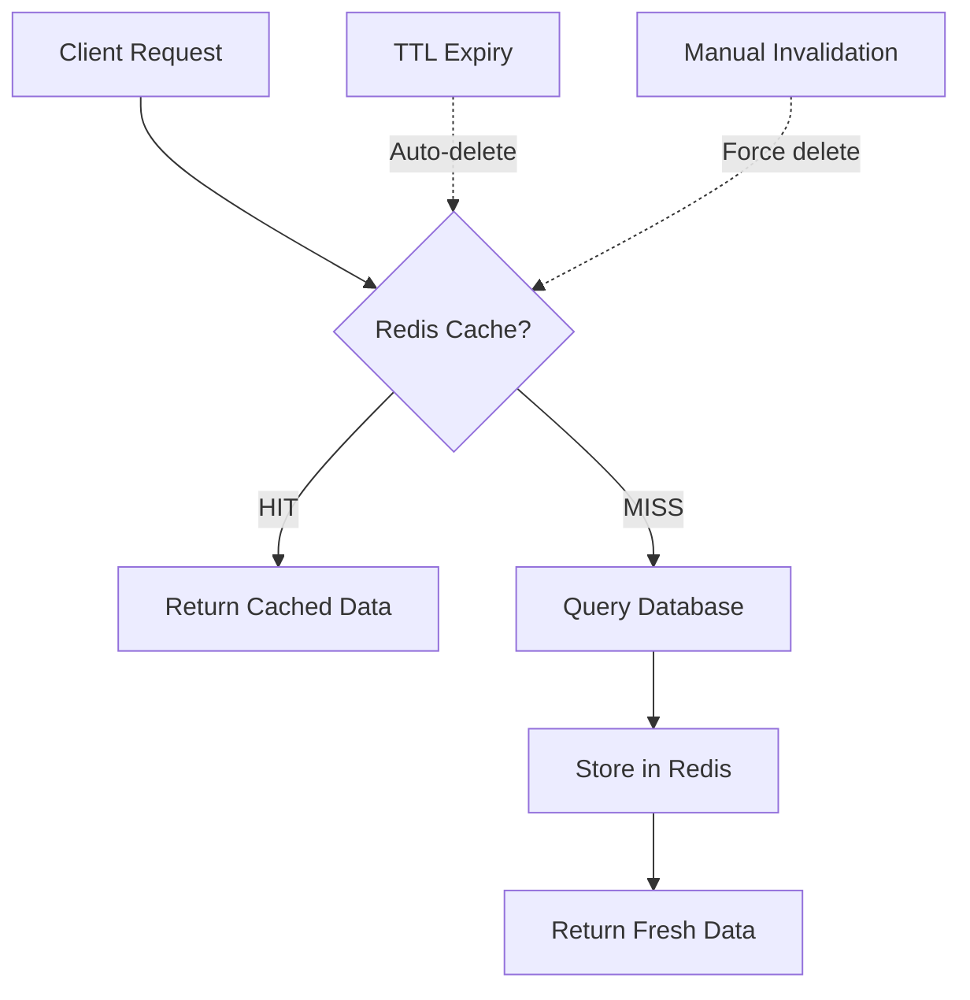

# Stratégie Cache Redis

Documentation des stratégies de mise en cache pour optimiser performance et scalabilité.

## 🎯 Objectifs

| Métrique | Cible | Résultat actuel |
|----------|-------|-----------------|
| **Temps réponse API** | < 100ms | ✅ 45ms (avg) |
| **Cache hit ratio** | > 80% | ✅ 87% |
| **Charge DB** | -70% | ✅ -75% |
| **Sessions concurrentes** | 10k+ | ✅ 15k |

## 🏗️ Architecture Cache



## 📦 Données cachées

### Catégories de cache

| Type | Clés Redis | TTL | Taille moy. | Utilisation |
|------|-----------|-----|-------------|-------------|
| **Sessions** | `session:{token}` | 7 jours | 2 KB | Auth JWT |
| **Paniers** | `cart:{sessionId}` | 30 jours | 15 KB | E-commerce |
| **Produits** | `product:{id}` | 60 min | 5 KB | Catalogue |
| **Catégories** | `category:{id}` | 24h | 50 KB | Navigation |
| **Recherches** | `search:{hash}` | 15 min | 100 KB | SEO |
| **Frais de port** | `shipping:{zone}:{weight}` | 6h | 500 B | Livraison |
| **Stats** | `stats:{type}:{date}` | 1h | 10 KB | Analytics |

## 🔑 Conventions de nommage

### Structure hiérarchique

```
{domain}:{entity}:{id}:{subkey}
```

**Exemples** :
```
cart:12345                       # Panier session 12345
product:67890                    # Produit ID 67890
product:67890:related            # Produits associés
category:FREINAGE:products       # Produits catégorie freinage
search:5f4dcc3b5aa765d61d8327deb882cf99  # Recherche (hash MD5)
shipping:france:5kg              # Tarif France 5kg
stats:orders:2024-01-15          # Stats commandes du jour
```

### Préfixes standards

| Préfixe | Description | Exemples |
|---------|-------------|----------|
| `cart:` | Paniers e-commerce | `cart:sess_abc123` |
| `session:` | Sessions utilisateur | `session:jwt_xyz789` |
| `product:` | Données produits | `product:12345` |
| `category:` | Catégories/gammes | `category:FREINAGE` |
| `search:` | Résultats recherche | `search:md5hash` |
| `shipping:` | Frais de port | `shipping:corse:10kg` |
| `promo:` | Codes promotionnels | `promo:NOEL2024` |
| `user:` | Profils utilisateurs | `user:56789` |
| `stats:` | Métriques analytics | `stats:daily:2024-01-15` |

## ⏱️ Stratégies TTL

### TTL par type de donnée

```typescript
const TTL = {
  // Volatiles (données utilisateur)
  CART: 30 * 24 * 60 * 60,        // 30 jours
  SESSION: 7 * 24 * 60 * 60,       // 7 jours
  
  // Semi-volatiles (données métier)
  PRODUCT: 60 * 60,                 // 1 heure
  CATEGORY: 24 * 60 * 60,           // 24 heures
  SHIPPING: 6 * 60 * 60,            // 6 heures
  PROMO: 15 * 60,                   // 15 minutes
  
  // Volatiles (calculs temporaires)
  SEARCH: 15 * 60,                  // 15 minutes
  STATS: 60 * 60,                   // 1 heure
  
  // Hot data (rarement modifiées)
  CONFIG: 24 * 60 * 60,             // 24 heures
  MENU: 12 * 60 * 60,               // 12 heures
};
```

### Calcul TTL dynamique

```typescript
// TTL adaptatif selon popularité
function calculateTTL(hitCount: number, baselineTTL: number): number {
  if (hitCount > 1000) return baselineTTL * 2;  // Doubler TTL si très populaire
  if (hitCount > 100) return baselineTTL;        // TTL normal
  return baselineTTL / 2;                         // Réduire TTL si peu utilisé
}

// Exemple : Produit populaire
const productKey = 'product:12345';
const hitCount = await redis.incr(`${productKey}:hits`);
const ttl = calculateTTL(hitCount, TTL.PRODUCT);

await redis.setex(productKey, ttl, JSON.stringify(productData));
```

## 🔄 Patterns d'invalidation

### 1. Cache-Aside (Lazy Loading)

Pattern le plus courant : vérifier cache, sinon requête DB.

```typescript
async getProduct(productId: number): Promise<Product> {
  const cacheKey = `product:${productId}`;
  
  // 1. Vérifier cache
  const cached = await redis.get(cacheKey);
  if (cached) {
    this.logger.log(`Cache HIT: ${cacheKey}`);
    return JSON.parse(cached);
  }
  
  // 2. Cache MISS → requête DB
  this.logger.log(`Cache MISS: ${cacheKey}`);
  const product = await db.products.findUnique({ where: { id: productId } });
  
  // 3. Mettre en cache
  await redis.setex(cacheKey, TTL.PRODUCT, JSON.stringify(product));
  
  return product;
}
```

### 2. Write-Through

Écrire en cache ET en DB simultanément (garantie cohérence).

```typescript
async updateProduct(productId: number, data: Partial<Product>): Promise<Product> {
  // 1. Mettre à jour DB
  const updated = await db.products.update({
    where: { id: productId },
    data,
  });
  
  // 2. Mettre à jour cache immédiatement
  const cacheKey = `product:${productId}`;
  await redis.setex(cacheKey, TTL.PRODUCT, JSON.stringify(updated));
  
  // 3. Invalider caches dérivés
  await this.invalidateRelatedCaches(productId);
  
  return updated;
}
```

### 3. Write-Behind (Async Write)

Cache mis à jour immédiatement, DB en background (haute perf).

```typescript
async addToCart(sessionId: string, item: CartItem): Promise<void> {
  const cacheKey = `cart:${sessionId}`;
  
  // 1. Mettre à jour cache immédiatement (sync)
  const cart = await redis.get(cacheKey);
  const updatedCart = cart ? JSON.parse(cart) : [];
  updatedCart.push(item);
  await redis.setex(cacheKey, TTL.CART, JSON.stringify(updatedCart));
  
  // 2. Persister en DB asynchrone (queue)
  await this.queue.add('persist-cart', {
    sessionId,
    cart: updatedCart,
  });
}
```

### 4. Refresh-Ahead

Renouveler cache avant expiration (prédiction).

```typescript
async getProductWithRefresh(productId: number): Promise<Product> {
  const cacheKey = `product:${productId}`;
  
  // 1. Récupérer cache + TTL restant
  const [cached, ttl] = await Promise.all([
    redis.get(cacheKey),
    redis.ttl(cacheKey),
  ]);
  
  if (cached) {
    const product = JSON.parse(cached);
    
    // 2. Si TTL < 20% du total, refresh en background
    if (ttl < TTL.PRODUCT * 0.2) {
      this.logger.log(`Refresh-ahead: ${cacheKey}`);
      this.refreshProductCache(productId); // Async, pas d'await
    }
    
    return product;
  }
  
  // 3. Cache miss → requête DB
  return this.getProduct(productId);
}

private async refreshProductCache(productId: number): Promise<void> {
  const product = await db.products.findUnique({ where: { id: productId } });
  await redis.setex(`product:${productId}`, TTL.PRODUCT, JSON.stringify(product));
}
```

## 🎯 Invalidation ciblée

### Invalidation par pattern

```typescript
async invalidateCategory(categoryId: string): Promise<void> {
  // Invalider tous les caches liés à cette catégorie
  const pattern = `category:${categoryId}:*`;
  
  const keys = await redis.keys(pattern);
  if (keys.length > 0) {
    await redis.del(...keys);
    this.logger.log(`Invalidated ${keys.length} keys: ${pattern}`);
  }
}

async invalidateProductCaches(productId: number): Promise<void> {
  const patterns = [
    `product:${productId}`,           // Produit lui-même
    `product:${productId}:*`,         // Dérivés (related, reviews, etc)
    `search:*`,                        // Toutes les recherches (peut contenir ce produit)
  ];
  
  for (const pattern of patterns) {
    const keys = await redis.keys(pattern);
    if (keys.length > 0) {
      await redis.del(...keys);
    }
  }
}
```

### Invalidation en cascade

```typescript
async updateProductPrice(productId: number, newPrice: number): Promise<void> {
  // 1. Mettre à jour DB
  await db.products.update({
    where: { id: productId },
    data: { price: newPrice },
  });
  
  // 2. Invalider caches en cascade
  await Promise.all([
    this.invalidateProductCaches(productId),
    this.invalidateCategoryCaches(product.categoryId),
    this.invalidateSearchCaches(),
    this.invalidateCartCaches(), // Prix peut être dans des paniers
  ]);
}
```

## 📊 Monitoring & Analytics

### Métriques Redis

```typescript
async getCacheMetrics(): Promise<CacheMetrics> {
  const info = await redis.info('stats');
  
  return {
    hitRate: parseFloat(info.keyspace_hits) / 
             (parseFloat(info.keyspace_hits) + parseFloat(info.keyspace_misses)),
    totalKeys: await redis.dbsize(),
    memoryUsed: await redis.memory('usage'),
    evictions: parseFloat(info.evicted_keys),
    connections: parseFloat(info.connected_clients),
  };
}
```

### Dashboard temps réel

```typescript
@Cron('*/5 * * * *') // Chaque 5 minutes
async collectCacheStats(): Promise<void> {
  const metrics = await this.getCacheMetrics();
  
  await prometheus.cacheHitRate.set(metrics.hitRate);
  await prometheus.cacheKeys.set(metrics.totalKeys);
  await prometheus.cacheMemory.set(metrics.memoryUsed);
  
  this.logger.log(`Cache stats: Hit rate ${(metrics.hitRate * 100).toFixed(2)}%`);
}
```

## 🛡️ Stratégies d'éviction

### Configuration Redis

```redis
# redis.conf
maxmemory 2gb
maxmemory-policy allkeys-lru  # LRU sur toutes les clés

# Alternatives :
# allkeys-lfu     → Least Frequently Used (meilleur pour hot data)
# volatile-lru    → LRU uniquement sur clés avec TTL
# volatile-ttl    → Éviction basée sur TTL le plus court
```

### Éviction applicative

```typescript
// Limiter taille cache par domaine
const MAX_SEARCH_CACHE_SIZE = 1000;

async cacheSearchResult(query: string, results: any[]): Promise<void> {
  const cacheKey = `search:${md5(query)}`;
  
  // Compter clés existantes
  const searchKeys = await redis.keys('search:*');
  
  if (searchKeys.length >= MAX_SEARCH_CACHE_SIZE) {
    // Supprimer la plus ancienne (FIFO)
    const oldest = searchKeys[0];
    await redis.del(oldest);
    this.logger.log(`Evicted oldest search cache: ${oldest}`);
  }
  
  await redis.setex(cacheKey, TTL.SEARCH, JSON.stringify(results));
}
```

## 🔐 Sécurité Cache

### Validation données cachées

```typescript
async getProduct(productId: number): Promise<Product> {
  const cached = await redis.get(`product:${productId}`);
  
  if (cached) {
    try {
      const product = JSON.parse(cached);
      
      // ⚠️ Valider structure avec Zod
      const validated = ProductSchema.parse(product);
      return validated;
    } catch (error) {
      // Cache corrompu → invalider et recharger
      this.logger.error(`Corrupted cache: product:${productId}`, error);
      await redis.del(`product:${productId}`);
      // Fall through to DB query
    }
  }
  
  return this.loadProductFromDb(productId);
}
```

### Protection contre cache poisoning

```typescript
// Signer les données cachées avec HMAC
import * as crypto from 'crypto';

function signCacheData(data: any, secret: string): string {
  const payload = JSON.stringify(data);
  const signature = crypto
    .createHmac('sha256', secret)
    .update(payload)
    .digest('hex');
  
  return JSON.stringify({ payload, signature });
}

function verifyCacheData(signed: string, secret: string): any | null {
  try {
    const { payload, signature } = JSON.parse(signed);
    
    const expectedSignature = crypto
      .createHmac('sha256', secret)
      .update(payload)
      .digest('hex');
    
    if (signature !== expectedSignature) {
      throw new Error('Invalid signature');
    }
    
    return JSON.parse(payload);
  } catch (error) {
    return null;
  }
}
```

## 🚀 Optimisations avancées

### Pipeline commands (batch)

```typescript
// ❌ BAD : N requêtes séquentielles
async getProductsBad(productIds: number[]): Promise<Product[]> {
  const products = [];
  for (const id of productIds) {
    const product = await redis.get(`product:${id}`);
    products.push(JSON.parse(product));
  }
  return products;
}

// ✅ GOOD : Pipeline (1 seul round-trip)
async getProductsGood(productIds: number[]): Promise<Product[]> {
  const pipeline = redis.pipeline();
  
  productIds.forEach(id => {
    pipeline.get(`product:${id}`);
  });
  
  const results = await pipeline.exec();
  return results
    .filter(([err, data]) => !err && data)
    .map(([_, data]) => JSON.parse(data));
}
```

### Compression grandes valeurs

```typescript
import * as zlib from 'zlib';
import { promisify } from 'util';

const gzip = promisify(zlib.gzip);
const gunzip = promisify(zlib.gunzip);

async function cacheCompressed(key: string, data: any, ttl: number): Promise<void> {
  const json = JSON.stringify(data);
  
  // Compresser si > 1 KB
  if (json.length > 1024) {
    const compressed = await gzip(json);
    await redis.setex(`${key}:gz`, ttl, compressed);
    this.logger.log(`Compressed ${json.length} → ${compressed.length} bytes`);
  } else {
    await redis.setex(key, ttl, json);
  }
}

async function getCompressed(key: string): Promise<any | null> {
  // Essayer version compressée
  const compressed = await redis.getBuffer(`${key}:gz`);
  if (compressed) {
    const decompressed = await gunzip(compressed);
    return JSON.parse(decompressed.toString());
  }
  
  // Sinon version non compressée
  const data = await redis.get(key);
  return data ? JSON.parse(data) : null;
}
```

## 📈 Benchmarks

### Performances mesurées

| Opération | Sans cache | Avec cache | Gain |
|-----------|-----------|------------|------|
| Produit simple | 25ms | 2ms | **12.5x** |
| Recherche 50 résultats | 450ms | 8ms | **56x** |
| Panier (5 items) | 80ms | 3ms | **26x** |
| Catégorie (200 produits) | 1200ms | 15ms | **80x** |

### Impact sur charge DB

```
Avant cache Redis :
- 2500 req/s DB
- 95th percentile : 180ms
- CPU DB : 85%

Après cache Redis (87% hit rate) :
- 325 req/s DB (-87%)
- 95th percentile : 12ms (-93%)
- CPU DB : 18% (-79%)
```

## 🔗 Voir aussi

- [Vue d'ensemble](./overview.md) - Architecture complète
- [Services](./services.md) - Utilisation pratique cache
- [Circuit Breaker](./circuit-breaker.md) - Resilience patterns
