# 🏗️ Diagrammes d'Architecture

> **Visualisation complète de l'architecture backend** - Modules, flux de données, intégrations

**Version:** 1.0.0
**Dernière mise à jour:** 2025-11-18
**Modules:** 37/37 (100% coverage)

---

## 📋 Table des matières

- [Vue d'ensemble globale](#-vue-densemble-globale)
- [Architecture par domaine](#-architecture-par-domaine)
- [Flux de données](#-flux-de-donn%C3%A9es)
- [Intégrations externes](#-int%C3%A9grations-externes)
- [Guards & Sécurité](#-guards--s%C3%A9curit%C3%A9)
- [Cache & Performance](#-cache--performance)
- [Workflows métier](#-workflows-m%C3%A9tier)

---

## 🌐 Vue d'ensemble globale

### Architecture Générale du Backend

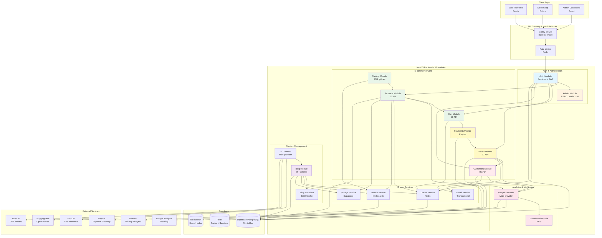
```mermaid
graph TB
    subgraph "Client Layer"
        WEB[Web Frontend<br/>Remix]
        MOBILE[Mobile App<br/>Future]
        ADMIN_UI[Admin Dashboard<br/>React]
    end

    subgraph "API Gateway & Load Balancer"
        CADDY[Caddy Server<br/>Reverse Proxy]
        RATE_LIMITER[Rate Limiter<br/>Redis]
    end

    subgraph "NestJS Backend - 37 Modules"
        subgraph "Auth & Authorization"
            AUTH[Auth Module<br/>Sessions + JWT]
            ADMIN_MOD[Admin Module<br/>RBAC Levels 1-10]
        end

        subgraph "E-commerce Core"
            CATALOG[Catalog Module<br/>400k pièces]
            PRODUCTS[Products Module<br/>26 API]
            CART[Cart Module<br/>18 API]
            PAYMENTS[Payments Module<br/>Paybox]
            ORDERS[Orders Module<br/>17 API]
            CUSTOMERS[Customers Module<br/>RGPD]
        end

        subgraph "Content Management"
            BLOG[Blog Module<br/>85+ articles]
            BLOG_META[Blog Metadata<br/>SEO Cache]
            AI[AI Content<br/>Multi-provider]
        end

        subgraph "Analytics & Monitoring"
            ANALYTICS[Analytics Module<br/>Multi-provider]
            DASHBOARD[Dashboard Module<br/>KPIs]
        end

        subgraph "Shared Services"
            CACHE[Cache Service<br/>Redis]
            SEARCH[Search Service<br/>Meilisearch]
            EMAIL[Email Service<br/>Transactional]
            STORAGE[Storage Service<br/>Supabase]
        end
    end

    subgraph "Data Layer"
        POSTGRES[(Supabase PostgreSQL<br/>50+ tables)]
        REDIS[(Redis<br/>Cache + Sessions)]
        MEILI[(Meilisearch<br/>Search Index)]
    end

    subgraph "External Services"
        PAYBOX_EXT[Paybox<br/>Payment Gateway]
        GROQ[Groq AI<br/>Fast Inference]
        HUGGINGFACE[HuggingFace<br/>Open Models]
        OPENAI_EXT[OpenAI<br/>GPT Models]
        GA[Google Analytics<br/>Tracking]
        MATOMO[Matomo<br/>Privacy Analytics]
    end

    WEB --> CADDY
    MOBILE --> CADDY
    ADMIN_UI --> CADDY
    
    CADDY --> RATE_LIMITER
    RATE_LIMITER --> AUTH
    
    AUTH --> ADMIN_MOD
    AUTH --> PRODUCTS
    AUTH --> CART
    AUTH --> ORDERS
    AUTH --> CUSTOMERS
    
    CATALOG --> PRODUCTS
    PRODUCTS --> CART
    CART --> PAYMENTS
    PAYMENTS --> ORDERS
    ORDERS --> CUSTOMERS
    
    BLOG --> BLOG_META
    AI --> BLOG
    
    PRODUCTS --> ANALYTICS
    ORDERS --> ANALYTICS
    CUSTOMERS --> ANALYTICS
    ANALYTICS --> DASHBOARD
    
    AUTH --> CACHE
    PRODUCTS --> CACHE
    CART --> CACHE
    BLOG --> CACHE
    
    CATALOG --> SEARCH
    PRODUCTS --> SEARCH
    BLOG --> SEARCH
    
    ORDERS --> EMAIL
    CUSTOMERS --> EMAIL
    
    BLOG --> STORAGE
    PRODUCTS --> STORAGE
    
    AUTH --> POSTGRES
    PRODUCTS --> POSTGRES
    ORDERS --> POSTGRES
    CUSTOMERS --> POSTGRES
    BLOG --> POSTGRES
    
    CACHE --> REDIS
    
    SEARCH --> MEILI
    
    PAYMENTS --> PAYBOX_EXT
    AI --> GROQ
    AI --> HUGGINGFACE
    AI --> OPENAI_EXT
    ANALYTICS --> GA
    ANALYTICS --> MATOMO

    style AUTH fill:#e1f5ff
    style ADMIN_MOD fill:#fff3e0
    style BLOG fill:#f3e5f5
    style CATALOG fill:#e8f5e9
    style PRODUCTS fill:#e8f5e9
    style CART fill:#e8f5e9
    style PAYMENTS fill:#fff9c4
    style ORDERS fill:#fff9c4
    style CUSTOMERS fill:#ffebee
    style ANALYTICS fill:#fce4ec
    style DASHBOARD fill:#fce4ec
```

---

## 🎯 Architecture par Domaine

### E-commerce Core - Architecture Complète

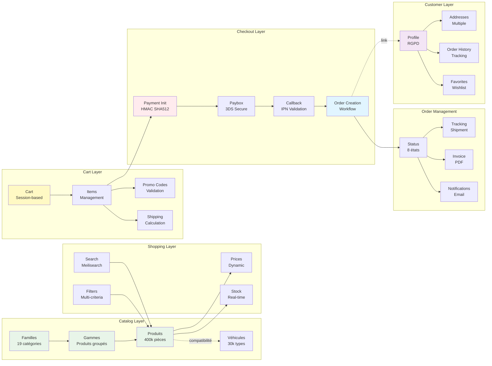
```mermaid
graph LR
    subgraph "Catalog Layer"
        FAMILLE[Familles<br/>19 catégories]
        GAMME[Gammes<br/>Produits groupés]
        PRODUCT[Produits<br/>400k pièces]
        VEHICLE[Véhicules<br/>30k types]
        
        FAMILLE --> GAMME
        GAMME --> PRODUCT
        PRODUCT -.compatibilité.-> VEHICLE
    end

    subgraph "Shopping Layer"
        SEARCH[Search<br/>Meilisearch]
        FILTERS[Filters<br/>Multi-criteria]
        PRICES[Prices<br/>Dynamic]
        STOCK[Stock<br/>Real-time]
        
        SEARCH --> PRODUCT
        FILTERS --> PRODUCT
        PRODUCT --> PRICES
        PRODUCT --> STOCK
    end

    subgraph "Cart Layer"
        CART_SESSION[Cart<br/>Session-based]
        CART_ITEMS[Items<br/>Management]
        PROMO[Promo Codes<br/>Validation]
        SHIPPING[Shipping<br/>Calculation]
        
        CART_SESSION --> CART_ITEMS
        CART_ITEMS --> PROMO
        CART_ITEMS --> SHIPPING
    end

    subgraph "Checkout Layer"
        PAYMENT_INIT[Payment Init<br/>HMAC SHA512]
        PAYBOX_REDIRECT[Paybox<br/>3DS Secure]
        CALLBACK[Callback<br/>IPN Validation]
        ORDER_CREATE[Order Creation<br/>Workflow]
        
        CART_ITEMS --> PAYMENT_INIT
        PAYMENT_INIT --> PAYBOX_REDIRECT
        PAYBOX_REDIRECT --> CALLBACK
        CALLBACK --> ORDER_CREATE
    end

    subgraph "Order Management"
        ORDER_STATUS[Status<br/>8 états]
        TRACKING[Tracking<br/>Shipment]
        INVOICE[Invoice<br/>PDF]
        NOTIFICATIONS[Notifications<br/>Email]
        
        ORDER_CREATE --> ORDER_STATUS
        ORDER_STATUS --> TRACKING
        ORDER_STATUS --> INVOICE
        ORDER_STATUS --> NOTIFICATIONS
    end

    subgraph "Customer Layer"
        PROFILE[Profile<br/>RGPD]
        ADDRESSES[Addresses<br/>Multiple]
        HISTORY[Order History<br/>Tracking]
        FAVORITES[Favorites<br/>Wishlist]
        
        ORDER_CREATE -.link.-> PROFILE
        PROFILE --> ADDRESSES
        PROFILE --> HISTORY
        PROFILE --> FAVORITES
    end

    style FAMILLE fill:#e8f5e9
    style GAMME fill:#e8f5e9
    style PRODUCT fill:#e8f5e9
    style CART_SESSION fill:#fff9c4
    style PAYMENT_INIT fill:#ffebee
    style ORDER_CREATE fill:#e1f5ff
    style PROFILE fill:#f3e5f5
```

---

### Auth & Admin - RBAC Architecture

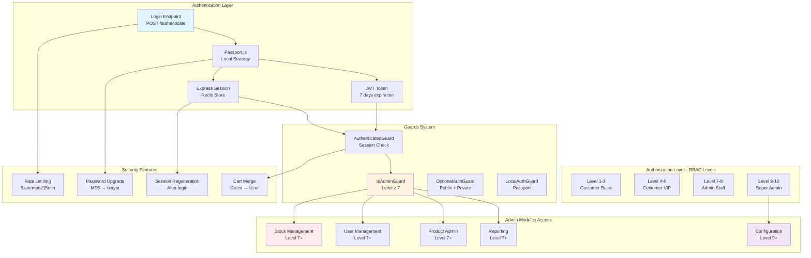
```mermaid
graph TB
    subgraph "Authentication Layer"
        LOGIN[Login Endpoint<br/>POST /authenticate]
        PASSPORT[Passport.js<br/>Local Strategy]
        SESSION[Express Session<br/>Redis Store]
        JWT[JWT Token<br/>7 days expiration]
        
        LOGIN --> PASSPORT
        PASSPORT --> SESSION
        PASSPORT --> JWT
    end

    subgraph "Authorization Layer - RBAC Levels"
        LEVEL_1_3[Level 1-3<br/>Customer Basic]
        LEVEL_4_6[Level 4-6<br/>Customer VIP]
        LEVEL_7_8[Level 7-8<br/>Admin Staff]
        LEVEL_9_10[Level 9-10<br/>Super Admin]
    end

    subgraph "Guards System"
        AUTH_GUARD[AuthenticatedGuard<br/>Session Check]
        ADMIN_GUARD[IsAdminGuard<br/>Level ≥ 7]
        OPTIONAL_GUARD[OptionalAuthGuard<br/>Public + Private]
        LOCAL_GUARD[LocalAuthGuard<br/>Passport]
        
        SESSION --> AUTH_GUARD
        JWT --> AUTH_GUARD
        AUTH_GUARD --> ADMIN_GUARD
    end

    subgraph "Admin Modules Access"
        STOCK_MGMT[Stock Management<br/>Level 7+]
        USER_MGMT[User Management<br/>Level 7+]
        PRODUCT_ADMIN[Product Admin<br/>Level 7+]
        REPORTING[Reporting<br/>Level 7+]
        CONFIG[Configuration<br/>Level 9+]
        
        ADMIN_GUARD --> STOCK_MGMT
        ADMIN_GUARD --> USER_MGMT
        ADMIN_GUARD --> PRODUCT_ADMIN
        ADMIN_GUARD --> REPORTING
        LEVEL_9_10 --> CONFIG
    end

    subgraph "Security Features"
        RATE_LIMIT[Rate Limiting<br/>5 attempts/15min]
        PASSWORD_UPGRADE[Password Upgrade<br/>MD5 → bcrypt]
        SESSION_REGEN[Session Regeneration<br/>After login]
        CART_MERGE[Cart Merge<br/>Guest → User]
    end

    LOGIN --> RATE_LIMIT
    PASSPORT --> PASSWORD_UPGRADE
    SESSION --> SESSION_REGEN
    AUTH_GUARD --> CART_MERGE

    style LOGIN fill:#e1f5ff
    style ADMIN_GUARD fill:#fff3e0
    style STOCK_MGMT fill:#ffebee
    style CONFIG fill:#f3e5f5
```

---

### CMS & Content - Blog Architecture

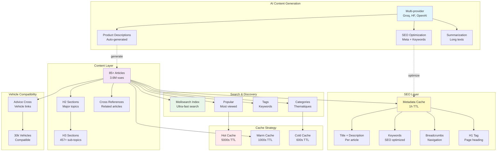
```mermaid
graph TB
    subgraph "Content Layer"
        ARTICLES[85+ Articles<br/>3.6M vues]
        H2_SECTIONS[H2 Sections<br/>Major topics]
        H3_SECTIONS[H3 Sections<br/>457+ sub-topics]
        CROSS_REF[Cross References<br/>Related articles]
        
        ARTICLES --> H2_SECTIONS
        H2_SECTIONS --> H3_SECTIONS
        ARTICLES --> CROSS_REF
    end

    subgraph "Search & Discovery"
        MEILI_INDEX[Meilisearch Index<br/>Ultra-fast search]
        CATEGORIES[Categories<br/>Thematiques]
        TAGS[Tags<br/>Keywords]
        POPULAR[Popular<br/>Most viewed]
        
        ARTICLES --> MEILI_INDEX
        ARTICLES --> CATEGORIES
        ARTICLES --> TAGS
        ARTICLES --> POPULAR
    end

    subgraph "SEO Layer"
        META_CACHE[Metadata Cache<br/>1h TTL]
        TITLE_DESC[Title + Description<br/>Per article]
        KEYWORDS[Keywords<br/>SEO optimized]
        BREADCRUMBS[Breadcrumbs<br/>Navigation]
        H1_TAG[H1 Tag<br/>Page heading]
        
        ARTICLES --> META_CACHE
        META_CACHE --> TITLE_DESC
        META_CACHE --> KEYWORDS
        META_CACHE --> BREADCRUMBS
        META_CACHE --> H1_TAG
    end

    subgraph "Cache Strategy"
        HOT_CACHE[Hot Cache<br/>5000s TTL]
        WARM_CACHE[Warm Cache<br/>1000s TTL]
        COLD_CACHE[Cold Cache<br/>600s TTL]
        
        POPULAR --> HOT_CACHE
        ARTICLES --> WARM_CACHE
        CATEGORIES --> COLD_CACHE
    end

    subgraph "AI Content Generation"
        AI_MULTI[Multi-provider<br/>Groq, HF, OpenAI]
        AI_PRODUCT[Product Descriptions<br/>Auto-generated]
        AI_SEO[SEO Optimization<br/>Meta + Keywords]
        AI_SUMMARY[Summarization<br/>Long texts]
        
        AI_MULTI --> AI_PRODUCT
        AI_MULTI --> AI_SEO
        AI_MULTI --> AI_SUMMARY
    end

    subgraph "Vehicle Compatibility"
        VEHICLES[30k Vehicles<br/>Compatible]
        ADVICE_CROSS[Advice Cross<br/>Vehicle links]
        
        ARTICLES --> ADVICE_CROSS
        ADVICE_CROSS --> VEHICLES
    end

    AI_PRODUCT -.generate.-> ARTICLES
    AI_SEO -.optimize.-> META_CACHE

    style ARTICLES fill:#f3e5f5
    style MEILI_INDEX fill:#e8f5e9
    style META_CACHE fill:#fff9c4
    style HOT_CACHE fill:#ffebee
    style AI_MULTI fill:#e1f5ff
```

---

## 🔄 Flux de Données

### Flux E-commerce Complet (Customer Journey)

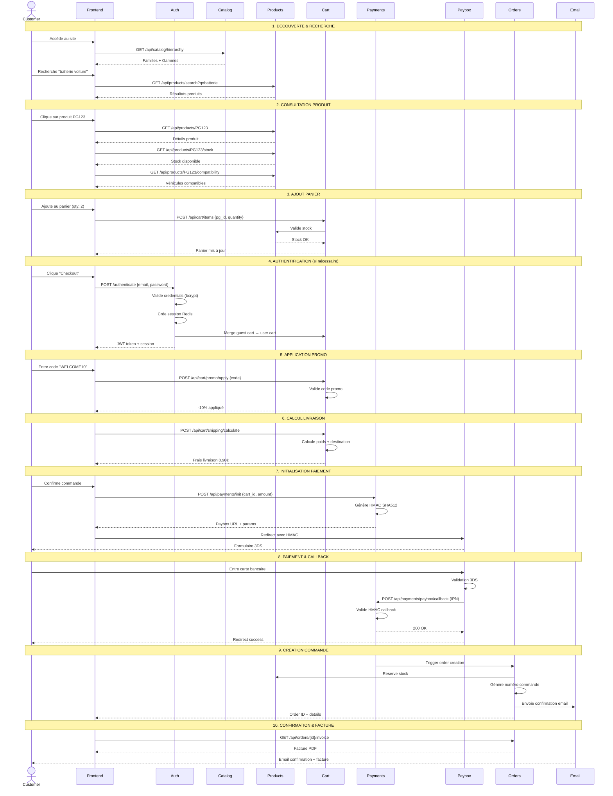
```mermaid
sequenceDiagram
    actor Customer
    participant Frontend
    participant Auth
    participant Catalog
    participant Products
    participant Cart
    participant Payments
    participant Paybox
    participant Orders
    participant Email

    Note over Customer,Email: 1. DÉCOUVERTE & RECHERCHE
    Customer->>Frontend: Accède au site
    Frontend->>Catalog: GET /api/catalog/hierarchy
    Catalog-->>Frontend: Familles + Gammes
    Customer->>Frontend: Recherche "batterie voiture"
    Frontend->>Products: GET /api/products/search?q=batterie
    Products-->>Frontend: Résultats produits

    Note over Customer,Email: 2. CONSULTATION PRODUIT
    Customer->>Frontend: Clique sur produit PG123
    Frontend->>Products: GET /api/products/PG123
    Products-->>Frontend: Détails produit
    Frontend->>Products: GET /api/products/PG123/stock
    Products-->>Frontend: Stock disponible
    Frontend->>Products: GET /api/products/PG123/compatibility
    Products-->>Frontend: Véhicules compatibles

    Note over Customer,Email: 3. AJOUT PANIER
    Customer->>Frontend: Ajoute au panier (qty: 2)
    Frontend->>Cart: POST /api/cart/items {pg_id, quantity}
    Cart->>Products: Valide stock
    Products-->>Cart: Stock OK
    Cart-->>Frontend: Panier mis à jour

    Note over Customer,Email: 4. AUTHENTIFICATION (si nécessaire)
    Customer->>Frontend: Clique "Checkout"
    Frontend->>Auth: POST /authenticate {email, password}
    Auth->>Auth: Valide credentials (bcrypt)
    Auth->>Auth: Crée session Redis
    Auth->>Cart: Merge guest cart → user cart
    Auth-->>Frontend: JWT token + session

    Note over Customer,Email: 5. APPLICATION PROMO
    Customer->>Frontend: Entre code "WELCOME10"
    Frontend->>Cart: POST /api/cart/promo/apply {code}
    Cart->>Cart: Valide code promo
    Cart-->>Frontend: -10% appliqué

    Note over Customer,Email: 6. CALCUL LIVRAISON
    Frontend->>Cart: POST /api/cart/shipping/calculate
    Cart->>Cart: Calcule poids + destination
    Cart-->>Frontend: Frais livraison 8.90€

    Note over Customer,Email: 7. INITIALISATION PAIEMENT
    Customer->>Frontend: Confirme commande
    Frontend->>Payments: POST /api/payments/init {cart_id, amount}
    Payments->>Payments: Génère HMAC SHA512
    Payments-->>Frontend: Paybox URL + params
    Frontend->>Paybox: Redirect avec HMAC
    Paybox-->>Customer: Formulaire 3DS

    Note over Customer,Email: 8. PAIEMENT & CALLBACK
    Customer->>Paybox: Entre carte bancaire
    Paybox->>Paybox: Validation 3DS
    Paybox->>Payments: POST /api/payments/paybox/callback (IPN)
    Payments->>Payments: Valide HMAC callback
    Payments-->>Paybox: 200 OK
    Paybox-->>Customer: Redirect success

    Note over Customer,Email: 9. CRÉATION COMMANDE
    Payments->>Orders: Trigger order creation
    Orders->>Products: Reserve stock
    Orders->>Orders: Génère numéro commande
    Orders->>Email: Envoie confirmation email
    Orders-->>Frontend: Order ID + details

    Note over Customer,Email: 10. CONFIRMATION & FACTURE
    Frontend->>Orders: GET /api/orders/{id}/invoice
    Orders-->>Frontend: Facture PDF
    Email-->>Customer: Email confirmation + facture
```

---

### Flux Admin - Gestion Stock

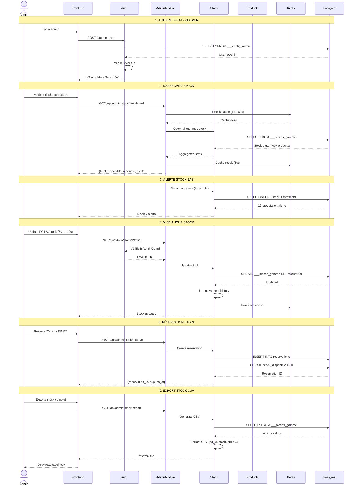
```mermaid
sequenceDiagram
    actor Admin
    participant Frontend
    participant Auth
    participant AdminModule
    participant Stock
    participant Products
    participant Redis
    participant Postgres

    Note over Admin,Postgres: 1. AUTHENTIFICATION ADMIN
    Admin->>Frontend: Login admin
    Frontend->>Auth: POST /authenticate
    Auth->>Postgres: SELECT * FROM ___config_admin
    Postgres-->>Auth: User level 8
    Auth->>Auth: Vérifie level ≥ 7
    Auth-->>Frontend: JWT + IsAdminGuard OK

    Note over Admin,Postgres: 2. DASHBOARD STOCK
    Admin->>Frontend: Accède dashboard stock
    Frontend->>AdminModule: GET /api/admin/stock/dashboard
    AdminModule->>Redis: Check cache (TTL 60s)
    Redis-->>AdminModule: Cache miss
    AdminModule->>Stock: Query all gammes stock
    Stock->>Postgres: SELECT FROM ___pieces_gamme
    Postgres-->>Stock: Stock data (400k produits)
    Stock-->>AdminModule: Aggregated stats
    AdminModule->>Redis: Cache result (60s)
    AdminModule-->>Frontend: {total, disponible, reserved, alerts}

    Note over Admin,Postgres: 3. ALERTE STOCK BAS
    AdminModule->>Stock: Detect low stock (threshold)
    Stock->>Postgres: SELECT WHERE stock < threshold
    Postgres-->>Stock: 15 produits en alerte
    Stock-->>Frontend: Display alerts

    Note over Admin,Postgres: 4. MISE À JOUR STOCK
    Admin->>Frontend: Update PG123 stock (50 → 100)
    Frontend->>AdminModule: PUT /api/admin/stock/PG123
    AdminModule->>Auth: Vérifie IsAdminGuard
    Auth-->>AdminModule: Level 8 OK
    AdminModule->>Stock: Update stock
    Stock->>Postgres: UPDATE ___pieces_gamme SET stock=100
    Postgres-->>Stock: Updated
    Stock->>Stock: Log movement history
    Stock->>Redis: Invalidate cache
    Stock-->>Frontend: Stock updated

    Note over Admin,Postgres: 5. RÉSERVATION STOCK
    Admin->>Frontend: Reserve 20 units PG123
    Frontend->>AdminModule: POST /api/admin/stock/reserve
    AdminModule->>Stock: Create reservation
    Stock->>Postgres: INSERT INTO reservations
    Stock->>Postgres: UPDATE stock_disponible = 80
    Postgres-->>Stock: Reservation ID
    Stock-->>Frontend: {reservation_id, expires_at}

    Note over Admin,Postgres: 6. EXPORT STOCK CSV
    Admin->>Frontend: Exporte stock complet
    Frontend->>AdminModule: GET /api/admin/stock/export
    AdminModule->>Stock: Generate CSV
    Stock->>Postgres: SELECT * FROM ___pieces_gamme
    Postgres-->>Stock: All stock data
    Stock->>Stock: Format CSV (pg_id, stock, price...)
    Stock-->>Frontend: text/csv file
    Frontend-->>Admin: Download stock.csv
```

---

### Flux Blog - Content Delivery avec Cache

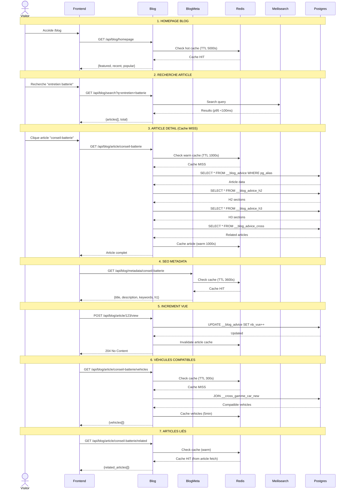
```mermaid
sequenceDiagram
    actor Visitor
    participant Frontend
    participant Blog
    participant BlogMeta
    participant Redis
    participant Meilisearch
    participant Postgres

    Note over Visitor,Postgres: 1. HOMEPAGE BLOG
    Visitor->>Frontend: Accède /blog
    Frontend->>Blog: GET /api/blog/homepage
    Blog->>Redis: Check hot cache (TTL 5000s)
    Redis-->>Blog: Cache HIT
    Blog-->>Frontend: {featured, recent, popular}

    Note over Visitor,Postgres: 2. RECHERCHE ARTICLE
    Visitor->>Frontend: Recherche "entretien batterie"
    Frontend->>Blog: GET /api/blog/search?q=entretien+batterie
    Blog->>Meilisearch: Search query
    Meilisearch-->>Blog: Results (p95 <100ms)
    Blog-->>Frontend: {articles[], total}

    Note over Visitor,Postgres: 3. ARTICLE DETAIL (Cache MISS)
    Visitor->>Frontend: Clique article "conseil-batterie"
    Frontend->>Blog: GET /api/blog/article/conseil-batterie
    Blog->>Redis: Check warm cache (TTL 1000s)
    Redis-->>Blog: Cache MISS
    Blog->>Postgres: SELECT * FROM __blog_advice WHERE pg_alias
    Postgres-->>Blog: Article data
    Blog->>Postgres: SELECT * FROM __blog_advice_h2
    Postgres-->>Blog: H2 sections
    Blog->>Postgres: SELECT * FROM __blog_advice_h3
    Postgres-->>Blog: H3 sections
    Blog->>Postgres: SELECT * FROM __blog_advice_cross
    Postgres-->>Blog: Related articles
    Blog->>Redis: Cache article (warm 1000s)
    Blog-->>Frontend: Article complet

    Note over Visitor,Postgres: 4. SEO METADATA
    Frontend->>BlogMeta: GET /api/blog/metadata/conseil-batterie
    BlogMeta->>Redis: Check cache (TTL 3600s)
    Redis-->>BlogMeta: Cache HIT
    BlogMeta-->>Frontend: {title, description, keywords, h1}

    Note over Visitor,Postgres: 5. INCREMENT VUE
    Frontend->>Blog: POST /api/blog/article/123/view
    Blog->>Postgres: UPDATE __blog_advice SET nb_vue++
    Postgres-->>Blog: Updated
    Blog->>Redis: Invalidate article cache
    Blog-->>Frontend: 204 No Content

    Note over Visitor,Postgres: 6. VÉHICULES COMPATIBLES
    Frontend->>Blog: GET /api/blog/article/conseil-batterie/vehicles
    Blog->>Redis: Check cache (TTL 300s)
    Redis-->>Blog: Cache MISS
    Blog->>Postgres: JOIN __cross_gamme_car_new
    Postgres-->>Blog: Compatible vehicles
    Blog->>Redis: Cache vehicles (5min)
    Blog-->>Frontend: {vehicles[]}

    Note over Visitor,Postgres: 7. ARTICLES LIÉS
    Frontend->>Blog: GET /api/blog/article/conseil-batterie/related
    Blog->>Redis: Check cache (warm)
    Redis-->>Blog: Cache HIT (from article fetch)
    Blog-->>Frontend: {related_articles[]}
```

---

## 🔌 Intégrations Externes

### Intégration Paybox (Payment Gateway)

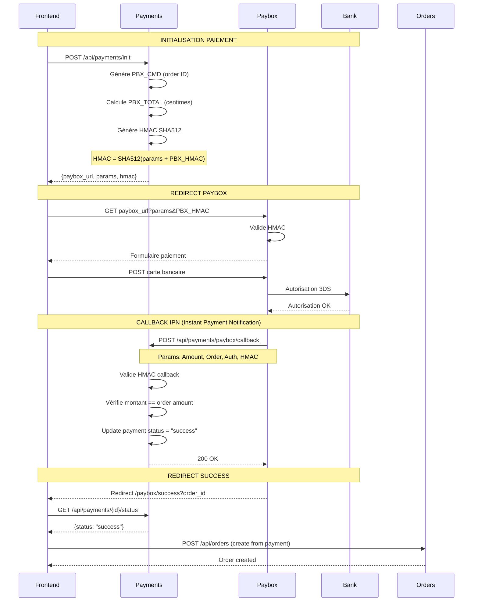
```mermaid
sequenceDiagram
    participant Frontend
    participant Payments
    participant Paybox
    participant Bank

    Note over Frontend,Bank: INITIALISATION PAIEMENT
    Frontend->>Payments: POST /api/payments/init
    Payments->>Payments: Génère PBX_CMD (order ID)
    Payments->>Payments: Calcule PBX_TOTAL (centimes)
    Payments->>Payments: Génère HMAC SHA512
    Note over Payments: HMAC = SHA512(params + PBX_HMAC)
    Payments-->>Frontend: {paybox_url, params, hmac}

    Note over Frontend,Bank: REDIRECT PAYBOX
    Frontend->>Paybox: GET paybox_url?params&PBX_HMAC
    Paybox->>Paybox: Valide HMAC
    Paybox-->>Frontend: Formulaire paiement
    Frontend->>Paybox: POST carte bancaire
    Paybox->>Bank: Autorisation 3DS
    Bank-->>Paybox: Autorisation OK

    Note over Frontend,Bank: CALLBACK IPN (Instant Payment Notification)
    Paybox->>Payments: POST /api/payments/paybox/callback
    Note over Paybox,Payments: Params: Amount, Order, Auth, HMAC
    Payments->>Payments: Valide HMAC callback
    Payments->>Payments: Vérifie montant == order amount
    Payments->>Payments: Update payment status = "success"
    Payments-->>Paybox: 200 OK

    Note over Frontend,Bank: REDIRECT SUCCESS
    Paybox-->>Frontend: Redirect /paybox/success?order_id
    Frontend->>Payments: GET /api/payments/{id}/status
    Payments-->>Frontend: {status: "success"}
    Frontend->>Orders: POST /api/orders (create from payment)
    Orders-->>Frontend: Order created
```

**Paramètres Paybox:**

```
PBX_SITE: Site ID (config)
PBX_RANG: Rang (config)
PBX_IDENTIFIANT: Identifiant (config)
PBX_TOTAL: Montant en centimes (ex: 15900 = 159.00€)
PBX_DEVISE: 978 (EUR)
PBX_CMD: Order reference (unique)
PBX_PORTEUR: Email client
PBX_RETOUR: Variables retour (Mt, Ref, Auto, Erreur)
PBX_HASH: SHA512
PBX_TIME: ISO-8601 timestamp
PBX_HMAC: HMAC SHA512 signature
```

---

### Intégration AI Multi-Provider

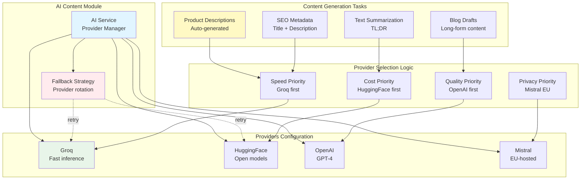
```mermaid
graph TB
    subgraph "AI Content Module"
        AI_SERVICE[AI Service<br/>Provider Manager]
        FALLBACK[Fallback Strategy<br/>Provider rotation]
    end

    subgraph "Providers Configuration"
        GROQ_CONFIG[Groq<br/>Fast inference]
        HF_CONFIG[HuggingFace<br/>Open models]
        OPENAI_CONFIG[OpenAI<br/>GPT-4]
        MISTRAL_CONFIG[Mistral<br/>EU-hosted]
    end

    subgraph "Content Generation Tasks"
        PRODUCT_DESC[Product Descriptions<br/>Auto-generated]
        SEO_META[SEO Metadata<br/>Title + Description]
        BLOG_DRAFT[Blog Drafts<br/>Long-form content]
        SUMMARY[Text Summarization<br/>TL;DR]
    end

    subgraph "Provider Selection Logic"
        SPEED_PRIO[Speed Priority<br/>Groq first]
        COST_PRIO[Cost Priority<br/>HuggingFace first]
        QUALITY_PRIO[Quality Priority<br/>OpenAI first]
        PRIVACY_PRIO[Privacy Priority<br/>Mistral EU]
    end

    AI_SERVICE --> GROQ_CONFIG
    AI_SERVICE --> HF_CONFIG
    AI_SERVICE --> OPENAI_CONFIG
    AI_SERVICE --> MISTRAL_CONFIG

    AI_SERVICE --> FALLBACK
    FALLBACK -.retry.-> GROQ_CONFIG
    FALLBACK -.retry.-> HF_CONFIG

    PRODUCT_DESC --> SPEED_PRIO
    SEO_META --> SPEED_PRIO
    BLOG_DRAFT --> QUALITY_PRIO
    SUMMARY --> COST_PRIO

    SPEED_PRIO --> GROQ_CONFIG
    COST_PRIO --> HF_CONFIG
    QUALITY_PRIO --> OPENAI_CONFIG
    PRIVACY_PRIO --> MISTRAL_CONFIG

    style AI_SERVICE fill:#e1f5ff
    style GROQ_CONFIG fill:#e8f5e9
    style PRODUCT_DESC fill:#fff9c4
    style FALLBACK fill:#ffebee
```

**Providers:**

| Provider | Use Case | Speed | Cost | Quality |
|----------|----------|-------|------|---------|
| **Groq** | Product descriptions, SEO | ⚡⚡⚡ Very Fast | 💰 Free tier | ⭐⭐⭐ Good |
| **HuggingFace** | Bulk generation, summaries | ⚡⚡ Fast | 💰 Low cost | ⭐⭐ Fair |
| **OpenAI** | Blog articles, complex tasks | ⚡ Moderate | 💰💰💰 High | ⭐⭐⭐⭐⭐ Excellent |
| **Mistral** | GDPR compliance, EU data | ⚡⚡ Fast | 💰💰 Medium | ⭐⭐⭐⭐ Very Good |

---

### Intégration Analytics Multi-Provider

```mermaid
graph LR
    subgraph "Frontend Events"
        PAGE_VIEW[Page View]
        CLICK[Click Event]
        ADD_CART[Add to Cart]
        PURCHASE[Purchase]
    end

    subgraph "Analytics Module"
        BUFFER[Event Buffer<br/>1000 max]
        BATCH[Batch Processor<br/>Flush every 10s]
    end

    subgraph "Providers"
        GA4[Google Analytics<br/>GA4]
        MATOMO[Matomo<br/>Privacy-focused]
        PLAUSIBLE[Plausible<br/>Simple analytics]
        CUSTOM[Custom DB<br/>Internal tracking]
    end

    subgraph "Legacy PHP Endpoints"
        TRACK_PHP[/track.php<br/>Legacy compat]
        V7_TRACK[/v7.track.php<br/>V7 compat]
    end

    PAGE_VIEW --> BUFFER
    CLICK --> BUFFER
    ADD_CART --> BUFFER
    PURCHASE --> BUFFER

    TRACK_PHP --> BUFFER
    V7_TRACK --> BUFFER

    BUFFER --> BATCH
    
    BATCH --> GA4
    BATCH --> MATOMO
    BATCH --> PLAUSIBLE
    BATCH --> CUSTOM

    style BUFFER fill:#fff9c4
    style BATCH fill:#ffebee
    style GA4 fill:#e1f5ff
    style MATOMO fill:#e8f5e9
    style PLAUSIBLE fill:#f3e5f5
```

**Buffer Strategy:**

- **Max size:** 1000 events
- **Flush interval:** Every 10 seconds
- **Overflow:** Slice to 500 oldest events
- **Retry:** 3 attempts with exponential backoff
- **Cache:** Redis 10 minutes TTL

---

## 🔒 Guards & Sécurité

### Guards Hierarchy & Flow

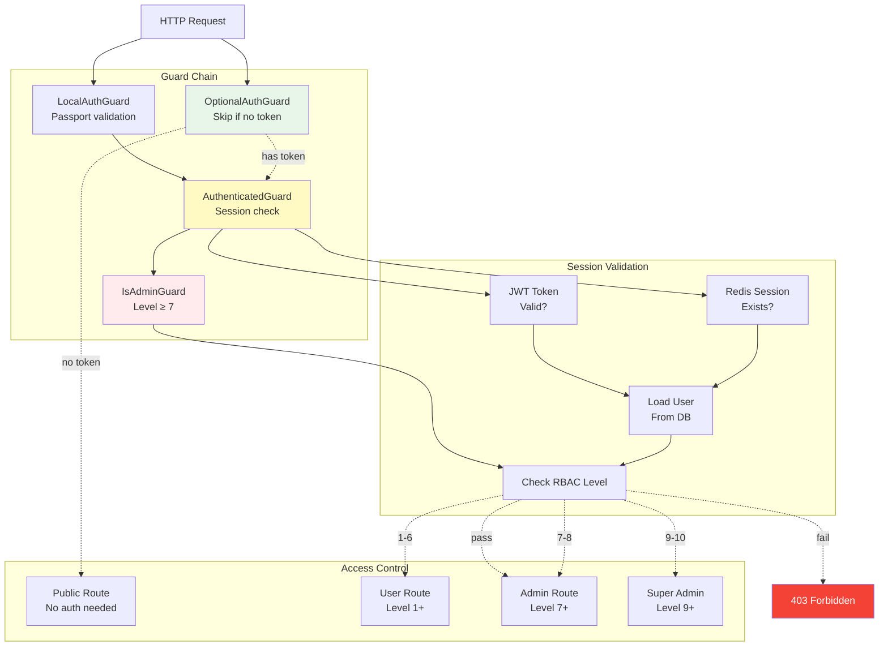
```mermaid
graph TB
    REQUEST[HTTP Request]
    
    subgraph "Guard Chain"
        OPTIONAL[OptionalAuthGuard<br/>Skip if no token]
        LOCAL[LocalAuthGuard<br/>Passport validation]
        AUTHENTICATED[AuthenticatedGuard<br/>Session check]
        ADMIN[IsAdminGuard<br/>Level ≥ 7]
    end

    subgraph "Session Validation"
        SESSION_CHECK[Redis Session<br/>Exists?]
        JWT_CHECK[JWT Token<br/>Valid?]
        USER_LOAD[Load User<br/>From DB]
        LEVEL_CHECK[Check RBAC Level]
    end

    subgraph "Access Control"
        PUBLIC[Public Route<br/>No auth needed]
        USER[User Route<br/>Level 1+]
        ADMIN_ROUTE[Admin Route<br/>Level 7+]
        SUPER_ADMIN[Super Admin<br/>Level 9+]
    end

    REQUEST --> OPTIONAL
    OPTIONAL -.no token.-> PUBLIC
    OPTIONAL -.has token.-> AUTHENTICATED

    REQUEST --> LOCAL
    LOCAL --> AUTHENTICATED

    AUTHENTICATED --> SESSION_CHECK
    AUTHENTICATED --> JWT_CHECK
    SESSION_CHECK --> USER_LOAD
    JWT_CHECK --> USER_LOAD

    USER_LOAD --> LEVEL_CHECK

    LEVEL_CHECK -.1-6.-> USER
    LEVEL_CHECK -.7-8.-> ADMIN_ROUTE
    LEVEL_CHECK -.9-10.-> SUPER_ADMIN

    AUTHENTICATED --> ADMIN
    ADMIN --> LEVEL_CHECK
    LEVEL_CHECK -.fail.-> REJECT[403 Forbidden]
    LEVEL_CHECK -.pass.-> ADMIN_ROUTE

    style OPTIONAL fill:#e8f5e9
    style AUTHENTICATED fill:#fff9c4
    style ADMIN fill:#ffebee
    style REJECT fill:#f44336,color:#fff
```

**Guards par Module:**

| Module | Guards | RBAC Level | Notes |
|--------|--------|------------|-------|
| **Auth** | LocalAuthGuard | Public | Login endpoint |
| **Profile** | AuthenticatedGuard | 1+ | User must be logged in |
| **Admin Stock** | AuthenticatedGuard + IsAdminGuard | 7+ | Admin staff only |
| **Admin Config** | AuthenticatedGuard + IsAdminGuard | 9+ | Super admin only |
| **Cart** | AuthenticatedGuard | 1+ | Session required |
| **Orders** | AuthenticatedGuard | 1+ | Own orders only |
| **Blog** | OptionalAuthGuard | Public | Public + logged users |
| **Analytics** | OptionalAuthGuard | Public | Track both |

---

### Password Security & Upgrade Flow

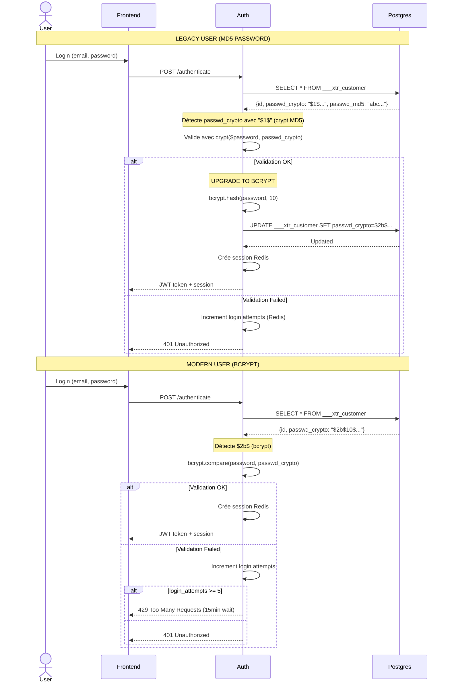
```mermaid
sequenceDiagram
    actor User
    participant Frontend
    participant Auth
    participant Postgres

    Note over User,Postgres: LEGACY USER (MD5 PASSWORD)
    User->>Frontend: Login (email, password)
    Frontend->>Auth: POST /authenticate
    Auth->>Postgres: SELECT * FROM ___xtr_customer
    Postgres-->>Auth: {id, passwd_crypto: "$1$...", passwd_md5: "abc..."}

    Note over Auth: Détecte passwd_crypto avec "$1$" (crypt MD5)
    Auth->>Auth: Valide avec crypt($password, passwd_crypto)
    Alt Validation OK
        Note over Auth: UPGRADE TO BCRYPT
        Auth->>Auth: bcrypt.hash(password, 10)
        Auth->>Postgres: UPDATE ___xtr_customer SET passwd_crypto=$2b$...
        Postgres-->>Auth: Updated
        Auth->>Auth: Crée session Redis
        Auth-->>Frontend: JWT token + session
    Else Validation Failed
        Auth->>Auth: Increment login attempts (Redis)
        Auth-->>Frontend: 401 Unauthorized
    End

    Note over User,Postgres: MODERN USER (BCRYPT)
    User->>Frontend: Login (email, password)
    Frontend->>Auth: POST /authenticate
    Auth->>Postgres: SELECT * FROM ___xtr_customer
    Postgres-->>Auth: {id, passwd_crypto: "$2b$10$..."}
    Note over Auth: Détecte $2b$ (bcrypt)
    Auth->>Auth: bcrypt.compare(password, passwd_crypto)
    Alt Validation OK
        Auth->>Auth: Crée session Redis
        Auth-->>Frontend: JWT token + session
    Else Validation Failed
        Auth->>Auth: Increment login attempts
        Alt login_attempts >= 5
            Auth-->>Frontend: 429 Too Many Requests (15min wait)
        Else
            Auth-->>Frontend: 401 Unauthorized
        End
    End
```

---

## ⚡ Cache & Performance

### Cache Strategy Multi-Niveaux

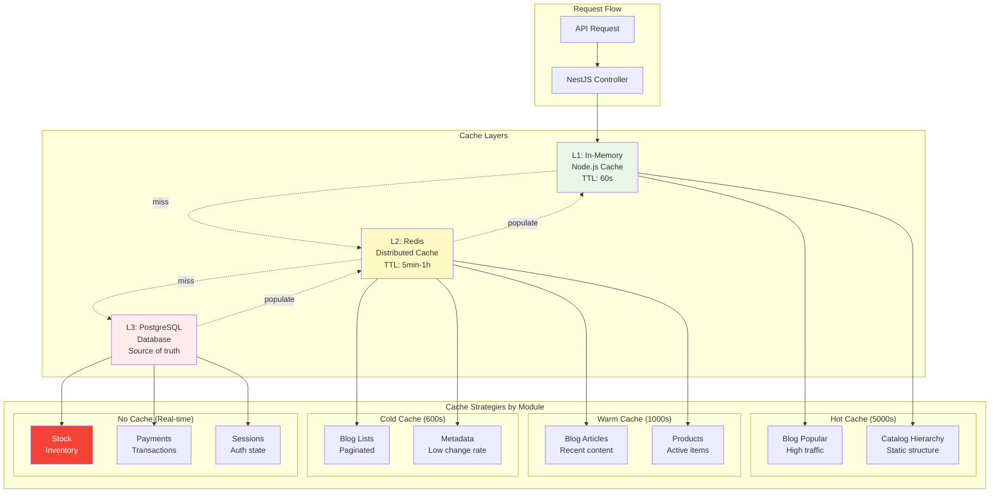
```mermaid
graph TB
    subgraph "Request Flow"
        REQUEST[API Request]
        CONTROLLER[NestJS Controller]
    end

    subgraph "Cache Layers"
        L1[L1: In-Memory<br/>Node.js Cache<br/>TTL: 60s]
        L2[L2: Redis<br/>Distributed Cache<br/>TTL: 5min-1h]
        L3[L3: PostgreSQL<br/>Database<br/>Source of truth]
    end

    subgraph "Cache Strategies by Module"
        subgraph "Hot Cache (5000s)"
            BLOG_POP[Blog Popular<br/>High traffic]
            CATALOG_HIER[Catalog Hierarchy<br/>Static structure]
        end

        subgraph "Warm Cache (1000s)"
            BLOG_ART[Blog Articles<br/>Recent content]
            PRODUCTS[Products<br/>Active items]
        end

        subgraph "Cold Cache (600s)"
            BLOG_LIST[Blog Lists<br/>Paginated]
            META[Metadata<br/>Low change rate]
        end

        subgraph "No Cache (Real-time)"
            STOCK[Stock<br/>Inventory]
            PAYMENTS[Payments<br/>Transactions]
            SESSION[Sessions<br/>Auth state]
        end
    end

    REQUEST --> CONTROLLER
    CONTROLLER --> L1
    L1 -.miss.-> L2
    L2 -.miss.-> L3
    L3 -.populate.-> L2
    L2 -.populate.-> L1

    L1 --> BLOG_POP
    L1 --> CATALOG_HIER

    L2 --> BLOG_ART
    L2 --> PRODUCTS
    L2 --> BLOG_LIST
    L2 --> META

    L3 --> STOCK
    L3 --> PAYMENTS
    L3 --> SESSION

    style L1 fill:#e8f5e9
    style L2 fill:#fff9c4
    style L3 fill:#ffebee
    style STOCK fill:#f44336,color:#fff
```

**Cache TTL par Module:**

| Module | Data Type | TTL | Strategy | Redis Key Pattern |
|--------|-----------|-----|----------|-------------------|
| **Blog** | Popular articles | 5000s | Hot | `blog:popular` |
| **Blog** | Article detail | 1000s | Warm | `blog:article:{slug}` |
| **Blog** | Article lists | 600s | Cold | `blog:list:{page}` |
| **Blog Metadata** | SEO metadata | 3600s | Cold | `blog:meta:{alias}` |
| **Catalog** | Hierarchy | 300s | Warm | `catalog:hierarchy` |
| **Catalog** | Famille detail | 300s | Warm | `catalog:famille:{id}` |
| **Products** | Product detail | 600s | Warm | `products:{pg_id}` |
| **Products** | Search results | - | None | Real-time |
| **Cart** | Cart data | - | Session | `cart:{session_id}` |
| **Auth** | Session | 604800s | 7 days | `sess:{session_id}` |
| **Auth** | Login attempts | 900s | 15min | `login:attempts:{email}` |
| **Analytics** | Events buffer | 600s | 10min | `analytics:buffer` |

---

### Performance Optimization Patterns

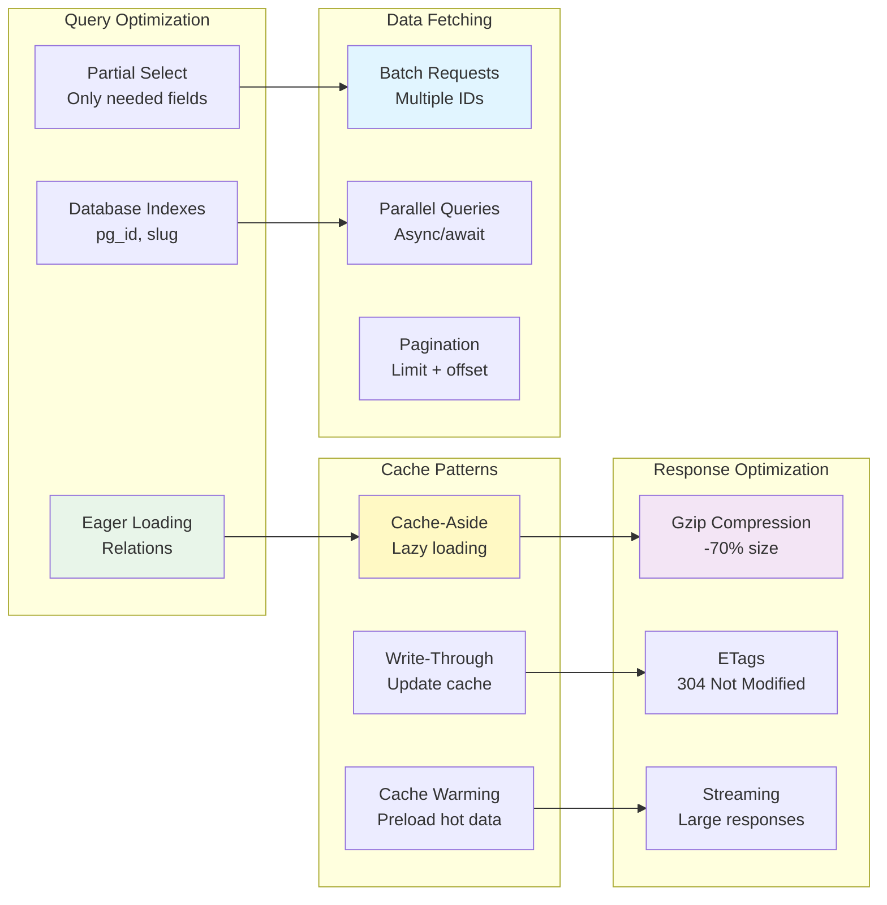
```mermaid
graph LR
    subgraph "Query Optimization"
        EAGER[Eager Loading<br/>Relations]
        INDEX[Database Indexes<br/>pg_id, slug]
        PARTIAL[Partial Select<br/>Only needed fields]
    end

    subgraph "Cache Patterns"
        CACHE_ASIDE[Cache-Aside<br/>Lazy loading]
        WRITE_THROUGH[Write-Through<br/>Update cache]
        CACHE_WARM[Cache Warming<br/>Preload hot data]
    end

    subgraph "Data Fetching"
        BATCH[Batch Requests<br/>Multiple IDs]
        PARALLEL[Parallel Queries<br/>Async/await]
        PAGINATION[Pagination<br/>Limit + offset]
    end

    subgraph "Response Optimization"
        COMPRESSION[Gzip Compression<br/>-70% size]
        ETAG[ETags<br/>304 Not Modified]
        STREAMING[Streaming<br/>Large responses]
    end

    EAGER --> CACHE_ASIDE
    INDEX --> PARALLEL
    PARTIAL --> BATCH
    
    CACHE_ASIDE --> COMPRESSION
    WRITE_THROUGH --> ETAG
    CACHE_WARM --> STREAMING

    style EAGER fill:#e8f5e9
    style CACHE_ASIDE fill:#fff9c4
    style BATCH fill:#e1f5ff
    style COMPRESSION fill:#f3e5f5
```

---

## 🔄 Workflows Métier

### Workflow Commande (8 États)

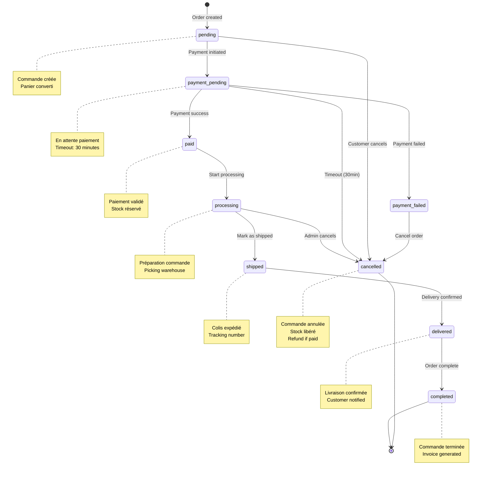
```mermaid
stateDiagram-v2
    [*] --> pending: Order created

    pending --> payment_pending: Payment initiated
    payment_pending --> paid: Payment success
    payment_pending --> payment_failed: Payment failed
    payment_failed --> cancelled: Cancel order

    paid --> processing: Start processing
    processing --> shipped: Mark as shipped
    shipped --> delivered: Delivery confirmed
    delivered --> completed: Order complete

    pending --> cancelled: Customer cancels
    payment_pending --> cancelled: Timeout (30min)
    processing --> cancelled: Admin cancels

    cancelled --> [*]
    completed --> [*]

    note right of pending
        Commande créée
        Panier converti
    end note

    note right of payment_pending
        En attente paiement
        Timeout: 30 minutes
    end note

    note right of paid
        Paiement validé
        Stock réservé
    end note

    note right of processing
        Préparation commande
        Picking warehouse
    end note

    note right of shipped
        Colis expédié
        Tracking number
    end note

    note right of delivered
        Livraison confirmée
        Customer notified
    end note

    note right of completed
        Commande terminée
        Invoice generated
    end note

    note right of cancelled
        Commande annulée
        Stock libéré
        Refund if paid
    end note
```

**Transitions & Permissions:**

| From | To | Actor | Conditions |
|------|----|----- |-----------|
| `pending` | `payment_pending` | System | Payment init |
| `payment_pending` | `paid` | System | Paybox callback success |
| `payment_pending` | `cancelled` | System | Timeout 30min |
| `paid` | `processing` | Admin (7+) | Manual trigger |
| `processing` | `shipped` | Admin (7+) | Tracking number |
| `shipped` | `delivered` | System/Admin | Carrier confirmation |
| `delivered` | `completed` | System | Auto after 48h |
| `pending` | `cancelled` | Customer | Before payment |
| `processing` | `cancelled` | Admin (9+) | With approval |

---

### Workflow Stock Reservation

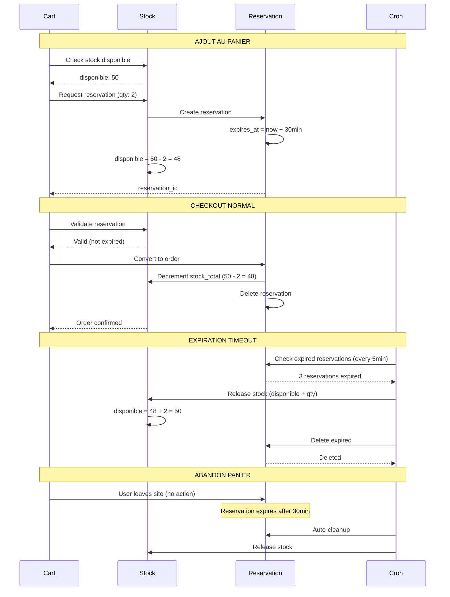
```mermaid
sequenceDiagram
    participant Cart
    participant Stock
    participant Reservation
    participant Cron

    Note over Cart,Cron: AJOUT AU PANIER
    Cart->>Stock: Check stock disponible
    Stock-->>Cart: disponible: 50
    Cart->>Stock: Request reservation (qty: 2)
    Stock->>Reservation: Create reservation
    Reservation->>Reservation: expires_at = now + 30min
    Stock->>Stock: disponible = 50 - 2 = 48
    Reservation-->>Cart: reservation_id

    Note over Cart,Cron: CHECKOUT NORMAL
    Cart->>Stock: Validate reservation
    Stock-->>Cart: Valid (not expired)
    Cart->>Reservation: Convert to order
    Reservation->>Stock: Decrement stock_total (50 - 2 = 48)
    Reservation->>Reservation: Delete reservation
    Stock-->>Cart: Order confirmed

    Note over Cart,Cron: EXPIRATION TIMEOUT
    Cron->>Reservation: Check expired reservations (every 5min)
    Reservation-->>Cron: 3 reservations expired
    Cron->>Stock: Release stock (disponible + qty)
    Stock->>Stock: disponible = 48 + 2 = 50
    Cron->>Reservation: Delete expired
    Reservation-->>Cron: Deleted

    Note over Cart,Cron: ABANDON PANIER
    Cart->>Reservation: User leaves site (no action)
    Note over Reservation: Reservation expires after 30min
    Cron->>Reservation: Auto-cleanup
    Cron->>Stock: Release stock
```

---

### Workflow AI Content Generation

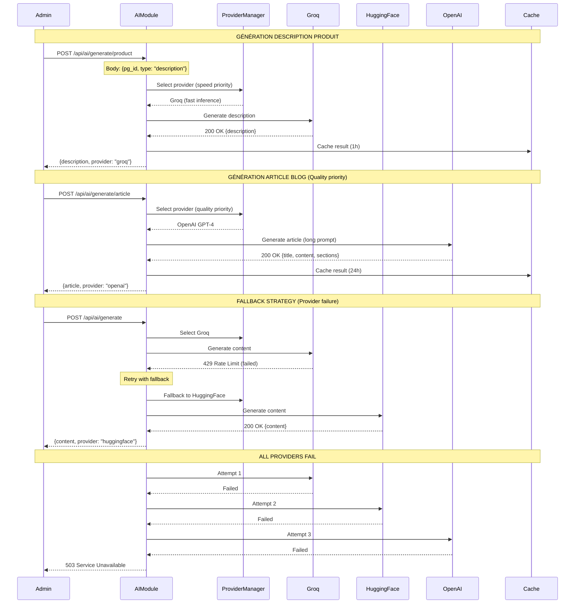
```mermaid
sequenceDiagram
    participant Admin
    participant AIModule
    participant ProviderManager
    participant Groq
    participant HuggingFace
    participant OpenAI
    participant Cache

    Note over Admin,Cache: GÉNÉRATION DESCRIPTION PRODUIT
    Admin->>AIModule: POST /api/ai/generate/product
    Note over AIModule: Body: {pg_id, type: "description"}
    AIModule->>ProviderManager: Select provider (speed priority)
    ProviderManager-->>AIModule: Groq (fast inference)

    AIModule->>Groq: Generate description
    Groq-->>AIModule: 200 OK {description}
    AIModule->>Cache: Cache result (1h)
    AIModule-->>Admin: {description, provider: "groq"}

    Note over Admin,Cache: GÉNÉRATION ARTICLE BLOG (Quality priority)
    Admin->>AIModule: POST /api/ai/generate/article
    AIModule->>ProviderManager: Select provider (quality priority)
    ProviderManager-->>AIModule: OpenAI GPT-4

    AIModule->>OpenAI: Generate article (long prompt)
    OpenAI-->>AIModule: 200 OK {title, content, sections}
    AIModule->>Cache: Cache result (24h)
    AIModule-->>Admin: {article, provider: "openai"}

    Note over Admin,Cache: FALLBACK STRATEGY (Provider failure)
    Admin->>AIModule: POST /api/ai/generate
    AIModule->>ProviderManager: Select Groq
    AIModule->>Groq: Generate content
    Groq-->>AIModule: 429 Rate Limit (failed)
    
    Note over AIModule: Retry with fallback
    AIModule->>ProviderManager: Fallback to HuggingFace
    AIModule->>HuggingFace: Generate content
    HuggingFace-->>AIModule: 200 OK {content}
    AIModule-->>Admin: {content, provider: "huggingface"}

    Note over Admin,Cache: ALL PROVIDERS FAIL
    AIModule->>Groq: Attempt 1
    Groq-->>AIModule: Failed
    AIModule->>HuggingFace: Attempt 2
    HuggingFace-->>AIModule: Failed
    AIModule->>OpenAI: Attempt 3
    OpenAI-->>AIModule: Failed
    AIModule-->>Admin: 503 Service Unavailable
```

---

## 📚 Références

### Documentation Liée

- **Main README**: [README.md](./README.md) - Navigation principale
- **API Index**: [API-ENDPOINTS-INDEX.md](./API-ENDPOINTS-INDEX.md) - Référence complète endpoints
- **Coverage Report**: [CRITICAL-MODULES-REPORT.md](./features/CRITICAL-MODULES-REPORT.md) - Rapport 100%
- **Quick Start**: [QUICK-START-DEV.md](./QUICK-START-DEV.md) - Guide développeur (à créer)

### Specs par Module

Voir README principal pour la liste complète des 37 modules documentés.

---

## 🎯 Prochaines Étapes

### Phase 3 - Diagrammes Détaillés (Roadmap)

1. **Sequence Diagrams** - Flows détaillés par use case
2. **Component Diagrams** - Architecture interne des modules
3. **Deployment Diagrams** - Infrastructure & containers
4. **Class Diagrams** - Modèles de données & relations
5. **State Machines** - Workflows avancés (retours, SAV)

---

**Made with ❤️ by Backend Team**  
**Architecture Documentation v1.0.0 - 2025-11-18**
