# 🏗️ Diagrammes d'Architecture

> **Visualisation complète de l'architecture backend** - Modules, flux de données, intégrations

**Version:** 1.0.0
**Dernière mise à jour:** 2025-11-18
**Modules:** 37/37 (100% coverage)

---

## 📋 Table des matières

- [Vue d'ensemble globale](#-vue-densemble-globale)
- [Architecture par domaine](#-architecture-par-domaine)
- [Flux de données](#-flux-de-donn%C3%A9es)
- [Intégrations externes](#-int%C3%A9grations-externes)
- [Guards & Sécurité](#-guards--s%C3%A9curit%C3%A9)
- [Cache & Performance](#-cache--performance)
- [Workflows métier](#-workflows-m%C3%A9tier)

---

## 🌐 Vue d'ensemble globale

### Architecture Générale du Backend


---

## 🎯 Architecture par Domaine

### E-commerce Core - Architecture Complète


---

### Auth & Admin - RBAC Architecture


---

### CMS & Content - Blog Architecture


---

## 🔄 Flux de Données

### Flux E-commerce Complet (Customer Journey)


---

### Flux Admin - Gestion Stock

```mermaid
sequenceDiagram
    actor Admin
    participant Frontend
    participant Auth
    participant AdminModule
    participant Stock
    participant Products
    participant Redis
    participant Postgres

    Note over Admin,Postgres: 1. AUTHENTIFICATION ADMIN
    Admin->>Frontend: Login admin
    Frontend->>Auth: POST /authenticate
    Auth->>Postgres: SELECT * FROM ___config_admin
    Postgres-->>Auth: User level 8
    Auth->>Auth: Vérifie level ≥ 7
    Auth-->>Frontend: JWT + IsAdminGuard OK

    Note over Admin,Postgres: 2. DASHBOARD STOCK
    Admin->>Frontend: Accède dashboard stock
    Frontend->>AdminModule: GET /api/admin/stock/dashboard
    AdminModule->>Redis: Check cache (TTL 60s)
    Redis-->>AdminModule: Cache miss
    AdminModule->>Stock: Query all gammes stock
    Stock->>Postgres: SELECT FROM ___pieces_gamme
    Postgres-->>Stock: Stock data (400k produits)
    Stock-->>AdminModule: Aggregated stats
    AdminModule->>Redis: Cache result (60s)
    AdminModule-->>Frontend: {total, disponible, reserved, alerts}

    Note over Admin,Postgres: 3. ALERTE STOCK BAS
    AdminModule->>Stock: Detect low stock (threshold)
    Stock->>Postgres: SELECT WHERE stock < threshold
    Postgres-->>Stock: 15 produits en alerte
    Stock-->>Frontend: Display alerts

    Note over Admin,Postgres: 4. MISE À JOUR STOCK
    Admin->>Frontend: Update PG123 stock (50 → 100)
    Frontend->>AdminModule: PUT /api/admin/stock/PG123
    AdminModule->>Auth: Vérifie IsAdminGuard
    Auth-->>AdminModule: Level 8 OK
    AdminModule->>Stock: Update stock
    Stock->>Postgres: UPDATE ___pieces_gamme SET stock=100
    Postgres-->>Stock: Updated
    Stock->>Stock: Log movement history
    Stock->>Redis: Invalidate cache
    Stock-->>Frontend: Stock updated

    Note over Admin,Postgres: 5. RÉSERVATION STOCK
    Admin->>Frontend: Reserve 20 units PG123
    Frontend->>AdminModule: POST /api/admin/stock/reserve
    AdminModule->>Stock: Create reservation
    Stock->>Postgres: INSERT INTO reservations
    Stock->>Postgres: UPDATE stock_disponible = 80
    Postgres-->>Stock: Reservation ID
    Stock-->>Frontend: {reservation_id, expires_at}

    Note over Admin,Postgres: 6. EXPORT STOCK CSV
    Admin->>Frontend: Exporte stock complet
    Frontend->>AdminModule: GET /api/admin/stock/export
    AdminModule->>Stock: Generate CSV
    Stock->>Postgres: SELECT * FROM ___pieces_gamme
    Postgres-->>Stock: All stock data
    Stock->>Stock: Format CSV (pg_id, stock, price...)
    Stock-->>Frontend: text/csv file
    Frontend-->>Admin: Download stock.csv
```



---

### Flux Blog - Content Delivery avec Cache


---

## 🔌 Intégrations Externes

### Intégration Paybox (Payment Gateway)


**Paramètres Paybox:**

```
PBX_SITE: Site ID (config)
PBX_RANG: Rang (config)
PBX_IDENTIFIANT: Identifiant (config)
PBX_TOTAL: Montant en centimes (ex: 15900 = 159.00€)
PBX_DEVISE: 978 (EUR)
PBX_CMD: Order reference (unique)
PBX_PORTEUR: Email client
PBX_RETOUR: Variables retour (Mt, Ref, Auto, Erreur)
PBX_HASH: SHA512
PBX_TIME: ISO-8601 timestamp
PBX_HMAC: HMAC SHA512 signature
```

---

### Intégration AI Multi-Provider


**Providers:**

| Provider | Use Case | Speed | Cost | Quality |
|----------|----------|-------|------|---------|
| **Groq** | Product descriptions, SEO | ⚡⚡⚡ Very Fast | 💰 Free tier | ⭐⭐⭐ Good |
| **HuggingFace** | Bulk generation, summaries | ⚡⚡ Fast | 💰 Low cost | ⭐⭐ Fair |
| **OpenAI** | Blog articles, complex tasks | ⚡ Moderate | 💰💰💰 High | ⭐⭐⭐⭐⭐ Excellent |
| **Mistral** | GDPR compliance, EU data | ⚡⚡ Fast | 💰💰 Medium | ⭐⭐⭐⭐ Very Good |

---

### Intégration Analytics Multi-Provider

```mermaid
graph LR
    subgraph "Frontend Events"
        PAGE_VIEW[Page View]
        CLICK[Click Event]
        ADD_CART[Add to Cart]
        PURCHASE[Purchase]
    end

    subgraph "Analytics Module"
        BUFFER[Event Buffer<br/>1000 max]
        BATCH[Batch Processor<br/>Flush every 10s]
    end

    subgraph "Providers"
        GA4[Google Analytics<br/>GA4]
        MATOMO[Matomo<br/>Privacy-focused]
        PLAUSIBLE[Plausible<br/>Simple analytics]
        CUSTOM[Custom DB<br/>Internal tracking]
    end

    subgraph "Legacy PHP Endpoints"
        TRACK_PHP[/track.php<br/>Legacy compat]
        V7_TRACK[/v7.track.php<br/>V7 compat]
    end

    PAGE_VIEW --> BUFFER
    CLICK --> BUFFER
    ADD_CART --> BUFFER
    PURCHASE --> BUFFER

    TRACK_PHP --> BUFFER
    V7_TRACK --> BUFFER

    BUFFER --> BATCH
    
    BATCH --> GA4
    BATCH --> MATOMO
    BATCH --> PLAUSIBLE
    BATCH --> CUSTOM

    style BUFFER fill:#fff9c4
    style BATCH fill:#ffebee
    style GA4 fill:#e1f5ff
    style MATOMO fill:#e8f5e9
    style PLAUSIBLE fill:#f3e5f5
```

**Buffer Strategy:**

- **Max size:** 1000 events
- **Flush interval:** Every 10 seconds
- **Overflow:** Slice to 500 oldest events
- **Retry:** 3 attempts with exponential backoff
- **Cache:** Redis 10 minutes TTL

---

## 🔒 Guards & Sécurité

### Guards Hierarchy & Flow


**Guards par Module:**

| Module | Guards | RBAC Level | Notes |
|--------|--------|------------|-------|
| **Auth** | LocalAuthGuard | Public | Login endpoint |
| **Profile** | AuthenticatedGuard | 1+ | User must be logged in |
| **Admin Stock** | AuthenticatedGuard + IsAdminGuard | 7+ | Admin staff only |
| **Admin Config** | AuthenticatedGuard + IsAdminGuard | 9+ | Super admin only |
| **Cart** | AuthenticatedGuard | 1+ | Session required |
| **Orders** | AuthenticatedGuard | 1+ | Own orders only |
| **Blog** | OptionalAuthGuard | Public | Public + logged users |
| **Analytics** | OptionalAuthGuard | Public | Track both |

---

### Password Security & Upgrade Flow

```mermaid
sequenceDiagram
    actor User
    participant Frontend
    participant Auth
    participant Postgres

    Note over User,Postgres: LEGACY USER (MD5 PASSWORD)
    User->>Frontend: Login (email, password)
    Frontend->>Auth: POST /authenticate
    Auth->>Postgres: SELECT * FROM ___xtr_customer
    Postgres-->>Auth: {id, passwd_crypto: "$1$...", passwd_md5: "abc..."}

    Note over Auth: Détecte passwd_crypto avec "$1$" (crypt MD5)
    Auth->>Auth: Valide avec crypt($password, passwd_crypto)
    Alt Validation OK
        Note over Auth: UPGRADE TO BCRYPT
        Auth->>Auth: bcrypt.hash(password, 10)
        Auth->>Postgres: UPDATE ___xtr_customer SET passwd_crypto=$2b$...
        Postgres-->>Auth: Updated
        Auth->>Auth: Crée session Redis
        Auth-->>Frontend: JWT token + session
    Else Validation Failed
        Auth->>Auth: Increment login attempts (Redis)
        Auth-->>Frontend: 401 Unauthorized
    End

    Note over User,Postgres: MODERN USER (BCRYPT)
    User->>Frontend: Login (email, password)
    Frontend->>Auth: POST /authenticate
    Auth->>Postgres: SELECT * FROM ___xtr_customer
    Postgres-->>Auth: {id, passwd_crypto: "$2b$10$..."}
    Note over Auth: Détecte $2b$ (bcrypt)
    Auth->>Auth: bcrypt.compare(password, passwd_crypto)
    Alt Validation OK
        Auth->>Auth: Crée session Redis
        Auth-->>Frontend: JWT token + session
    Else Validation Failed
        Auth->>Auth: Increment login attempts
        Alt login_attempts >= 5
            Auth-->>Frontend: 429 Too Many Requests (15min wait)
        Else
            Auth-->>Frontend: 401 Unauthorized
        End
    End
```



---

## ⚡ Cache & Performance

### Cache Strategy Multi-Niveaux


**Cache TTL par Module:**

| Module | Data Type | TTL | Strategy | Redis Key Pattern |
|--------|-----------|-----|----------|-------------------|
| **Blog** | Popular articles | 5000s | Hot | `blog:popular` |
| **Blog** | Article detail | 1000s | Warm | `blog:article:{slug}` |
| **Blog** | Article lists | 600s | Cold | `blog:list:{page}` |
| **Blog Metadata** | SEO metadata | 3600s | Cold | `blog:meta:{alias}` |
| **Catalog** | Hierarchy | 300s | Warm | `catalog:hierarchy` |
| **Catalog** | Famille detail | 300s | Warm | `catalog:famille:{id}` |
| **Products** | Product detail | 600s | Warm | `products:{pg_id}` |
| **Products** | Search results | - | None | Real-time |
| **Cart** | Cart data | - | Session | `cart:{session_id}` |
| **Auth** | Session | 604800s | 7 days | `sess:{session_id}` |
| **Auth** | Login attempts | 900s | 15min | `login:attempts:{email}` |
| **Analytics** | Events buffer | 600s | 10min | `analytics:buffer` |

---

### Performance Optimization Patterns


---

## 🔄 Workflows Métier

### Workflow Commande (8 États)

```mermaid
stateDiagram-v2
    [*] --> pending: Order created

    pending --> payment_pending: Payment initiated
    payment_pending --> paid: Payment success
    payment_pending --> payment_failed: Payment failed
    payment_failed --> cancelled: Cancel order

    paid --> processing: Start processing
    processing --> shipped: Mark as shipped
    shipped --> delivered: Delivery confirmed
    delivered --> completed: Order complete

    pending --> cancelled: Customer cancels
    payment_pending --> cancelled: Timeout (30min)
    processing --> cancelled: Admin cancels

    cancelled --> [*]
    completed --> [*]

    note right of pending
        Commande créée
        Panier converti
    end note

    note right of payment_pending
        En attente paiement
        Timeout: 30 minutes
    end note

    note right of paid
        Paiement validé
        Stock réservé
    end note

    note right of processing
        Préparation commande
        Picking warehouse
    end note

    note right of shipped
        Colis expédié
        Tracking number
    end note

    note right of delivered
        Livraison confirmée
        Customer notified
    end note

    note right of completed
        Commande terminée
        Invoice generated
    end note

    note right of cancelled
        Commande annulée
        Stock libéré
        Refund if paid
    end note
```



**Transitions & Permissions:**

| From | To | Actor | Conditions |
|------|----|----- |-----------|
| `pending` | `payment_pending` | System | Payment init |
| `payment_pending` | `paid` | System | Paybox callback success |
| `payment_pending` | `cancelled` | System | Timeout 30min |
| `paid` | `processing` | Admin (7+) | Manual trigger |
| `processing` | `shipped` | Admin (7+) | Tracking number |
| `shipped` | `delivered` | System/Admin | Carrier confirmation |
| `delivered` | `completed` | System | Auto after 48h |
| `pending` | `cancelled` | Customer | Before payment |
| `processing` | `cancelled` | Admin (9+) | With approval |

---

### Workflow Stock Reservation


---

### Workflow AI Content Generation

```mermaid
sequenceDiagram
    participant Admin
    participant AIModule
    participant ProviderManager
    participant Groq
    participant HuggingFace
    participant OpenAI
    participant Cache

    Note over Admin,Cache: GÉNÉRATION DESCRIPTION PRODUIT
    Admin->>AIModule: POST /api/ai/generate/product
    Note over AIModule: Body: {pg_id, type: "description"}
    AIModule->>ProviderManager: Select provider (speed priority)
    ProviderManager-->>AIModule: Groq (fast inference)

    AIModule->>Groq: Generate description
    Groq-->>AIModule: 200 OK {description}
    AIModule->>Cache: Cache result (1h)
    AIModule-->>Admin: {description, provider: "groq"}

    Note over Admin,Cache: GÉNÉRATION ARTICLE BLOG (Quality priority)
    Admin->>AIModule: POST /api/ai/generate/article
    AIModule->>ProviderManager: Select provider (quality priority)
    ProviderManager-->>AIModule: OpenAI GPT-4

    AIModule->>OpenAI: Generate article (long prompt)
    OpenAI-->>AIModule: 200 OK {title, content, sections}
    AIModule->>Cache: Cache result (24h)
    AIModule-->>Admin: {article, provider: "openai"}

    Note over Admin,Cache: FALLBACK STRATEGY (Provider failure)
    Admin->>AIModule: POST /api/ai/generate
    AIModule->>ProviderManager: Select Groq
    AIModule->>Groq: Generate content
    Groq-->>AIModule: 429 Rate Limit (failed)
    
    Note over AIModule: Retry with fallback
    AIModule->>ProviderManager: Fallback to HuggingFace
    AIModule->>HuggingFace: Generate content
    HuggingFace-->>AIModule: 200 OK {content}
    AIModule-->>Admin: {content, provider: "huggingface"}

    Note over Admin,Cache: ALL PROVIDERS FAIL
    AIModule->>Groq: Attempt 1
    Groq-->>AIModule: Failed
    AIModule->>HuggingFace: Attempt 2
    HuggingFace-->>AIModule: Failed
    AIModule->>OpenAI: Attempt 3
    OpenAI-->>AIModule: Failed
    AIModule-->>Admin: 503 Service Unavailable
```



---

## 📚 Références

### Documentation Liée

- **Main README**: [README.md](./README.md) - Navigation principale
- **API Index**: [API-ENDPOINTS-INDEX.md](./API-ENDPOINTS-INDEX.md) - Référence complète endpoints
- **Coverage Report**: [CRITICAL-MODULES-REPORT.md](./features/CRITICAL-MODULES-REPORT.md) - Rapport 100%
- **Quick Start**: [QUICK-START-DEV.md](./QUICK-START-DEV.md) - Guide développeur (à créer)

### Specs par Module

Voir README principal pour la liste complète des 37 modules documentés.

---

## 🎯 Prochaines Étapes

### Phase 3 - Diagrammes Détaillés (Roadmap)

1. **Sequence Diagrams** - Flows détaillés par use case
2. **Component Diagrams** - Architecture interne des modules
3. **Deployment Diagrams** - Infrastructure & containers
4. **Class Diagrams** - Modèles de données & relations
5. **State Machines** - Workflows avancés (retours, SAV)

---

**Made with ❤️ by Backend Team**  
**Architecture Documentation v1.0.0 - 2025-11-18**
