# 🏗️ Architecture Backend - NestJS E-commerce

> **Vue d'ensemble de l'architecture backend** - Diagrammes détaillés, flux de données, intégrations externes

**Version:** 1.0.0  
**Dernière mise à jour:** 2025-11-18

---

## 📋 Table des Matières

- [Vue d'ensemble](#vue-densemble)
- [Architecture Globale](#architecture-globale)
- [Modules par Couche](#modules-par-couche)
- [Flux de Données](#flux-de-données)
- [Intégrations Externes](#intégrations-externes)
- [Sécurité](#sécurité)
- [Performance & Cache](#performance--cache)

---

## Vue d'ensemble

### Stack Technique

```
┌─────────────────────────────────────────────────────────────┐
│                        FRONTEND                              │
│  Remix (React) - Server-Side Rendering - TypeScript         │
└──────────────────────┬──────────────────────────────────────┘
                       │ HTTP/REST
┌──────────────────────▼──────────────────────────────────────┐
│                     BACKEND API                              │
│  NestJS 10.3+ - Node.js 20 LTS - TypeScript 5.3+           │
│                                                              │
│  ┌────────────┐  ┌────────────┐  ┌────────────┐           │
│  │   Auth     │  │ E-commerce │  │  Content   │           │
│  │  Modules   │  │   Modules  │  │  Modules   │           │
│  └────────────┘  └────────────┘  └────────────┘           │
└──────────────────────┬──────────────────────────────────────┘
                       │
        ┌──────────────┼──────────────┐
        │              │              │
┌───────▼───────┐ ┌───▼────┐ ┌──────▼──────┐
│  PostgreSQL   │ │ Redis  │ │ Meilisearch │
│   Supabase    │ │ Cache  │ │   Search    │
└───────────────┘ └────────┘ └─────────────┘
```

### Statistiques

- **37 modules** documentés (100% coverage)
- **187+ endpoints** REST API
- **50+ tables** PostgreSQL (Supabase)
- **15+ services** Redis cache
- **4 providers** AI intégrés
- **400,000+** produits catalogués
- **30,000+** véhicules référencés

---

## Architecture Globale

### Diagramme Complet des Modules


---

## Modules par Couche

### 🔐 Couche Authentication & Authorization

#### Auth Module
**Responsabilités:**
- Authentification Passport.js (LocalStrategy)
- Génération JWT tokens (7 days expiration)
- Gestion sessions (Redis store)
- Migration legacy passwords (MD5→bcrypt)
- Rate limiting (5 attempts/15min)

**Guards:**
- `AuthenticatedGuard`: Vérifie session active
- `IsAdminGuard`: Vérifie level ≥ 7
- `LocalAuthGuard`: Passport validation
- `OptionalAuthGuard`: Public + authenticated content

**Endpoints:** 6  
**Spec:** [auth-module.md](./features/auth-module.md)

#### Admin Module
**Responsabilités:**
- RBAC (levels 1-10, 7+=admin)
- Stock management (dashboard, movements, reservations, alerts)
- User management (stats, activation, level updates)
- Products admin (search, export, statistics)
- Reporting (analytics, scheduled reports)
- Configuration & SEO management

**Endpoints:** 39  
**Spec:** [admin-module.md](./features/admin-module.md)

---

### 🛒 Couche E-commerce Core

#### Catalog Module
**Responsabilités:**
- Hiérarchie 3 niveaux (Famille → Gamme → Produit)
- Recherche Meilisearch ultra-rapide
- Compatibilité véhicules (30k+ véhicules)
- Cache Redis multi-niveaux (hot/warm/cold)
- Breadcrumbs navigation

**Tables:**
- `__famille` (19 familles)
- `__pieces_gammes` (gammes produits)
- `__cross_gamme_car_new` (compatibilité véhicules)

**Endpoints:** 31  
**Spec:** [catalog-module.md](./features/catalog-module.md)

#### Products Module
**Responsabilités:**
- CRUD 400k+ produits
- Recherche textuelle Meilisearch
- Filtres véhicules avancés
- Prix dynamique (promos)
- Stock temps réel
- Images CDN Supabase
- Cross-sell & up-sell

**Endpoints:** 26  
**Spec:** [products.md](./features/products.md)

#### Cart Module
**Responsabilités:**
- Session management (Redis TTL 7 days)
- Merge guest → user cart (auto on login)
- Promo codes (stacking rules)
- Shipping calculation (multi-carrier)
- Stock validation temps réel
- Cart analytics tracking

**Endpoints:** 18  
**Spec:** [cart.md](./features/cart.md)

#### Payments Module
**Responsabilités:**
- Paybox integration (3DS secure)
- HMAC SHA512 validation
- Callbacks IPN handling
- Multi-currency support (EUR, USD, GBP)
- Fraud detection
- Refunds management

**Endpoints:** 11  
**Spec:** [payments.md](./features/payments.md)

#### Orders Module
**Responsabilités:**
- Workflow 8 états (pending → delivered/refunded)
- Status tracking
- Emails transactionnels (6 types)
- Invoice PDF generation
- Shipping tracking integration
- Returns & refunds workflow
- Admin export CSV

**Endpoints:** 17  
**Spec:** [orders.md](./features/orders.md)

#### Customers Module
**Responsabilités:**
- Account management
- Addresses CRUD
- Order history
- RGPD compliance (export, delete, consent)
- Wishlist management
- Notifications preferences

**Endpoints:** 17  
**Spec:** [customers.md](./features/customers.md)

---

### 📝 Couche Content Management

#### Blog Module
**Responsabilités:**
- CMS 85+ articles conseils (3.6M+ vues)
- Hiérarchie H2/H3 (457+ sections)
- Meilisearch indexation
- Cache 3 niveaux (hot 5000s, warm 1000s, cold 600s)
- Articles croisés (cross recommendations)
- Compatibilité véhicules
- SEO switches per gamme

**Tables:** 10  
**Endpoints:** 20+  
**Spec:** [blog-module.md](./features/blog-module.md)

#### Blog Metadata Module
**Responsabilités:**
- SEO centralisé (title, description, keywords, H1)
- Breadcrumbs ariane
- Cache Redis 1h TTL
- Fallback intelligent (default metadata)
- Normalisation relfollow

**Endpoints:** 5  
**Spec:** [blog-metadata-module.md](./features/blog-metadata-module.md)

#### AI Content Module
**Responsabilités:**
- Multi-provider (Groq, HuggingFace, OpenAI, Mistral)
- Génération descriptions produits
- SEO optimization
- Streaming responses (SSE)
- Fallback cascade (cheapest → most reliable)
- Token usage tracking

**Endpoints:** 10  
**Spec:** [ai-content-module.md](./features/ai-content-module.md)

#### Gamme REST Module
**Responsabilités:**
- Legacy PHP compatibility
- RPC-style endpoints
- SEO switches migration
- Vehicle assembly (type+modele+marque)
- Cache warm strategy

**Endpoints:** 12  
**Spec:** [gamme-rest-module.md](./features/gamme-rest-module.md)

---

### 📊 Couche Analytics & Monitoring

#### Analytics Module
**Responsabilités:**
- Multi-provider tracking (GA4, Matomo, Plausible, Custom)
- Legacy PHP endpoints (/track.php)
- Event buffer (1000 max, slice to 500)
- Script generation (minification, async/defer)
- GDPR compliant (IP anonymization, cookie consent)

**Endpoints:** 15+  
**Spec:** [analytics-module.md](./features/analytics-module.md)

#### Dashboard Module
**Responsabilités:**
- KPIs temps réel (orders, revenue, users)
- Orders statistics (date range)
- Revenue tracking & forecast
- Top products (sales, views)
- Low stock alerts
- Customers statistics

**Endpoints:** 9  
**Spec:** [dashboard-module.md](./features/dashboard-module.md)

---

## Flux de Données

### Flux E-commerce Complet

```mermaid
sequenceDiagram
    participant U as User
    participant F as Frontend
    participant AUTH as Auth Module
    participant CAT as Catalog Module
    participant PROD as Products Module
    participant CART as Cart Module
    participant PAY as Payments Module
    participant ORD as Orders Module
    participant CUST as Customers Module
    participant DB as Supabase
    participant REDIS as Redis Cache
    participant MEILI as Meilisearch

    %% Navigation & Search
    U->>F: Browse catalog
    F->>CAT: GET /api/catalog/hierarchy
    CAT->>REDIS: Check cache
    alt Cache hit
        REDIS-->>CAT: Return cached data
    else Cache miss
        CAT->>DB: Query hierarchy
        DB-->>CAT: Return data
        CAT->>REDIS: Store cache (TTL 300s)
    end
    CAT-->>F: Return hierarchy
    F-->>U: Display catalog

    %% Product Search
    U->>F: Search "filtre à huile BMW"
    F->>PROD: POST /api/products/search
    PROD->>MEILI: Search query
    MEILI-->>PROD: Search results
    PROD->>DB: Enrich with prices/stock
    DB-->>PROD: Product details
    PROD-->>F: Return products
    F-->>U: Display results

    %% Add to Cart
    U->>F: Add product to cart
    F->>CART: POST /api/cart/items
    CART->>REDIS: Get session cart
    CART->>DB: Validate stock
    DB-->>CART: Stock OK
    CART->>REDIS: Update cart (TTL 7d)
    CART-->>F: Return updated cart
    F-->>U: Cart updated

    %% Apply Promo
    U->>F: Apply promo code
    F->>CART: POST /api/cart/promo
    CART->>DB: Validate promo code
    DB-->>CART: Promo valid
    CART->>REDIS: Update cart with discount
    CART-->>F: Return discounted cart
    F-->>U: Discount applied

    %% Checkout
    U->>F: Proceed to checkout
    F->>AUTH: Verify authentication
    AUTH->>REDIS: Check session
    REDIS-->>AUTH: Session valid
    AUTH-->>F: User authenticated

    F->>PAY: POST /api/payments/init
    PAY->>DB: Create payment record
    DB-->>PAY: Payment ID
    PAY->>PAY: Generate HMAC
    PAY-->>F: Return Paybox URL + HMAC
    F-->>U: Redirect to Paybox

    %% Payment Callback
    U->>PAY: Paybox callback (IPN)
    PAY->>PAY: Validate HMAC
    PAY->>DB: Update payment status
    DB-->>PAY: Updated

    %% Order Creation
    PAY->>ORD: POST /api/orders (internal)
    ORD->>CART: Get cart items
    CART->>REDIS: Retrieve cart
    REDIS-->>CART: Cart items
    CART-->>ORD: Cart data

    ORD->>DB: Create order + items
    DB-->>ORD: Order ID
    ORD->>DB: Update stock quantities
    ORD->>REDIS: Clear cart
    ORD->>ORD: Queue email (order confirmation)
    ORD-->>PAY: Order created
    PAY-->>U: Redirect to success page

    %% Customer Profile
    U->>F: View order history
    F->>CUST: GET /api/customers/orders
    CUST->>AUTH: Verify user
    AUTH-->>CUST: User valid
    CUST->>DB: Query orders
    DB-->>CUST: Orders list
    CUST-->>F: Return orders
    F-->>U: Display order history
```



### Flux Authentication


### Flux Content Generation (AI)


---

## Intégrations Externes

### Services Externes

| Service | Usage | Protocole | Authentification |
|---------|-------|-----------|------------------|
| **Supabase** | Database PostgreSQL + Storage CDN | REST API + WebSocket | API Key + Service Role |
| **Redis** | Cache + Sessions + Rate Limiting | TCP (Redis Protocol) | Password |
| **Meilisearch** | Ultra-fast search engine | REST API | Master Key |
| **Paybox** | Payment gateway (3DS secure) | HTTPS + IPN Callbacks | HMAC SHA512 |
| **Groq** | AI content generation (primary) | REST API | API Key |
| **HuggingFace** | AI content generation (fallback 1) | REST API | API Token |
| **OpenAI** | AI content generation (fallback 2) | REST API | API Key |
| **Mistral** | AI content generation (fallback 3) | REST API | API Key |
| **Google Analytics GA4** | Web analytics | JavaScript SDK | Measurement ID |
| **Matomo** | Self-hosted analytics | JavaScript SDK + API | Site ID + Token |
| **Plausible** | Privacy-first analytics | JavaScript SDK | Domain |

### Diagramme Intégrations


---

## Sécurité

### Stratégies de Sécurité par Couche

#### 1. Authentication Layer

**Mécanismes:**
- **Passport.js LocalStrategy**: Validation email/password
- **JWT Tokens**: Expiration 7 jours, refresh auto
- **bcrypt**: Hashing passwords (rounds: 10)
- **Legacy migration**: MD5+crypt → bcrypt automatique
- **Rate Limiting**: 5 tentatives/15min (Redis tracking)
- **Session Management**: Redis store, TTL 7 jours, regeneration après login

**Guards:**
```typescript
// AuthenticatedGuard: Vérifie session active
@UseGuards(AuthenticatedGuard)

// IsAdminGuard: Vérifie level ≥ 7
@UseGuards(IsAdminGuard)

// OptionalAuthGuard: Public + authenticated
@UseGuards(OptionalAuthGuard)
```

#### 2. API Layer

**Protection:**
- **CORS**: Configuré per environment
- **Rate Limiting**: Global + per-endpoint
- **Input Validation**: Zod schemas, DTOs
- **SQL Injection**: Parameterized queries (Supabase)
- **XSS Protection**: HTML sanitization (blog content)
- **CSRF**: SameSite=strict cookies

#### 3. Payment Layer

**Security:**
- **HMAC SHA512**: Signature validation Paybox
- **3D Secure**: Support 3DS authentication
- **PCI-DSS**: Paybox handles card data (no storage)
- **Fraud Detection**: IP geolocation, velocity checks
- **Secure Callbacks**: HMAC validation on IPN

**Validation HMAC:**
```typescript
const signature = crypto
  .createHmac('sha512', PAYBOX_KEY)
  .update(data)
  .digest('hex')
  .toUpperCase();

if (signature !== receivedSignature) {
  throw new UnauthorizedException('Invalid HMAC');
}
```

#### 4. RGPD Compliance

**Droits utilisateurs:**
- **Right to access**: Export data (JSON)
- **Right to erasure**: Delete account + anonymize
- **Right to rectification**: Update data
- **Consent management**: Track consents
- **Data portability**: Export complet

**Implémentation:**
```typescript
// Export RGPD
POST /api/customers/gdpr/export
→ Returns JSON with all user data

// Delete account
DELETE /api/customers/gdpr/delete
→ Soft delete + anonymize sensitive data
```

---

## Performance & Cache

### Stratégies de Cache Redis

#### 1. Cache Multi-niveaux

**Hot Cache (TTL 300-5000s):**
- Catalog hierarchy
- Popular products
- Blog homepage & popular articles
- Frequently accessed gammes

**Warm Cache (TTL 120-1000s):**
- Recent products
- Filtered lists
- Blog article details
- User sessions

**Cold Cache (TTL 60-600s):**
- Full lists
- Statistics
- Admin reports

#### 2. Cache Keys Pattern

```
# Catalog
catalog:hierarchy                           # TTL 300s
catalog:famille:{id_famille}               # TTL 300s
catalog:gamme:{pg_id}                      # TTL 300s (hot)
catalog:gamme:{pg_id}:products             # TTL 120s (warm)

# Products
products:list:{page}:{limit}               # TTL 300s
products:detail:{id}                       # TTL 600s
products:{id}:price                        # TTL 180s
products:{id}:stock                        # TTL 60s

# Cart
cart:session:{session_id}                  # TTL 7 days
cart:user:{user_id}                        # TTL 7 days

# Auth
session:{session_id}                       # TTL 7 days
rate_limit:login:{ip}                      # TTL 15 min

# Blog
blog:homepage                              # TTL 5000s (hot)
blog:article:{slug}                        # TTL 1000s (warm)
blog:popular                               # TTL 5000s (hot)
blog:metadata:{alias}                      # TTL 3600s

# Analytics
analytics:config                           # TTL 600s
analytics:metrics:{date_range}             # TTL 600s

# Dashboard
dashboard:overview                         # TTL 300s
dashboard:orders:stats                     # TTL 300s
dashboard:products:top                     # TTL 600s
```

#### 3. Cache Invalidation

**Automatic:**
- TTL expiration (passive)
- LRU eviction (Redis maxmemory-policy)

**Manual:**
- Admin clear cache endpoints
- Update operations (products, orders, stock)
- Deployment flush (optional)

**Smart invalidation:**
```typescript
// Clear related caches on product update
async updateProduct(id: number, data: UpdateProductDto) {
  await this.db.update(id, data);
  
  // Clear product caches
  await this.redis.del(`products:detail:${id}`);
  await this.redis.del(`products:${id}:price`);
  await this.redis.del(`products:${id}:stock`);
  
  // Clear list caches (wildcard)
  await this.redis.del('products:list:*');
}
```

### Performance Targets

#### API Response Times

| Endpoint Type | p50 | p95 | p99 |
|--------------|-----|-----|-----|
| **Cache hit** | <50ms | <100ms | <150ms |
| **Simple GET** | <200ms | <400ms | <600ms |
| **Search** | <300ms | <500ms | <800ms |
| **Complex query** | <500ms | <1000ms | <1500ms |
| **Payment init** | <800ms | <2000ms | <3000ms |
| **Order creation** | <1000ms | <2000ms | <3000ms |

#### Database Queries

- **Max execution time**: <500ms
- **Indexes**: 50+ strategic indexes
- **Pagination**: Limit/offset optimisé (max 100 items)
- **Joins**: Minimisés via cache Redis

#### Search Performance

- **Meilisearch**: <200ms (p95)
- **Autocomplete**: <150ms (p95)
- **Indexed documents**: 400k+ products, 85+ articles
- **Update latency**: <1s (near real-time)

---

## Ressources

### Documentation Modules

- [README.md](./README.md) - Navigation principale
- [API-INDEX.md](./API-INDEX.md) - Index complet des endpoints
- [CRITICAL-MODULES-REPORT.md](./features/CRITICAL-MODULES-REPORT.md) - Rapport de coverage

### Guides Externes

- [CONTEXT7-GUIDE.md](../CONTEXT7-GUIDE.md) - Configuration Context7 MCP
- [AI-README.md](../AI-README.md) - Multi-provider AI setup
- [REDIS-CACHE-IMPLEMENTATION.md](../REDIS-CACHE-IMPLEMENTATION.md) - Cache strategies
- [PERFORMANCE-OPTIMIZATIONS.md](../PERFORMANCE-OPTIMIZATIONS.md) - Optimisations -70% homepage

### Spécifications Techniques

- [Auth Module](./features/auth-module.md)
- [Admin Module](./features/admin-module.md)
- [Catalog Module](./features/catalog-module.md)
- [Products Module](./features/products.md)
- [Cart Module](./features/cart.md)
- [Payments Module](./features/payments.md)
- [Orders Module](./features/orders.md)
- [Customers Module](./features/customers.md)
- [Blog Module](./features/blog-module.md)
- [AI Content Module](./features/ai-content-module.md)
- [Analytics Module](./features/analytics-module.md)
- [Dashboard Module](./features/dashboard-module.md)

---

**Made with ❤️ by Backend Team**  
**Architecture v1.0.0 - 2025-11-18**
