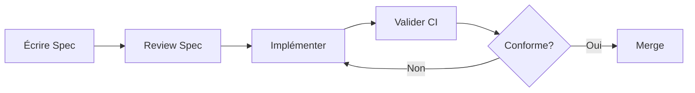

# 📋 Spécifications du Projet

Ce dossier contient toutes les spécifications structurées du monorepo NestJS-Remix, suivant l'approche **Spec-Driven Development** avec [GitHub Spec Kit](https://github.com/github/spec-kit).

## 🎯 Philosophie

Les spécifications définissent le **"quoi"** et le **"pourquoi"** avant le **"comment"**. Elles sont :

- ✅ **Exécutables** : générant directement des implémentations fonctionnelles
- ✅ **Validables** : vérifiées automatiquement par la CI/CD
- ✅ **Vivantes** : maintenues à jour avec le code
- ✅ **Traçables** : versionnées avec Git

## 📁 Structure

```
.spec/
├── features/       # Spécifications des fonctionnalités métier
├── architecture/   # Décisions d'architecture (ADR)
├── api/           # Contrats API (OpenAPI, GraphQL)
├── types/         # Schémas de types (Zod, TypeScript)
├── workflows/     # Processus de développement
└── templates/     # Templates réutilisables
```

## 🚀 Utilisation

### Créer une nouvelle spécification

1. **Choisir le template approprié** dans `templates/`
2. **Copier le template** dans le dossier correspondant
3. **Remplir les sections** selon les besoins
4. **Valider** avec `npm run spec:validate`

### Commandes disponibles

```bash
# Valider toutes les specs
npm run spec:validate

# Générer des specs depuis le code existant
npm run spec:generate

# Rapport de conformité spec vs code
npm run spec:report
```

### Workflow de développement



## 📚 Types de spécifications

### 1. Features (`features/`)

Spécifications des fonctionnalités métier :
- User stories et scenarios d'usage
- Critères d'acceptation
- Comportements attendus
- Contraintes et règles métier

**Exemple** : `features/cart-management.md`

### 2. Architecture (`architecture/`)

Décisions d'architecture (ADR) :
- Choix technologiques
- Patterns et structures
- Contraintes système
- Trade-offs documentés

**Exemple** : `architecture/001-monorepo-structure.md`

### 3. API (`api/`)

Contrats d'interface :
- Spécifications OpenAPI (REST)
- Schémas GraphQL
- Endpoints et méthodes
- Formats de requête/réponse

**Exemple** : `api/cart-api.yaml`

### 4. Types (`types/`)

Schémas de données :
- Types TypeScript
- Schémas Zod/Yup
- Validations
- Transformations

**Exemple** : `types/cart.schema.ts`

### 5. Workflows (`workflows/`)

Processus de développement :
- Git flow
- CI/CD pipelines
- Release process
- Standards de code

**Exemple** : `workflows/feature-development.md`

## 🔗 Intégration CI/CD

Les spécifications sont validées automatiquement :

- **Sur PR** : Validation de conformité
- **Avant merge** : Tests de régression
- **Post-deploy** : Vérification production

Voir [`.github/workflows/spec-validation.yml`](../.github/workflows/spec-validation.yml)

## 🤖 Intégration AI-Agents

Le système d'agents IA Python inclut un agent de validation :

```bash
# Analyser la conformité specs
python ai-agents-python/run.py --agent A13
```

L'agent A13 détecte :
- ❌ Drift entre specs et code
- ❌ Features non documentées
- ❌ APIs non conformes
- ❌ Types incompatibles

## 📖 Conventions

### Naming Conventions

**Features**:
```
.spec/features/{domain}-{feature}.md

Exemples:
- auth-system.md
- product-catalog.md
- payment-gateway.md
- cart-checkout.md
```

**Architecture (ADRs)**:
```
.spec/architecture/{number}-{title}.md

Exemples:
- 001-supabase-direct.md
- 002-monorepo-structure.md
- 003-design-tokens.md
```

**APIs**:
```
.spec/api/{service}-api.yaml

Exemples:
- payment-api.yaml
- cart-api.yaml
- product-api.yaml
```

**Types**:
```
.spec/types/{entity}.schema.ts

Exemples:
- payment.schema.ts
- cart.schema.ts
- order.schema.ts
```

**Workflows**:
```
.spec/workflows/{process}.md

Exemples:
- feature-development.md
- deployment-process.md
- testing-strategy.md
```

### Metadata Standards

Chaque spec **doit** inclure ce frontmatter YAML :

```yaml
---
title: "Titre clair et concis"           # REQUIS
status: draft | review | approved | implemented  # REQUIS
version: 1.0.0                            # REQUIS (semantic versioning)
authors: [nom1, nom2]                     # REQUIS
created: YYYY-MM-DD                       # REQUIS
updated: YYYY-MM-DD                       # REQUIS
relates-to:                               # OPTIONNEL
  - ../features/autre-spec.md
  - ../api/related-api.yaml
tags: [domain, priority, type]           # RECOMMANDÉ
priority: low | medium | high | critical # RECOMMANDÉ
---
```

**Exemple concret**:
```yaml
---
title: "Payment & Cart System"
status: implemented
version: 1.0.1
authors: [Backend Team]
created: 2025-11-14
updated: 2025-11-14
relates-to:
  - ../ANALYSE-APPROFONDIE.md
  - ../architecture/001-supabase-direct.md
tags: [e-commerce, payments, cart, checkout, critical]
priority: high
coverage:
  modules: [cart, payments, orders]
  routes: [/api/cart/*, /api/payments/*]
---
```

### Status Workflow

Les specs suivent ce workflow de statut :

```
draft → review → approved → implemented
  ↓        ↓         ↓           ↓
 WIP   En review  Validé    En prod
```

**Règles**:
- `draft` : Work in progress, peut changer librement
- `review` : Prêt pour feedback, stable mais peut évoluer
- `approved` : Validé par l'équipe, prêt pour implémentation
- `implemented` : Code en production, spec = source of truth

**Transitions**:
- `draft` → `review` : PR avec spec complète
- `review` → `approved` : Validation par 1+ reviewer
- `approved` → `implemented` : Code déployé en production
- `implemented` → `draft` : Changement majeur requis (nouvelle version)

### Versioning Sémantique

Utiliser [Semantic Versioning](https://semver.org/) pour les specs :

- **MAJOR** (1.0.0 → 2.0.0) : Breaking changes
  - Changement d'API contract
  - Modification structure de données
  - Suppression de fonctionnalité
  
- **MINOR** (1.0.0 → 1.1.0) : Nouvelles features backward-compatible
  - Ajout endpoint API
  - Nouveau champ optionnel
  - Extension fonctionnalité
  
- **PATCH** (1.0.0 → 1.0.1) : Corrections, clarifications
  - Fix typo
  - Amélioration documentation
  - Ajout exemples

**Exemple**:
```yaml
# Version initiale
version: 1.0.0

# Ajout endpoint GET /cart/summary (backward-compatible)
version: 1.1.0

# Fix documentation endpoint promo
version: 1.1.1

# Changement structure CartItem (breaking)
version: 2.0.0
```

### Validation Checklist

Avant de marquer une spec comme `review`, vérifier :

**Metadata** :
- [ ] `title` clair et concis
- [ ] `status` approprié
- [ ] `version` semantic versioning
- [ ] `authors` renseignés
- [ ] `created` et `updated` dates valides
- [ ] `relates-to` liens corrects (si applicable)
- [ ] `tags` pertinents

**Contenu** :
- [ ] Sections obligatoires remplies (selon template)
- [ ] Exemples concrets fournis
- [ ] Critères d'acceptation testables
- [ ] Contraintes et limitations documentées
- [ ] Risques et mitigations identifiés

**Qualité** :
- [ ] Pas de typos majeurs
- [ ] Langage clair et non ambigu
- [ ] Diagrammes/schemas si nécessaire
- [ ] Code examples syntaxiquement valides
- [ ] Liens internes fonctionnels

**Validation Technique** :
- [ ] ✅ `npm run spec:validate` passe sans erreurs
- [ ] Types TypeScript compilent (si applicable)
- [ ] OpenAPI spec valide (si applicable)
- [ ] Pas de conflits avec specs existantes

### Linking Conventions

Utiliser liens relatifs pour relier specs entre elles :

```markdown
<!-- Depuis .spec/features/payment-system.md -->

## Related Documents

- **Architecture**: [ADR-001: Supabase Direct](../architecture/001-supabase-direct.md)
- **API**: [Payment API](../api/payment-api.yaml)
- **Types**: [Payment Schema](../types/payment.schema.ts)
- **Workflows**: [Feature Development](../workflows/feature-development.md)
```

**Patterns courants** :
- Features → Architecture (relates-to dans frontmatter)
- Features → API + Types (documentation détaillée)
- API → Types (validation schemas)
- Workflows → Features (processus d'implémentation)

### Documentation Standards

**Sections obligatoires (Features)** :
1. Overview (contexte, objectifs)
2. User Stories (acteurs, besoins, valeur)
3. Functional Requirements (contraintes métier)
4. Non-Functional Requirements (performance, sécurité)
5. API Endpoints (ou référence)
6. Data Requirements (ou référence)
7. Testing Requirements
8. Implementation Status

**Sections obligatoires (ADRs)** :
1. Status (accepted/rejected/superseded)
2. Context (problème à résoudre)
3. Decision (choix retenu)
4. Rationale (pourquoi ce choix)
5. Consequences (impacts positifs/négatifs)
6. Alternatives Considered (options rejetées)

**Sections recommandées (toutes specs)** :
- Related Documents
- Change Log (historique versions)
- References (liens externes)
- Examples (code concret)

### Style Guide

**Langage** :
- ✅ Présent ou futur ("Le système **gère**..." ou "Le système **gérera**...")
- ❌ Éviter passé ("Le système a géré...")
- ✅ Actif ("L'utilisateur **saisit**...")
- ❌ Éviter passif ("Les données sont saisies...")

**Exemples** :
- ✅ "Le panier calcule automatiquement les totaux"
- ❌ "Les totaux sont calculés par le panier"

**Terminologie** :
- Utiliser glossaire projet (si existe)
- Cohérence noms (Product vs Produit : choisir un)
- Acronymes explicités lors 1ère utilisation

**Code Blocks** :
- ✅ Spécifier langage (```typescript, ```bash, ```yaml)
- ✅ Commenter code si nécessaire
- ✅ Inclure imports si pertinent
- ❌ Éviter code incomplet sans indication

### Tags Recommandés

**Par domaine** :
- `auth`, `payments`, `cart`, `orders`, `products`, `users`
- `admin`, `dashboard`, `backoffice`
- `e-commerce`, `seo`, `analytics`

**Par priorité** :
- `critical` : Bloquant, production impactée
- `high` : Important, roadmap court-terme
- `medium` : Utile, roadmap moyen-terme
- `low` : Nice-to-have, backlog

**Par type** :
- `feature`, `bugfix`, `refactor`, `performance`
- `security`, `accessibility`, `i18n`

**Par statut technique** :
- `wip` : Work in progress
- `blocked` : Bloqué par dépendance externe
- `deprecated` : À supprimer prochainement

**Exemple combiné** :
```yaml
tags: [payments, e-commerce, critical, security, implemented]
```

### Maintenance

**Review périodique** :
- ⏰ **Mensuel** : Vérifier specs `implemented` à jour avec code
- ⏰ **Trimestriel** : Audit complet conformité spec ↔ code
- ⏰ **Avant release** : Validation toutes specs impactées

**Update triggers** :
- ✅ Changement API contract → Update spec API
- ✅ Modification data model → Update spec Types
- ✅ Nouvelle feature → Nouvelle spec Feature
- ✅ Changement architecture → Nouveau ADR ou update existant

**Deprecation process** :
1. Marquer spec status: `deprecated`
2. Ajouter note avec spec de remplacement
3. Définir date de suppression
4. Supprimer après migration complète

**Exemple**:
```yaml
---
status: deprecated
deprecated-by: ../features/payment-system-v2.md
deprecated-date: 2025-12-31
---

# ⚠️ DEPRECATED

This specification is deprecated and will be removed on 2025-12-31.

Please refer to [Payment System v2](./payment-system-v2.md) for the updated specification.
```


title: Titre de la spec
status: draft|review|approved|implemented
version: 1.0.0
authors: [nom1, nom2]
created: YYYY-MM-DD
updated: YYYY-MM-DD
relates-to: [spec1.md, spec2.md]
---
```

### Versioning

- **Version majeure** : Changement breaking
- **Version mineure** : Ajout non-breaking
- **Version patch** : Corrections mineures

## 🔍 Validation

### Critères de qualité

Une spec est valide si :

- ✅ **Complète** : Toutes sections obligatoires remplies
- ✅ **Claire** : Pas d'ambiguïté, langage précis
- ✅ **Cohérente** : Pas de contradictions internes ou avec autres specs
- ✅ **Testable** : Critères d'acceptation vérifiables
- ✅ **Maintenable** : Pas de sur-spécification, juste assez de détails

### Validation Automatique

```bash
# Valider toutes les specs
npm run spec:validate

# Validation inclut :
# - Structure directories
# - YAML frontmatter valide
# - Champs obligatoires présents
# - OpenAPI specs valides (si applicable)
# - TypeScript types compilent (si applicable)
```

### Checklist Complète

Avant de marquer une spec comme `review`, vérifier :

**Metadata** :
- [ ] `title` clair et concis
- [ ] `status` approprié (draft/review/approved/implemented)
- [ ] `version` semantic versioning (x.y.z)
- [ ] `authors` renseignés
- [ ] `created` et `updated` dates valides
- [ ] `relates-to` liens corrects (si applicable)
- [ ] `tags` pertinents ajoutés

**Contenu** :
- [ ] Sections obligatoires remplies (selon template)
- [ ] Exemples concrets fournis
- [ ] Critères d'acceptation testables
- [ ] Contraintes et limitations documentées
- [ ] Risques et mitigations identifiés

**Qualité** :
- [ ] Pas de typos majeurs
- [ ] Langage clair et non ambigu
- [ ] Diagrammes/schemas si nécessaire
- [ ] Code examples syntaxiquement valides
- [ ] Liens internes fonctionnels

**Validation Technique** :
- [ ] ✅ `npm run spec:validate` passe sans erreurs
- [ ] Types TypeScript compilent (si applicable)
- [ ] OpenAPI spec valide (si applicable)
- [ ] Pas de conflits avec specs existantes
- [ ] Review par 1+ pair effectuée

## 📚 Ressources

- [Spec-Driven Development Methodology](https://github.com/github/spec-kit/blob/main/spec-driven.md)
- [GitHub Spec Kit Documentation](https://github.com/github/spec-kit)
- [Documentation projet](../docs/)

## 🆕 Recent Updates (17 Nov 2025)

### Performance Optimizations
- ⚡ **Homepage Load Time**: -70% (15-20s → 3-5s)
- 💾 **Cache Strategy**: Redis multi-niveaux (équipementiers TTL 1h, conseils TTL 30min)
- 🔄 **Parallélisation**: Requêtes véhicule 5s → 1.5s (-70%)
- 🔍 **Diagnostic Tool**: Script `diagnose-performance.js` pour analyse logs
- 📊 **Cache Hit Rate**: <30% → >70% attendu
- Voir [PERFORMANCE-OPTIMIZATIONS.md](../PERFORMANCE-OPTIMIZATIONS.md)

### SEO Switches Migration
- 🔄 **Migration complète PHP → TypeScript**: Service `SeoSwitchesService` (395 lignes)
- 📊 **177 switches peuplés**: Table `__seo_gamme_car_switch` pour 5 gammes
- ✅ **Formules rotation**: Réplication exacte logique PHP (`typeId % count`)
- 🎯 **21 variables supportées**: #CompSwitch, #LinkGammeCar, #VMarque, etc.
- Voir [SEO-SWITCHES-MIGRATION-COMPLETE.md](../backend/SEO-SWITCHES-MIGRATION-COMPLETE.md)

## 🆘 Support

Pour toute question :

1. Consulter les [templates](templates/)
2. Lire la [documentation complète](../docs/)
3. Ouvrir une issue GitHub
4. Demander en équipe

---

**Note** : Les spécifications complètent la documentation existante dans `docs/`. Les docs expliquent le "pourquoi" et le contexte, les specs définissent le "quoi" de manière exécutable.
