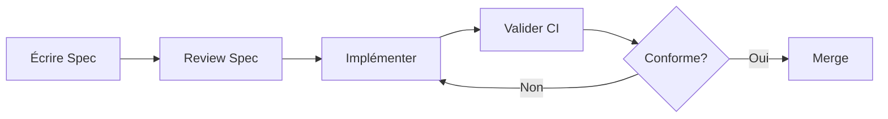

# 📋 Spécifications du Projet

Ce dossier contient toutes les spécifications structurées du monorepo NestJS-Remix, suivant l'approche **Spec-Driven Development** avec [GitHub Spec Kit](https://github.com/github/spec-kit).

## 🎯 Philosophie

Les spécifications définissent le **"quoi"** et le **"pourquoi"** avant le **"comment"**. Elles sont :

- ✅ **Exécutables** : générant directement des implémentations fonctionnelles
- ✅ **Validables** : vérifiées automatiquement par la CI/CD
- ✅ **Vivantes** : maintenues à jour avec le code
- ✅ **Traçables** : versionnées avec Git

## 📁 Structure

```
.spec/
├── features/       # Spécifications des fonctionnalités métier
├── architecture/   # Décisions d'architecture (ADR)
├── api/           # Contrats API (OpenAPI, GraphQL)
├── types/         # Schémas de types (Zod, TypeScript)
├── workflows/     # Processus de développement
└── templates/     # Templates réutilisables
```

## 🚀 Utilisation

### Créer une nouvelle spécification

1. **Choisir le template approprié** dans `templates/`
2. **Copier le template** dans le dossier correspondant
3. **Remplir les sections** selon les besoins
4. **Valider** avec `npm run spec:validate`

### Commandes disponibles

```bash
# Valider toutes les specs
npm run spec:validate

# Générer des specs depuis le code existant
npm run spec:generate

# Rapport de conformité spec vs code
npm run spec:report
```

### Workflow de développement



## 📚 Types de spécifications

### 1. Features (`features/`)

Spécifications des fonctionnalités métier :
- User stories et scenarios d'usage
- Critères d'acceptation
- Comportements attendus
- Contraintes et règles métier

**Exemple** : `features/cart-management.md`

### 2. Architecture (`architecture/`)

Décisions d'architecture (ADR) :
- Choix technologiques
- Patterns et structures
- Contraintes système
- Trade-offs documentés

**Exemple** : `architecture/001-monorepo-structure.md`

### 3. API (`api/`)

Contrats d'interface :
- Spécifications OpenAPI (REST)
- Schémas GraphQL
- Endpoints et méthodes
- Formats de requête/réponse

**Exemple** : `api/cart-api.yaml`

### 4. Types (`types/`)

Schémas de données :
- Types TypeScript
- Schémas Zod/Yup
- Validations
- Transformations

**Exemple** : `types/cart.schema.ts`

### 5. Workflows (`workflows/`)

Processus de développement :
- Git flow
- CI/CD pipelines
- Release process
- Standards de code

**Exemple** : `workflows/feature-development.md`

## 🔗 Intégration CI/CD

Les spécifications sont validées automatiquement :

- **Sur PR** : Validation de conformité
- **Avant merge** : Tests de régression
- **Post-deploy** : Vérification production

Voir [`.github/workflows/spec-validation.yml`](../.github/workflows/spec-validation.yml)

## 🤖 Intégration AI-Agents

Le système d'agents IA Python inclut un agent de validation :

```bash
# Analyser la conformité specs
python ai-agents-python/run.py --agent A13
```

L'agent A13 détecte :
- ❌ Drift entre specs et code
- ❌ Features non documentées
- ❌ APIs non conformes
- ❌ Types incompatibles

## 📖 Conventions

### Nommage

- **Features** : `{domain}-{feature}.md` (ex: `cart-checkout.md`)
- **Architecture** : `{number}-{title}.md` (ex: `001-monorepo-structure.md`)
- **API** : `{service}-api.yaml` (ex: `cart-api.yaml`)
- **Types** : `{entity}.schema.ts` (ex: `cart.schema.ts`)

### Metadata

Chaque spec doit inclure :

```yaml
---
title: Titre de la spec
status: draft|review|approved|implemented
version: 1.0.0
authors: [nom1, nom2]
created: YYYY-MM-DD
updated: YYYY-MM-DD
relates-to: [spec1.md, spec2.md]
---
```

### Versioning

- **Version majeure** : Changement breaking
- **Version mineure** : Ajout non-breaking
- **Version patch** : Corrections mineures

## 🔍 Validation

### Critères de qualité

Une spec est valide si :

- ✅ Complète (toutes sections remplies)
- ✅ Claire (pas d'ambiguïté)
- ✅ Cohérente (pas de contradiction)
- ✅ Testable (critères vérifiables)
- ✅ Maintenable (pas de sur-spécification)

### Checklist

Avant de soumettre une spec :

- [ ] Metadata complètes
- [ ] Liens vers specs reliées
- [ ] Exemples concrets fournis
- [ ] Tests d'acceptation définis
- [ ] Review par pair effectuée
- [ ] Validation CI passée

## 📚 Ressources

- [Spec-Driven Development Methodology](https://github.com/github/spec-kit/blob/main/spec-driven.md)
- [GitHub Spec Kit Documentation](https://github.com/github/spec-kit)
- [Documentation projet](../docs/)

## 🆘 Support

Pour toute question :

1. Consulter les [templates](templates/)
2. Lire la [documentation complète](../docs/)
3. Ouvrir une issue GitHub
4. Demander en équipe

---

**Note** : Les spécifications complètent la documentation existante dans `docs/`. Les docs expliquent le "pourquoi" et le contexte, les specs définissent le "quoi" de manière exécutable.
