# 🏗️ Diagrammes C4 Architecture

Documentation visuelle de l'architecture selon le modèle C4 (Context, Container, Component, Code).

:::info
Le fichier source complet est disponible ici : [`.spec/diagrams/C4-ARCHITECTURE.md`](https://github.com/ak125/nestjs-remix-monorepo/blob/main/.spec/diagrams/C4-ARCHITECTURE.md)
:::

## 📚 Modèle C4

Le modèle C4 décompose l'architecture en **4 niveaux de zoom** :

1. **Level 1 - Context** : Vue système (utilisateurs + systèmes externes)
2. **Level 2 - Container** : Containers applicatifs (backend, frontend, DB, cache)
3. **Level 3 - Component** : Composants internes (modules NestJS)
4. **Level 4 - Code** : Implémentation code (classes, interfaces)

## 🌍 Level 1 : System Context

**Vue d'ensemble** du système et ses interactions externes.

```mermaid
C4Context
    title System Context - Autoparts E-commerce Platform

    Person(customer, "Client", "Acheteur de pièces auto")
    Person(staff, "Staff", "Employé (préparation commandes)")
    Person(admin, "Admin", "Administrateur système")

    System(autoparts, "Autoparts Platform", "Plateforme e-commerce pièces auto")

    System_Ext(supabase, "Supabase", "Auth + PostgreSQL + Storage")
    System_Ext(redis, "Redis", "Distributed cache")
    System_Ext(meilisearch, "Meilisearch", "Search engine")
    System_Ext(paybox, "Paybox", "Payment gateway")
    System_Ext(keycloak, "Keycloak", "OAuth2/SSO")
    System_Ext(smtp, "SMTP", "Email delivery")
    System_Ext(sms, "Twilio/Vonage", "SMS delivery")
    System_Ext(push, "Firebase", "Push notifications")
    System_Ext(cdn, "Cloudflare", "CDN + Images")
    System_Ext(analytics, "Google Analytics", "Web analytics")
    System_Ext(monitoring, "Prometheus/Grafana", "Monitoring")
    System_Ext(carriers, "Carrier APIs", "DHL, Chronopost, UPS")

    Rel(customer, autoparts, "Achète produits", "HTTPS")
    Rel(staff, autoparts, "Gère commandes", "HTTPS")
    Rel(admin, autoparts, "Configure système", "HTTPS")
    
    Rel(autoparts, supabase, "Stocke données", "PostgreSQL")
    Rel(autoparts, redis, "Cache données", "Redis Protocol")
    Rel(autoparts, meilisearch, "Recherche produits", "HTTP/JSON")
    Rel(autoparts, paybox, "Process paiements", "HTTPS")
    Rel(autoparts, keycloak, "Authentifie SSO", "OAuth2")
    Rel(autoparts, smtp, "Envoie emails", "SMTP")
    Rel(autoparts, sms, "Envoie SMS", "REST API")
    Rel(autoparts, push, "Envoie notifications", "FCM")
    Rel(autoparts, cdn, "Distribue images", "HTTPS")
    Rel(autoparts, analytics, "Envoie events", "GA4")
    Rel(autoparts, monitoring, "Envoie métriques", "Prometheus")
    Rel(autoparts, carriers, "Track colis", "REST API")

    UpdateLayoutConfig($c4ShapeInRow="4", $c4BoundaryInRow="2")
```



### Acteurs

- **👤 Client** : Acheteur B2C (4M+ produits disponibles)
- **🧑‍💼 Staff** : Préparation commandes, SAV
- **⚙️ Admin** : Configuration système, analytics

### Systèmes Externes

| Système | Usage | Protocole |
|---------|-------|-----------|
| **Supabase** | Auth + PostgreSQL + Storage S3 | PostgreSQL, REST |
| **Redis** | Cache distribué, sessions | Redis Protocol |
| **Meilisearch** | Search engine 4M+ docs | HTTP/JSON |
| **Paybox** | Paiements sécurisés 3DS | HTTPS + HMAC |
| **Keycloak** | OAuth2/SSO entreprise | OpenID Connect |
| **SMTP** | Emails transactionnels | SMTP |
| **Twilio/Vonage** | SMS notifications | REST API |
| **Firebase** | Push notifications | FCM |
| **Cloudflare** | CDN images | HTTPS |
| **Google Analytics** | Web analytics | GA4 |
| **Prometheus/Grafana** | Monitoring infra | Prometheus |
| **Carriers APIs** | Tracking colis | REST API |

## 🏢 Level 2 : Container

**Containers applicatifs** et leurs interactions.


### Containers

#### 1. Frontend Remix (Intégré dans Backend)
- **Framework** : Remix SSR (React 18)
- **Styling** : TailwindCSS + Shadcn/ui
- **Validation** : Zod schemas
- **Build** : Vite
- **Intégration** : Servi par NestJS via `@fafa/frontend` package (port 3000)

#### 2. Backend NestJS (Port 3000 - Monolithe)
- **Framework** : NestJS 10 (TypeScript 5)
- **Endpoints** : 281 REST API
- **Authentication** : JWT + Sessions
- **Validation** : Zod
- **Frontend** : Sert Remix SSR (RemixController catch-all route)
- **Swagger UI** : `/api/docs`

#### 3. Redis (Port 6379)
- **Usage** : Cache, sessions, rate limiting
- **Cluster** : 1 master + 2 replicas
- **TTL** : 15s - 7d selon type

#### 4. PostgreSQL (Supabase)
- **Provider** : Supabase managed
- **Connexions** : Pooling max 100
- **Backup** : Daily automated

#### 5. Storage (Supabase S3)
- **Usage** : Images produits, documents
- **CDN** : Cloudflare
- **Optimisation** : WebP, thumbnails

## 🔧 Level 3 : Component

**Modules NestJS** (16 principaux).

### E-commerce Modules

```typescript
// Cart Module
@Module({
  imports: [CacheModule, DatabaseModule],
  controllers: [CartController],
  providers: [CartService],
  exports: [CartService]
})
export class CartModule {}

// Orders Module
@Module({
  imports: [PaymentsModule, ShippingModule, NotificationsModule],
  controllers: [OrdersController],
  providers: [OrdersService, OrderStatusService],
  exports: [OrdersService]
})
export class OrdersModule {}

// Products Module
@Module({
  imports: [SearchModule, CacheModule],
  controllers: [ProductsController],
  providers: [ProductsService, VehicleCompatibilityService],
  exports: [ProductsService]
})
export class ProductsModule {}
```

### Détail des 16 Modules

| Module | Responsabilité | Endpoints | Services |
|--------|----------------|-----------|----------|
| **AuthModule** | JWT + OAuth2 | 12 | AuthService, JwtStrategy |
| **UsersModule** | Gestion users | 18 | UsersService, ProfileService |
| **ProductsModule** | Catalogue 4M+ | 15 | ProductsService, CompatibilityService |
| **OrdersModule** | Workflow commandes | 22 | OrdersService, StatusService |
| **PaymentsModule** | Paybox integration | 14 | PayboxService, ValidationService |
| **CartModule** | Panier guest+user | 10 | CartService, MergeService |
| **VehiclesModule** | Compat 500K véhicules | 12 | VehicleService, BrandService |
| **SearchModule** | Meilisearch | 6 | SearchService, IndexService |
| **ShippingModule** | Transporteurs | 7 | ShippingService, TrackingService |
| **NotificationsModule** | Email/SMS/Push | 9 | EmailService, SmsService |
| **CacheModule** | Redis cache | - | CacheService, InvalidationService |
| **ConfigModule** | Settings 4 niveaux | 8 | ConfigService, EncryptionService |
| **HealthModule** | Kubernetes probes | 3 | HealthService, ReadinessService |
| **ErrorsModule** | Centralized logs | - | ErrorService, LoggerService |
| **UploadModule** | Supabase Storage | 4 | UploadService, ImageService |
| **DatabaseModule** | Supabase client | - | DatabaseService, ConnectionService |

## 💻 Level 4 : Code

**Exemples d'implémentation**.

### SupabaseBaseService

```typescript
export abstract class SupabaseBaseService {
  protected readonly client: SupabaseClient;
  protected readonly logger: Logger;
  
  constructor(
    protected readonly supabase: SupabaseService,
    loggerContext: string
  ) {
    this.client = supabase.getClient();
    this.logger = new Logger(loggerContext);
  }

  protected async query<T>(
    table: string,
    filters?: Record<string, any>
  ): Promise<T[]> {
    let query = this.client.from(table).select('*');
    
    if (filters) {
      Object.entries(filters).forEach(([key, value]) => {
        query = query.eq(key, value);
      });
    }
    
    const { data, error } = await query;
    
    if (error) {
      this.logger.error(`Query error on ${table}:`, error);
      throw new DatabaseException(error.message);
    }
    
    return data as T[];
  }
}
```

### Cache Pattern

```typescript
@Injectable()
export class CacheService {
  constructor(
    @Inject(CACHE_MANAGER) private cacheManager: Cache,
    private readonly redis: Redis
  ) {}

  async get<T>(key: string): Promise<T | null> {
    // L1: In-memory cache (fast)
    const memoryValue = await this.cacheManager.get<T>(key);
    if (memoryValue) return memoryValue;
    
    // L2: Redis cache (distributed)
    const redisValue = await this.redis.get(key);
    if (redisValue) {
      const parsed = JSON.parse(redisValue) as T;
      // Populate L1
      await this.cacheManager.set(key, parsed, 60);
      return parsed;
    }
    
    return null;
  }

  async set<T>(
    key: string,
    value: T,
    ttl: number
  ): Promise<void> {
    // Write to both layers
    await Promise.all([
      this.cacheManager.set(key, value, Math.min(ttl, 300)),
      this.redis.setex(key, ttl, JSON.stringify(value))
    ]);
  }
}
```

### JWT Auth Guard

```typescript
@Injectable()
export class JwtAuthGuard implements CanActivate {
  constructor(
    private readonly jwtService: JwtService,
    private readonly redis: Redis
  ) {}

  async canActivate(context: ExecutionContext): Promise<boolean> {
    const request = context.switchToHttp().getRequest();
    const token = this.extractToken(request);
    
    if (!token) {
      throw new UnauthorizedException('No token provided');
    }
    
    try {
      // Verify JWT
      const payload = this.jwtService.verify(token);
      
      // Check session in Redis
      const session = await this.redis.get(`session:${payload.userId}`);
      if (!session) {
        throw new UnauthorizedException('Session expired');
      }
      
      // Attach user to request
      request.user = JSON.parse(session);
      return true;
      
    } catch (error) {
      throw new UnauthorizedException('Invalid token');
    }
  }

  private extractToken(request: Request): string | null {
    const authHeader = request.headers.authorization;
    if (!authHeader?.startsWith('Bearer ')) return null;
    return authHeader.substring(7);
  }
}
```

## 🚀 Déploiement Architecture


**Configuration Kubernetes :**
- 5 nodes (2 vCPU, 8GB RAM chacun)
- 15 pods total (3 replicas × 5 services)
- Nginx Ingress (TLS Let's Encrypt)
- Prometheus + Grafana monitoring

## 📚 Voir Aussi

- **[Sequence Diagrams](./sequence-diagrams)** - Flows critiques
- **[Deployment](./deployment)** - Kubernetes détaillé
- **[Security](./security)** - Best practices sécurité

## 🔗 Fichier Source

Le fichier source complet avec tous les détails est disponible dans le repository :

📄 [`.spec/diagrams/C4-ARCHITECTURE.md`](https://github.com/ak125/nestjs-remix-monorepo/blob/main/.spec/diagrams/C4-ARCHITECTURE.md) (673 lignes)

---

**Version** : 1.0.0  
**Dernière mise à jour** : 15 novembre 2025  
**Auteur** : Architecture Team
