# C4 Architecture Diagrams - NestJS Remix Monorepo

Cette documentation présente l'architecture du système en utilisant le **modèle C4** (Context, Container, Component, Code) pour fournir différents niveaux de détail adaptés à chaque audience.

## Table des Matières

1. [Level 1 - System Context](#level-1---system-context)
2. [Level 2 - Container](#level-2---container)
3. [Level 3 - Component (Backend)](#level-3---component-backend)
4. [Level 4 - Code (Exemples)](#level-4---code-exemples)

---

## Level 1 - System Context

**Audience**: Business stakeholders, product managers, everyone  
**Vue d'ensemble**: Comment le système s'intègre dans son environnement

```mermaid
C4Context
    title System Context Diagram - Autoparts E-commerce Platform

    Person(customer, "Customer", "Client final achetant des pièces auto")
    Person(staff, "Staff", "Équipe administrative (support, commercial, admin)")
    
    System(platform, "Autoparts Platform", "Plateforme e-commerce spécialisée pièces auto (4M+ produits)")
    
    System_Ext(supabase, "Supabase", "PostgreSQL + Storage + Auth")
    System_Ext(keycloak, "Keycloak", "SSO & OAuth2 Enterprise")
    System_Ext(paybox, "Paybox", "Paiement sécurisé 3D Secure")
    System_Ext(meilisearch, "Meilisearch", "Moteur de recherche")
    System_Ext(redis, "Redis", "Cache distribué")
    System_Ext(email, "Email Provider", "SMTP transactionnel")
    System_Ext(carriers, "Carriers APIs", "DHL, UPS, Colissimo")
    System_Ext(vies, "EU VIES", "Validation TVA européenne")
    
    Rel(customer, platform, "Recherche, commande, suivi", "HTTPS")
    Rel(staff, platform, "Gestion commandes, support", "HTTPS")
    
    Rel(platform, supabase, "Données, fichiers, auth", "HTTPS/PostgREST")
    Rel(platform, keycloak, "SSO entreprise", "OAuth2")
    Rel(platform, paybox, "Paiements", "HTTPS")
    Rel(platform, meilisearch, "Recherche full-text", "HTTPS")
    Rel(platform, redis, "Cache sessions", "TCP")
    Rel(platform, email, "Emails transactionnels", "SMTP")
    Rel(platform, carriers, "Tracking, tarifs", "REST")
    Rel(platform, vies, "Validation VAT", "SOAP")

    UpdateLayoutConfig($c4ShapeInRow="4", $c4BoundaryInRow="2")
```



### Utilisateurs Principaux

| Acteur | Rôle | Interactions |
|--------|------|--------------|
| **Customer** | Client final B2C/B2B | Recherche produits, passe commandes, suivi livraison, factures |
| **Staff** | Équipe interne | Gestion commandes, support client, administration |

### Systèmes Externes

| Système | Criticité | Usage | Fallback |
|---------|-----------|-------|----------|
| **Supabase** | ⚠️ Critical | Base données, storage, auth | Aucun (requis) |
| **Redis** | ⚡ High | Cache sessions, performances | Mode dégradé sans cache |
| **Paybox** | ⚠️ Critical | Paiements 3D Secure | Paiement hors-ligne manuel |
| **Meilisearch** | ⚡ High | Recherche produits | PostgreSQL LIKE (lent) |
| **Keycloak** | 📊 Medium | SSO entreprise | Auth Supabase uniquement |
| **Email/SMS** | ⚡ High | Notifications clients | Queue retry automatique |
| **Carriers APIs** | 📊 Medium | Tracking livraison | Tracking manuel |
| **VIES API** | 📊 Medium | Validation TVA UE | Cache 24h, validation format |

---

## Level 2 - Container

**Audience**: Technical leads, architects, DevOps  
**Vue d'ensemble**: Containers (applications, services, data stores)

```mermaid
C4Container
    title Container Diagram - Autoparts Platform

    Person(customer, "Customer", "Client web/mobile")
    Person(staff, "Staff", "Équipe admin")

    Container_Boundary(platform, "Autoparts Platform") {
        Container(frontend, "Frontend SSR", "Remix + React 18", "Interface utilisateur responsive, SEO-optimisée")
        Container(backend, "Backend API", "NestJS 10 + TypeScript", "Business logic, REST API, 281 endpoints")
        Container(worker, "Background Worker", "NestJS + Bull", "Jobs asynchrones (exports, emails, sync)")
        
        ContainerDb(redis_cache, "Cache", "Redis 7.x", "Sessions, cache applicatif, queues")
        ContainerDb(meilisearch_search, "Search Engine", "Meilisearch 1.5", "Index 4M+ produits, autocomplete")
    }

    System_Ext(supabase_db, "PostgreSQL", "Supabase Database")
    System_Ext(supabase_storage, "Object Storage", "Supabase Storage")
    System_Ext(supabase_auth, "Auth Service", "Supabase Auth")
    System_Ext(keycloak_sso, "SSO Provider", "Keycloak OAuth2")
    System_Ext(paybox_gateway, "Payment Gateway", "Paybox")
    System_Ext(email_smtp, "Email Service", "SMTP Provider")

    Rel(customer, frontend, "Visite, navigue", "HTTPS")
    Rel(staff, frontend, "Administration", "HTTPS")
    
    Rel(frontend, backend, "API calls", "REST/JSON")
    Rel(backend, redis_cache, "Cache R/W, sessions", "Redis protocol")
    Rel(backend, meilisearch_search, "Recherche produits", "REST/JSON")
    Rel(backend, supabase_db, "CRUD données", "PostgREST")
    Rel(backend, supabase_storage, "Upload/download", "S3 API")
    Rel(backend, supabase_auth, "Passwordless auth", "REST")
    Rel(backend, keycloak_sso, "OAuth2 flow", "OAuth2")
    Rel(backend, paybox_gateway, "Process payments", "HTTPS")
    Rel(backend, email_smtp, "Send emails", "SMTP")
    
    Rel(worker, backend, "Délègue jobs", "Queue")
    Rel(worker, redis_cache, "Bull queues", "Redis protocol")
    Rel(worker, supabase_db, "Exports, reports", "PostgREST")

    UpdateLayoutConfig($c4ShapeInRow="3", $c4BoundaryInRow="1")
```



### Containers Details

#### Frontend SSR (Remix)
- **Technology**: Remix (React 18), Vite 5, TailwindCSS 3
- **Deployment**: Docker container, 3 replicas
- **Port**: 3001
- **Scaling**: Horizontal (3+ replicas)
- **Features**: 
  - Server-side rendering (SEO 95/100)
  - Progressive enhancement
  - Optimistic UI
  - Route-based code splitting

#### Backend API (NestJS)
- **Technology**: NestJS 10, TypeScript 5
- **Deployment**: Docker container, 3 replicas
- **Port**: 3000
- **Scaling**: Horizontal (3+ replicas)
- **Endpoints**: 281 REST endpoints
- **Modules**: 37 business modules
- **Features**:
  - JWT authentication
  - Role-based access control (RBAC)
  - Request validation (class-validator)
  - Rate limiting (10 req/s per IP)
  - Swagger documentation

#### Background Worker
- **Technology**: NestJS + Bull (Redis queues)
- **Deployment**: Docker container, 1-2 replicas
- **Jobs**:
  - **Exports**: CSV/Excel génération (orders, invoices)
  - **Emails**: Async sending (confirmations, notifications)
  - **Reports**: Daily/weekly/monthly business reports
  - **Sync**: Data synchronization (Meilisearch indexing)
  - **Cleanup**: Temp files, expired sessions

#### Redis Cache
- **Technology**: Redis 7.x
- **Deployment**: 1 master + 2 replicas (HA)
- **Memory**: 2GB allocated
- **Usage**:
  - Sessions (TTL 7 days)
  - API cache (TTL 5-30 min)
  - Bull queues
  - Rate limiting counters

#### Meilisearch
- **Technology**: Meilisearch 1.5+
- **Deployment**: Docker container, 1 replica
- **Index**: 4M+ products
- **Features**:
  - Typo-tolerance
  - Faceted search
  - Multi-language (FR, EN)
  - Autocomplete (<50ms)

---

## Level 3 - Component (Backend)

**Audience**: Software architects, senior developers  
**Vue d'ensemble**: Components (modules) au sein du Backend API


### Modules Architecture

#### 🛒 E-commerce Domain (9 modules, 100%)
- **Products**: 4M+ catalog, stock management, variants
- **Cart**: Session-based, calculations, persistence
- **Orders**: State machine (9 statuses), workflow, history
- **Customers**: B2C/B2B profiles, addresses, preferences
- **Payment**: Paybox integration, 3DS, fraud detection
- **Invoicing**: PDF generation, credit notes, accounting
- **Promo**: Coupons, discounts, rules engine
- **Équipementiers**: OEM suppliers, cross-reference
- **Taxes**: EU VAT, VIES validation, OSS reports

#### 🔐 Auth & Users Domain (3 modules, 100%)
- **Auth**: JWT + OAuth2, SSO Keycloak, passwordless
- **Supabase Auth**: Magic links, social login
- **Users/Staff**: CRUD, roles, permissions, RBAC

#### 📝 Content & Media Domain (4 modules, 100%)
- **News**: Blog, articles, SEO
- **SEO**: Meta tags, sitemap, redirections
- **Notifications**: Email, SMS, push (Firebase)
- **Media**: Upload, optimization, CDN

#### 🚚 Logistics Domain (3 modules, 100%)
- **Shipping**: Multi-carriers, rates, labels
- **Tracking**: Real-time status, webhooks
- **Vehicles**: Compatibility, 50K+ models

#### 🏗️ Infrastructure Domain (7 modules, 100%)
- **Database**: Supabase client, pooling, retry
- **Cache**: Redis distributed, TTL, invalidation
- **Search**: Meilisearch integration, indexing
- **Upload**: Storage, virus scan, optimization
- **Config**: Multi-level (app, payment, features, secrets)
- **Health**: Probes, metrics, monitoring
- **Errors**: Logging, redirections, retry

#### 📊 Analytics Domain (3 modules, 100%)
- **Dashboard**: KPIs, charts, real-time
- **Metrics**: Business metrics, tracking
- **Tracking**: Events, analytics

---

## Level 4 - Code (Exemples)

**Audience**: Developers working on the code  
**Vue d'ensemble**: Détails d'implémentation (classes, méthodes)

### Exemple 1: Architecture Modulaire - Database Module


**Avantages de l'architecture**:
- ✅ **Single Responsibility**: Chaque service 1 domaine métier
- ✅ **Testabilité**: Services isolés, mockable facilement
- ✅ **Scalabilité**: Ajout de nouveaux services sans impact
- ✅ **Composition**: DatabaseCompositionService agrège tout
- ✅ **Héritage**: SupabaseBaseService mutualise client + logging

---

### Exemple 2: Cache Strategy - Multi-Level Caching


**Performance Metrics**:
- ✅ **In-Memory hit**: ~2ms (95% hit rate)
- ✅ **Redis hit**: ~15ms (90% hit rate L2)
- ✅ **Database query**: ~120ms (5% miss rate)
- ✅ **Overall avg**: ~10ms per request

**Cache Strategy**:
```typescript
// Config Module - Multi-level cache
class ConfigService {
  private inMemoryCache = new Map<string, any>();
  private readonly IN_MEMORY_TTL = 300; // 5 minutes
  private readonly REDIS_TTL = 3600; // 1 hour

  async get(key: string): Promise<any> {
    // L1: In-memory (fastest)
    const inMemory = this.inMemoryCache.get(key);
    if (inMemory && !this.isExpired(inMemory.expiry)) {
      return inMemory.value;
    }

    // L2: Redis (fast)
    const redisValue = await this.redis.get(`config:${key}`);
    if (redisValue) {
      this.setInMemory(key, redisValue);
      return redisValue;
    }

    // L3: Database (slow, but source of truth)
    const dbValue = await this.database.getConfig(key);
    
    // Populate cache layers
    await this.redis.setex(`config:${key}`, this.REDIS_TTL, dbValue);
    this.setInMemory(key, dbValue);

    return dbValue;
  }

  // Invalidate all cache levels
  async invalidate(key: string): Promise<void> {
    this.inMemoryCache.delete(key);
    await this.redis.del(`config:${key}`);
  }
}
```

---

### Exemple 3: Event-Driven Architecture - Order Workflow


**Event Patterns**:
```typescript
// Event-driven order workflow
@Injectable()
export class OrderService {
  constructor(
    private eventEmitter: EventEmitter2,
    private paymentService: PaymentService,
  ) {}

  async createOrder(data: CreateOrderDto): Promise<Order> {
    // 1. Validate and save order
    const order = await this.saveOrder(data);
    this.eventEmitter.emit('order.created', order);

    // 2. Process payment
    const paymentResult = await this.paymentService.process(order);

    if (paymentResult.success) {
      order.status = OrderStatus.PAID;
      await this.updateOrder(order);
      this.eventEmitter.emit('order.paid', order); // Triggers invoice + shipping
    } else {
      order.status = OrderStatus.PAYMENT_FAILED;
      await this.updateOrder(order);
      this.eventEmitter.emit('order.payment_failed', order);
    }

    return order;
  }
}

// Listener: Invoicing Service
@Injectable()
export class InvoicingService {
  @OnEvent('order.paid')
  async handleOrderPaid(order: Order): Promise<void> {
    const invoice = await this.generateInvoice(order);
    this.eventEmitter.emit('invoice.generated', { order, invoice });
  }
}

// Listener: Shipping Service
@Injectable()
export class ShippingService {
  @OnEvent('order.paid')
  async handleOrderPaid(order: Order): Promise<void> {
    const shipment = await this.createShipment(order);
    this.eventEmitter.emit('shipment.created', { order, shipment });
  }
}
```

---

## Deployment Architecture (Kubernetes)

### Production Cluster

```yaml
# Kubernetes Deployment
apiVersion: apps/v1
kind: Deployment
metadata:
  name: backend-api
  namespace: production
spec:
  replicas: 3  # Horizontal scaling
  selector:
    matchLabels:
      app: backend-api
  template:
    metadata:
      labels:
        app: backend-api
    spec:
      containers:
      - name: backend
        image: ghcr.io/ak125/nestjs-backend:v2.0.0
        ports:
        - containerPort: 3000
        env:
        - name: SUPABASE_URL
          valueFrom:
            secretKeyRef:
              name: supabase-secrets
              key: url
        - name: REDIS_HOST
          value: redis-master
        resources:
          requests:
            memory: "512Mi"
            cpu: "500m"
          limits:
            memory: "2Gi"
            cpu: "2000m"
        livenessProbe:
          httpGet:
            path: /api/health/live
            port: 3000
          initialDelaySeconds: 30
          periodSeconds: 10
        readinessProbe:
          httpGet:
            path: /api/health/ready
            port: 3000
          initialDelaySeconds: 10
          periodSeconds: 5
---
apiVersion: v1
kind: Service
metadata:
  name: backend-api-service
spec:
  type: LoadBalancer
  selector:
    app: backend-api
  ports:
  - protocol: TCP
    port: 80
    targetPort: 3000
```

### Infrastructure Summary

| Component | Replicas | Resources | HA | Auto-scaling |
|-----------|----------|-----------|-----|--------------|
| **Backend API** | 3 | 512Mi-2Gi / 0.5-2 CPU | ✅ | Horizontal (3-10) |
| **Frontend SSR** | 3 | 256Mi-1Gi / 0.25-1 CPU | ✅ | Horizontal (3-10) |
| **Worker** | 1-2 | 512Mi-1Gi / 0.5-1 CPU | ⚠️ | Manual (1-3) |
| **Redis** | 3 (1M+2R) | 1Gi / 0.5 CPU | ✅ | Sentinel |
| **Meilisearch** | 1 | 2Gi / 1 CPU | ❌ | Manual |
| **PostgreSQL** | Managed | Supabase (multi-AZ) | ✅ | Automatic |

---

## Navigation

- 📖 [Retour INDEX.md](../INDEX.md)
- 📊 [GLOBAL-COVERAGE-REPORT.md](../GLOBAL-COVERAGE-REPORT.md)
- 📈 [PROJECT-STATS.md](../PROJECT-STATS.md)
- 🔄 [Sequence Diagrams](SEQUENCE-DIAGRAMS.md) (à créer)
- 📋 [OpenAPI Specification](../openapi.yaml) (à créer)

---

## Références

- **C4 Model**: https://c4model.com/
- **Mermaid Diagrams**: https://mermaid.js.org/
- **NestJS Architecture**: https://docs.nestjs.com/
- **Kubernetes**: https://kubernetes.io/docs/

---

**Version**: 1.0.0  
**Date**: 2025-01-15  
**Auteur**: Architecture Team  
**Status**: ✅ Production Ready
