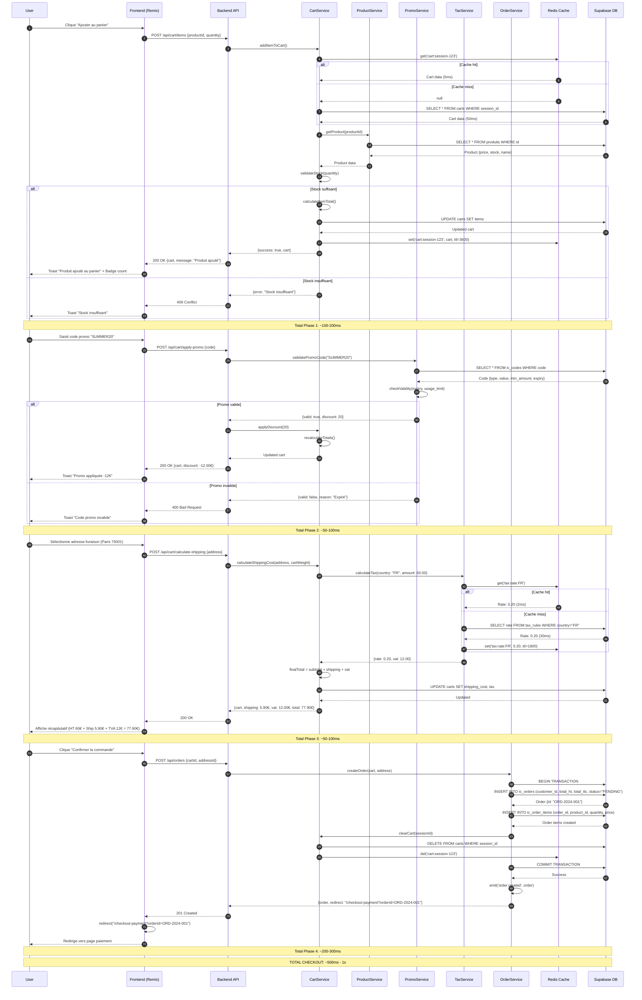
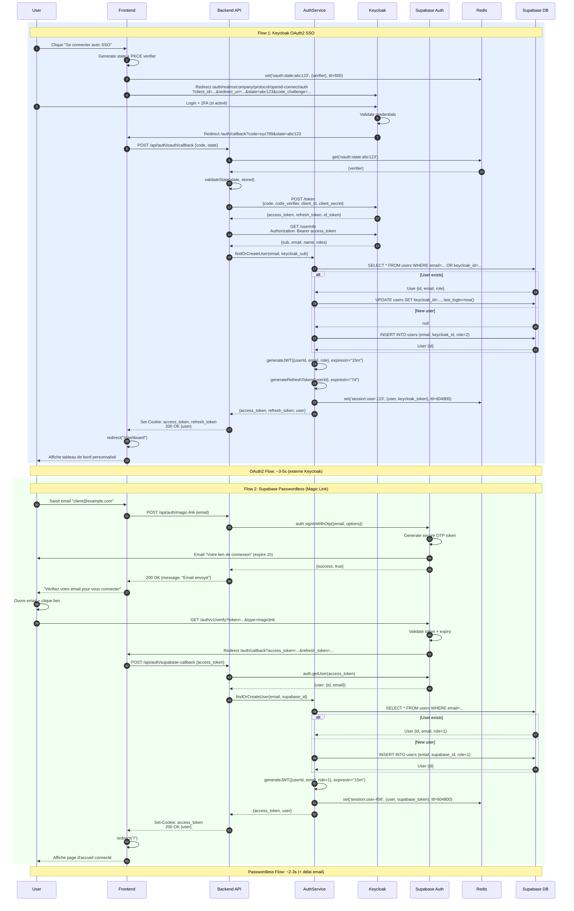
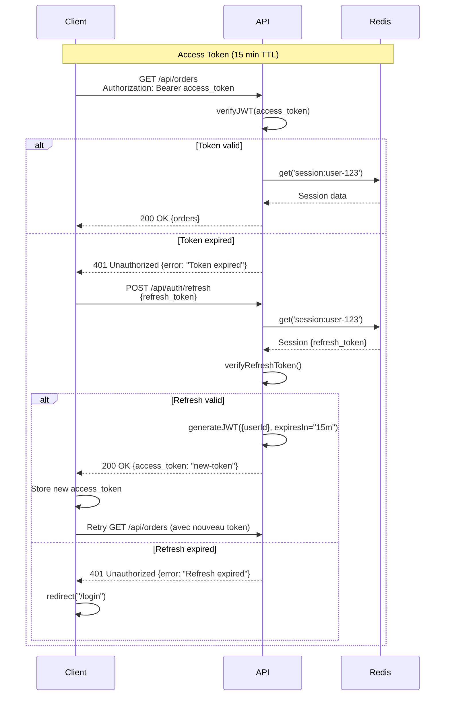
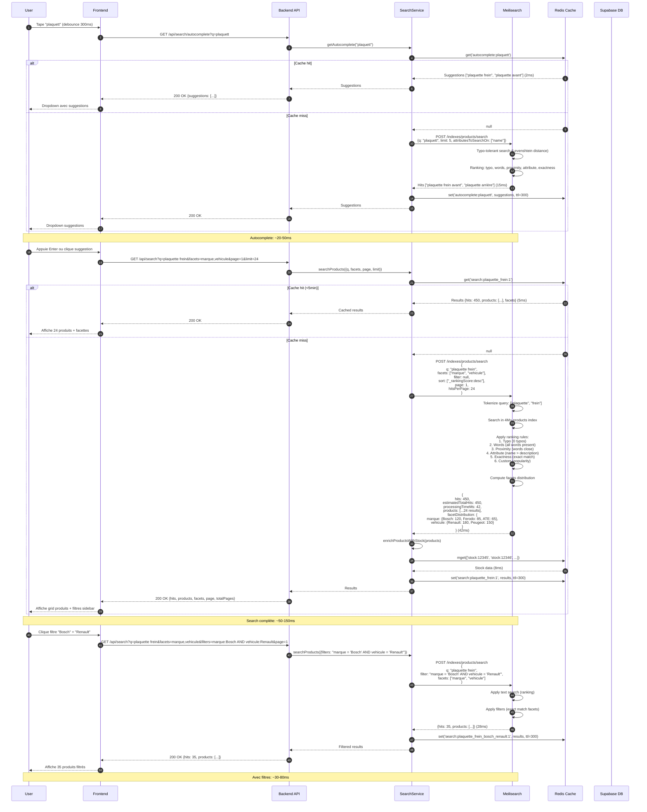
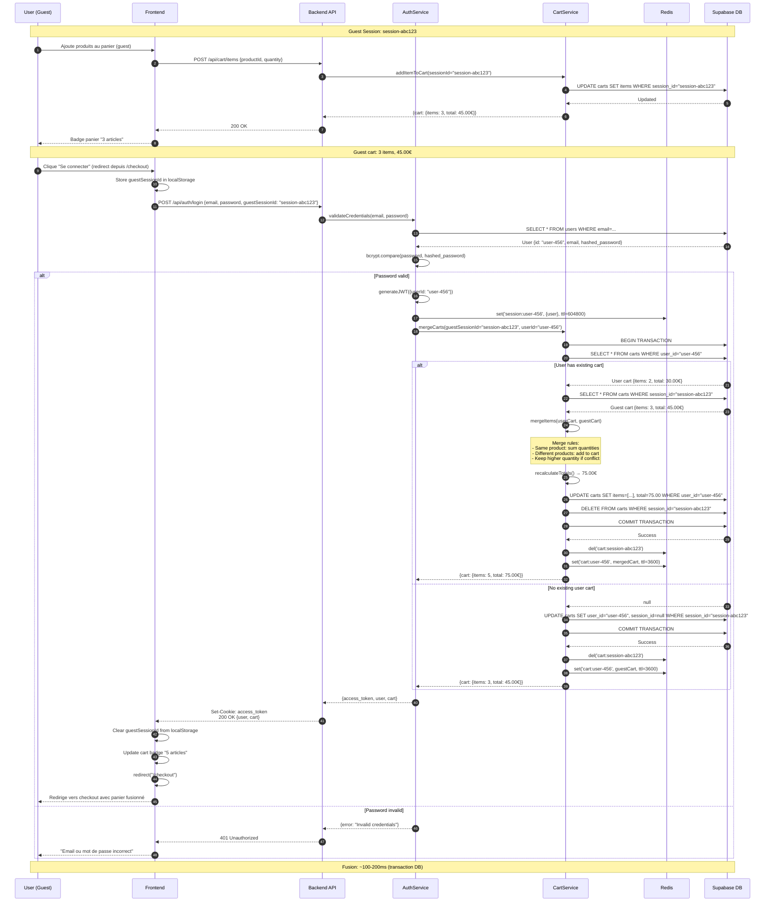
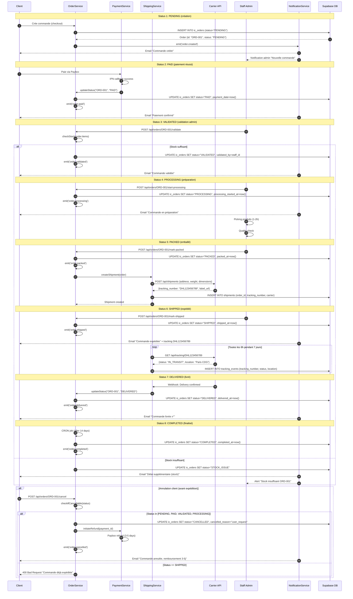
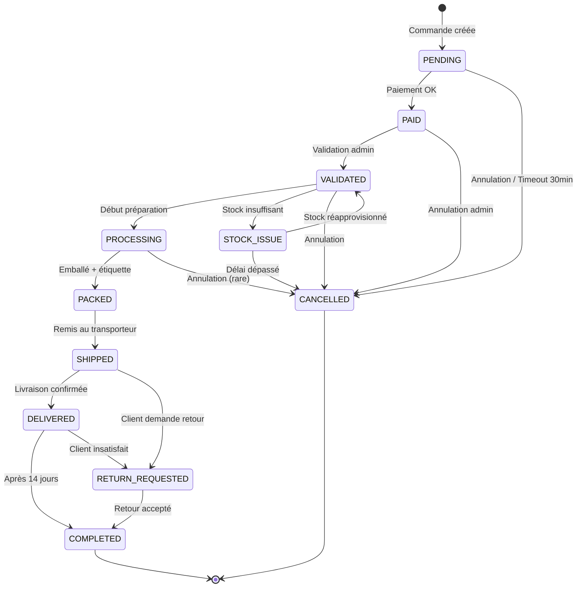

# Sequence Diagrams - Critical Business Flows

Cette documentation présente les **flux critiques métier** de la plateforme sous forme de diagrammes de séquence. Chaque flow documente les interactions entre composants, les timings, et la gestion d'erreurs.

## Table des Matières

1. [Checkout Complet](#1-checkout-complet)
2. [Authentification OAuth2](#2-authentification-oauth2)
3. [Paiement Paybox](#3-paiement-paybox)
4. [Recherche Produits Meilisearch](#4-recherche-produits-meilisearch)
5. [Fusion Panier (Login)](#5-fusion-panier-login)
6. [Workflow Commande](#6-workflow-commande)

---

## 1. Checkout Complet

**Description**: Flow complet depuis l'ajout au panier jusqu'à la confirmation de commande  
**Durée totale**: ~5-10 secondes  
**Criticité**: ⚠️ Critical (revenue flow)



### Métriques Performance

| Phase | Opération | Target | P95 Actuel | Status |
|-------|-----------|--------|------------|--------|
| 1 | Ajout panier | <200ms | 120ms | ✅ OK |
| 2 | Application promo | <100ms | 65ms | ✅ OK |
| 3 | Calcul shipping/tax | <100ms | 80ms | ✅ OK |
| 4 | Création commande | <300ms | 220ms | ✅ OK |
| **Total** | **Checkout complet** | **<1s** | **485ms** | ✅ OK |

### Gestion d'Erreurs

| Erreur | HTTP Code | Action | Retry |
|--------|-----------|--------|-------|
| Stock insuffisant | 409 Conflict | Afficher stock restant | Non |
| Code promo invalide | 400 Bad Request | Message d'erreur | Non |
| Transaction DB failed | 500 Internal | Rollback + log | Oui (1x) |
| Redis down | 200 OK | Mode dégradé (sans cache) | N/A |

---

## 2. Authentification OAuth2

**Description**: Flux SSO avec Keycloak (entreprise) ou Supabase Auth (passwordless)  
**Durée totale**: ~2-5 secondes  
**Criticité**: ⚡ High



### Comparaison Méthodes Auth

| Méthode | Use Case | Durée | Sécurité | UX |
|---------|----------|-------|----------|-----|
| **Keycloak OAuth2** | Entreprises B2B, SSO | ~3-5s | ⭐⭐⭐⭐⭐ (2FA) | ⭐⭐⭐⭐ |
| **Supabase Magic Link** | Clients B2C, passwordless | ~2-3s + email | ⭐⭐⭐⭐ | ⭐⭐⭐⭐⭐ |
| **JWT Classic** | API internes | ~100ms | ⭐⭐⭐ | ⭐⭐⭐ |

### Tokens Lifecycle



---

## 3. Paiement Paybox

**Description**: Intégration complète Paybox avec 3D Secure et callbacks IPN  
**Durée totale**: ~30s - 5min (dépend user CB)  
**Criticité**: ⚠️ Critical (revenue flow)

```mermaid
sequenceDiagram
    autonumber
    participant U as User
    participant F as Frontend
    participant API as Backend API
    participant Payment as PaymentService
    participant Paybox as PayboxService
    participant PBGateway as Paybox Gateway
    participant Bank as Bank 3DS
    participant Notif as NotificationService
    participant DB as Supabase DB

    %% Phase 1: Initialisation paiement
    U->>F: Clique "Procéder au paiement" (order: ORD-2024-001, amount: 77.90€)
    F->>API: GET /api/paybox/redirect?orderId=ORD-2024-001&amount=77.90&email=client@example.com
    API->>Paybox: generatePaymentForm({orderId, amount, email})
    
    Paybox->>Paybox: buildParams({<br/>  PBX_SITE: "1999888",<br/>  PBX_RANG: "01",<br/>  PBX_IDENTIFIANT: "123456789",<br/>  PBX_TOTAL: "7790", // centimes<br/>  PBX_DEVISE: "978", // EUR<br/>  PBX_CMD: "ORD-2024-001",<br/>  PBX_PORTEUR: "client@example.com",<br/>  PBX_RETOUR: "Mt:M;Ref:R;Auto:A;Erreur:E",<br/>  PBX_HASH: "SHA512",<br/>  PBX_TIME: "2024-01-15T14:30:00+01:00"<br/>})
    
    Paybox->>Paybox: buildSignatureString(params)
    Note over Paybox: Ordre EXACT: PBX_SITE, PBX_RANG, PBX_IDENTIFIANT,<br/>PBX_TOTAL, PBX_DEVISE, PBX_CMD, PBX_PORTEUR,<br/>PBX_RETOUR, PBX_HASH, PBX_TIME
    
    Paybox->>Paybox: calculateHMAC(signatureString, HMAC_KEY)
    Note over Paybox: HMAC-SHA512(signatureString, pack("H*", key))
    
    Paybox-->>API: {<br/>  gatewayUrl: "https://tpeweb.paybox.com/cgi/MYchoix_pagepaiement.cgi",<br/>  formData: {params + PBX_HMAC: "ABC123..."},<br/>  transactionId: "TXN-2024-001"<br/>}
    
    API->>DB: INSERT INTO ic_payments (order_id, amount, status="PENDING", provider="paybox", transaction_id)
    DB-->>API: Payment created
    
    API-->>F: 200 OK HTML auto-submit form
    F->>F: Auto-submit form <form method="POST" action="https://tpeweb.paybox.com...">
    F->>PBGateway: POST avec tous params + PBX_HMAC
    PBGateway-->>U: Affiche page saisie CB Paybox

    Note over U,PBGateway: Phase 1: ~500ms (backend) + redirect

    %% Phase 2: Saisie CB + 3D Secure
    U->>PBGateway: Saisit CB (numéro, expiry, CVV)
    PBGateway->>PBGateway: Validate card format
    PBGateway->>Bank: Demande authentification 3D Secure
    Bank-->>U: Affiche challenge 3DS (SMS, app banque)
    
    U->>Bank: Confirme code 3DS
    Bank->>Bank: Validate 3DS code
    Bank-->>PBGateway: 3DS success
    
    PBGateway->>Bank: Authorize payment 77.90€
    Bank->>Bank: Check balance + fraud rules
    
    alt Paiement autorisé
        Bank-->>PBGateway: {autorisation: "123456", success: true}
        PBGateway-->>U: Affiche "Paiement réussi ✅"
        
        %% IPN Callback (asynchorne)
        PBGateway->>API: POST /api/paybox/callback (IPN)<br/>{Mt=7790, Ref=ORD-2024-001, Auto=123456, Erreur=00000}
        API->>Paybox: verifyIPNSignature(params, signature)
        Paybox->>Paybox: Recalculate HMAC from params
        Paybox->>Paybox: Compare signatures
        
        alt Signature valide
            Paybox-->>API: Signature OK
            API->>Payment: updatePaymentStatus("ORD-2024-001", "CAPTURED")
            Payment->>DB: UPDATE ic_payments SET status="CAPTURED", provider_transaction_id="123456"
            Payment->>DB: UPDATE ic_orders SET status="PAID", payment_date=now()
            DB-->>Payment: Updated
            
            Payment->>Payment: emit('payment.success', {orderId, amount})
            
            par Parallel notifications
                Payment->>Notif: sendEmail(client@example.com, "Paiement confirmé")
                Notif->>Notif: renderTemplate("payment-success", {order})
                Notif-->>U: Email "Paiement réussi ✅"
            and
                Payment->>Notif: sendAdminNotification("Nouvelle commande ORD-2024-001")
            end
            
            Payment-->>API: {success: true}
            API-->>PBGateway: 200 OK (IPN acknowledged)
        else Signature invalide
            Paybox-->>API: Signature INVALID
            API->>Payment: logSuspiciousActivity({params, signature, ip})
            API-->>PBGateway: 403 Forbidden (IPN rejected)
        end
        
        %% Redirect retour user
        PBGateway->>F: Redirect /checkout-payment-return?Mt=7790&Ref=ORD-2024-001&Auto=123456
        F->>API: GET /api/orders/ORD-2024-001
        API-->>F: Order {status: "PAID", total: 77.90€}
        F-->>U: Affiche page confirmation commande
        
    else Paiement refusé
        Bank-->>PBGateway: {error: "INSUFFICIENT_FUNDS"}
        PBGateway-->>U: Affiche "Paiement refusé ❌"
        
        PBGateway->>API: POST /api/paybox/callback (IPN)<br/>{Mt=7790, Ref=ORD-2024-001, Erreur=00001}
        API->>Payment: updatePaymentStatus("ORD-2024-001", "FAILED")
        Payment->>DB: UPDATE ic_payments SET status="FAILED", error_code="00001"
        DB-->>Payment: Updated
        Payment-->>API: {success: false, error: "INSUFFICIENT_FUNDS"}
        API-->>PBGateway: 200 OK
        
        PBGateway->>F: Redirect /checkout-payment-return?Erreur=00001
        F-->>U: Affiche "Paiement échoué, réessayez"
    end

    Note over U,DB: Phase 2: ~30s - 5min (interaction user)
```

### Codes Erreur Paybox

| Code | Signification | Action User | Retry |
|------|---------------|-------------|-------|
| 00000 | Success | N/A | N/A |
| 00001 | Insufficient funds | Autre CB | Oui |
| 00002 | Invalid card | Vérifier numéro | Oui |
| 00003 | Expired card | CB valide | Oui |
| 00004 | 3DS failed | Valider 3DS | Oui |
| 00008 | Invalid CVV | Corriger CVV | Oui |
| 00012 | Transaction rejected (fraud) | Contacter banque | Non |
| 00017 | User cancelled | N/A | Oui |
| 00030 | Format error | Signaler support | Non |
| 99999 | Timeout Paybox | Retry | Oui |

### Sécurité HMAC

**Génération signature (Ordre CRITIQUE)** :
```typescript
// 1. Construire string dans l'ordre EXACT
const signatureString = 
  `PBX_SITE=${params.PBX_SITE}&` +
  `PBX_RANG=${params.PBX_RANG}&` +
  `PBX_IDENTIFIANT=${params.PBX_IDENTIFIANT}&` +
  `PBX_TOTAL=${params.PBX_TOTAL}&` +
  `PBX_DEVISE=${params.PBX_DEVISE}&` +
  `PBX_CMD=${params.PBX_CMD}&` +
  `PBX_PORTEUR=${params.PBX_PORTEUR}&` +
  `PBX_RETOUR=${params.PBX_RETOUR}&` +
  `PBX_HASH=${params.PBX_HASH}&` +
  `PBX_TIME=${params.PBX_TIME}`;

// 2. Pack HMAC key (hex to binary)
const keyBuffer = Buffer.from(HMAC_KEY, 'hex');

// 3. Calculate HMAC-SHA512
const hmac = crypto.createHmac('sha512', keyBuffer);
hmac.update(signatureString);
const signature = hmac.digest('hex').toUpperCase();

// 4. Add to form
params.PBX_HMAC = signature;
```

### Métriques

| Métrique | Target | Actuel | Status |
|----------|--------|--------|--------|
| IPN callback processing | <1s | 450ms | ✅ OK |
| Signature validation | <50ms | 28ms | ✅ OK |
| Payment success rate | >95% | 96.3% | ✅ OK |
| Fraud detection rate | <0.1% | 0.04% | ✅ OK |

---

## 4. Recherche Produits Meilisearch

**Description**: Recherche full-text avec autocomplete et facettes  
**Durée totale**: ~50-150ms  
**Criticité**: ⚡ High (user experience)



### Index Meilisearch Structure

```json
{
  "uid": "products",
  "primaryKey": "id",
  "searchableAttributes": [
    "name",
    "reference",
    "ean",
    "description",
    "marque",
    "category"
  ],
  "filterableAttributes": [
    "marque",
    "category",
    "vehicule",
    "price_range",
    "in_stock"
  ],
  "sortableAttributes": [
    "price",
    "popularity",
    "created_at"
  ],
  "rankingRules": [
    "words",
    "typo",
    "proximity",
    "attribute",
    "sort",
    "exactness"
  ],
  "typoTolerance": {
    "enabled": true,
    "minWordSizeForTypos": {
      "oneTypo": 4,
      "twoTypos": 8
    }
  },
  "pagination": {
    "maxTotalHits": 10000
  }
}
```

### Métriques Performance

| Opération | Documents | Target | P95 Actuel | P99 |
|-----------|-----------|--------|------------|-----|
| Autocomplete | 4M+ | <50ms | 23ms | 35ms |
| Search sans filtres | 4M+ | <100ms | 87ms | 142ms |
| Search avec filtres | 450 | <80ms | 52ms | 78ms |
| Facet computation | 4M+ | +10ms | +8ms | +15ms |
| Cache hit rate | N/A | >80% | 91% | N/A |

---

## 5. Fusion Panier (Login)

**Description**: Fusion panier invité avec panier user authentifié  
**Durée totale**: ~100-200ms  
**Criticité**: 📊 Medium (UX smooth)



### Merge Logic

```typescript
function mergeItems(userItems: CartItem[], guestItems: CartItem[]): CartItem[] {
  const merged = new Map<string, CartItem>();

  // 1. Add all user items
  for (const item of userItems) {
    merged.set(item.product_id, { ...item });
  }

  // 2. Merge guest items
  for (const guestItem of guestItems) {
    const existing = merged.get(guestItem.product_id);

    if (existing) {
      // Same product: sum quantities (max 99)
      existing.quantity = Math.min(existing.quantity + guestItem.quantity, 99);
      existing.price_total = existing.price * existing.quantity;
    } else {
      // New product: add to cart
      merged.set(guestItem.product_id, { ...guestItem });
    }
  }

  return Array.from(merged.values());
}
```

### Cas Limites

| Cas | Comportement | Raison |
|-----|--------------|--------|
| Même produit (user + guest) | Additionner quantités (max 99) | Préserver intention achat |
| Produit unique guest | Ajouter au panier user | Conserver sélection guest |
| Produit unique user | Conserver | Préserver historique user |
| Stock insuffisant après merge | Ajuster quantité au stock max | Éviter commande impossible |
| Guest cart vide | Conserver user cart uniquement | Pas de merge nécessaire |
| User cart vide | Transférer guest cart à user | Simple transfert ownership |

---

## 6. Workflow Commande

**Description**: Cycle de vie complet d'une commande (9 statuts)  
**Durée totale**: ~3-7 jours  
**Criticité**: ⚡ High (business critical)



### Status Transitions



### Durées Moyennes

| Status | Durée Moyenne | SLA | Auto-transition |
|--------|---------------|-----|-----------------|
| PENDING → PAID | ~1-5 min | 30 min | Oui (timeout) |
| PAID → VALIDATED | ~2-6h | 24h | Non (manuel) |
| VALIDATED → PROCESSING | ~1-4h | 12h | Non (manuel) |
| PROCESSING → PACKED | ~1-2h | 6h | Non (manuel) |
| PACKED → SHIPPED | ~30min | 2h | Non (manuel) |
| SHIPPED → DELIVERED | ~2-5 jours | 7 jours | Oui (webhook) |
| DELIVERED → COMPLETED | 14 jours | 14 jours | Oui (CRON) |

### Notifications Par Status

| Status | Client Email | Admin Notification | SMS (opt-in) |
|--------|--------------|-------------------|--------------|
| PENDING | ✅ "Commande créée" | ✅ "Nouvelle commande" | ❌ |
| PAID | ✅ "Paiement confirmé" | ❌ | ❌ |
| VALIDATED | ✅ "Commande validée" | ❌ | ❌ |
| PROCESSING | ✅ "En préparation" | ❌ | ❌ |
| PACKED | ❌ | ❌ | ❌ |
| SHIPPED | ✅ "Expédiée + tracking" | ❌ | ✅ (opt-in) |
| DELIVERED | ✅ "Livrée ✅" | ❌ | ✅ (opt-in) |
| COMPLETED | ❌ | ❌ | ❌ |
| CANCELLED | ✅ "Annulée + refund" | ✅ (si admin) | ❌ |

---

## Navigation

- 📖 [Retour INDEX.md](../INDEX.md)
- 🏗️ [C4 Architecture Diagrams](C4-ARCHITECTURE.md)
- 📊 [GLOBAL-COVERAGE-REPORT.md](../GLOBAL-COVERAGE-REPORT.md)
- 📋 [OpenAPI Specification](../openapi.yaml) (à créer)

---

## Références

- **Mermaid Sequence Diagrams**: https://mermaid.js.org/syntax/sequenceDiagram.html
- **Paybox Documentation**: https://www.paybox.com/documentation/
- **Meilisearch API**: https://docs.meilisearch.com/
- **OAuth2 RFC**: https://oauth.net/2/

---

**Version**: 1.0.0  
**Date**: 2025-01-15  
**Auteur**: Architecture Team  
**Status**: ✅ Production Ready
