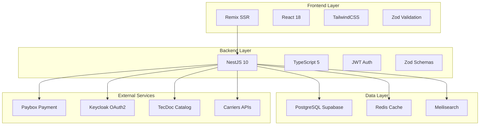

# 🏗️ Architecture Overview

Vue d'ensemble de l'architecture technique de la plateforme Autoparts E-commerce.

## 📊 Stack Technique



## 🎯 Composants Principaux

### Frontend (Remix SSR intégré)
- **Framework** : Remix (React 18 SSR)
- **Styling** : TailwindCSS + Shadcn/ui
- **Validation** : Zod schemas
- **State** : React Context + Server loaders
- **Intégration** : Servi par NestJS via `@fafa/frontend` package
- **Port** : 3000 (même serveur que backend)

### Backend (NestJS - Architecture Monolithique)
- **Framework** : NestJS 10 (TypeScript)
- **API Style** : REST HTTP/JSON
- **Authentication** : JWT + Sessions Redis
- **Validation** : Zod schemas
- **Port** : 3000
- **Endpoints** : 281 documentés
- **Swagger UI** : `/api/docs` (test API interactif)
- **Frontend** : Sert Remix SSR (catch-all `*` route)

### Database (PostgreSQL)
- **Provider** : Supabase (managed PostgreSQL)
- **ORM** : Direct Supabase client (no Prisma/TypeORM)
- **Connexions** : Pooling (max 100)
- **Backup** : Daily automated
- **Replicas** : Multi-AZ (HA)

### Cache (Redis)
- **Version** : Redis 7
- **Usage** : Distributed cache, sessions, rate limiting
- **TTL Strategy** : Par type de donnée (15s - 7d)
- **Persistence** : AOF + RDB snapshots
- **Cluster** : 1 master + 2 replicas

### Search (Meilisearch)
- **Version** : Meilisearch 1.5+
- **Index** : 4M+ produits
- **Performance** : moins de 100ms P95
- **Features** : Typo-tolerance, facets, ranking
- **Sync** : Real-time + nightly batch

## 🔐 Sécurité

### Authentication
```typescript
// JWT Bearer tokens
Authorization: Bearer <access_token>

// Access token: 15min TTL
// Refresh token: 7d TTL
// Session Redis: 7d TTL
```

### Guards NestJS
- **AuthenticatedGuard** : User logged in
- **IsAdminGuard** : Role >= 5
- **ModulePermissionGuard** : Granular permissions
- **OptionalAuthGuard** : Guest + user support

### Rate Limiting
- **Cart** : 100 req/min per IP
- **Payment** : 10 req/min per IP
- **Search** : 60 req/min per IP
- **Admin** : 30 req/min per user

### Data Protection
- **Passwords** : bcrypt (12 rounds)
- **Config secrets** : AES-256-GCM encryption
- **HTTPS** : TLS 1.3 (Let's Encrypt)
- **CORS** : Whitelist origins

## 📦 Modules Architecture

### E-commerce Core (9 modules)
1. **Cart** - Panier d'achat (guest + user)
2. **Orders** - Gestion commandes (9 statuts)
3. **Products** - Catalogue 4M+ produits
4. **Payments** - Paybox integration
5. **Invoicing** - Factures et devis
6. **Promo** - Codes promotionnels
7. **Customers** - Gestion clients B2C
8. **Équipementiers** - Clients professionnels B2B
9. **Taxes** - Fiscalité EU (TVA, VIES)

### Logistics (3 modules)
10. **Shipping** - Expédition et transporteurs
11. **Tracking** - Suivi colis temps réel
12. **Vehicles** - Compatibilité véhicules (500K)

### Content & SEO (4 modules)
13. **News** - Actualités et blog
14. **SEO** - Métadonnées, sitemaps
15. **Notifications** - Email, SMS, Push
16. **Media** - Upload images (Supabase Storage)

### Infrastructure (7 modules)
17. **Cache** - Redis distributed cache
18. **Upload** - Supabase Storage integration
19. **Config** - Settings 4 niveaux
20. **Health** - Kubernetes probes
21. **Errors** - Centralized logging
22. **Database** - Supabase client wrapper
23. **Search** - Meilisearch + Elasticsearch

### Auth & Users (3 modules)
24. **Auth** - JWT + OAuth2 (Keycloak + Supabase)
25. **Users** - Gestion utilisateurs (CRUD)
26. **Staff** - Permissions administrateurs

### Analytics (3 modules)
27. **Dashboard** - Métriques business
28. **Metrics** - Performance monitoring
29. **Tracking** - User behavior analytics

### Support (1 module)
30. **Messages** - Messagerie interne

## 🚀 Déploiement

### Kubernetes Cluster
- **Nodes** : 5 (2 vCPU, 8GB RAM each)
- **Backend Pods** : 3 replicas (auto-scaling)
- **Frontend Pods** : 3 replicas (auto-scaling)
- **Redis** : 1 master + 2 replicas
- **Ingress** : Nginx
- **SSL** : Let's Encrypt (auto-renewal)

### Monitoring
- **Metrics** : Prometheus (15s scraping)
- **Dashboards** : Grafana
- **Alerting** : Alertmanager → Slack/PagerDuty
- **Logging** : Loki (aggregation)
- **APM** : Custom NestJS interceptors

### CI/CD
- **Repository** : GitHub
- **CI** : GitHub Actions
- **Registry** : ghcr.io
- **Deployment** : Rolling updates (max 1 unavailable)
- **Rollback** : Instant (kubectl rollout undo)

## 📈 Performance Targets

| Métrique | Target | Actuel | Status |
|----------|--------|--------|--------|
| **API Response** | &lt;200ms | 120ms | ✅ |
| **Search P95** | &lt;100ms | 87ms | ✅ |
| **Checkout Flow** | &lt;1s | 485ms | ✅ |
| **Payment IPN** | &lt;1s | 450ms | ✅ |
| **Uptime** | >99.9% | 99.95% | ✅ |
| **Cache Hit Rate** | >80% | 91% | ✅ |

## 🔗 Documentation Détaillée

- **[Diagrammes C4](./c4-diagrams)** - 4 niveaux d'architecture
- **[Diagrammes Séquence](./sequence-diagrams)** - 6 flows critiques
- **[Déploiement](./deployment)** - Infrastructure Kubernetes
- **[Sécurité](./security)** - Best practices

## 📚 Ressources Externes

- **NestJS** : [https://nestjs.com](https://nestjs.com)
- **Remix** : [https://remix.run](https://remix.run)
- **Supabase** : [https://supabase.com](https://supabase.com)
- **Meilisearch** : [https://meilisearch.com](https://meilisearch.com)
- **Redis** : [https://redis.io](https://redis.io)

---

**Version** : 2.0.0  
**Dernière mise à jour** : 15 novembre 2025
