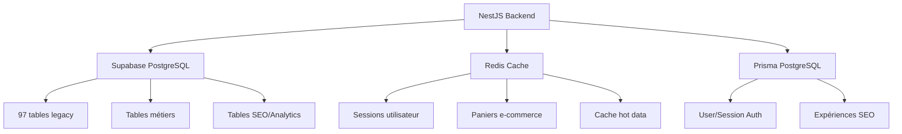

# Base de données - Vue d'ensemble

## Architecture

Le système utilise une architecture **hybride multi-sources** pour maximiser performance et évolutivité :



## 🗄️ Sources de données

### 1. Supabase PostgreSQL (Principal)

**97 tables** héritées d'un système PHP legacy, structure optimisée pour l'e-commerce automobile :

- **Tables produits** : `pieces`, `pieces_price`, `pieces_gamme`, `pieces_media_img`
- **Tables catalogues** : `auto_marque`, `auto_modele`, `auto_type`, `catalog_family`
- **Tables commandes** : `___xtr_order`, `___xtr_order_line`, `___xtr_invoice`
- **Tables clients** : `___xtr_customer`, `___xtr_customer_billing_address`
- **Tables SEO** : `__seo_gamme`, `__blog_advice`, `__sitemap_*`
- **Tables config** : `___config`, `___config_admin`, `___header_menu`

**Connexion** : Service role key avec bypass RLS automatique

```typescript
// Configuration centralisée
supabaseUrl = "https://your-project.supabase.co"
supabaseServiceKey = "eyJhbGc..." // Service role
```

### 2. Redis Cache

Système de cache haute performance pour données volatiles :

- **Sessions utilisateur** : TTL 30 jours
- **Paniers e-commerce** : TTL 30 jours
- **Cache API** : TTL configurable (5-60 min)
- **Rate limiting** : Fenêtres glissantes

**Clés Redis structurées** :
- `cart:{sessionId}` → Items du panier
- `cart:promo:{sessionId}` → Codes promo appliqués
- `session:{sessionToken}` → Données session

### 3. Prisma PostgreSQL (Auth + Analytics)

Base dédiée pour fonctionnalités modernes :

```prisma
model User {
  id        String    @id @default(cuid())
  email     String    @unique
  password  String    // bcrypt hash
  sessions  Session[]
}

model Session {
  id           String  @id @default(cuid())
  userId       String
  sessionToken String  @unique
  ipAddress    String?
  userAgent    String?
}

model CrawlBudgetExperiment {
  id               String    @id @default(uuid())
  name             String
  action           String    // exclude, include, reduce
  targetFamilies   String[]  // Codes gammes ciblées
  status           String    // draft, running, completed
  metrics          CrawlBudgetMetric[]
}
```

## 🏗️ Architecture des services

### Pattern Repository

Tous les services héritent de `SupabaseBaseService` :

```typescript
@Injectable()
export abstract class SupabaseBaseService {
  protected readonly supabase: SupabaseClient;
  
  // Circuit breaker intégré
  private circuitBreaker: CircuitBreakerState;
  
  // Retry automatique avec exponential backoff
  protected async executeWithRetry<T>(
    operation: () => Promise<T>,
    maxRetries = 3
  ): Promise<T | null>
}
```

### Services disponibles

| Service | Responsabilité | Tables principales |
|---------|---------------|-------------------|
| `CartDataService` | Gestion paniers e-commerce | Redis + `pieces` |
| `OrderDataService` | Création/suivi commandes | `___xtr_order`, `___xtr_order_line` |
| `OrderRepository` | Accès données commandes | `___xtr_order`, `___xtr_order_line` |
| `UserDataService` | Gestion clients B2C | `___xtr_customer` |
| `StaffDataService` | Gestion utilisateurs B2B | `___xtr_customer` (flag staff) |
| `PromoDataService` | Codes promotionnels | `promo_codes` |
| `ShippingDataService` | Calcul frais de port | `shipping_rates_cache` |
| `RedisCacheService` | Cache générique | Redis |
| `PaymentService` | Intégration Paybox | `ic_postback` |
| `InvoicesService` | Génération factures PDF | `___xtr_invoice` |
| `LegacyOrderService` | Commandes legacy PHP | `___xtr_order` (rétrocompat) |
| `LegacyUserService` | Utilisateurs legacy PHP | `___xtr_customer` (rétrocompat) |

## 🔐 Sécurité

### Row Level Security (RLS)

- **Prisma** : RLS activé pour `User`, `Session`, `CrawlBudgetExperiment`
- **Supabase** : Bypass RLS via `service_role` key
  - ✅ Avantage : Performance maximale, pas de surcharge RLS
  - ⚠️ Important : Validation côté application obligatoire

### Circuit Breaker

Protection contre les pannes Supabase/Cloudflare :

```typescript
// États : closed (normal) → open (erreur) → half-open (test)
private circuitBreaker = {
  failures: 0,
  lastFailure: 0,
  state: 'closed',
  maxFailures: 5,
  resetTimeout: 60000 // 1 min
}
```

**Comportement** :
- 5 erreurs consécutives → Circuit OPEN (bloque requêtes)
- Après 1 minute → Circuit HALF-OPEN (tente 3 requêtes test)
- Succès → Circuit CLOSED (retour normal)

### Retry Logic

Exponential backoff automatique :

```typescript
// Tente 3 fois avec délais croissants
maxRetries = 3
delays = [1s, 2s, 4s]
```

## 📊 Performance

### Optimisations appliquées

1. **Indexes Supabase** :
   - `___xtr_order(id)` - Primary key
   - `___xtr_order(customer_id)` - Recherche client
   - `pieces(piece_ref_clean)` - Recherche produits
   - `crawl_budget_metrics(experiment_id, date)` - Analytics

2. **Cache Redis** :
   - Hot data (produits populaires) : TTL 60 min
   - Session data : TTL 30 jours
   - Cart data : TTL 30 jours

3. **Connection Pooling** :
   - Supabase : Connection pooler activé
   - Redis : Pool géré par NestJS IORedis

### Monitoring

```typescript
// Métriques circuit breaker
getCircuitBreakerStatus(): {
  failures: number,
  lastFailure: timestamp,
  state: 'closed' | 'open' | 'half-open'
}
```

## 🔗 Relations inter-tables

### Schéma e-commerce

```
___xtr_customer (clients)
    ↓ 1:N
___xtr_order (commandes)
    ↓ 1:N
___xtr_order_line (lignes commande)
    → pieces (produits)
    
___xtr_order
    ↓ 1:1
___xtr_invoice (factures)
    ↓ 1:N
___xtr_invoice_line (lignes facture)
```

### Schéma produits

```
pieces (produits)
    ← N:1 pieces_marque (marques)
    ← N:1 pieces_gamme (gammes)
    → 1:N pieces_price (prix)
    → 1:N pieces_media_img (images)
    → N:N pieces_relation_type (compatibilités véhicules)
        ← auto_type (motorisations)
```

## 📚 Références

- [Schéma Supabase](./supabase-schema.md) - 97 tables détaillées
- [Schéma Prisma](./prisma-schema.md) - Auth + Analytics
- [Services Data](./services.md) - Documentation API services
- [Cache Strategy](./cache-strategy.md) - Stratégies Redis
- [Circuit Breaker](./circuit-breaker.md) - Resilience patterns

## 🚀 Quick Start

```typescript
// Exemple : Récupérer un produit avec cache
import { CartDataService } from '@/database/services';

@Injectable()
export class ProductService {
  constructor(private cartService: CartDataService) {}
  
  async getProduct(productId: string) {
    return this.cartService.getProductDetails(productId);
  }
}
```

---

**Migration depuis PHP** : Les tables legacy (`___xtr_*`, `pieces*`) conservent leur structure d'origine pour compatibilité. Nouvelles fonctionnalités développées dans Prisma PostgreSQL séparée.
