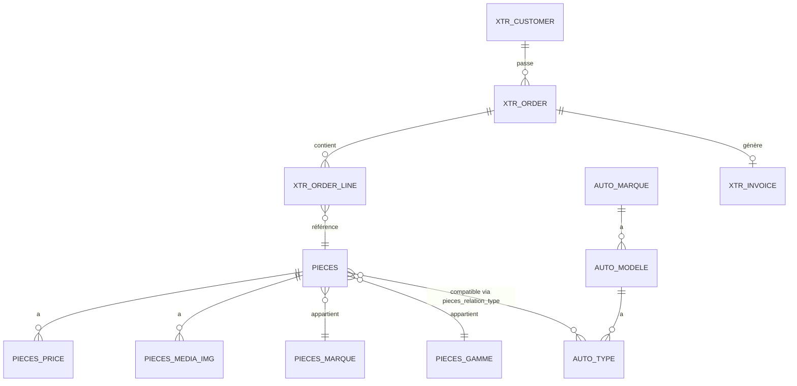

# Schéma Supabase - 97 tables

Documentation complète des 97 tables héritées du système PHP legacy.

## 📦 Catégories de tables

| Catégorie | Préfixe | Nombre | Description |
|-----------|---------|--------|-------------|
| **Produits** | `pieces*` | 18 | Catalogue produits, prix, images, références |
| **Catalogue auto** | `auto_*` | 8 | Marques, modèles, motorisations compatibles |
| **Commandes** | `___xtr_order*` | 5 | Gestion commandes et lignes |
| **Clients** | `___xtr_customer*` | 3 | Clients et adresses facturation/livraison |
| **Livraison** | `___xtr_delivery*` | 5 | Transporteurs et grilles tarifaires |
| **Factures** | `___xtr_invoice*` | 2 | Factures et lignes de facture |
| **SEO** | `__seo_*`, `__blog_*` | 20 | Meta tags, sitemaps, contenu SEO |
| **Configuration** | `___config*` | 4 | Paramètres site et admins |
| **Autres** | - | 32 | Menus, messages, paiements, analytics |

## 🛒 Tables produits (`pieces*`)

### `pieces` - Produits principaux

Table centrale du catalogue produits (2M+ références).

| Colonne | Type | Description |
|---------|------|-------------|
| `piece_id` | TEXT | ID unique produit |
| `piece_ref` | TEXT | Référence constructeur |
| `piece_ref_clean` | TEXT | Référence normalisée (recherche) |
| `piece_pm_id` | TEXT | FK → `pieces_marque` (marque) |
| `piece_pg_id` | TEXT | FK → `pieces_gamme` (gamme) |
| `piece_name` | TEXT | Nom commercial produit |
| `piece_des` | TEXT | Description courte |
| `piece_name_comp` | TEXT | Nom complet avec détails |
| `piece_qty_sale` | TEXT | Quantité minimum de vente |
| `piece_weight_kgm` | TEXT | Poids en kg |
| `piece_has_oem` | TEXT | Flag références OEM disponibles |
| `piece_has_img` | TEXT | Flag images disponibles |
| `search_vector` | TSVECTOR | Index recherche full-text |

**Indexes** :
- PRIMARY KEY `piece_id`
- INDEX `piece_ref_clean` (recherche rapide)
- INDEX `piece_pm_id` (filtrage par marque)
- GIN `search_vector` (full-text search)

### `pieces_price` - Prix et disponibilité

Tarification multi-niveaux (prix public, grossiste, promotions).

| Colonne | Type | Description |
|---------|------|-------------|
| `pri_piece_id` | TEXT | FK → `pieces.piece_id` |
| `pri_pm_id` | TEXT | FK → `pieces_marque.pm_id` |
| `pri_ref` | TEXT | Référence fournisseur |
| `pri_ean` | TEXT | Code-barres EAN13 |
| `pri_dispo` | TEXT | Stock disponible |
| `pri_public_ht` | NUMERIC | Prix public HT |
| `pri_gros_ht` | NUMERIC | Prix grossiste HT |
| `pri_vente_ht` | NUMERIC | Prix vente final HT |
| `pri_vente_ttc` | NUMERIC | Prix vente TTC (calculé) |
| `pri_tva` | NUMERIC | Taux TVA (%) |
| `pri_remise` | NUMERIC | Remise applicable (%) |
| `pri_poids` | NUMERIC | Poids expédition |
| `pri_date_from` | DATE | Début validité prix |
| `pri_date_to` | DATE | Fin validité prix |

**Calcul prix TTC** :
```sql
pri_vente_ttc = pri_vente_ht * (1 + pri_tva/100)
```

### `pieces_gamme` - Familles de produits

Hiérarchie catégorielle (freinage, filtration, etc).

| Colonne | Type | Description |
|---------|------|-------------|
| `pg_id` | TEXT | ID unique gamme |
| `pg_parent` | TEXT | FK parent (arborescence) |
| `pg_name` | TEXT | Nom gamme (ex: "Disques de frein") |
| `pg_name_url` | TEXT | Slug URL SEO-friendly |
| `pg_alias` | TEXT | Code court (ex: "FREINAGE") |
| `pg_pic` | TEXT | Image miniature |
| `pg_wall` | TEXT | Image bannière |
| `pg_level` | INT | Niveau hiérarchie (1-3) |
| `pg_display` | BOOL | Visible frontend |

**Arborescence typique** :
```
01_FREINAGE (level 1)
  ├─ 01_01_DISQUES (level 2)
  │   └─ 01_01_01_AVANT (level 3)
  └─ 01_02_PLAQUETTES (level 2)
```

### `pieces_marque` - Marques équipementiers

| Colonne | Type | Description |
|---------|------|-------------|
| `pm_id` | TEXT | ID unique marque |
| `pm_name` | TEXT | Nom marque (ex: "BOSCH") |
| `pm_logo` | TEXT | URL logo |
| `pm_quality` | TEXT | Niveau qualité (OES, Premium, Standard) |
| `pm_nature` | TEXT | Type (Constructeur, Adaptable) |
| `pm_nb_stars` | INT | Note qualité (1-5) |

### `pieces_media_img` - Images produits

| Colonne | Type | Description |
|---------|------|-------------|
| `pmi_piece_id` | TEXT | FK → `pieces.piece_id` |
| `pmi_folder` | TEXT | Dossier stockage |
| `pmi_name` | TEXT | Nom fichier image |
| `pmi_sort` | INT | Ordre affichage (1=principale) |

**URL image générée** : `https://cdn.example.com/{folder}/{name}`

### `pieces_relation_type` - Compatibilités véhicules

Mapping produit ↔ motorisation (N:N).

| Colonne | Type | Description |
|---------|------|-------------|
| `rtp_piece_id` | TEXT | FK → `pieces.piece_id` |
| `rtp_type_id` | TEXT | FK → `auto_type.type_id` |
| `rtp_pg_id` | TEXT | FK → `pieces_gamme.pg_id` |

**Exemple** : Le disque BOSCH ref="0986479R93" est compatible avec VW Golf VII 2.0 TDI (type_id="12345").

### Autres tables produits

| Table | Description |
|-------|-------------|
| `pieces_criteria` | Critères techniques (diamètre, alésage, etc) |
| `pieces_criteria_group` | Groupes de critères (dimensions, électrique) |
| `pieces_criteria_link` | Liaison critères ↔ gammes |
| `pieces_details` | Détails supplémentaires (poids, accessoires) |
| `pieces_list` | Kits multi-composants |
| `pieces_ref_brand` | Marques références (OEM, IAM) |
| `pieces_ref_ean` | Codes-barres EAN13 |
| `pieces_ref_oem` | Références origine constructeur |
| `pieces_ref_search` | Index recherche références |
| `pieces_gamme_cross` | Gammes associées (cross-sell) |
| `pieces_side_filtre` | Filtres latéralité (gauche/droite) |
| `pieces_status` | Statuts produit (actif, obsolète) |

## 🚗 Tables catalogue auto (`auto_*`)

### `auto_marque` - Marques véhicules

| Colonne | Type | Description |
|---------|------|-------------|
| `marque_id` | TEXT | ID unique (ex: "VW") |
| `marque_name` | TEXT | Nom (ex: "Volkswagen") |
| `marque_logo` | TEXT | URL logo marque |
| `marque_display` | BOOL | Visible catalogue |

### `auto_modele` - Modèles véhicules

| Colonne | Type | Description |
|---------|------|-------------|
| `modele_id` | TEXT | ID unique |
| `modele_marque_id` | TEXT | FK → `auto_marque` |
| `modele_name` | TEXT | Nom (ex: "Golf VII") |
| `modele_year_from` | TEXT | Année début production |
| `modele_year_to` | TEXT | Année fin production |
| `modele_body` | TEXT | Carrosserie (berline, break, SUV) |

### `auto_type` - Motorisations

Table pivot pour compatibilités pièces/véhicules.

| Colonne | Type | Description |
|---------|------|-------------|
| `type_id` | TEXT | ID unique motorisation |
| `type_modele_id` | TEXT | FK → `auto_modele` |
| `type_name` | TEXT | Nom complet (ex: "Golf VII 2.0 TDI 150ch") |
| `type_engine` | TEXT | Code moteur (ex: "CUNA") |
| `type_fuel` | TEXT | Carburant (Diesel, Essence, Électrique) |
| `type_power_ps` | INT | Puissance en chevaux |
| `type_power_kw` | INT | Puissance en kW |
| `type_year_from` | TEXT | Année début |
| `type_year_to` | TEXT | Année fin |

### Relations catalogue auto

```
auto_marque
    ↓ 1:N
auto_modele
    ↓ 1:N
auto_type
    ↓ N:N (via pieces_relation_type)
pieces
```

## 🛍️ Tables commandes (`___xtr_order*`)

### `___xtr_order` - Commandes

| Colonne | Type | Description |
|---------|------|-------------|
| `ord_id` | SERIAL | ID unique commande |
| `ord_cst_id` | INT | FK → `___xtr_customer` |
| `ord_number` | TEXT | Numéro commande (ORD-20240115-0001) |
| `ord_status` | INT | FK → `___xtr_order_status` |
| `ord_total_ht` | NUMERIC | Total HT |
| `ord_total_ttc` | NUMERIC | Total TTC |
| `ord_shipping_cost` | NUMERIC | Frais de port |
| `ord_promo_code` | TEXT | Code promo appliqué |
| `ord_promo_discount` | NUMERIC | Montant remise |
| `ord_payment_method` | TEXT | Mode paiement (CB, Paybox, Virement) |
| `ord_payment_status` | TEXT | Statut paiement (pending, paid, failed) |
| `ord_created_at` | TIMESTAMP | Date création |
| `ord_updated_at` | TIMESTAMP | Dernière mise à jour |

**Workflow statuts** :
```
1. draft (panier) 
  → 2. pending (attente paiement)
  → 3. paid (payé)
  → 4. processing (préparation)
  → 5. shipped (expédié)
  → 6. delivered (livré)
  → 7. cancelled (annulé)
```

### `___xtr_order_line` - Lignes de commande

| Colonne | Type | Description |
|---------|------|-------------|
| `ordl_id` | SERIAL | ID unique ligne |
| `ordl_ord_id` | INT | FK → `___xtr_order` |
| `ordl_piece_id` | TEXT | FK → `pieces` |
| `ordl_ref` | TEXT | Référence produit |
| `ordl_name` | TEXT | Nom produit (snapshot) |
| `ordl_qty` | INT | Quantité commandée |
| `ordl_price_ht` | NUMERIC | Prix unitaire HT |
| `ordl_total_ht` | NUMERIC | Total ligne HT |
| `ordl_tva` | NUMERIC | Taux TVA (%) |
| `ordl_status` | INT | Statut ligne (disponible, rupture, expédié) |

### `___xtr_order_status` - Référentiel statuts

| Colonne | Type | Description |
|---------|------|-------------|
| `ords_id` | INT | ID statut |
| `ords_label` | TEXT | Libellé (ex: "En préparation") |
| `ords_color` | TEXT | Couleur UI (hex) |
| `ords_is_final` | BOOL | Statut terminal (livré/annulé) |

## 👤 Tables clients (`___xtr_customer*`)

### `___xtr_customer` - Clients

| Colonne | Type | Description |
|---------|------|-------------|
| `cst_id` | SERIAL | ID unique client |
| `cst_mail` | TEXT | Email (unique) |
| `cst_pswd` | TEXT | Mot de passe hashé (bcrypt) |
| `cst_keylog` | TEXT | Token session legacy PHP |
| `cst_civility` | TEXT | Civilité (M, Mme, Autre) |
| `cst_name` | TEXT | Nom |
| `cst_fname` | TEXT | Prénom |
| `cst_tel` | TEXT | Téléphone |
| `cst_is_cpy` | BOOL | Est une entreprise |
| `cst_rs` | TEXT | Raison sociale |
| `cst_siret` | TEXT | N° SIRET |
| `cst_is_pro` | BOOL | Compte professionnel (tarifs grossistes) |
| `cst_level` | INT | Niveau fidélité (1-5) |
| `cst_activ` | BOOL | Compte actif |

### `___xtr_customer_billing_address` - Adresses facturation

| Colonne | Type | Description |
|---------|------|-------------|
| `cba_id` | SERIAL | ID unique |
| `cba_cst_id` | INT | FK → `___xtr_customer` |
| `cba_name` | TEXT | Nom complet |
| `cba_address` | TEXT | Adresse complète |
| `cba_zip_code` | TEXT | Code postal |
| `cba_city` | TEXT | Ville |
| `cba_country` | TEXT | Pays (ISO 3166-1) |

### `___xtr_customer_delivery_address` - Adresses livraison

Même structure que `billing_address`.

## 🚚 Tables livraison (`___xtr_delivery*`)

### `___xtr_delivery_agent` - Transporteurs

| Colonne | Type | Description |
|---------|------|-------------|
| `da_id` | INT | ID transporteur |
| `da_name` | TEXT | Nom (ex: "Colissimo") |
| `da_icon` | TEXT | URL icône |
| `da_fee` | NUMERIC | Frais de base |
| `da_seuil` | NUMERIC | Seuil franco de port |

### Grilles tarifaires

| Table | Zone |
|-------|------|
| `___xtr_delivery_ape_france` | France métropolitaine |
| `___xtr_delivery_ape_corse` | Corse |
| `___xtr_delivery_ape_domtom1` | DOM-TOM zone 1 (Guadeloupe, Martinique, Réunion) |
| `___xtr_delivery_ape_domtom2` | DOM-TOM zone 2 (Guyane, Mayotte, Polynésie) |

**Structure commune** :
```typescript
{
  tpg_min: number,      // Poids min (kg)
  tpg_max: number,      // Poids max (kg)
  tpg_frais_port: number // Tarif TTC
}
```

## 📄 Tables factures

### `___xtr_invoice` - Factures

| Colonne | Type | Description |
|---------|------|-------------|
| `inv_id` | SERIAL | ID unique |
| `inv_ord_id` | INT | FK → `___xtr_order` |
| `inv_number` | TEXT | N° facture (INV-2024-0001) |
| `inv_date` | DATE | Date émission |
| `inv_total_ttc` | NUMERIC | Total TTC |

### `___xtr_invoice_line` - Lignes facture

Structure miroir de `___xtr_order_line`.

## 🎯 Tables SEO

### `__seo_gamme` - SEO gammes produits

| Colonne | Type | Description |
|---------|------|-------------|
| `seg_pg_id` | TEXT | FK → `pieces_gamme` |
| `seg_title` | TEXT | Titre SEO `<title>` |
| `seg_description` | TEXT | Meta description |
| `seg_h1` | TEXT | H1 page |
| `seg_content` | TEXT | Contenu éditorial |

### `__blog_advice` - Articles blog conseil

| Colonne | Type | Description |
|---------|------|-------------|
| `ba_id` | INT | ID unique |
| `ba_title` | TEXT | Titre article |
| `ba_alias` | TEXT | Slug URL |
| `ba_content` | TEXT | Contenu HTML |
| `ba_date` | DATE | Date publication |

### `__sitemap_*` - Sitemaps XML

| Table | Description |
|-------|-------------|
| `__sitemap_marque` | URLs marques véhicules |
| `__sitemap_motorisation` | URLs motorisations |
| `__sitemap_blog` | URLs articles blog |
| `__sitemap_p_xml` | Sitemap global généré |

## ⚙️ Tables configuration

### `___config` - Configuration site

| Colonne | Type | Description |
|---------|------|-------------|
| `cnf_name` | TEXT | Nom société |
| `cnf_domain` | TEXT | Domaine principal |
| `cnf_mail` | TEXT | Email contact |
| `cnf_phone` | TEXT | Téléphone |
| `cnf_tva` | TEXT | N° TVA intracommunautaire |
| `cnf_shipping` | NUMERIC | Frais de port par défaut |

### `___config_admin` - Comptes administrateurs

| Colonne | Type | Description |
|---------|------|-------------|
| `cnfa_id` | INT | ID unique |
| `cnfa_login` | TEXT | Login admin |
| `cnfa_pswd` | TEXT | Mot de passe hashé |
| `cnfa_level` | INT | Niveau accès (1=superadmin, 2=admin, 3=éditeur) |

## 🔗 Diagramme relationnel simplifié



## 🚀 Requêtes courantes

### Recherche produit par référence

```sql
SELECT 
  p.piece_id,
  p.piece_name,
  pm.pm_name AS brand,
  pp.pri_vente_ttc AS price
FROM pieces p
LEFT JOIN pieces_marque pm ON p.piece_pm_id = pm.pm_id
LEFT JOIN pieces_price pp ON p.piece_id = pp.pri_piece_id
WHERE p.piece_ref_clean = '0986479R93'
  AND p.piece_display = '1'
LIMIT 1;
```

### Produits compatibles véhicule

```sql
SELECT DISTINCT
  p.piece_id,
  p.piece_name,
  pg.pg_name AS category
FROM pieces p
JOIN pieces_relation_type prt ON p.piece_id = prt.rtp_piece_id
JOIN auto_type at ON prt.rtp_type_id = at.type_id
JOIN pieces_gamme pg ON p.piece_pg_id = pg.pg_id
WHERE at.type_id = '12345'  -- VW Golf VII 2.0 TDI
  AND p.piece_display = '1'
ORDER BY pg.pg_name, p.piece_name;
```

### Commandes client avec détails

```sql
SELECT 
  o.ord_number,
  o.ord_created_at,
  os.ords_label AS status,
  o.ord_total_ttc,
  COUNT(ol.ordl_id) AS nb_items
FROM ___xtr_order o
JOIN ___xtr_order_status os ON o.ord_status = os.ords_id
LEFT JOIN ___xtr_order_line ol ON o.ord_id = ol.ordl_ord_id
WHERE o.ord_cst_id = 123
GROUP BY o.ord_id, os.ords_label
ORDER BY o.ord_created_at DESC;
```

## 📈 Statistiques

- **Tables** : 97 au total
- **Produits** : ~2 millions de références
- **Commandes** : ~500k depuis 2010
- **Clients** : ~150k comptes actifs
- **Taille DB** : ~45 GB (prod)

## ⚠️ Notes migration PHP → NestJS

1. **Champs nullables** : Toutes les colonnes sont `TEXT | null` (legacy PHP permissif)
2. **Pas de foreign keys** : Contraintes non déclarées en SQL (gérées applicativement)
3. **IDs mixtes** : `SERIAL` pour commandes/clients, `TEXT` pour produits/catalogue
4. **Prefixes** : 
   - `___` = Tables transactions (commandes, clients)
   - `__` = Tables SEO/content
   - Pas de prefix = Tables catalogue

## 🔍 Voir aussi

- [Vue d'ensemble](./overview.md) - Architecture complète
- [Services](./services.md) - Documentation API services
- [Cache Redis](./cache-strategy.md) - Stratégies de mise en cache
