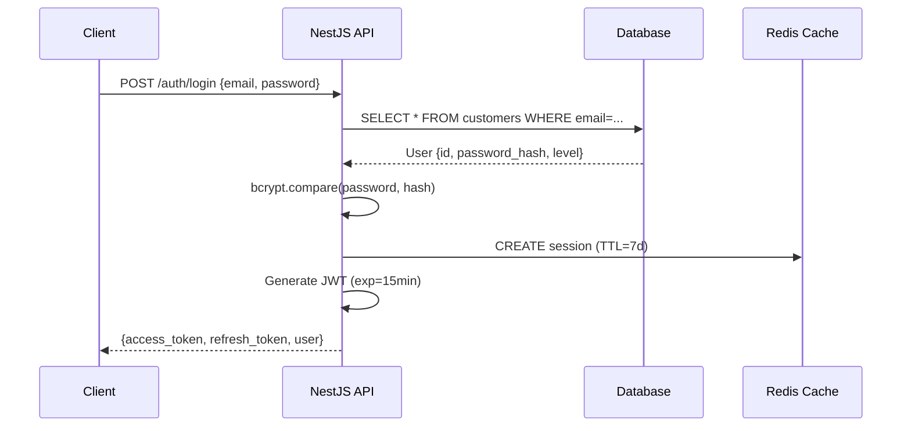

# 🔐 Guide d'Authentification

## Vue d'Ensemble

L'API utilise un système d'authentification hybride combinant **JWT tokens** et **sessions Passport** pour offrir sécurité et flexibilité.

:::info Architecture
L'authentification unifie clients B2C et staff (admins) dans un seul système avec niveaux d'accès granulaires.
:::

---

## 🎯 Flux d'Authentification

### 1. Login Standard (Email + Password)



---

## 🔑 Endpoints d'Authentification

### POST /auth/login

**Description**: Authentification avec email/password

**Request**:
```typescript
{
  email: string;      // Format: RFC 5322
  password: string;   // Min 6 chars (legacy), 8 chars (nouveaux)
}
```

**Response** (200):
```typescript
{
  success: true,
  user: {
    id: "user-123",
    email: "client@example.com",
    firstName: "Jean",
    lastName: "Dupont",
    level: 0,           // 0=customer, 1-9=staff, 10+=admin
    isAdmin: false,
    isPro: false
  },
  sessionToken: "eyJhbGciOiJIUzI1NiIsInR5cCI6IkpXVCJ9...",
  message: "Connexion réussie"
}
```

**Erreurs**:
- `401 Unauthorized`: Email/password invalide
- `403 Forbidden`: Compte désactivé
- `429 Too Many Requests`: Trop de tentatives (rate limiting)

---

### POST /auth/register

**Description**: Créer un nouveau compte client

**Request**:
```typescript
{
  email: string;       // Unique, format RFC 5322
  password: string;    // Min 8 chars
  firstName: string;   // 2-50 chars
  lastName: string;    // 2-50 chars
}
```

**Response** (201):
```typescript
{
  success: true,
  message: "Compte créé avec succès",
  user: { /* ... */ },
  sessionToken: "..."  // Auto-login après inscription
}
```

**Validation Zod**:
```typescript
import { z } from 'zod';

const RegisterSchema = z.object({
  email: z.string().email('Email invalide'),
  password: z.string().min(8, 'Mot de passe trop court'),
  firstName: z.string().min(2).max(50),
  lastName: z.string().min(2).max(50),
});
```

---

### POST /auth/logout

**Description**: Déconnexion et destruction session

**Request**:
```bash
POST /auth/logout
Authorization: Bearer <access_token>
```

**Response** (200):
```typescript
{
  success: true,
  message: "Déconnexion réussie"
}
```

**Side Effects**:
- Suppression session Redis
- Invalidation cookie `connect.sid`
- Fusion panier guest → user (si applicable)

---

### GET /auth/me

**Description**: Récupérer l'utilisateur connecté

**Request**:
```bash
GET /auth/me
Authorization: Bearer <access_token>
```

**Response** (200):
```typescript
{
  success: true,
  user: {
    id: "user-123",
    email: "client@example.com",
    firstName: "Jean",
    lastName: "Dupont",
    level: 0,
    isAdmin: false
  },
  timestamp: "2025-11-15T10:30:00Z"
}
```

---

## 🛡️ JWT Tokens

### Structure du Token

**Payload**:
```typescript
{
  sub: "user-123",           // User ID
  email: "client@example.com",
  level: 0,                  // Access level (0-100)
  sessionId: "sess_abc123",  // Redis session ID
  iat: 1700000000,          // Issued At
  exp: 1700000900           // Expires In (15 min)
}
```

### Générer un Token

```typescript
import { JwtService } from '@nestjs/jwt';

const payload = {
  sub: user.id,
  email: user.email,
  level: user.level,
  sessionId: sessionId,
};

const access_token = this.jwtService.sign(payload);
// Expiration par défaut: 15 minutes
```

### Valider un Token

```typescript
// Backend (NestJS)
@UseGuards(JwtAuthGuard)
@Get('protected-route')
async getProtectedData(@Request() req) {
  const user = req.user; // Injecté par JwtAuthGuard
  return { userId: user.sub };
}
```

---

## 🔄 Refresh Tokens

### POST /auth/refresh

**Description**: Renouveler l'access token avec un refresh token

**Request**:
```typescript
{
  refreshToken: string;  // Token 7 jours
}
```

**Response** (200):
```typescript
{
  access_token: "eyJhbGc...",  // Nouveau token 15 min
  expires_in: 900
}
```

**Flow Recommandé**:

```typescript
// Frontend (Axios Interceptor)
axios.interceptors.response.use(
  response => response,
  async error => {
    if (error.response?.status === 401) {
      const refreshToken = localStorage.getItem('refresh_token');
      
      const { data } = await axios.post('/auth/refresh', {
        refreshToken
      });
      
      localStorage.setItem('access_token', data.access_token);
      
      // Retry requête originale
      error.config.headers.Authorization = `Bearer ${data.access_token}`;
      return axios.request(error.config);
    }
    return Promise.reject(error);
  }
);
```

---

## 🔐 Sessions Passport

### Configuration

```typescript
// backend/src/main.ts
import session from 'express-session';
import RedisStore from 'connect-redis';

app.use(
  session({
    store: new RedisStore({ client: redisClient }),
    secret: process.env.SESSION_SECRET,
    resave: false,
    saveUninitialized: false,
    cookie: {
      maxAge: 7 * 24 * 60 * 60 * 1000, // 7 jours
      httpOnly: true,
      secure: process.env.NODE_ENV === 'production',
      sameSite: 'strict',
    },
  })
);
```

### LocalStrategy (Passport)

```typescript
// backend/src/auth/local.strategy.ts
import { Strategy } from 'passport-local';
import { PassportStrategy } from '@nestjs/passport';

@Injectable()
export class LocalStrategy extends PassportStrategy(Strategy) {
  constructor(private authService: AuthService) {
    super({
      usernameField: 'email',
      passwordField: 'password',
    });
  }

  async validate(email: string, password: string): Promise<any> {
    const user = await this.authService.validateUser(email, password);
    if (!user) {
      throw new UnauthorizedException('Identifiants invalides');
    }
    return user;
  }
}
```

---

## 🛡️ Guards & Décorateurs

### JwtAuthGuard

```typescript
// backend/src/auth/guards/jwt-auth.guard.ts
import { AuthGuard } from '@nestjs/passport';

@Injectable()
export class JwtAuthGuard extends AuthGuard('jwt') {
  canActivate(context: ExecutionContext) {
    return super.canActivate(context);
  }
}
```

**Utilisation**:
```typescript
@Controller('api/orders')
export class OrdersController {
  @UseGuards(JwtAuthGuard)
  @Get()
  async getOrders(@Request() req) {
    const userId = req.user.sub;
    return this.ordersService.findByUser(userId);
  }
}
```

### OptionalAuthGuard

```typescript
// Permet endpoints publics avec info user si connecté
@Injectable()
export class OptionalAuthGuard implements CanActivate {
  async canActivate(context: ExecutionContext): Promise<boolean> {
    const request = context.switchToHttp().getRequest();
    
    // Vérifier session Passport
    if (request.isAuthenticated && request.isAuthenticated()) {
      return true;
    }
    
    // Vérifier JWT Bearer token
    const authHeader = request.headers.authorization;
    if (authHeader && authHeader.startsWith('Bearer ')) {
      // Validation JWT (non bloquante)
    }
    
    // Laisser passer sans user
    return true;
  }
}
```

---

## 🔑 Gestion des Mots de Passe

### Hashing (bcrypt)

```typescript
import * as bcrypt from 'bcrypt';

// Créer hash
const saltRounds = 10;
const hash = await bcrypt.hash(password, saltRounds);

// Valider
const isValid = await bcrypt.compare(password, hash);
```

### Migration Legacy (MD5 → bcrypt)

```typescript
// backend/src/auth/auth.service.ts
async login(email: string, password: string) {
  const user = await this.findUser(email);
  
  // Détection legacy password
  if (user.password_hash.startsWith('$1$')) {
    // Legacy MD5 crypt
    const isValid = await this.validateLegacyPassword(password, user.password_hash);
    
    if (isValid) {
      // ✅ Upgrade automatique vers bcrypt
      const newHash = await bcrypt.hash(password, 10);
      await this.updateUserPassword(user.id, newHash);
    }
  } else {
    // Bcrypt moderne
    const isValid = await bcrypt.compare(password, user.password_hash);
  }
}
```

---

## 🔄 Reset Password Flow

### 1. Demander Reset

```bash
POST /api/password/request-reset
Content-Type: application/json

{
  "email": "client@example.com"
}
```

**Response**:
```typescript
{
  success: true,
  message: "Email de réinitialisation envoyé",
  expiresIn: 3600  // 1 heure
}
```

### 2. Valider Token + Reset

```bash
POST /api/password/reset
Content-Type: application/json

{
  "token": "reset_abc123xyz",
  "newPassword": "NewSecurePass123!"
}
```

**Backend Logic**:
```typescript
async resetPassword(token: string, newPassword: string) {
  // Vérifier token Redis
  const userId = await this.redis.get(`password_reset:${token}`);
  if (!userId) {
    throw new BadRequestException('Token invalide ou expiré');
  }
  
  // Hash nouveau mot de passe
  const hash = await bcrypt.hash(newPassword, 10);
  
  // Mettre à jour
  await this.db.updateUser(userId, { password_hash: hash });
  
  // Invalider token
  await this.redis.del(`password_reset:${token}`);
}
```

---

## 🚨 Sécurité & Best Practices

### Rate Limiting

```typescript
// backend/src/auth/auth.controller.ts
import { Throttle } from '@nestjs/throttler';

@Controller('auth')
export class AuthController {
  @Throttle(5, 60)  // 5 tentatives / 60 secondes
  @Post('login')
  async login(@Body() credentials: LoginDto) {
    // ...
  }
}
```

### Tentatives Échouées

```typescript
async login(email: string, password: string) {
  const attemptsKey = `login_attempts:${email}`;
  const attempts = await this.redis.get(attemptsKey) || 0;
  
  if (attempts >= 5) {
    throw new TooManyRequestsException('Trop de tentatives. Réessayez dans 15 min');
  }
  
  const isValid = await this.validatePassword(email, password);
  
  if (!isValid) {
    await this.redis.incr(attemptsKey);
    await this.redis.expire(attemptsKey, 900); // 15 min
    throw new UnauthorizedException('Identifiants invalides');
  }
  
  // Reset compteur si succès
  await this.redis.del(attemptsKey);
}
```

### CSRF Protection

```typescript
// backend/src/main.ts
import * as csurf from 'csurf';

app.use(csurf({ cookie: true }));

// Frontend doit inclure token CSRF
fetch('/auth/login', {
  method: 'POST',
  headers: {
    'CSRF-Token': csrfToken,
  },
  body: JSON.stringify(credentials),
});
```

---

## 🧪 Exemples d'Intégration

### Frontend (React/Remix)

```typescript
// app/utils/auth.client.ts
export const login = async (email: string, password: string) => {
  const response = await fetch('/auth/login', {
    method: 'POST',
    headers: { 'Content-Type': 'application/json' },
    body: JSON.stringify({ email, password }),
  });
  
  const data = await response.json();
  
  if (data.success) {
    localStorage.setItem('access_token', data.sessionToken);
    return data.user;
  }
  
  throw new Error(data.error || 'Login failed');
};

export const getAuthHeaders = () => {
  const token = localStorage.getItem('access_token');
  return {
    'Authorization': `Bearer ${token}`,
    'Content-Type': 'application/json',
  };
};
```

### cURL

```bash
# Login
curl -X POST http://localhost:3000/auth/login \
  -H "Content-Type: application/json" \
  -d '{
    "email": "client@example.com",
    "password": "securepass123"
  }'

# Utiliser token
TOKEN="eyJhbGc..."

curl -X GET http://localhost:3000/api/orders \
  -H "Authorization: Bearer $TOKEN"
```

---

## 📊 Architecture Technique

### Technologies Utilisées

- **NestJS**: Framework backend
- **Passport**: Middleware authentification
- **JWT**: Tokens stateless
- **bcrypt**: Hashing passwords (10 rounds)
- **Redis**: Sessions + rate limiting
- **Zod**: Validation schemas

### Schéma Base de Données

```sql
-- Table customers (B2C)
CREATE TABLE customers (
  id UUID PRIMARY KEY,
  email VARCHAR(255) UNIQUE NOT NULL,
  password_hash VARCHAR(255) NOT NULL,
  first_name VARCHAR(100),
  last_name VARCHAR(100),
  level INTEGER DEFAULT 0,
  is_active BOOLEAN DEFAULT true,
  created_at TIMESTAMP DEFAULT NOW()
);

-- Table admins (Staff)
CREATE TABLE admins (
  id UUID PRIMARY KEY,
  email VARCHAR(255) UNIQUE NOT NULL,
  password_hash VARCHAR(255) NOT NULL,
  name VARCHAR(100),
  level INTEGER DEFAULT 1,  -- 1-9=staff, 10+=admin
  is_active BOOLEAN DEFAULT true
);

-- Historique connexions
CREATE TABLE login_history (
  id UUID PRIMARY KEY,
  user_id UUID NOT NULL,
  ip_address VARCHAR(45),
  user_agent TEXT,
  success BOOLEAN,
  created_at TIMESTAMP DEFAULT NOW()
);
```

---

## 🔗 Ressources Complémentaires

- [Swagger UI - API Reference](http://localhost:3000/api/docs)
- [Webhooks Overview](../webhooks/overview)
- **Guide Error Handling** *(à venir)*
- **Exemple Checkout Flow** *(à venir)*

---

## ❓ FAQ

### Comment tester l'authentification en dev ?

```bash
# Créer un compte test
curl -X POST http://localhost:3000/auth/register \
  -H "Content-Type: application/json" \
  -d '{
    "email": "test@example.com",
    "password": "testpass123",
    "firstName": "Test",
    "lastName": "User"
  }'

# Vérifier dans Swagger UI
open http://localhost:3000/api/docs
# Cliquer "Authorize", coller le token
```

### Quelle est la durée de vie des tokens ?

- **Access Token**: 15 minutes (900 secondes)
- **Refresh Token**: 7 jours (604800 secondes)
- **Session Redis**: 7 jours (identique au refresh token)

### Comment gérer l'expiration des tokens ?

Utiliser un interceptor Axios pour refresh automatique :

```typescript
axios.interceptors.response.use(
  response => response,
  async error => {
    if (error.response?.status === 401) {
      // Tenter refresh
      const newToken = await refreshAccessToken();
      // Retry requête originale
      return axios.request(error.config);
    }
    return Promise.reject(error);
  }
);
```

---

## 🐛 Troubleshooting

### Erreur "Invalid token"

**Cause**: Token expiré ou malformé

**Solution**:
```typescript
// Vérifier format token
const token = localStorage.getItem('access_token');
console.log('Token:', token);

// Décoder payload (sans valider signature)
const payload = JSON.parse(atob(token.split('.')[1]));
console.log('Expiration:', new Date(payload.exp * 1000));
```

### Session perdue après redémarrage serveur

**Cause**: Redis non configuré ou sessions en mémoire

**Solution**:
```typescript
// .env
REDIS_HOST=localhost
REDIS_PORT=6379

// Vérifier connexion Redis
redis-cli ping
# Réponse attendue: PONG
```

### CORS errors en développement

**Solution**:
```typescript
// backend/src/main.ts
app.enableCors({
  origin: 'http://localhost:5173',  // Frontend Vite
  credentials: true,  // Important pour cookies
});
```
