# Database Schema Guide

Cette documentation complète décrit l'architecture de la base de données Supabase, les entités métier, les relations entre tables, et les patterns d'accès aux données.

---

## 🗂️ Vue d'ensemble

### Architecture technique

- **ORM**: [Supabase](https://supabase.com) (PostgreSQL)
- **Nombre de tables**: 97 tables découvertes
- **Volume de données**: ~4M+ produits (table `pieces`)
- **Type safety**: TypeScript généré automatiquement depuis le schéma Supabase
- **Fichier types**: `backend/src/database/types/database.types.ts` (1336 lignes)

:::info
Le projet utilise **Supabase** comme ORM principal. Le fichier `backend/prisma/schema.prisma` existe mais **n'est PAS utilisé** en production (sauf pour les expérimentations A/B testing SEO).
:::

### Catégories de tables

Les 97 tables sont organisées en 6 catégories métier :

| Catégorie | Tables principales | Description |
|-----------|-------------------|-------------|
| **Clients** | `___xtr_customer`, `___xtr_customer_billing_address`, `___xtr_customer_delivery_address` | Gestion clients B2B/B2C |
| **Commandes** | `___xtr_order`, `___xtr_order_line`, `___xtr_order_line_status`, `___xtr_invoice` | Cycle de vie commandes |
| **Produits** | `pieces`, `pieces_marque`, `pieces_gamme`, `pieces_price` | Catalogue 4M+ pièces auto |
| **Véhicules** | `auto_marque`, `auto_modele`, `auto_type` | Compatibilité véhicules |
| **Panier** | `cart_items`, `promo_codes`, `promo_usage` | Gestion panier e-commerce |
| **Système** | `config`, `config_admin`, `crawl_budget_experiments` | Configuration & monitoring |

---

## 📋 Tables principales

### 1. Clients (`___xtr_customer`)

Table centrale pour la gestion des clients (B2B et B2C).

```typescript
export interface XtrCustomer {
  cst_id: string | null;                    // ID unique client
  cst_email: string | null;                 // Email
  cst_password: string | null;              // Hash bcrypt
  cst_name: string | null;                  // Nom
  cst_fname: string | null;                 // Prénom
  cst_phone: string | null;                 // Téléphone
  cst_type: string | null;                  // 'pro' | 'part' (B2B/B2C)
  cst_company: string | null;               // Raison sociale (si B2B)
  cst_siret: string | null;                 // SIRET (si B2B)
  cst_tva: string | null;                   // Numéro TVA intracommunautaire
  cst_date_register: string | null;         // Date inscription
  cst_status: string | null;                // 'active' | 'inactive' | 'suspended'
}
```

**Relations**:
- **1-N** vers `___xtr_order` (un client peut avoir plusieurs commandes)
- **1-N** vers `___xtr_customer_billing_address` (adresses de facturation)
- **1-N** vers `___xtr_customer_delivery_address` (adresses de livraison)

**Exemple de requête**:

```typescript
// Récupérer un client avec ses commandes
const { data: customer } = await supabase
  .from('___xtr_customer')
  .select(`
    *,
    orders:___xtr_order(*)
  `)
  .eq('cst_email', 'client@example.com')
  .single();
```

:::tip **Distinction B2B/B2C**
Le champ `cst_type` détermine le type de client:
- `'pro'`: Client professionnel (nécessite SIRET)
- `'part'`: Particulier (pas de SIRET requis)
:::

---

### 2. Commandes (`___xtr_order`)

Table principale pour le cycle de vie des commandes.

```typescript
export interface XtrOrder {
  ord_id: string | null;                    // ID unique commande
  ord_cst_id: string | null;                // FK → ___xtr_customer.cst_id
  ord_cba_id: string | null;                // FK → customer_billing_address
  ord_cda_id: string | null;                // FK → customer_delivery_address
  ord_date: string | null;                  // Date commande (ISO timestamp)
  ord_amount_ht: string | null;             // Montant HT (decimal as string)
  ord_deposit_ht: string | null;            // Consigne HT
  ord_shipping_fee_ht: string | null;       // Frais de port HT
  ord_total_ht: string | null;              // Total HT
  ord_tva: string | null;                   // Montant TVA
  ord_amount_ttc: string | null;            // Montant TTC
  ord_total_ttc: string | null;             // Total TTC
  ord_is_pay: string | null;                // '0' | '1' (statut paiement)
  ord_date_pay: string | null;              // Date paiement
  ord_ords_id: string | null;               // FK → order_status
  ord_info: string | null;                  // Notes additionnelles
}
```

**Relations**:
- **N-1** vers `___xtr_customer` (plusieurs commandes pour un client)
- **1-N** vers `___xtr_order_line` (une commande contient plusieurs lignes)
- **1-1** vers `___xtr_invoice` (une commande génère une facture)

**Exemple de requête**:

```typescript
// Récupérer une commande complète
const { data: order } = await supabase
  .from('___xtr_order')
  .select(`
    *,
    customer:___xtr_customer(*),
    lines:___xtr_order_line(*),
    invoice:___xtr_invoice(*)
  `)
  .eq('ord_id', orderId)
  .single();
```

---

### 3. Lignes de commande (`___xtr_order_line`)

Détail des articles commandés.

```typescript
export interface XtrOrderLine {
  orl_id: string | null;                    // ID unique ligne
  orl_ord_id: string | null;                // FK → ___xtr_order.ord_id
  orl_pg_id: string | null;                 // FK → pieces_gamme.pg_id (gamme)
  orl_pm_id: string | null;                 // FK → pieces_marque.pm_id (marque)
  orl_art_ref: string | null;               // Référence article
  orl_art_ref_clean: string | null;         // Référence normalisée
  orl_art_price_buy_unit_ht: string | null; // Prix achat unitaire HT
  orl_art_price_sell_unit_ht: string | null;// Prix vente unitaire HT
  orl_art_price_sell_margin: string | null; // Marge (%)
  orl_art_quantity: string | null;          // Quantité commandée
  orl_art_deposit_unit_ht: string | null;   // Consigne unitaire HT
  orl_orls_id: string | null;               // FK → order_line_status
}
```

**Relations**:
- **N-1** vers `___xtr_order` (plusieurs lignes par commande)
- **N-1** vers `pieces_gamme` (gamme produit)
- **N-1** vers `pieces_marque` (marque produit)

**Calcul du total ligne**:

```typescript
// Calcul total ligne (quantity × unit_price + deposit)
const lineTotal = 
  (parseFloat(orl_art_quantity) * parseFloat(orl_art_price_sell_unit_ht)) +
  (parseFloat(orl_art_quantity) * parseFloat(orl_art_deposit_unit_ht));
```

---

### 4. Produits (`pieces`)

Catalogue principal de pièces automobiles (~4M+ produits).

```typescript
export interface Pieces {
  piece_id: string | null;                  // ID unique pièce
  piece_ref: string | null;                 // Référence fabricant
  piece_ref_clean: string | null;           // Référence normalisée
  piece_pm_id: string | null;               // FK → pieces_marque.pm_id
  piece_pg_id: string | null;               // FK → pieces_gamme.pg_id
  piece_name: string | null;                // Nom produit
  piece_des: string | null;                 // Description
  piece_price_ht: string | null;            // Prix HT
  piece_weight: string | null;              // Poids (kg)
  piece_stock: string | null;               // Stock disponible
  piece_display: string | null;             // '0' | '1' (visible)
  search_vector: string | null;             // Index texte plein (PostgreSQL)
}
```

**Relations**:
- **N-1** vers `pieces_marque` (marque produit)
- **N-1** vers `pieces_gamme` (gamme produit)
- **1-N** vers `pieces_price` (grille tarifaire)
- **N-N** vers `auto_type` via `pieces_auto_link` (compatibilité véhicules)

**Recherche full-text**:

```typescript
// Recherche textuelle (utilise search_vector)
const { data: products } = await supabase
  .from('pieces')
  .select('*')
  .textSearch('search_vector', 'filtre huile volkswagen')
  .limit(50);
```

:::info **Index texte plein**
La colonne `search_vector` utilise l'indexation PostgreSQL full-text pour optimiser les recherches (jusqu'à 50× plus rapide qu'un `LIKE '%...%'`).
:::

---

### 5. Marques (`pieces_marque`)

Table des marques de pièces automobiles.

```typescript
export interface PiecesMarque {
  pm_id: string | null;                     // ID unique marque
  pm_name: string | null;                   // Nom marque
  pm_alias: string | null;                  // Alias URL-friendly
  pm_logo: string | null;                   // URL logo
  pm_quality: string | null;                // 'OE' | 'premium' | 'standard'
  pm_nature: string | null;                 // 'origin' | 'aftermarket'
  pm_nb_stars: string | null;               // Note qualité (1-5)
  pm_display: string | null;                // '0' | '1' (visible)
}
```

**Qualité des marques**:

| Niveau | Description | Exemples |
|--------|-------------|----------|
| `OE` | Qualité équipement origine | Bosch, Valeo, Behr |
| `premium` | Qualité supérieure | Hella, Mann Filter |
| `standard` | Qualité économique | Marques distributeurs |

---

### 6. Véhicules (`auto_marque`, `auto_modele`, `auto_type`)

Référentiel véhicules pour la compatibilité pièces.

```typescript
// Marques véhicules (Renault, Peugeot, Volkswagen...)
export interface AutoMarque {
  marque_id: string | null;                 // ID unique marque
  marque_name: string | null;               // Nom marque
  marque_alias: string | null;              // Alias URL
  marque_logo: string | null;               // URL logo
  marque_display: string | null;            // '0' | '1'
}

// Modèles véhicules (Clio, 308, Golf...)
export interface AutoModele {
  modele_id: string | null;                 // ID unique modèle
  modele_marque_id: string | null;          // FK → auto_marque.marque_id
  modele_name: string | null;               // Nom modèle
  modele_year_from: string | null;          // Année début production
  modele_year_to: string | null;            // Année fin production
  modele_body: string | null;               // Type carrosserie
}

// Types motorisation (1.5 dCi, 2.0 HDi, 1.9 TDI...)
export interface AutoType {
  type_id: string | null;                   // ID unique type
  type_modele_id: string | null;            // FK → auto_modele.modele_id
  type_name: string | null;                 // Nom type moteur
  type_engine: string | null;               // Cylindrée (ex: 1461 cc)
  type_fuel: string | null;                 // Carburant (diesel, essence)
  type_power_cv: string | null;             // Puissance (CV)
  type_power_kw: string | null;             // Puissance (kW)
}
```

**Requête de compatibilité**:

```typescript
// Trouver pièces compatibles pour un véhicule
const { data: compatibleParts } = await supabase
  .from('pieces')
  .select(`
    *,
    links:pieces_auto_link!inner(
      auto_type!inner(
        modele:auto_modele!inner(
          marque:auto_marque!inner(marque_name)
        )
      )
    )
  `)
  .eq('links.auto_type.modele.marque.marque_id', marqueId)
  .eq('links.auto_type.modele_id', modeleId)
  .eq('links.auto_type.type_id', typeId);
```

---

### 7. Panier (`cart_items`)

Table pour le panier e-commerce (persisté en base).

```typescript
export interface CartItems {
  id: string | null;                        // UUID (PK)
  user_id: string | null;                   // FK → ___xtr_customer.cst_id
  product_id: string | null;                // FK → pieces.piece_id
  quantity: number | null;                  // Quantité (1-99)
  price: number | null;                     // Prix unitaire HT
  created_at: string | null;                // Date ajout
  updated_at: string | null;                // Date modification
  options: Record<string, any> | null;      // Métadonnées JSON
}
```

**Pattern cache Redis**:

```typescript
// Le panier est AUSSI caché dans Redis (TTL 30 jours)
const CART_REDIS_KEY = `cart:${sessionId}`;
const CART_EXPIRY_SECONDS = 30 * 24 * 60 * 60; // 30 jours

// Récupérer panier (Redis first, fallback DB)
let cart = await redis.get(CART_REDIS_KEY);
if (!cart) {
  const { data } = await supabase
    .from('cart_items')
    .select('*')
    .eq('user_id', userId);
  
  cart = data;
  await redis.set(CART_REDIS_KEY, JSON.stringify(cart), 'EX', CART_EXPIRY_SECONDS);
}
```

---

### 8. Codes promo (`promo_codes`)

Gestion des codes promotionnels.

```typescript
export interface PromoCodes {
  id: string | null;                        // UUID (PK)
  code: string | null;                      // Code promo (ex: 'NOEL2024')
  discount_type: string | null;             // 'percentage' | 'fixed'
  discount_value: number | null;            // Valeur (10.5 pour 10.5% ou 15.00€)
  min_order_amount: number | null;          // Montant minimum commande
  max_uses: number | null;                  // Nombre max utilisations
  max_uses_per_user: number | null;         // Max par utilisateur
  valid_from: string | null;                // Date début validité
  valid_until: string | null;               // Date fin validité
  is_active: boolean | null;                // Actif/Inactif
}
```

**Validation promo**:

```typescript
// Vérifier validité d'un code promo
const { data: promo } = await supabase
  .from('promo_codes')
  .select('*')
  .eq('code', promoCode)
  .eq('is_active', true)
  .lte('valid_from', new Date().toISOString())
  .gte('valid_until', new Date().toISOString())
  .single();

if (!promo) {
  throw new Error('Code promo invalide ou expiré');
}

// Vérifier nombre d'utilisations
const { count } = await supabase
  .from('promo_usage')
  .select('*', { count: 'exact', head: true })
  .eq('promo_code_id', promo.id);

if (count >= promo.max_uses) {
  throw new Error('Code promo épuisé');
}
```

---

### 9. Factures (`___xtr_invoice`)

Génération de factures depuis les commandes.

```typescript
export interface XtrInvoice {
  inv_id: string | null;                    // ID unique facture
  inv_ord_id: string | null;                // FK → ___xtr_order.ord_id
  inv_cst_id: string | null;                // FK → ___xtr_customer.cst_id
  inv_date: string | null;                  // Date facturation
  inv_amount_ht: string | null;             // Montant HT
  inv_total_ttc: string | null;             // Total TTC
  inv_tva: string | null;                   // Montant TVA
}
```

**Génération automatique**:

```typescript
// Une facture est générée automatiquement après paiement confirmé
async function generateInvoice(orderId: string) {
  const { data: order } = await supabase
    .from('___xtr_order')
    .select('*')
    .eq('ord_id', orderId)
    .eq('ord_is_pay', '1') // Payée uniquement
    .single();

  if (!order) throw new Error('Commande non payée');

  const { data: invoice } = await supabase
    .from('___xtr_invoice')
    .insert({
      inv_ord_id: order.ord_id,
      inv_cst_id: order.ord_cst_id,
      inv_date: new Date().toISOString(),
      inv_amount_ht: order.ord_amount_ht,
      inv_total_ttc: order.ord_total_ttc,
      inv_tva: order.ord_tva,
    })
    .select()
    .single();

  return invoice;
}
```

---

## 🏗️ Architecture des services

### Pattern de base : `SupabaseBaseService`

Tous les services héritent de la classe abstraite `SupabaseBaseService`.

```typescript
// backend/src/database/services/supabase-base.service.ts

@Injectable()
export abstract class SupabaseBaseService {
  protected readonly logger = new Logger(SupabaseBaseService.name);
  protected readonly supabase: SupabaseClient;
  protected readonly supabaseUrl: string;
  protected readonly supabaseServiceKey: string;

  constructor(protected configService?: ConfigService) {
    const appConfig = getAppConfig();
    
    this.supabaseUrl = appConfig.supabase.url;
    this.supabaseServiceKey = appConfig.supabase.serviceKey;

    // Créer client Supabase avec bypass RLS
    this.supabase = createClient(this.supabaseUrl, this.supabaseServiceKey, {
      auth: {
        persistSession: false,
        autoRefreshToken: false,
      },
      db: { schema: 'public' },
    });
  }

  // Expose le client Supabase
  get client(): SupabaseClient {
    return this.supabase;
  }

  // Circuit breaker pour gérer les erreurs Cloudflare
  protected async executeWithRetry<T>(
    operation: () => Promise<T>,
    operationName: string,
    maxRetries = 3,
  ): Promise<T | null> {
    // ... logique retry avec exponential backoff
  }
}
```

**Fonctionnalités clés**:
- ✅ **Bypass RLS automatique** (service_role key)
- ✅ **Circuit breaker** (gestion erreurs 500 Cloudflare)
- ✅ **Retry avec exponential backoff** (3 tentatives max)
- ✅ **Logging structuré** (Winston)

---

### Services spécialisés

#### `OrderDataService`

```typescript
// backend/src/database/services/order-data.service.ts

@Injectable()
export class OrderDataService extends SupabaseBaseService {
  constructor(configService: ConfigService) {
    super(configService);
  }

  // Récupérer commandes d'un utilisateur
  async getUserOrders(userId: string): Promise<Order[]> {
    const { data, error } = await this.client
      .from('___xtr_order')
      .select('*')
      .eq('customer_id', userId)
      .order('created_at', { ascending: false });

    if (error) throw error;
    return (data || []).map(OrderMapper.fromDb);
  }

  // Créer une commande
  async createOrder(orderData: Partial<Order>): Promise<Order> {
    const dbData = OrderMapper.toDb(orderData);

    const { data, error } = await this.client
      .from('___xtr_order')
      .insert(dbData)
      .select()
      .single();

    if (error) throw error;
    return OrderMapper.fromDb(data);
  }

  // Mettre à jour le statut
  async updateOrderStatus(orderId: string, status: OrderStatus): Promise<void> {
    const { error } = await this.client
      .from('___xtr_order')
      .update({ ord_ords_id: status })
      .eq('ord_id', orderId);

    if (error) throw error;
  }
}
```

---

#### `CartDataService`

```typescript
// backend/src/database/services/cart-data.service.ts

@Injectable()
export class CartDataService extends SupabaseBaseService {
  constructor(private readonly cacheService: CacheService) {
    super();
  }

  // Récupérer panier (Redis first, DB fallback)
  async getCart(sessionId: string): Promise<CartItem[]> {
    const cacheKey = `cart:${sessionId}`;

    // Essayer Redis
    let cart = await this.cacheService.get<CartItem[]>(cacheKey);

    // Fallback DB
    if (!cart) {
      const { data } = await this.client
        .from('cart_items')
        .select('*')
        .eq('session_id', sessionId);

      cart = data || [];

      // Mettre en cache (30 jours)
      await this.cacheService.set(cacheKey, cart, 30 * 24 * 60 * 60);
    }

    return cart;
  }

  // Ajouter un article
  async addItem(sessionId: string, item: CartItem): Promise<void> {
    // Validation Zod
    const validatedItem = CartItemSchema.parse(item);

    // Insérer en DB
    const { error } = await this.client
      .from('cart_items')
      .insert(validatedItem);

    if (error) throw error;

    // Invalider cache Redis
    await this.cacheService.del(`cart:${sessionId}`);
  }

  // Calculer totaux
  async calculateTotals(sessionId: string): Promise<CartMetadata> {
    const items = await this.getCart(sessionId);

    const subtotal = items.reduce(
      (sum, item) => sum + item.price * item.quantity,
      0,
    );

    const shippingCost = await this.calculateShipping(items);
    const taxAmount = subtotal * 0.20; // TVA 20%
    const total = subtotal + shippingCost + taxAmount;

    return {
      user_id: parseInt(sessionId),
      subtotal,
      shipping_cost: shippingCost,
      tax_amount: taxAmount,
      total,
      currency: 'EUR',
    };
  }
}
```

---

#### `DatabaseCompositionService` (Façade)

```typescript
// backend/src/database/services/database-composition.service.ts

@Injectable()
export class DatabaseCompositionService {
  constructor(
    private readonly orderDataService: OrderDataService,
    private readonly cartDataService: CartDataService,
    private readonly userDataService: UserDataService,
    private readonly promoDataService: PromoDataService,
    private readonly shippingDataService: ShippingDataService,
  ) {}

  // Exposition des services
  get orders() {
    return this.orderDataService;
  }

  get cart() {
    return this.cartDataService;
  }

  get users() {
    return this.userDataService;
  }

  get promos() {
    return this.promoDataService;
  }

  get shipping() {
    return this.shippingDataService;
  }
}
```

**Usage dans un contrôleur**:

```typescript
@Controller('api/cart')
export class CartController {
  constructor(private readonly db: DatabaseCompositionService) {}

  @Get(':sessionId')
  async getCart(@Param('sessionId') sessionId: string) {
    return this.db.cart.getCart(sessionId);
  }

  @Post(':sessionId/items')
  async addItem(
    @Param('sessionId') sessionId: string,
    @Body() item: CartItem,
  ) {
    await this.db.cart.addItem(sessionId, item);
    return { success: true };
  }
}
```

---

## 📊 Diagramme entité-relation (ERD)

### Schéma commandes

```mermaid
erDiagram
    XTR_CUSTOMER ||--o{ XTR_ORDER : "passe"
    XTR_CUSTOMER ||--o{ XTR_CUSTOMER_BILLING_ADDRESS : "possède"
    XTR_CUSTOMER ||--o{ XTR_CUSTOMER_DELIVERY_ADDRESS : "possède"
    
    XTR_ORDER ||--o{ XTR_ORDER_LINE : "contient"
    XTR_ORDER ||--|| XTR_INVOICE : "génère"
    XTR_ORDER }o--|| XTR_CUSTOMER_BILLING_ADDRESS : "facture à"
    XTR_ORDER }o--|| XTR_CUSTOMER_DELIVERY_ADDRESS : "livre à"
    
    XTR_ORDER_LINE }o--|| PIECES : "référence"
    XTR_ORDER_LINE }o--|| PIECES_MARQUE : "marque"
    XTR_ORDER_LINE }o--|| PIECES_GAMME : "gamme"
    
    XTR_CUSTOMER {
        string cst_id PK
        string cst_email
        string cst_password
        string cst_type
        string cst_company
        string cst_siret
    }
    
    XTR_ORDER {
        string ord_id PK
        string ord_cst_id FK
        string ord_cba_id FK
        string ord_cda_id FK
        string ord_date
        string ord_total_ttc
        string ord_is_pay
    }
    
    XTR_ORDER_LINE {
        string orl_id PK
        string orl_ord_id FK
        string orl_art_ref
        string orl_art_quantity
        string orl_art_price_sell_unit_ht
    }
    
    XTR_INVOICE {
        string inv_id PK
        string inv_ord_id FK
        string inv_cst_id FK
        string inv_total_ttc
    }
```



### Schéma produits

```mermaid
erDiagram
    PIECES }o--|| PIECES_MARQUE : "fabriqué par"
    PIECES }o--|| PIECES_GAMME : "appartient à"
    PIECES ||--o{ PIECES_PRICE : "grille tarifaire"
    PIECES ||--o{ PIECES_MEDIA_IMG : "images"
    PIECES }o--o{ AUTO_TYPE : "compatible avec"
    
    AUTO_TYPE }o--|| AUTO_MODELE : "motorisation de"
    AUTO_MODELE }o--|| AUTO_MARQUE : "modèle de"
    
    PIECES {
        string piece_id PK
        string piece_ref
        string piece_pm_id FK
        string piece_pg_id FK
        string piece_name
        string piece_price_ht
        string search_vector
    }
    
    PIECES_MARQUE {
        string pm_id PK
        string pm_name
        string pm_quality
        string pm_nature
    }
    
    PIECES_GAMME {
        string pg_id PK
        string pg_name
        string pg_level
    }
    
    AUTO_MARQUE {
        string marque_id PK
        string marque_name
    }
    
    AUTO_MODELE {
        string modele_id PK
        string modele_marque_id FK
        string modele_name
    }
    
    AUTO_TYPE {
        string type_id PK
        string type_modele_id FK
        string type_name
        string type_engine
    }
```



---

## 🔍 Patterns de requêtes avancées

### 1. Recherche de produits avec filtres

```typescript
// Recherche textuelle + filtres marque/gamme + tri
const { data: products } = await supabase
  .from('pieces')
  .select(`
    *,
    marque:pieces_marque(pm_name, pm_quality),
    gamme:pieces_gamme(pg_name, pg_level)
  `)
  .textSearch('search_vector', searchQuery)
  .in('piece_pm_id', brandIds)        // Filtrer par marques
  .in('piece_pg_id', categoryIds)     // Filtrer par gammes
  .gte('piece_price_ht', minPrice)    // Prix minimum
  .lte('piece_price_ht', maxPrice)    // Prix maximum
  .eq('piece_display', '1')           // Produits visibles uniquement
  .order('piece_price_ht', { ascending: true })
  .range(offset, offset + limit - 1); // Pagination
```

### 2. Commande avec lignes et client

```typescript
// Récupérer commande complète (deep join)
const { data: order } = await supabase
  .from('___xtr_order')
  .select(`
    *,
    customer:___xtr_customer(
      cst_id,
      cst_email,
      cst_name,
      cst_fname,
      cst_type
    ),
    lines:___xtr_order_line(
      *,
      piece:pieces(piece_name, piece_ref),
      marque:pieces_marque(pm_name),
      gamme:pieces_gamme(pg_name)
    ),
    invoice:___xtr_invoice(*)
  `)
  .eq('ord_id', orderId)
  .single();
```

### 3. Agrégations (total ventes par mois)

```typescript
// Total ventes par mois (utilise RPC function)
const { data: sales } = await supabase
  .rpc('get_monthly_sales', {
    start_date: '2024-01-01',
    end_date: '2024-12-31',
  });

// Fonction SQL correspondante (à créer dans Supabase)
/*
CREATE OR REPLACE FUNCTION get_monthly_sales(
  start_date DATE,
  end_date DATE
)
RETURNS TABLE (
  month TEXT,
  total_ht NUMERIC,
  total_ttc NUMERIC,
  order_count BIGINT
) AS $$
BEGIN
  RETURN QUERY
  SELECT
    TO_CHAR(ord_date::DATE, 'YYYY-MM') AS month,
    SUM(ord_total_ht::NUMERIC) AS total_ht,
    SUM(ord_total_ttc::NUMERIC) AS total_ttc,
    COUNT(*) AS order_count
  FROM ___xtr_order
  WHERE ord_date::DATE BETWEEN start_date AND end_date
    AND ord_is_pay = '1'
  GROUP BY TO_CHAR(ord_date::DATE, 'YYYY-MM')
  ORDER BY month DESC;
END;
$$ LANGUAGE plpgsql;
*/
```

### 4. Transaction multi-étapes

```typescript
// Créer commande + lignes + facture (transaction)
async function createFullOrder(
  customerId: string,
  cartItems: CartItem[],
): Promise<{ orderId: string; invoiceId: string }> {
  
  // 1. Créer commande
  const { data: order, error: orderError } = await supabase
    .from('___xtr_order')
    .insert({
      ord_cst_id: customerId,
      ord_date: new Date().toISOString(),
      ord_amount_ht: calculateTotalHT(cartItems),
      ord_total_ttc: calculateTotalTTC(cartItems),
      ord_is_pay: '0', // Non payée
    })
    .select()
    .single();

  if (orderError) throw orderError;

  // 2. Créer lignes commande
  const orderLines = cartItems.map((item) => ({
    orl_ord_id: order.ord_id,
    orl_art_ref: item.product_sku,
    orl_art_quantity: item.quantity.toString(),
    orl_art_price_sell_unit_ht: item.price.toString(),
  }));

  const { error: linesError } = await supabase
    .from('___xtr_order_line')
    .insert(orderLines);

  if (linesError) {
    // Rollback : supprimer commande
    await supabase.from('___xtr_order').delete().eq('ord_id', order.ord_id);
    throw linesError;
  }

  // 3. Créer facture pro forma
  const { data: invoice, error: invoiceError } = await supabase
    .from('___xtr_invoice')
    .insert({
      inv_ord_id: order.ord_id,
      inv_cst_id: customerId,
      inv_date: new Date().toISOString(),
      inv_total_ttc: order.ord_total_ttc,
    })
    .select()
    .single();

  if (invoiceError) {
    // Rollback
    await supabase.from('___xtr_order_line').delete().eq('orl_ord_id', order.ord_id);
    await supabase.from('___xtr_order').delete().eq('ord_id', order.ord_id);
    throw invoiceError;
  }

  return {
    orderId: order.ord_id,
    invoiceId: invoice.inv_id,
  };
}
```

---

## ⚡ Performance et optimisation

### Index recommandés

```sql
-- Index sur recherche textuelle
CREATE INDEX idx_pieces_search_vector ON pieces USING GIN (search_vector);

-- Index sur clés étrangères
CREATE INDEX idx_xtr_order_cst_id ON ___xtr_order (ord_cst_id);
CREATE INDEX idx_xtr_order_line_ord_id ON ___xtr_order_line (orl_ord_id);
CREATE INDEX idx_pieces_pm_id ON pieces (piece_pm_id);
CREATE INDEX idx_pieces_pg_id ON pieces (piece_pg_id);

-- Index composites pour filtres fréquents
CREATE INDEX idx_pieces_display_price ON pieces (piece_display, piece_price_ht);
CREATE INDEX idx_xtr_order_pay_date ON ___xtr_order (ord_is_pay, ord_date);
```

### Stratégie de cache

**Redis** (cache applicatif):
- ✅ Panier utilisateur (TTL 30 jours)
- ✅ Tarifs shipping (TTL 1 heure)
- ✅ Codes promo actifs (TTL 10 minutes)

**Supabase Cache** (CDN edge):
- ✅ Liste marques (TTL 24h)
- ✅ Liste gammes (TTL 24h)
- ✅ Véhicules populaires (TTL 6h)

```typescript
// Pattern cache Redis
async function getCachedData<T>(
  key: string,
  fetchFn: () => Promise<T>,
  ttl: number,
): Promise<T> {
  // Essayer cache
  const cached = await redis.get(key);
  if (cached) return JSON.parse(cached);

  // Fallback DB
  const data = await fetchFn();

  // Mettre en cache
  await redis.set(key, JSON.stringify(data), 'EX', ttl);

  return data;
}

// Usage
const brands = await getCachedData(
  'brands:all',
  () => supabase.from('pieces_marque').select('*'),
  24 * 60 * 60, // 24h
);
```

---

## 🛡️ Sécurité et RLS

### Row Level Security (RLS)

:::danger **Service Role Key**
L'application utilise la **service_role key** qui **BYPASSE automatiquement RLS**. Les règles RLS ne s'appliquent donc PAS au backend NestJS.

Les règles RLS sont principalement pour protéger les accès directs (API Supabase publique, Supabase Studio).
:::

**Exemple de règle RLS** (protection table clients):

```sql
-- Activer RLS sur la table customers
ALTER TABLE ___xtr_customer ENABLE ROW LEVEL SECURITY;

-- Policy : un client ne peut voir QUE ses données
CREATE POLICY "Users can view own data"
ON ___xtr_customer
FOR SELECT
USING (auth.uid()::TEXT = cst_id);

-- Policy : admins peuvent tout voir
CREATE POLICY "Admins can view all"
ON ___xtr_customer
FOR SELECT
USING (
  EXISTS (
    SELECT 1 FROM config_admin
    WHERE cnfa_id::TEXT = auth.uid()::TEXT
      AND cnfa_level = 'admin'
  )
);
```

### Validation des données (Zod)

Toujours valider les données avant insertion :

```typescript
import { z } from 'zod';

// Schéma validation commande
const CreateOrderSchema = z.object({
  customerId: z.string().uuid(),
  items: z.array(
    z.object({
      productId: z.string(),
      quantity: z.number().min(1).max(99),
      price: z.number().min(0),
    })
  ).min(1), // Au moins 1 article
  shippingAddressId: z.string().uuid(),
  billingAddressId: z.string().uuid(),
});

// Usage dans contrôleur
@Post()
async createOrder(@Body() body: unknown) {
  const data = CreateOrderSchema.parse(body); // Lève erreur si invalide
  return this.orderService.create(data);
}
```

---

## 🧪 Tests et fixtures

### Tests unitaires (Jest)

```typescript
// order-data.service.spec.ts

describe('OrderDataService', () => {
  let service: OrderDataService;
  let supabase: jest.Mocked<SupabaseClient>;

  beforeEach(() => {
    supabase = {
      from: jest.fn(() => ({
        select: jest.fn().mockReturnThis(),
        eq: jest.fn().mockReturnThis(),
        single: jest.fn(),
      })),
    } as any;

    service = new OrderDataService(mockConfigService);
    (service as any).supabase = supabase;
  });

  it('should get order by ID', async () => {
    const mockOrder = {
      ord_id: '123',
      ord_cst_id: 'cst_456',
      ord_total_ttc: '150.00',
    };

    supabase.from().single.mockResolvedValue({
      data: mockOrder,
      error: null,
    });

    const result = await service.getOrderById('123');

    expect(result).toBeDefined();
    expect(result.ord_id).toBe('123');
    expect(supabase.from).toHaveBeenCalledWith('___xtr_order');
  });
});
```

### Fixtures (données de test)

```typescript
// test/fixtures/orders.fixture.ts

export const mockCustomer = {
  cst_id: 'cst_test_001',
  cst_email: 'test@example.com',
  cst_name: 'Dupont',
  cst_fname: 'Jean',
  cst_type: 'part',
};

export const mockOrder = {
  ord_id: 'ord_test_001',
  ord_cst_id: 'cst_test_001',
  ord_date: '2024-12-01T10:00:00Z',
  ord_total_ttc: '250.00',
  ord_is_pay: '1',
};

export const mockOrderLines = [
  {
    orl_id: 'orl_test_001',
    orl_ord_id: 'ord_test_001',
    orl_art_ref: 'REF123',
    orl_art_quantity: '2',
    orl_art_price_sell_unit_ht: '50.00',
  },
  {
    orl_id: 'orl_test_002',
    orl_ord_id: 'ord_test_001',
    orl_art_ref: 'REF456',
    orl_art_quantity: '1',
    orl_art_price_sell_unit_ht: '100.00',
  },
];
```

---

## 📝 Migrations

### Structure des migrations

```
backend/supabase/migrations/
├── 20251027_crawl_budget_experiments.sql
├── 20241115_database_indexes_optimization.sql
└── 20241008_initial_schema.sql
```

### Exemple de migration

```sql
-- 20251027_crawl_budget_experiments.sql

-- Créer table expérimentations SEO
CREATE TABLE IF NOT EXISTS crawl_budget_experiments (
  id UUID PRIMARY KEY DEFAULT gen_random_uuid(),
  name TEXT NOT NULL,
  description TEXT,
  action TEXT NOT NULL CHECK (action IN ('exclude', 'include', 'reduce')),
  target_families TEXT[] NOT NULL,
  reduction_percent INTEGER,
  duration_days INTEGER DEFAULT 30,
  status TEXT DEFAULT 'draft' CHECK (status IN ('draft', 'running', 'paused', 'completed')),
  baseline JSONB,
  started_at TIMESTAMPTZ,
  completed_at TIMESTAMPTZ,
  created_at TIMESTAMPTZ DEFAULT NOW(),
  updated_at TIMESTAMPTZ DEFAULT NOW()
);

-- Index pour recherches fréquentes
CREATE INDEX idx_experiments_status ON crawl_budget_experiments(status);
CREATE INDEX idx_experiments_started_at ON crawl_budget_experiments(started_at);

-- Trigger pour updated_at
CREATE TRIGGER set_updated_at
  BEFORE UPDATE ON crawl_budget_experiments
  FOR EACH ROW
  EXECUTE FUNCTION trigger_set_timestamp();
```

### Appliquer une migration

```bash
# Via Supabase CLI
supabase db push

# Via SQL direct (Supabase Studio)
-- Copier-coller le contenu du fichier .sql
```

---

## 🔧 Troubleshooting

### Erreur : "relation does not exist"

**Cause** : La table n'existe pas ou le schéma est incorrect.

**Solution** :

```typescript
// Vérifier le schéma dans la requête
const { data } = await supabase
  .from('___xtr_order') // ⚠️ 3 underscores au début
  .select('*');
```

### Erreur : "Invalid input syntax for type uuid"

**Cause** : Le champ UUID attend un UUID valide, vous passez un string.

**Solution** :

```typescript
// ❌ Mauvais
const orderId = '123'; // String simple

// ✅ Bon
const orderId = '123e4567-e89b-12d3-a456-426614174000'; // UUID valide

// Ou générer un UUID
import { v4 as uuidv4 } from 'uuid';
const orderId = uuidv4();
```

### Erreur : "Cannot read property 'client' of undefined"

**Cause** : `SupabaseBaseService` pas initialisé correctement.

**Solution** :

```typescript
// ✅ Injecter ConfigService dans le constructeur
@Injectable()
export class MyService extends SupabaseBaseService {
  constructor(configService: ConfigService) {
    super(configService); // OBLIGATOIRE
  }
}
```

### Performance lente (>2s)

**Cause** : Requête complexe sans index ou pagination.

**Solution** :

```typescript
// ✅ Ajouter index + pagination
const { data } = await supabase
  .from('pieces')
  .select('piece_id, piece_name, piece_price_ht') // Limiter colonnes
  .eq('piece_display', '1') // Utiliser index
  .order('piece_price_ht')
  .range(0, 49); // TOUJOURS paginer (max 50)
```

---

## 📚 Ressources complémentaires

- [Supabase Documentation](https://supabase.com/docs)
- [PostgreSQL Full-Text Search](https://www.postgresql.org/docs/current/textsearch.html)
- [Zod Schema Validation](https://zod.dev)
- [NestJS Database Guide](https://docs.nestjs.com/techniques/database)

---

## 🎯 Checklist développeur

Avant de créer une nouvelle fonctionnalité utilisant la base de données :

- [ ] J'ai vérifié que la table existe dans `database.types.ts`
- [ ] J'ai identifié les relations (FK) nécessaires
- [ ] J'ai créé un schéma Zod pour la validation
- [ ] J'ai testé la requête dans Supabase Studio
- [ ] J'ai ajouté un index si la requête sera fréquente
- [ ] J'ai implémenté un cache Redis si pertinent
- [ ] J'ai écrit des tests unitaires avec fixtures
- [ ] J'ai documenté les cas d'erreur (try/catch)

---

**Dernière mise à jour** : 2024-12-01  
**Auteur** : Documentation auto-générée depuis `database.types.ts`
