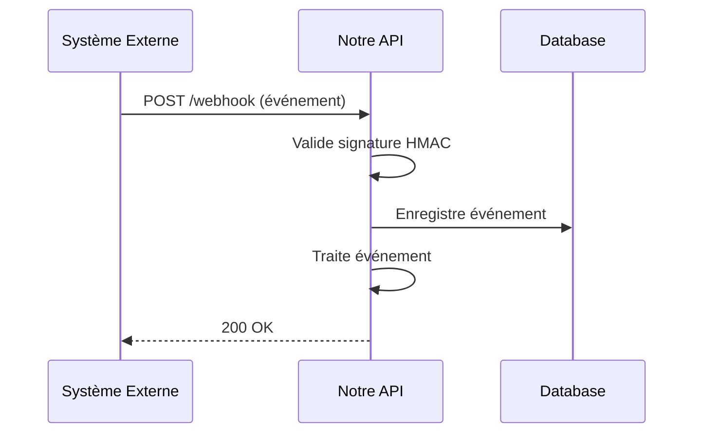

# 🪝 Webhooks Overview

Guide complet des webhooks entrants et événements asynchrones de la plateforme.

:::tip
La spécification complète AsyncAPI est disponible : [`.spec/asyncapi.yaml`](https://github.com/ak125/nestjs-remix-monorepo/blob/main/.spec/asyncapi.yaml)
:::

## 📡 Qu'est-ce qu'un Webhook ?

Un **webhook** est un **callback HTTP** envoyé par un système externe vers notre API pour notifier un événement en temps réel.



**Avantages vs Polling :**
- ⚡ **Temps réel** (0-5s latence)
- 💰 **Économique** (pas de requêtes inutiles)
- 🎯 **Scalable** (event-driven architecture)

## 🔐 Sécurité

### Vérification Signature HMAC

Tous les webhooks critiques utilisent une **signature cryptographique** :

```typescript
// Exemple : Vérifier signature Paybox
function verifyPayboxSignature(
  params: Record<string, string>,
  receivedSignature: string
): boolean {
  // 1. Construire string à signer (ordre EXACT)
  const signatureString = buildSignatureString(params);
  
  // 2. Calculer HMAC-SHA512
  const keyBuffer = Buffer.from(HMAC_KEY, 'hex');
  const hmac = crypto.createHmac('sha512', keyBuffer);
  hmac.update(signatureString);
  const calculatedSignature = hmac.digest('hex').toUpperCase();
  
  // 3. Comparer (timing-safe)
  return crypto.timingSafeEqual(
    Buffer.from(calculatedSignature),
    Buffer.from(receivedSignature)
  );
}
```

### IP Whitelisting

Pour certains webhooks (TecDoc), nous autorisons uniquement les **IPs connues** :

```typescript
const TECDOC_IPS = [
  '185.12.34.56',
  '185.12.34.57',
  '185.12.34.58'
];

function validateTecDocIP(req: Request): boolean {
  const clientIp = req.ip;
  return TECDOC_IPS.includes(clientIp);
}
```

### API Keys

Les webhooks internes (n8n) utilisent des **secrets partagés** :

```bash
POST /api/webhooks/n8n/workflow-123?secret=abc123def456
```

## 📊 Webhooks Disponibles

### 1. Paybox IPN (Paiements)

**URL** : `POST /api/paybox/callback`

Notification de paiement après transaction Paybox (succès ou échec).

```typescript
interface PayboxCallback {
  Mt: string;         // Montant en centimes (ex: "7790" = 77.90€)
  Ref: string;        // Référence commande (ex: "ORD-2024-001")
  Auto: string;       // Code autorisation banque
  Erreur: string;     // Code erreur ("00000" = succès)
  Date: string;       // Date transaction YYYYMMDD
  Heure: string;      // Heure transaction HHMMSS
  Pays: string;       // Code pays ISO (ex: "FRA")
  Carte: string;      // Type carte (ex: "VISA")
  K: string;          // Signature HMAC-SHA512
}
```

**Exemple :**
```bash
POST /api/paybox/callback?Mt=7790&Ref=ORD-2024-001&Auto=123456&Erreur=00000&K=ABC123...
```

**Traitement :**
1. Valider signature HMAC-SHA512
2. Vérifier montant correspond à commande
3. Mettre à jour statut paiement en DB
4. Mettre à jour statut commande (PENDING → PAID)
5. Envoyer email confirmation client
6. Logger dans `ic_postback` (audit)
7. Retourner HTTP 200 OK

**Codes erreur Paybox :**
- `00000` : Success ✅
- `00001` : Insufficient funds
- `00002` : Invalid card
- `00003` : Expired card
- `00004` : 3DS failed
- `00008` : Invalid CVV
- `00012` : Fraud detected
- `00017` : User cancelled
- `99999` : Timeout

**Sécurité :**
- Signature HMAC-SHA512 obligatoire
- Clé HMAC configurée back-office Paybox
- Timeout 30s (Paybox retry 3x si échec)

➡️ [Documentation complète Paybox](./paybox)

---

### 2. TecDoc Product Update

**URL** : `POST /api/integrations/tecdoc/webhook`

Notification de mise à jour catalogue TecDoc (stock, prix, nouveaux produits).

```typescript
interface TecDocUpdate {
  eventType: 'STOCK_UPDATE' | 'PRICE_CHANGE' | 'NEW_PRODUCT' | 'DISCONTINUED';
  productId: string;        // ID TecDoc (ex: "TD-123456")
  ean: string;              // Code-barres EAN13
  stock?: number;           // Quantité en stock
  priceHT?: number;         // Prix HT (si changement)
  priceOld?: number;        // Ancien prix
  currency?: string;        // Devise (EUR)
  supplier: string;         // Fournisseur (ex: "VALEO")
  timestamp: string;        // ISO 8601 date
}
```

**Exemple :**
```json
{
  "eventType": "STOCK_UPDATE",
  "productId": "TD-123456",
  "ean": "5012345678900",
  "stock": 150,
  "supplier": "VALEO",
  "timestamp": "2024-11-15T14:30:00Z"
}
```

**Traitement selon type :**
- `STOCK_UPDATE` : Mise à jour cache Redis `stock:{productId}`
- `PRICE_CHANGE` : Recalcul prix + marges
- `NEW_PRODUCT` : Ajout catalogue + indexation Meilisearch
- `DISCONTINUED` : Marquage produit non disponible

**Fréquence :**
- **Temps réel** : 50-200 webhooks/jour
- **Batch nightly** : Full sync ~10,000 produits à 02:00 UTC

**Sécurité :**
- IP Whitelisting TecDoc servers
- API Key dans header `X-TecDoc-Key`

➡️ [Documentation complète TecDoc](./tecdoc)

---

### 3. Carrier Tracking (Transporteurs)

**URL** : `POST /api/shipping/tracking/webhook`

Notification de suivi colis (DHL, Chronopost, UPS, FedEx, Colissimo).

```typescript
interface CarrierTracking {
  trackingNumber: string;   // Numéro suivi (ex: "DHL123456789")
  carrier: 'DHL' | 'CHRONOPOST' | 'COLISSIMO' | 'UPS' | 'FEDEX';
  status: 'PICKED_UP' | 'IN_TRANSIT' | 'OUT_FOR_DELIVERY' | 'DELIVERED' | 'DELIVERY_FAILED' | 'RETURNED';
  statusCode: string;       // Code interne transporteur
  location: string;         // Localisation actuelle
  timestamp: string;        // ISO 8601
  recipient?: string;       // Nom destinataire (si livré)
  signatureUrl?: string;    // URL POD (Proof of Delivery)
  estimatedDelivery?: string; // Date estimée
}
```

**Exemple (Livraison réussie) :**
```json
{
  "trackingNumber": "DHL123456789",
  "carrier": "DHL",
  "status": "DELIVERED",
  "statusCode": "OK",
  "location": "Paris 75001",
  "timestamp": "2024-11-15T16:45:00Z",
  "recipient": "Jean Dupont",
  "signatureUrl": "https://dhl.com/pod/123456789.pdf"
}
```

**Traitement :**
1. Insertion événement tracking en DB
2. Mise à jour cache Redis `tracking:{trackingNumber}`
3. Si `DELIVERED` : Email notification client
4. Si `DELIVERY_FAILED` : Alert admin + retry planification

**Sécurité :**
- API Key par transporteur (header `X-API-Key`)
- Signature HMAC optionnelle (selon transporteur)

➡️ [Documentation complète Carriers](./carriers)

---

### 4. n8n Workflows (Automatisations)

**URL** : `POST /api/webhooks/n8n/{workflowId}`

Endpoint générique pour déclencher des workflows n8n.

```typescript
interface N8nWorkflow {
  workflowId: string;       // ID workflow à déclencher
  event: string;            // Type événement (ex: "order.validated")
  data: Record<string, any>; // Payload flexible
  priority?: 'low' | 'normal' | 'high' | 'urgent';
  metadata?: {
    source: string;
    userId: string;
    timestamp: string;
  };
}
```

**Workflows actifs :**

1. **Order Fulfillment** (`order-fulfillment-v2`)
   - Trigger : `order.validated`
   - Actions : Assign warehouse, generate picking list, notify staff
   
2. **Stock Alerts** (`stock-alerts`)
   - Trigger : `stock.low`
   - Actions : Alert purchasing, suggest reorder, check supplier lead times
   
3. **Customer Segments** (`customer-segments`)
   - Trigger : `order.completed`
   - Actions : Update RFM score, assign segment, sync CRM
   
4. **Invoice Generation** (`invoice-generation`)
   - Trigger : `order.shipped`
   - Actions : Generate PDF, send email, register accounting
   
5. **Support Tickets** (`support-tickets`)
   - Trigger : `order.problem`
   - Actions : Create Zendesk ticket, notify support team, escalate if urgent

**Exemple :**
```bash
POST /api/webhooks/n8n/order-fulfillment-v2?secret=abc123def456
Content-Type: application/json

{
  "workflowId": "order-fulfillment-v2",
  "event": "order.validated",
  "data": {
    "orderId": "ORD-2024-005",
    "items": [
      {
        "productId": "PRD-001",
        "quantity": 2,
        "location": "Warehouse-A-Shelf-12"
      }
    ]
  },
  "priority": "high"
}
```

**Sécurité :**
- Webhook secret dans query param `?secret=xxx`
- IP restriction optionnelle
- Rate limiting : 100 req/min

➡️ [Documentation complète n8n](./n8n)

---

### 5. CyberPlus Callback (Legacy)

**URL** : `POST /api/payments/callback/cyberplus`

Ancien gateway de paiement CyberPlus/BNP Paribas (legacy, toujours actif).

```typescript
interface CyberPlusCallback {
  vads_amount: string;          // Montant centimes
  vads_order_id: string;        // ID commande
  vads_trans_id: string;        // ID transaction
  vads_trans_status: 'AUTHORISED' | 'REFUSED' | 'CANCELLED';
  vads_auth_result: string;     // Code résultat ("00" = success)
  signature: string;            // Signature HMAC-SHA256
}
```

**Exemple :**
```bash
POST /api/payments/callback/cyberplus
vads_amount=7790&vads_order_id=ORD-2024-003&vads_trans_status=AUTHORISED&signature=abc123...
```

**Sécurité :**
- Signature HMAC-SHA256
- IP Whitelisting BNP Paribas

## 📈 Monitoring Webhooks

### Logs & Audit

Tous les webhooks sont **loggés** dans `ic_postback` :

```sql
CREATE TABLE ic_postback (
  id SERIAL PRIMARY KEY,
  source VARCHAR(50),          -- 'paybox', 'tecdoc', 'dhl', 'n8n'
  event_type VARCHAR(50),      -- 'payment.success', 'stock.update'
  payload JSONB,               -- Full webhook payload
  signature VARCHAR(512),      -- Signature reçue
  signature_valid BOOLEAN,     -- Résultat vérification
  processed_at TIMESTAMP,      -- Date traitement
  response_code INT,           -- HTTP code retourné
  error TEXT                   -- Erreur si échec
);
```

### Métriques Prometheus

```promql
# Nombre de webhooks reçus par source
webhook_requests_total{source="paybox"} 1543
webhook_requests_total{source="tecdoc"} 87
webhook_requests_total{source="dhl"} 45

# Durée de traitement (ms)
webhook_processing_duration_ms{source="paybox", p95="450"}

# Taux d'échec
webhook_failures_total{source="paybox", reason="signature_invalid"} 2
```

### Alertes

```yaml
# Alerte si trop d'échecs webhooks
- alert: WebhookFailureRateHigh
  expr: rate(webhook_failures_total[5m]) > 0.1
  for: 5m
  annotations:
    summary: "Webhook failure rate > 10% for {{ $labels.source }}"
```

## 🧪 Test des Webhooks

### En Local (Development)

```bash
# Ngrok pour exposer localhost
ngrok http 3000

# URL publique temporaire
https://abc123.ngrok.io → localhost:3000

# Configurer webhook dans Paybox back-office
IPN URL: https://abc123.ngrok.io/api/paybox/callback
```

### Avec cURL

```bash
# Test webhook Paybox (mode test)
curl -X GET "http://localhost:3000/api/paybox/callback-test?Mt=7790&Ref=TEST-001&Auto=123456&Erreur=00000"

# Test webhook TecDoc
curl -X POST http://localhost:3000/api/integrations/tecdoc/webhook \
  -H "Content-Type: application/json" \
  -H "X-TecDoc-Key: YOUR_API_KEY" \
  -d '{
    "eventType": "STOCK_UPDATE",
    "productId": "TD-123456",
    "stock": 150
  }'
```

### Replay Webhook (Debug)

```typescript
// Rejouer un webhook depuis les logs
async function replayWebhook(postbackId: number) {
  const postback = await db.ic_postback.findUnique({
    where: { id: postbackId }
  });
  
  // Réexécuter traitement
  await processWebhook(
    postback.source,
    postback.payload
  );
}
```

## 📚 Ressources

- **[AsyncAPI Spec](/asyncapi.yaml)** - Spécification complète
- **[Paybox Doc](./paybox)** - Webhooks paiement
- **[TecDoc Doc](./tecdoc)** - Intégration catalogue
- **[Carriers Doc](./carriers)** - Tracking colis
- **[n8n Doc](./n8n)** - Automatisations

## 🆘 Support

- **Webhook down ?** → [status.autoparts.com](https://status.autoparts.com)
- **Signature invalide ?** → [support@autoparts.com](mailto:support@autoparts.com)
- **Rate limit dépassé ?** → Upgrade plan ou contactez-nous

---

**Version** : 1.0.0  
**Dernière mise à jour** : 15 novembre 2025
