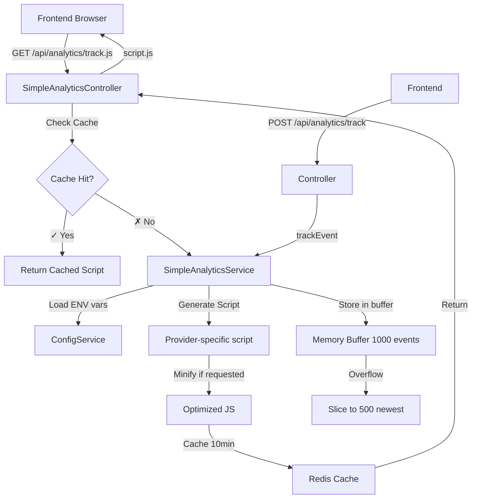

# Module Analytics - Spécification Technique

## 1. Vue d'ensemble

### Description
Module global d'analytics pour le tracking multi-provider (Google Analytics, Matomo, Plausible, Custom) avec configuration flexible, scripts optimisés, et compatibilité legacy avec les anciens endpoints PHP (`analytics.track.php`, `v7.analytics.track.php`).

### Objectifs
- **Multi-provider** : Support Google Analytics, Matomo, Plausible, et scripts custom
- **Scripts optimisés** : Génération de scripts minifiés avec async/defer
- **Compatibilité legacy** : Endpoints compatibles avec anciens `*.track.php`
- **GDPR compliant** : Anonymisation IP, respect du consentement
- **Configuration flexible** : Variables d'environnement, pas de tables dédiées
- **Performance** : Cache Redis (10 minutes TTL), buffer événements en mémoire

### Contexte technique
- **Architecture** : Module NestJS global (@Global decorator)
- **Configuration** : Variables d'environnement uniquement (pas de base de données)
- **Cache** : Redis pour configs et scripts générés (TTL: 10 minutes)
- **Buffer** : Mémoire pour 1000 événements max (slice à 500 si dépassé)
- **Endpoints legacy** : `/api/analytics/track.php`, `/api/analytics/track.min.php`, `/api/analytics/v7.track.php`

---

## 2. Objectifs détaillés

### Fonctionnels
1. **Configuration multi-provider**
   - Google Analytics (GA4) avec anonymisation IP
   - Matomo (self-hosted ou cloud)
   - Plausible (privacy-first)
   - Scripts custom avec URL configurable

2. **Génération scripts tracking**
   - Scripts optimisés (minified, async, defer)
   - Versions multiples (v7, latest)
   - Compatibilité anciennes URLs PHP
   - Configuration GDPR intégrée

3. **Tracking événements**
   - Événements structurés (category, action, label, value)
   - Custom data arbitraire (JSON)
   - Buffer mémoire 1000 événements
   - Reporting basique (top events, total, providers)

4. **Endpoints legacy**
   - `/api/analytics/track.php` → retourne script JS
   - `/api/analytics/track.min.php` → version minifiée
   - `/api/analytics/v7.track.php` → version 7 spécifique
   - `/api/analytics/track.js` → moderne équivalent

5. **Health checks & stats**
   - `/api/analytics/health` → statut service
   - `/api/analytics/stats` → métriques buffer
   - `/api/analytics/config` → config active

### Non-fonctionnels
- **Performance** :
  - Génération script: <50ms (cache hit), <200ms (cache miss)
  - Tracking événement: <10ms (async, fire-and-forget)
  - Health check: <50ms
- **Cache** :
  - TTL: 600s (10 minutes) pour configs et scripts
  - Invalidation: automatique après expiration ou changement config
- **Disponibilité** : 99.9% (module global, toujours disponible)
- **GDPR** :
  - Anonymisation IP par défaut
  - Respect consentement utilisateur
  - Pas de cookies sans consentement

---

## 3. Hors périmètre

- ❌ **Stockage événements en base de données** → Buffer mémoire uniquement
- ❌ **Dashboards analytics avancés** → Utiliser Google Analytics / Matomo
- ❌ **Heatmaps / session replay** → Outils externes (Hotjar, Clarity)
- ❌ **A/B testing** → Module dédié ou service externe
- ❌ **Attribution marketing** → Google Analytics avec UTM tags
- ❌ **Real-time analytics** → Polling manuel ou WebSockets externes
- ❌ **Data warehouse integration** → ETL séparé

---

## 4. Architecture

### Structure du module

```
backend/src/modules/analytics/
├── analytics.module.ts                 # Module global (@Global)
├── controllers/
│   └── simple-analytics.controller.ts  # Endpoints REST + legacy PHP
└── services/
    ├── simple-analytics.service.ts     # Service principal
    └── enhanced-analytics.service.ts   # Service avancé (non utilisé)
```

### Configuration module

```typescript
@Global()  // Module disponible dans toute l'application
@Module({
  imports: [
    ConfigModule,      // Variables d'environnement
    CacheModule,       // Redis cache
    DatabaseModule,    // Supabase (optionnel)
  ],
  controllers: [SimpleAnalyticsController],
  providers: [SimpleAnalyticsService],
  exports: [SimpleAnalyticsService],  // Exporté pour utilisation dans autres modules
})
export class AnalyticsModule {
  static forTesting() {
    // Mock pour tests
    return {
      module: AnalyticsModule,
      providers: [
        {
          provide: SimpleAnalyticsService,
          useValue: { /* mocks */ },
        },
      ],
    };
  }
}
```

### Flux de données



---

## 5. Modèle de données

### Interfaces TypeScript

```typescript
// Configuration analytics
export interface AnalyticsConfig {
  provider: 'google' | 'matomo' | 'plausible' | 'custom';
  trackingId: string;                    // GA4 ID, Matomo site ID, etc.
  domain?: string;                       // Plausible domain
  scriptUrl?: string;                    // Custom script URL
  config: Record<string, any>;           // Provider-specific config
  anonymizeIp: boolean;                  // GDPR: anonymize IP
  trackLoggedInUsers: boolean;           // Track authenticated users
  customDimensions?: Record<string, any>; // Custom dimensions
  excludedPaths?: string[];              // Paths to exclude
  isActive: boolean;                     // Enable/disable tracking
}

// Événement analytics
export interface AnalyticsEvent {
  category: string;       // Ex: "Product", "User", "Cart"
  action: string;         // Ex: "View", "Add", "Purchase"
  label?: string;         // Ex: "Alternateur Bosch ALT-001"
  value?: number;         // Ex: 125.50 (price)
  customData?: Record<string, any>;  // Arbitrary JSON data
  timestamp: Date;
}

// Métriques analytics
export interface AnalyticsMetrics {
  totalEvents: number;
  topEvents: Array<{
    category: string;
    action: string;
    count: number;
    percentage: number;
  }>;
  providersUsed: string[];
  lastEventTime: Date | null;
}

// Configuration script
export interface ScriptConfig {
  provider: string;       // 'google' | 'matomo' | 'plausible' | 'custom' | 'auto'
  minified: boolean;      // Minify JS
  async: boolean;         // Async loading
  defer: boolean;         // Defer loading
  version: string;        // 'v7' | 'latest'
}
```

### Buffer événements (mémoire)

```typescript
// SimpleAnalyticsService
private eventsBuffer: AnalyticsEvent[] = [];

// Buffer management
async trackEvent(category: string, action: string, ...) {
  const event: AnalyticsEvent = {
    category,
    action,
    label,
    value,
    customData,
    timestamp: new Date(),
  };

  // Ajouter au buffer
  this.eventsBuffer.push(event);

  // Limiter à 1000 événements
  if (this.eventsBuffer.length > 1000) {
    this.eventsBuffer = this.eventsBuffer.slice(-500); // Garder les 500 plus récents
  }
}
```

### Pas de tables SQL
Le module analytics ne crée **aucune table** en base de données. Toute la configuration vient des variables d'environnement, et les événements sont stockés en mémoire (buffer volatile).

---

## 6. API Endpoints

### 6.1 Scripts tracking (compatibilité legacy)

#### GET `/api/analytics/track.js`
Script tracking moderne (remplace `track.php`).

**Query Parameters:**
- `min` (string, optional) - '1' ou 'true' pour minifier
- `v` (string, optional) - Version du script (default: 'v7')

**Headers:**
- `Content-Type: application/javascript`
- `Cache-Control: public, max-age=3600` (1h cache browser)

**Response 200:**
```javascript
// Google Analytics example
(function() {
  window.dataLayer = window.dataLayer || [];
  function gtag(){dataLayer.push(arguments);}
  gtag('js', new Date());
  gtag('config', 'G-XXXXXXXXXX', {
    'anonymize_ip': true,
    'cookie_flags': 'SameSite=None;Secure'
  });
})();
```

**Performance:** p50: <50ms (cache), p95: <200ms (génération)

---

#### GET `/api/analytics/track.php` ⚠️ LEGACY
Endpoint legacy compatible avec ancien système PHP.

**Query:** `min=1`, `v=v7`

**Response:** Identique à `/track.js` (retourne JavaScript, pas PHP)

**Code exemple:**
```typescript
// SimpleAnalyticsController
@Get('track.php')
@Header('Content-Type', 'application/javascript')
@Header('Cache-Control', 'public, max-age=3600')
async getTrackingScriptLegacy(
  @Query('min') min?: string,
  @Query('v') version?: string,
): Promise<string> {
  const isMinified = min === '1' || min === 'true';
  const scriptVersion = version || 'v7';

  const result = await this.getTrackingScript(
    isMinified ? 'true' : 'false',
    scriptVersion,
  );

  // Retourner le script directement comme le faisait le PHP
  return result.script;
}
```

---

#### GET `/api/analytics/track.min.php` ⚠️ LEGACY
Version minifiée du script (legacy).

**Response:** Script minifié automatiquement

---

#### GET `/api/analytics/v7.track.php` ⚠️ LEGACY
Version 7 spécifique du script (legacy).

**Query:** `min=1`

---

### 6.2 Configuration & Stats

#### GET `/api/analytics/config`
Récupérer la configuration analytics active.

**Response 200:**
```json
{
  "provider": "google",
  "trackingId": "G-XXXXXXXXXX",
  "domain": "example.com",
  "anonymizeIp": true,
  "trackLoggedInUsers": false,
  "excludedPaths": ["/admin", "/api"],
  "isActive": true
}
```

**Code exemple:**
```typescript
// SimpleAnalyticsService.getConfig()
async getConfig(): Promise<AnalyticsConfig | null> {
  const cacheKey = `analytics:config:env`;

  // Cache check
  const cached = await this.cacheService.get<AnalyticsConfig>(cacheKey);
  if (cached) return cached;

  // Load from environment variables
  const provider = this.configService.get<string>('ANALYTICS_PROVIDER', 'google');
  
  let trackingId = '';
  switch (provider) {
    case 'google':
      trackingId = this.configService.get<string>('ANALYTICS_GOOGLE_ID', '');
      break;
    case 'matomo':
      trackingId = this.configService.get<string>('ANALYTICS_MATOMO_SITE_ID', '');
      break;
    case 'plausible':
      trackingId = this.configService.get<string>('ANALYTICS_PLAUSIBLE_DOMAIN', '');
      break;
  }

  if (!trackingId) {
    this.logger.warn(`No tracking ID for provider: ${provider}`);
    return null;
  }

  const config: AnalyticsConfig = {
    provider: provider as any,
    trackingId,
    anonymizeIp: this.configService.get<boolean>('ANALYTICS_ANONYMIZE_IP', true),
    trackLoggedInUsers: this.configService.get<boolean>('ANALYTICS_TRACK_LOGGED_USERS', false),
    isActive: this.configService.get<boolean>('ANALYTICS_ENABLED', false),
    // ... autres propriétés
  };

  // Cache 10 minutes
  await this.cacheService.set(cacheKey, config, 600);
  
  return config;
}
```

---

#### GET `/api/analytics/health`
Health check du service analytics.

**Response 200:**
```json
{
  "status": "OK",
  "timestamp": "2025-11-18T10:00:00Z",
  "analytics": {
    "configLoaded": true,
    "totalEvents": 245,
    "provider": "google",
    "isActive": true,
    "lastEventTime": "2025-11-18T09:58:30Z"
  }
}
```

**Performance:** p50: <30ms

---

#### GET `/api/analytics/stats`
Statistiques du service (buffer mémoire).

**Response 200:**
```json
{
  "configLoaded": true,
  "totalEvents": 245,
  "provider": "google",
  "isActive": true,
  "lastEventTime": "2025-11-18T09:58:30Z",
  "bufferSize": 245,
  "maxBufferSize": 1000
}
```

---

### 6.3 Tracking événements

#### POST `/api/analytics/track`
Enregistrer un événement analytics.

**Body:**
```json
{
  "category": "Product",
  "action": "View",
  "label": "Alternateur Bosch ALT-001",
  "value": 125.50,
  "customData": {
    "productId": "product-uuid",
    "userId": "user-uuid",
    "source": "search"
  }
}
```

**Response 201:**
```json
{
  "success": true,
  "timestamp": "2025-11-18T10:00:00Z"
}
```

**Performance:** p50: <10ms (async)

**Code exemple:**
```typescript
// SimpleAnalyticsController
@Post('track')
@HttpCode(HttpStatus.CREATED)
async trackEvent(@Body() eventData: TrackEventDto) {
  await this.analyticsService.trackEvent(
    eventData.category,
    eventData.action,
    eventData.label,
    eventData.value,
    eventData.customData,
  );

  return {
    success: true,
    timestamp: new Date().toISOString(),
  };
}

// SimpleAnalyticsService.trackEvent()
async trackEvent(
  category: string,
  action: string,
  label?: string,
  value?: number,
  customData?: Record<string, any>,
) {
  const config = await this.getConfig();
  if (!config || !config.isActive) return;

  const event: AnalyticsEvent = {
    category,
    action,
    label,
    value,
    customData,
    timestamp: new Date(),
  };

  // Buffer en mémoire
  this.eventsBuffer.push(event);
  
  // Limiter taille buffer
  if (this.eventsBuffer.length > 1000) {
    this.eventsBuffer = this.eventsBuffer.slice(-500);
  }

  this.logger.debug(`Event tracked: ${category}:${action}`);
}
```

---

#### POST `/api/analytics/report`
Endpoint batch pour envoi groupé d'événements (compatibilité existant).

**Body:**
```json
{
  "type": "pageviews",
  "events": [
    {
      "category": "Product",
      "action": "View",
      "label": "Product Page",
      "data": { "productId": "123" }
    },
    {
      "category": "Cart",
      "action": "Add",
      "value": 50.00
    }
  ],
  "sessionId": "session-uuid",
  "timestamp": "2025-11-18T10:00:00Z"
}
```

**Response 200:**
```json
{
  "success": true,
  "processed": 2,
  "timestamp": "2025-11-18T10:00:05Z"
}
```

**Code exemple:**
```typescript
@Post('report')
async handleAnalyticsReport(
  @Body() batch: {
    type: string;
    events: any[];
    sessionId: string;
    timestamp: string;
  },
) {
  this.logger.log(`📊 Analytics batch received: ${batch.events.length} events`);

  // Traiter chaque événement du batch
  const promises = batch.events.map((event) =>
    this.analyticsService.trackEvent(
      event.category || 'batch',
      event.action || 'unknown',
      event.label,
      event.value,
      {
        ...event.data,
        sessionId: batch.sessionId,
        batchType: batch.type,
      },
    ),
  );

  await Promise.all(promises);

  return {
    success: true,
    processed: batch.events.length,
    timestamp: new Date().toISOString(),
  };
}
```

---

#### GET `/api/analytics/metrics`
Récupérer les métriques du buffer.

**Response 200:**
```json
{
  "totalEvents": 245,
  "topEvents": [
    {
      "category": "Product",
      "action": "View",
      "count": 120,
      "percentage": 49
    },
    {
      "category": "Cart",
      "action": "Add",
      "count": 45,
      "percentage": 18
    }
  ],
  "providersUsed": ["google"],
  "lastEventTime": "2025-11-18T09:58:30Z"
}
```

---

### 6.4 Cache management

#### POST `/api/analytics/cache/clear`
Vider le cache analytics (config + scripts).

**Response 200:**
```json
{
  "message": "Analytics cache cleared successfully",
  "timestamp": "2025-11-18T10:00:00Z"
}
```

---

#### POST `/api/analytics/events/clear`
Vider le buffer d'événements.

**Response 200:**
```json
{
  "message": "Analytics events buffer cleared successfully",
  "timestamp": "2025-11-18T10:00:00Z"
}
```

---

## 7. Sécurité

### Pas d'authentification requise
Les endpoints analytics sont **publics** (pas de guards) car ils doivent être accessibles depuis le frontend public.

```typescript
@Controller('api/analytics')
export class SimpleAnalyticsController {
  // Pas de @UseGuards() → Endpoints publics
}
```

### Protection CSRF
Scripts générés avec configuration GDPR intégrée.

```typescript
// SimpleAnalyticsService
private enhanceScriptWithGDPR(script: string, config: AnalyticsConfig): string {
  if (config.anonymizeIp) {
    script += `\n// GDPR: IP anonymization enabled`;
  }

  if (config.excludedPaths?.length > 0) {
    script += `\n// GDPR: Excluded paths: ${config.excludedPaths.join(', ')}`;
  }

  return script;
}
```

### Validation entrées

```typescript
// DTOs Zod
export interface TrackEventDto {
  category: string;      // Required, max 100 chars
  action: string;        // Required, max 100 chars
  label?: string;        // Optional, max 500 chars
  value?: number;        // Optional, positive number
  customData?: Record<string, any>;  // Optional JSON
}
```

### Rate Limiting
Non implémenté car événements fire-and-forget (async, non-blocking).

### Anonymisation IP (GDPR)

```typescript
// Google Analytics config
gtag('config', 'G-XXXXXXXXXX', {
  'anonymize_ip': true,  // Anonymize IP addresses
  'cookie_flags': 'SameSite=None;Secure',
  'allow_google_signals': false,  // Disable advertising features
});
```

---

## 8. Performance

### Objectifs de performance

| Endpoint | p50 | p95 | p99 | Notes |
|----------|-----|-----|-----|-------|
| GET /track.js | <50ms | <150ms | <300ms | Cache hit: <50ms |
| POST /track | <10ms | <30ms | <50ms | Fire-and-forget |
| GET /health | <30ms | <80ms | <150ms | Léger |
| GET /metrics | <50ms | <100ms | <200ms | Buffer scan |

### Cache Redis

```typescript
// Configuration cache (10 minutes)
private readonly cacheTtl = 600;

async getConfig(): Promise<AnalyticsConfig> {
  const cacheKey = `analytics:config:env`;
  
  const cached = await this.cacheService.get<AnalyticsConfig>(cacheKey);
  if (cached) {
    this.logger.debug('Config from cache');
    return cached;
  }

  const config = this.loadFromEnv();
  
  // Cache 10 minutes
  await this.cacheService.set(cacheKey, config, this.cacheTtl);
  
  return config;
}
```

### Buffer événements optimisé

```typescript
// Limiter à 1000 événements max
private eventsBuffer: AnalyticsEvent[] = [];

async trackEvent(...) {
  this.eventsBuffer.push(event);

  // Slice si > 1000
  if (this.eventsBuffer.length > 1000) {
    this.eventsBuffer = this.eventsBuffer.slice(-500);  // O(n) operation
  }
}
```

### Scripts minifiés

```typescript
private minifyScript(script: string): string {
  return script
    .replace(/\/\*[\s\S]*?\*\/|\/\/.*/g, '')  // Remove comments
    .replace(/\s+/g, ' ')                      // Collapse whitespace
    .replace(/\s*([{}();,:])\s*/g, '$1')       // Remove space around punctuation
    .trim();
}
```

### Cache navigateur (1h)

```typescript
@Get('track.js')
@Header('Content-Type', 'application/javascript')
@Header('Cache-Control', 'public, max-age=3600')  // 1 heure
async getTrackingScript() {
  // ...
}
```

---

## 9. Tests

### Tests unitaires

```typescript
// analytics/services/simple-analytics.service.spec.ts
describe('SimpleAnalyticsService', () => {
  let service: SimpleAnalyticsService;
  let cacheService: CacheService;
  let configService: ConfigService;

  beforeEach(async () => {
    const module: TestingModule = await Test.createTestingModule({
      providers: [
        SimpleAnalyticsService,
        {
          provide: CacheService,
          useValue: {
            get: jest.fn(),
            set: jest.fn(),
            del: jest.fn(),
          },
        },
        {
          provide: ConfigService,
          useValue: {
            get: jest.fn(),
          },
        },
      ],
    }).compile();

    service = module.get<SimpleAnalyticsService>(SimpleAnalyticsService);
    cacheService = module.get<CacheService>(CacheService);
    configService = module.get<ConfigService>(ConfigService);
  });

  describe('getConfig', () => {
    it('devrait charger la config depuis le cache si disponible', async () => {
      const mockConfig: AnalyticsConfig = {
        provider: 'google',
        trackingId: 'G-TEST123',
        isActive: true,
        anonymizeIp: true,
        trackLoggedInUsers: false,
        config: {},
      };

      jest.spyOn(cacheService, 'get').mockResolvedValue(mockConfig);

      const result = await service.getConfig();

      expect(result).toEqual(mockConfig);
      expect(cacheService.get).toHaveBeenCalledWith('analytics:config:env');
    });

    it('devrait charger depuis les variables d\'environnement si cache vide', async () => {
      jest.spyOn(cacheService, 'get').mockResolvedValue(null);
      jest.spyOn(configService, 'get')
        .mockReturnValueOnce('google')         // ANALYTICS_PROVIDER
        .mockReturnValueOnce('G-TEST123');     // ANALYTICS_GOOGLE_ID

      const result = await service.getConfig();

      expect(result.provider).toBe('google');
      expect(result.trackingId).toBe('G-TEST123');
      expect(cacheService.set).toHaveBeenCalledWith(
        'analytics:config:env',
        expect.any(Object),
        600,  // 10 minutes TTL
      );
    });

    it('devrait retourner null si pas de tracking ID configuré', async () => {
      jest.spyOn(cacheService, 'get').mockResolvedValue(null);
      jest.spyOn(configService, 'get')
        .mockReturnValueOnce('google')
        .mockReturnValueOnce('');  // Pas de tracking ID

      const result = await service.getConfig();

      expect(result).toBeNull();
    });
  });

  describe('trackEvent', () => {
    it('devrait ajouter un événement au buffer', async () => {
      const mockConfig: AnalyticsConfig = {
        provider: 'google',
        trackingId: 'G-TEST123',
        isActive: true,
        anonymizeIp: true,
        trackLoggedInUsers: false,
        config: {},
      };

      jest.spyOn(service as any, 'getConfig').mockResolvedValue(mockConfig);

      await service.trackEvent('Product', 'View', 'Alternateur', 125.50);

      const metrics = await service.getMetrics();
      expect(metrics.totalEvents).toBe(1);
    });

    it('devrait limiter le buffer à 1000 événements', async () => {
      const mockConfig: AnalyticsConfig = {
        provider: 'google',
        trackingId: 'G-TEST123',
        isActive: true,
        anonymizeIp: true,
        trackLoggedInUsers: false,
        config: {},
      };

      jest.spyOn(service as any, 'getConfig').mockResolvedValue(mockConfig);

      // Ajouter 1100 événements
      for (let i = 0; i < 1100; i++) {
        await service.trackEvent('Test', 'Action', `Event ${i}`);
      }

      const metrics = await service.getMetrics();
      expect(metrics.totalEvents).toBeLessThanOrEqual(1000);
    });

    it('ne devrait rien faire si analytics désactivé', async () => {
      const mockConfig: AnalyticsConfig = {
        provider: 'google',
        trackingId: 'G-TEST123',
        isActive: false,  // Désactivé
        anonymizeIp: true,
        trackLoggedInUsers: false,
        config: {},
      };

      jest.spyOn(service as any, 'getConfig').mockResolvedValue(mockConfig);

      await service.trackEvent('Product', 'View');

      const metrics = await service.getMetrics();
      expect(metrics.totalEvents).toBe(0);
    });
  });

  describe('getTrackingScript', () => {
    it('devrait générer un script Google Analytics', async () => {
      const mockConfig: AnalyticsConfig = {
        provider: 'google',
        trackingId: 'G-TEST123',
        isActive: true,
        anonymizeIp: true,
        trackLoggedInUsers: false,
        config: {},
      };

      jest.spyOn(service as any, 'getConfig').mockResolvedValue(mockConfig);

      const script = await service.getTrackingScript({
        provider: 'google',
        minified: false,
        async: true,
        defer: true,
        version: 'latest',
      });

      expect(script).toContain('gtag');
      expect(script).toContain('G-TEST123');
      expect(script).toContain('anonymize_ip');
    });

    it('devrait retourner un commentaire si analytics désactivé', async () => {
      jest.spyOn(service as any, 'getConfig').mockResolvedValue(null);

      const script = await service.getTrackingScript();

      expect(script).toContain('<!-- Analytics disabled');
    });

    it('devrait minifier le script si demandé', async () => {
      const mockConfig: AnalyticsConfig = {
        provider: 'google',
        trackingId: 'G-TEST123',
        isActive: true,
        anonymizeIp: true,
        trackLoggedInUsers: false,
        config: {},
      };

      jest.spyOn(service as any, 'getConfig').mockResolvedValue(mockConfig);

      const scriptFull = await service.getTrackingScript({
        provider: 'google',
        minified: false,
        async: true,
        defer: true,
        version: 'latest',
      });

      const scriptMin = await service.getTrackingScript({
        provider: 'google',
        minified: true,
        async: true,
        defer: true,
        version: 'latest',
      });

      expect(scriptMin.length).toBeLessThan(scriptFull.length);
    });
  });
});
```

### Tests d'intégration

```typescript
// analytics/controllers/simple-analytics.controller.spec.ts
describe('SimpleAnalyticsController (e2e)', () => {
  let app: INestApplication;

  beforeAll(async () => {
    const moduleFixture: TestingModule = await Test.createTestingModule({
      imports: [AnalyticsModule.forTesting()],
    }).compile();

    app = moduleFixture.createNestApplication();
    await app.init();
  });

  describe('GET /api/analytics/track.js', () => {
    it('devrait retourner un script JavaScript', async () => {
      const response = await request(app.getHttpServer())
        .get('/api/analytics/track.js')
        .expect(200);

      expect(response.headers['content-type']).toContain('application/javascript');
      expect(response.headers['cache-control']).toContain('max-age=3600');
    });

    it('devrait minifier le script si min=1', async () => {
      const responseFull = await request(app.getHttpServer())
        .get('/api/analytics/track.js')
        .expect(200);

      const responseMin = await request(app.getHttpServer())
        .get('/api/analytics/track.js?min=1')
        .expect(200);

      expect(responseMin.text.length).toBeLessThan(responseFull.text.length);
    });
  });

  describe('POST /api/analytics/track', () => {
    it('devrait accepter un événement valide', async () => {
      const event = {
        category: 'Product',
        action: 'View',
        label: 'Test Product',
        value: 99.99,
      };

      const response = await request(app.getHttpServer())
        .post('/api/analytics/track')
        .send(event)
        .expect(201);

      expect(response.body.success).toBe(true);
      expect(response.body.timestamp).toBeDefined();
    });

    it('devrait rejeter un événement invalide', async () => {
      const invalidEvent = {
        // Manque category et action
        label: 'Test',
      };

      await request(app.getHttpServer())
        .post('/api/analytics/track')
        .send(invalidEvent)
        .expect(400);
    });
  });

  describe('GET /api/analytics/health', () => {
    it('devrait retourner le statut du service', async () => {
      const response = await request(app.getHttpServer())
        .get('/api/analytics/health')
        .expect(200);

      expect(response.body.status).toBe('OK');
      expect(response.body.analytics).toBeDefined();
      expect(response.body.analytics.configLoaded).toBeDefined();
    });
  });

  afterAll(async () => {
    await app.close();
  });
});
```

---

## 10. Dépendances

### Modules NestJS internes

```typescript
@Global()
@Module({
  imports: [
    ConfigModule,      // Variables d'environnement
    CacheModule,       // Redis cache
    DatabaseModule,    // Supabase (optionnel)
  ],
  // ...
})
```

### Packages npm

```json
{
  "dependencies": {
    "@nestjs/common": "^10.3.0",
    "@nestjs/core": "^10.3.0",
    "@nestjs/config": "^3.1.1",
    "cache-manager": "^5.3.2"
  }
}
```

### Services externes

- **Redis** : Cache configurations et scripts (optionnel mais recommandé)
- **Google Analytics** : Provider externe (si configuré)
- **Matomo** : Provider externe (si configuré)
- **Plausible** : Provider externe (si configuré)

### Variables d'environnement

```bash
# .env
ANALYTICS_ENABLED=true
ANALYTICS_PROVIDER=google  # google | matomo | plausible | custom

# Google Analytics
ANALYTICS_GOOGLE_ID=G-XXXXXXXXXX

# Matomo
ANALYTICS_MATOMO_SITE_ID=1
ANALYTICS_MATOMO_URL=https://matomo.example.com

# Plausible
ANALYTICS_PLAUSIBLE_DOMAIN=example.com

# Custom
ANALYTICS_TRACKING_ID=custom-id
ANALYTICS_SCRIPT_URL=https://example.com/analytics.js

# Options
ANALYTICS_ANONYMIZE_IP=true
ANALYTICS_TRACK_LOGGED_USERS=false
ANALYTICS_EXCLUDED_PATHS=/admin,/api
```

---

## 11. Critères d'acceptation

### Fonctionnels
- ✅ **Scripts tracking** générés pour Google Analytics, Matomo, Plausible
- ✅ **Compatibilité legacy** : `/track.php`, `/track.min.php`, `/v7.track.php` fonctionnels
- ✅ **Configuration** chargée depuis variables d'environnement + cache 10min
- ✅ **Tracking événements** stocké en buffer mémoire (max 1000, slice à 500)
- ✅ **Métriques** : top events, total, provider, last event time
- ✅ **Health check** répond en <50ms avec statut service
- ✅ **GDPR compliant** : anonymization IP par défaut, cookies SameSite

### Non-fonctionnels
- ✅ **Performance** :
  - Script generation: p50 <50ms (cache), p95 <200ms (no cache)
  - Event tracking: p50 <10ms (async)
  - Health check: p50 <30ms
- ✅ **Cache** :
  - TTL: 600s (10 minutes)
  - Hit rate: >80% pour scripts fréquemment demandés
- ✅ **Disponibilité** : 99.9% (module global)
- ✅ **Sécurité** :
  - Endpoints publics (requis pour frontend)
  - Validation Zod sur événements
  - Anonymisation IP configurée

### Critères de qualité
- ✅ **Module global** : `@Global()` decorator, exporté dans toute l'app
- ✅ **Scripts optimisés** : Minification, async, defer
- ✅ **Logging** : Debug pour cache hits, événements trackés
- ✅ **Tests** : Couverture >75% pour service principal
- ✅ **Documentation** : Variables d'environnement documentées

---

## 12. Déploiement

### Configuration production

```bash
# .env.production
ANALYTICS_ENABLED=true
ANALYTICS_PROVIDER=google
ANALYTICS_GOOGLE_ID=G-PROD123456
ANALYTICS_ANONYMIZE_IP=true
ANALYTICS_TRACK_LOGGED_USERS=false
ANALYTICS_EXCLUDED_PATHS=/admin,/api
REDIS_URL=redis://redis:6379
```

### Health check production

```bash
# Vérifier que le service fonctionne
curl https://api.example.com/api/analytics/health

# Vérifier script tracking
curl https://api.example.com/api/analytics/track.js
```

### Monitoring

```typescript
// Métriques Prometheus
import { register, Counter, Histogram } from 'prom-client';

const analyticsEventsTotal = new Counter({
  name: 'analytics_events_total',
  help: 'Total analytics events tracked',
  labelNames: ['category', 'action'],
});

const analyticsScriptGeneration = new Histogram({
  name: 'analytics_script_generation_seconds',
  help: 'Script generation duration',
  buckets: [0.01, 0.05, 0.1, 0.2, 0.5, 1],
});
```

---

## 13. Documentation associée

- [Frontend Integration Guide](../../frontend/ANALYTICS-INTEGRATION.md) - Intégration scripts tracking
- [GDPR Compliance Guide](../../GDPR-ANALYTICS.md) - Conformité RGPD
- [Cache Strategy](../../CACHE-STRATEGY.md) - Stratégies cache Redis
- [Google Analytics Setup](../../GOOGLE-ANALYTICS-SETUP.md) - Configuration GA4
- [Matomo Setup](../../MATOMO-SETUP.md) - Configuration Matomo

---

## 14. Problèmes connus

### 1. Buffer volatile (perte au redémarrage)
**Impact:** Moyen  
**Workaround:** Les événements sont principalement trackés côté frontend (Google Analytics, Matomo). Le buffer backend est pour monitoring interne seulement.

### 2. Pas de persistance base de données
**Impact:** Faible  
**Décision:** Architecture volontaire (simple, performante). Analytics réels dans Google Analytics/Matomo.

### 3. Limite 1000 événements en mémoire
**Impact:** Faible  
**Workaround:** Slice automatique à 500 si dépassé. Suffisant pour monitoring basique.

### 4. Scripts générés statiques (pas de templating avancé)
**Impact:** Faible  
**Amélioration future:** Templating engine pour scripts plus complexes

---

## 15. Améliorations futures

### Phase 2 - Q1 2026
- [ ] **Persistance PostgreSQL** : Table `analytics_events` pour historique long terme
- [ ] **Dashboard analytics** : Interface admin avec graphiques
- [ ] **Export événements** : CSV, JSON pour analyse
- [ ] **Webhooks** : Envoyer événements vers systèmes externes

### Phase 3 - Q2 2026
- [ ] **Real-time analytics** : WebSockets pour updates live
- [ ] **Segmentation** : Analyse par user, device, location
- [ ] **A/B testing** : Intégration tests multivariés
- [ ] **Attribution** : Tracking campagnes marketing

### Optimisations techniques
- [ ] **Worker queue** : Traitement asynchrone événements (Bull/Redis)
- [ ] **Batching** : Envoi groupé vers providers externes
- [ ] **Retry logic** : Réessayer envois échoués
- [ ] **Rate limiting** : Protection contre spam événements

---

**Dernière mise à jour:** 2025-11-18  
**Version:** 1.0.0  
**Auteur:** Équipe Backend  
**Statut:** ✅ Production
