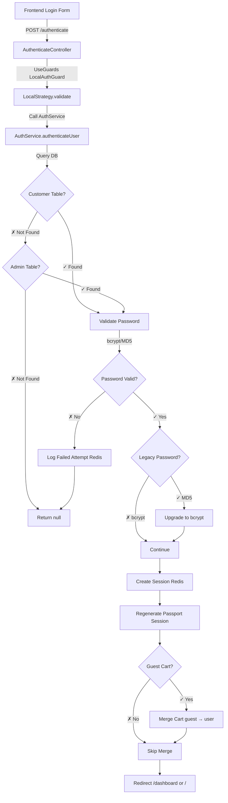

# Module Auth - Spécification Technique

## 1. Vue d'ensemble

### Description
Module d'authentification et d'autorisation complet pour customers et staff admin. Gère l'inscription, la connexion, les sessions, les guards NestJS, la validation JWT, et le contrôle d'accès basé sur les niveaux utilisateur (RBAC simple). Supporte les mots de passe legacy (MD5+crypt) avec upgrade automatique vers bcrypt.

### Objectifs
- **Authentification multi-table** : Customers (`___xtr_customer`) et Staff admin (`___config_admin`)
- **Mots de passe sécurisés** : bcrypt moderne + support legacy MD5 avec upgrade automatique
- **Sessions Passport** : Session-based auth avec Redis storage
- **Guards NestJS** : `AuthenticatedGuard`, `IsAdminGuard`, `LocalAuthGuard`, `OptionalAuthGuard`
- **RBAC simple** : Niveaux utilisateur 1-10 (7+ = admin)
- **Fusion panier** : Merge automatique panier invité → utilisateur authentifié
- **Protection brute-force** : Rate limiting 5 tentatives/15min via Redis
- **Audit trail** : Historique connexions (succès/échecs) dans Redis

### Contexte technique
- **Architecture** : NestJS + Passport.js + express-session
- **Stratégie** : Local strategy (email/password)
- **Sessions** : Redis storage (TTL: 7 jours)
- **Tokens** : JWT optionnel (7 jours), principal = sessions
- **Password hashing** : bcrypt (rounds: 10) via `PasswordCryptoService`
- **Guards** : Implémentent `CanActivate` pour protection routes

---

## 2. Objectifs détaillés

### Fonctionnels
1. **Inscription (register)**
   - Création compte customer uniquement (pas admin)
   - Validation email unique
   - Hash bcrypt automatique
   - Connexion automatique après inscription
   - Fusion panier invité → nouveau compte

2. **Connexion (login)**
   - Support customers + staff admin (2 tables)
   - Validation email/password
   - Upgrade automatique mots de passe legacy
   - Protection brute-force (5 tentatives/15min)
   - Sessions Redis (7 jours)
   - Fusion panier invité → utilisateur
   - Historique connexions (audit trail)

3. **Déconnexion (logout)**
   - Destruction session Passport
   - Nettoyage session Redis
   - Logging déconnexion

4. **Guards protection**
   - `AuthenticatedGuard` : Vérifier session active
   - `IsAdminGuard` : Vérifier niveau ≥ 7
   - `LocalAuthGuard` : Authentification email/password
   - `OptionalAuthGuard` : Auth optionnelle (public + private content)

5. **Gestion profil**
   - Mise à jour infos (prénom, nom, email, tél)
   - Changement mot de passe (avec validation ancien)
   - Invalidation cache après modification

6. **Contrôle d'accès modules**
   - Vérifier permissions par module (commercial, seo, admin, etc.)
   - Matrice permissions basée niveau utilisateur
   - API `checkModuleAccess(userId, module, action)`

### Non-fonctionnels
- **Performance** :
  - Login: p50 <250ms, p95 <600ms
  - Guards: p50 <10ms (cache session)
  - Register: p50 <400ms, p95 <1000ms
- **Sécurité** :
  - bcrypt rounds: 10 (équilibre sécurité/performance)
  - Upgrade automatique MD5 → bcrypt
  - Sessions Redis avec TTL 7 jours
  - CSRF protection (SameSite cookies)
  - Rate limiting: 5 tentatives/15min
- **Disponibilité** : 99.9%
- **Monitoring** : Logs détaillés (succès/échecs) dans Redis

---

## 3. Hors périmètre

- ❌ **OAuth / Social login** (Google, Facebook, etc.) → Future phase 2
- ❌ **2FA / MFA** → Future phase 3
- ❌ **Permissions granulaires par ressource** → RBAC simple par niveau
- ❌ **Password reset via email** → A implémenter séparément
- ❌ **Account verification email** → A implémenter séparément
- ❌ **API key authentication** → JWT suffit
- ❌ **SSO / SAML** → Pas requis pour e-commerce

---

## 4. Architecture

### Structure du module

```
backend/src/auth/
├── auth.module.ts                     # Module config
├── auth.service.ts                    # Service principal (login, register, validation)
├── authenticate.controller.ts         # Routes POST /authenticate, /register-and-login, /logout
├── profile.controller.ts              # Routes GET /profile
├── auth-root.controller.ts            # Routes root
├── guards/
│   ├── authenticated.guard.ts         # Vérifier session active
│   ├── is-admin.guard.ts              # Vérifier niveau ≥ 7
│   ├── local-auth.guard.ts            # Authentification Passport
│   └── optional-auth.guard.ts         # Auth optionnelle (public + private)
├── dto/
│   ├── auth.dto.ts                    # DTOs Zod (Login, Register, Session, JWT)
│   └── module-access.dto.ts           # DTOs permissions modules
├── services/
│   └── [other auth-related services]
├── local.strategy.ts                  # Passport Local Strategy
├── cart-merge.middleware.ts           # Middleware fusion panier
├── cookie-serializer.ts               # Sérialisation session
├── exception.filter.ts                # Gestion erreurs auth
└── redirected-error.exception.ts      # Exception custom redirection
```

### Configuration module

```typescript
@Module({
  imports: [
    PassportModule.register({ session: true }),  // Session-based auth
    JwtModule.register({
      secret: process.env.JWT_SECRET,
      signOptions: { expiresIn: '7d' },         // JWT 7 jours (optionnel)
    }),
    DatabaseModule,    // UserService, RedisCacheService
    CacheModule,       // Cache Redis
  ],
  controllers: [
    AuthenticateController,  // /authenticate, /register-and-login, /logout
    ProfileController,       // /profile
    AuthRootController,      // Routes root
  ],
  providers: [
    AuthService,           // Service principal
    LocalStrategy,         // Passport strategy
    // Guards exports globalement pour utilisation dans autres modules
    AuthenticatedGuard,
    IsAdminGuard,
    LocalAuthGuard,
    OptionalAuthGuard,
    PasswordCryptoService, // Hash/validation passwords
  ],
  exports: [
    AuthService,
    AuthenticatedGuard,
    IsAdminGuard,
    LocalAuthGuard,
    OptionalAuthGuard,
  ],
})
export class AuthModule {}
```

### Flux d'authentification



---

## 5. Modèle de données

### Tables SQL

#### 1. `___xtr_customer` - Customers
```sql
-- Table existante, colonnes clés pour auth:
cst_id UUID PRIMARY KEY
cst_mail VARCHAR(255) UNIQUE NOT NULL        -- Email (username)
cst_pswd VARCHAR(255) NOT NULL               -- Password hash (bcrypt ou legacy MD5)
cst_fname VARCHAR(100)                       -- Prénom
cst_name VARCHAR(100)                        -- Nom
cst_tel VARCHAR(20)                          -- Téléphone
cst_activ CHAR(1) DEFAULT '1'                -- 'Y' = actif, 'N' = inactif
cst_level INTEGER DEFAULT 1                  -- Niveau utilisateur 1-10 (7+ = admin)
cst_is_pro CHAR(1) DEFAULT 'N'               -- 'Y' = professionnel, 'N' = particulier
cst_last_login TIMESTAMPTZ                   -- Dernière connexion
cst_created_at TIMESTAMPTZ DEFAULT NOW()

CREATE INDEX idx_customer_email ON ___xtr_customer(cst_mail);
CREATE INDEX idx_customer_active ON ___xtr_customer(cst_activ);
CREATE INDEX idx_customer_level ON ___xtr_customer(cst_level);
```

#### 2. `___config_admin` - Staff Admin
```sql
-- Table existante pour personnel administratif:
cnfa_id UUID PRIMARY KEY
cnfa_mail VARCHAR(255) UNIQUE NOT NULL       -- Email admin
cnfa_pswd VARCHAR(255) NOT NULL              -- Password hash
cnfa_fname VARCHAR(100)                      -- Prénom
cnfa_name VARCHAR(100)                       -- Nom
cnfa_tel VARCHAR(20)                         -- Téléphone
cnfa_activ CHAR(1) DEFAULT '1'               -- 'Y' = actif
cnfa_level VARCHAR(10) DEFAULT '7'           -- Niveau admin (string!)

CREATE INDEX idx_admin_email ON ___config_admin(cnfa_mail);
```

### Données Redis

#### 1. Sessions (7 jours TTL)
```typescript
// Key: session:{sessionId}
{
  userId: 'user-uuid',
  ip: '192.168.1.1',
  createdAt: '2025-11-18T10:00:00Z',
  lastActivity: '2025-11-18T10:05:00Z'
}
// TTL: 604800s (7 jours)
```

#### 2. Login Attempts (15 minutes TTL)
```typescript
// Key: login_attempts:{email}:{ip}
'3'  // Nombre de tentatives échouées
// TTL: 900s (15 minutes)
```

#### 3. Login History (24h TTL)
```typescript
// Key: login_history:{timestamp}
{
  userIdOrEmail: 'user@example.com',
  ip: '192.168.1.1',
  status: 'SUCCESS' | 'FAILED',
  timestamp: '2025-11-18T10:00:00Z',
  userAgent: 'NestJS Client'
}
// TTL: 86400s (24 heures)
```

### Interfaces TypeScript

```typescript
// auth/dto/auth.dto.ts
export interface LoginDto {
  email: string;       // Email (username)
  password: string;    // Plain password
}

export interface RegisterDto {
  email: string;
  password: string;
  confirmPassword: string;
  firstName: string;
  lastName: string;
  civility?: 'M' | 'Mme' | 'Autre';
  phone?: string;
  acceptTerms: boolean;
}

export interface SessionDto {
  id: string;
  email: string;
  userType: 'customer' | 'staff';
  level: number;
  firstName?: string;
  lastName?: string;
  isActive: boolean;
}

export interface AuthResponse {
  user: SessionDto;
  accessToken: string;      // JWT (optionnel)
  refreshToken?: string;
  expiresIn: number;        // Secondes
}

export interface JwtPayload {
  sub: string;              // user ID
  email: string;
  userType: 'customer' | 'staff';
  level: number;
  sessionId: string;        // Lien session Redis
  iat?: number;
  exp?: number;
}

// auth/auth.service.ts
export interface AuthUser {
  id: string;
  email: string;
  firstName: string;
  lastName: string;
  isPro: boolean;
  isActive: boolean;
  level: number;
  isAdmin: boolean;         // level ≥ 7
  error?: string;
}

export interface LoginResult {
  user: AuthUser;
  access_token: string;     // JWT
  expires_in: number;
}
```

---

## 6. API Endpoints

### 6.1 Authentification

#### POST `/authenticate`
Connexion utilisateur (customers ou staff admin).

**Headers:**
- `Content-Type: application/x-www-form-urlencoded` (form POST)

**Body:**
```
email=user@example.com&password=MyPass123!&redirectTo=/dashboard
```

**Response 302:** Redirection vers:
- `/dashboard` si admin (level ≥ 100 historically, ou isAdmin = true)
- `{redirectTo}` si fourni et valide (commence par `/`, pas `//`)
- `/` par défaut

**Comportement:**
1. Validation email/password via `LocalStrategy`
2. Création session Passport + Redis
3. Fusion panier invité → utilisateur (si applicable)
4. Redirection conditionnelle

**Code exemple:**
```typescript
// authenticate.controller.ts
@UseGuards(LocalAuthGuard)  // Déclenche LocalStrategy.validate()
@Post('authenticate')
async login(@Req() request: Express.Request, @Res() response: Response) {
  if (!request.user) {
    return response.redirect('/');
  }

  const user = request.user as any;
  const isAdmin = user.isAdmin || user.level >= 100;

  // Régénérer session (sécurité)
  return new Promise<void>((resolve) => {
    request.session.regenerate(async (err) => {
      if (err) return response.redirect('/');

      // Réassigner user à nouvelle session
      request.login(user, async (loginErr) => {
        if (loginErr) return response.redirect('/');

        // Fusion panier
        const guestSessionId = extractGuestSession(request);
        const newSessionId = request.session.id;

        if (guestSessionId && guestSessionId !== newSessionId) {
          const mergedCount = await this.cartDataService.mergeCart(
            guestSessionId,
            newSessionId,
          );
          if (mergedCount > 0) {
            this.logger.log(`✅ ${mergedCount} articles fusionnés`);
          }
        }

        // Redirection
        const redirectTo = request.body?.redirectTo || request.query?.redirectTo;
        if (redirectTo?.startsWith('/') && !redirectTo.startsWith('//')) {
          return response.redirect(redirectTo);
        }

        response.redirect(isAdmin ? '/dashboard' : '/');
        resolve();
      });
    });
  });
}
```

**Performance:** p50: <250ms, p95: <600ms

---

#### POST `/register-and-login`
Inscription + connexion automatique.

**Body:**
```
email=new@example.com
&password=SecurePass123!
&confirmPassword=SecurePass123!
&firstName=Jean
&lastName=Dupont
&phone=0612345678
```

**Response 302:** Redirection vers `/?register=success`

**Comportement:**
1. Créer utilisateur dans `___xtr_customer`
2. Hash password avec bcrypt
3. Connexion automatique (même flux que `/authenticate`)
4. Fusion panier invité

**Validation:**
```typescript
// Zod schema
export const RegisterSchema = z.object({
  email: z.string().email('Email invalide'),
  password: z.string()
    .min(8, 'Minimum 8 caractères')
    .regex(/[A-Z]/, 'Au moins une majuscule')
    .regex(/[a-z]/, 'Au moins une minuscule')
    .regex(/[0-9]/, 'Au moins un chiffre'),
  confirmPassword: z.string(),
  firstName: z.string().min(2),
  lastName: z.string().min(2),
  phone: z.string().optional(),
  acceptTerms: z.boolean().refine((val) => val === true),
}).refine((data) => data.password === data.confirmPassword, {
  message: 'Les mots de passe ne correspondent pas',
  path: ['confirmPassword'],
});
```

**Erreurs:**
- Email déjà utilisé → `/register?error=Cet email est déjà utilisé`
- Validation échouée → `/register?error=Erreur lors de la création du compte`

---

#### POST `/logout`
#### POST `/auth/logout`
Déconnexion utilisateur.

**Response 302:** Redirection vers `/`

**Comportement:**
1. Destruction session Passport
2. Nettoyage session Redis
3. Logging déconnexion

**Code exemple:**
```typescript
@Post('logout')
@Post('auth/logout')
async logout(@Req() request: Express.Request, @Res() response: Response) {
  return new Promise<void>((resolve) => {
    request.logout((err) => {
      if (err) {
        this.logger.error('Erreur déconnexion:', err);
      }
      response.redirect('/');
      resolve();
    });
  });
}
```

---

### 6.2 Profile

#### GET `/profile`
Récupérer le profil utilisateur connecté.

**Guards:** `@UseGuards(AuthenticatedGuard)`

**Response 200:**
```json
{
  "id": "user-uuid",
  "email": "user@example.com",
  "firstName": "Jean",
  "lastName": "Dupont",
  "level": 2,
  "isPro": false,
  "isActive": true,
  "isAdmin": false
}
```

**Response 401:** Non authentifié → Redirection `/auth/login`

---

### 6.3 AuthService API (internal)

#### `authenticateUser(email, password): Promise<AuthUser | null>`
Authentifier utilisateur (customers ou admin).

**Flux:**
1. Chercher dans `___xtr_customer`
2. Si non trouvé, chercher dans `___config_admin`
3. Valider password (bcrypt ou legacy MD5)
4. Si legacy, upgrade automatique vers bcrypt
5. Vérifier `cst_activ = 'Y'`
6. Retourner `AuthUser` formaté

**Code exemple:**
```typescript
async authenticateUser(email: string, password: string): Promise<AuthUser | null> {
  let user = await this.userService.findUserByEmail(email);
  let isAdmin = false;

  if (!user) {
    const admin = await this.userService.findAdminByEmail(email);
    if (admin) {
      user = {
        cst_id: admin.cnfa_id,
        cst_mail: admin.cnfa_mail,
        cst_pswd: admin.cnfa_pswd,
        cst_fname: admin.cnfa_fname,
        cst_name: admin.cnfa_name,
        cst_level: parseInt(admin.cnfa_level) || 9,
        cst_activ: admin.cnfa_activ,
        cst_is_pro: '1',
      };
      isAdmin = true;
    }
  }

  if (!user) return null;

  // Valider password
  const isValid = await this.validatePassword(password, user.cst_pswd);
  if (!isValid) return null;

  // Upgrade legacy password si nécessaire
  if (this.passwordCrypto.needsRehash(user.cst_pswd)) {
    await this.passwordCrypto.upgradeHashIfNeeded(user.cst_id, password, user.cst_pswd, async (userId, newHash) => {
      if (isAdmin) {
        // Update admin
        await updateAdminPassword(userId, newHash);
      } else {
        // Update customer
        await this.userService.updateUserPassword(userId, newHash);
      }
    });
  }

  // Vérifier actif
  if (user.cst_activ !== '1') {
    throw new UnauthorizedException('Compte désactivé');
  }

  return this.formatUserResponse(user);
}
```

---

#### `register(registerDto): Promise<AuthUser>`
Créer nouveau compte customer.

**Validation:**
- Email unique (vérifier avant)
- Password strength (8+ chars, majuscule, minuscule, chiffre)
- Terms acceptés

**Code exemple:**
```typescript
async register(registerDto: RegisterDto): Promise<AuthUser> {
  // Vérifier email unique
  const exists = await this.checkIfUserExists({ email: registerDto.email });
  if (exists) {
    throw new BadRequestException('Un utilisateur avec cet email existe déjà');
  }

  // Hash password
  const hashedPassword = await this.passwordCrypto.hashPassword(registerDto.password);

  // Créer user
  const createdUser = await this.userService.createUser({
    email: registerDto.email,
    password: hashedPassword,
    firstName: registerDto.firstName,
    lastName: registerDto.lastName,
  });

  if (!createdUser) {
    throw new BadRequestException('Erreur lors de la création de l\'utilisateur');
  }

  return this.formatUserResponse(createdUser);
}
```

---

#### `login(email, password, ip): Promise<LoginResult>`
Connexion avec session + JWT.

**Protections:**
- Rate limiting: 5 tentatives / 15 minutes
- Logging tentatives échouées
- Reset tentatives après succès

**Code exemple:**
```typescript
async login(email: string, password: string, ip?: string): Promise<LoginResult> {
  const clientIp = ip || 'unknown';

  // Vérifier tentatives
  const attempts = await this.checkLoginAttempts(email, clientIp);
  if (attempts >= 5) {
    throw new BadRequestException('Compte bloqué. Réessayez dans 15 minutes.');
  }

  // Authentifier
  const user = await this.authenticateUser(email, password);
  if (!user) {
    await this.logFailedAttempt(email, clientIp);
    throw new UnauthorizedException('Email ou mot de passe incorrect');
  }

  // Reset tentatives
  await this.resetLoginAttempts(email);

  // Créer session Redis
  const sessionId = await this.createSession(user.id, clientIp);

  // Générer JWT
  const payload = { sub: user.id, email: user.email, level: user.level, sessionId };
  const access_token = this.jwtService.sign(payload);
  const expires_in = 3600 * 24 * 7; // 7 jours

  // Log historique
  await this.logLoginHistory(user.id, clientIp, 'SUCCESS');

  return { user, access_token, expires_in };
}
```

---

#### `checkModuleAccess(userId, module, action): Promise<{hasAccess, reason, requiredRole}>`
Vérifier permissions module.

**Modules supportés:**
- `commercial` : read=1, write=3
- `seo` : read=3, write=5
- `expedition` : read=2, write=4
- `inventory` : read=2, write=4
- `finance` : read=5, write=7
- `reports` : read=1, write=5
- `admin` : read=7, write=9

**Code exemple:**
```typescript
async checkModuleAccess(userId: string, module: string, action: string = 'read') {
  const user = await this.userService.getUserById(userId);

  if (!user || user.cst_activ !== '1') {
    return { hasAccess: false, reason: 'User inactive or not found' };
  }

  const userLevel = parseInt(String(user.cst_level)) || 0;

  const modulePermissions = {
    commercial: { read: 1, write: 3 },
    admin: { read: 7, write: 9 },
    seo: { read: 3, write: 5 },
    expedition: { read: 2, write: 4 },
    inventory: { read: 2, write: 4 },
    finance: { read: 5, write: 7 },
    reports: { read: 1, write: 5 },
  };

  const requiredLevel = modulePermissions[module]?.[action] || 9;
  const hasAccess = userLevel >= requiredLevel;

  return {
    hasAccess,
    reason: hasAccess ? 'Access granted' : 'Insufficient privileges',
    requiredRole: `Level ${requiredLevel} required`,
  };
}
```

---

## 7. Sécurité

### Guards NestJS

#### 1. AuthenticatedGuard
Vérifier que l'utilisateur a une session active.

```typescript
@Injectable()
export class AuthenticatedGuard implements CanActivate {
  private readonly logger = new Logger(AuthenticatedGuard.name);

  canActivate(context: ExecutionContext): boolean {
    const request = context.switchToHttp().getRequest();
    const isAuthenticated = request.isAuthenticated();  // Passport method
    const hasUser = !!request.user;

    this.logger.debug(
      `Path: ${request.path}, Authenticated: ${isAuthenticated}, User: ${request.user?.email || 'none'}`
    );

    return isAuthenticated && hasUser;
  }
}
```

**Usage:**
```typescript
@Controller('api/orders')
@UseGuards(AuthenticatedGuard)  // Toutes routes protégées
export class OrdersController {
  // ...
}
```

---

#### 2. IsAdminGuard
Vérifier niveau admin (≥ 7).

```typescript
@Injectable()
export class IsAdminGuard implements CanActivate {
  private readonly logger = new Logger(IsAdminGuard.name);

  canActivate(context: ExecutionContext): boolean {
    const request = context.switchToHttp().getRequest();
    const user = request.user;

    const isAdmin = user?.level >= 7 || user?.isAdmin === true;

    this.logger.debug(
      `User: ${user?.email}, isAdmin: ${user?.isAdmin}, level: ${user?.level}`
    );

    if (!isAdmin) {
      throw new ForbiddenException('Accès réservé aux administrateurs');
    }

    return true;
  }
}
```

**Usage:**
```typescript
@Controller('api/admin')
@UseGuards(AuthenticatedGuard, IsAdminGuard)  // Admin seulement
export class AdminController {
  // ...
}
```

---

#### 3. LocalAuthGuard
Authentification Passport (email/password).

```typescript
@Injectable()
export class LocalAuthGuard extends AuthGuard('local') {
  async canActivate(context: ExecutionContext): Promise<boolean> {
    const request = context.switchToHttp().getRequest();
    
    // Déclencher la stratégie locale
    const result = (await super.canActivate(context)) as boolean;
    
    // Créer session Passport
    await super.logIn(request);
    
    return result;
  }

  handleRequest(err, user, info) {
    if (err || !user) {
      throw err || new UnauthorizedException('Authentification échouée');
    }
    return user;
  }
}
```

**Usage:**
```typescript
@Post('authenticate')
@UseGuards(LocalAuthGuard)  // Déclenche LocalStrategy.validate()
async login(@Req() request, @Res() response) {
  // request.user déjà populé par Passport
  const user = request.user;
  response.redirect('/');
}
```

---

#### 4. OptionalAuthGuard
Authentification optionnelle (public + private content).

```typescript
@Injectable()
export class OptionalAuthGuard implements CanActivate {
  private readonly logger = new Logger(OptionalAuthGuard.name);

  async canActivate(context: ExecutionContext): Promise<boolean> {
    const request = context.switchToHttp().getRequest();
    
    // Vérifier session si existe
    if (request.isAuthenticated && request.isAuthenticated()) {
      this.logger.debug(`Authenticated user: ${request.user?.email}`);
      return true;
    }

    // Pas d'erreur si non authentifié
    this.logger.debug('No authentication, proceeding as guest');
    return true;  // Toujours autoriser
  }
}
```

**Usage:**
```typescript
@Get('api/blog')
@UseGuards(OptionalAuthGuard)  // Public + private content
async getBlogPosts(@User() user?) {
  // user peut être undefined (guest)
  if (user) {
    return this.getPersonalizedContent(user);
  }
  return this.getPublicContent();
}
```

---

### Password Security

#### Support multi-format avec upgrade automatique

```typescript
// PasswordCryptoService
async validatePassword(plainPassword: string, hash: string): Promise<{isValid: boolean, format: string}> {
  // Détection format
  if (hash.startsWith('$2b$') || hash.startsWith('$2a$')) {
    // bcrypt moderne
    const isValid = await bcrypt.compare(plainPassword, hash);
    return { isValid, format: 'bcrypt' };
  } else if (hash.length === 34 && hash.startsWith('$1$')) {
    // Legacy MD5 crypt
    const isValid = this.validateMD5Crypt(plainPassword, hash);
    return { isValid, format: 'md5-crypt' };
  } else {
    // Legacy MD5 simple
    const md5Hash = crypto.createHash('md5').update(plainPassword).digest('hex');
    return { isValid: md5Hash === hash, format: 'md5' };
  }
}

// Upgrade automatique
async upgradeHashIfNeeded(userId: string, plainPassword: string, currentHash: string, updateCallback) {
  if (!this.needsRehash(currentHash)) return;

  // Hash avec bcrypt
  const newHash = await bcrypt.hash(plainPassword, 10);

  // Callback pour mise à jour DB
  await updateCallback(userId, newHash);

  this.logger.log(`✅ Password upgraded: ${userId}`);
}
```

---

### Rate Limiting (Brute-force protection)

```typescript
// AuthService
private async checkLoginAttempts(email: string, ip: string): Promise<number> {
  const key = `login_attempts:${email}:${ip}`;
  const attempts = await this.cacheService.get(key);
  return attempts ? parseInt(attempts) : 0;
}

private async logFailedAttempt(email: string, ip: string): Promise<void> {
  const key = `login_attempts:${email}:${ip}`;
  const current = await this.checkLoginAttempts(email, ip);
  await this.cacheService.set(key, (current + 1).toString(), 900); // 15 minutes

  // Log historique
  await this.logLoginHistory(email, ip, 'FAILED');
}

// Dans login()
const attempts = await this.checkLoginAttempts(email, clientIp);
if (attempts >= 5) {
  throw new BadRequestException('Compte bloqué. Réessayez dans 15 minutes.');
}
```

---

### CSRF Protection

```typescript
// app.module.ts
app.use(
  session({
    secret: process.env.SESSION_SECRET,
    resave: false,
    saveUninitialized: false,
    cookie: {
      httpOnly: true,
      secure: process.env.NODE_ENV === 'production',
      sameSite: 'strict',  // Protection CSRF
      maxAge: 7 * 24 * 60 * 60 * 1000,  // 7 jours
    },
    store: new RedisStore({
      client: redisClient,
      prefix: 'session:',
    }),
  })
);
```

---

## 8. Performance

### Objectifs de performance

| Opération | p50 | p95 | p99 | Notes |
|-----------|-----|-----|-----|-------|
| Login | <250ms | <600ms | <1200ms | Inclus fusion panier |
| Register | <400ms | <1000ms | <2000ms | Hash bcrypt + create user |
| Guards check | <10ms | <30ms | <50ms | Session cache |
| Password validation | <100ms | <250ms | <500ms | bcrypt comparison |
| Logout | <50ms | <150ms | <300ms | Redis cleanup |

### Cache stratégies

#### 1. Sessions Redis (7 jours)
```typescript
// Créer session
async createSession(userId: string, ip: string): Promise<string> {
  const sessionId = crypto.randomUUID();
  const sessionData = {
    userId,
    ip,
    createdAt: new Date().toISOString(),
    lastActivity: new Date().toISOString(),
  };

  const key = `session:${sessionId}`;
  await this.cacheService.set(key, JSON.stringify(sessionData), 604800); // 7 jours

  return sessionId;
}
```

#### 2. User cache (10 minutes)
```typescript
// getUserById avec cache
async getUserById(userId: string): Promise<AuthUser | null> {
  const cacheKey = `user:${userId}`;
  
  const cached = await this.cacheService.get(cacheKey);
  if (cached) {
    return JSON.parse(cached);
  }

  const user = await this.userService.getUserById(userId);
  if (!user) return null;

  const authUser = this.formatUserResponse(user);
  
  // Cache 10 minutes
  await this.cacheService.set(cacheKey, JSON.stringify(authUser), 600);
  
  return authUser;
}
```

### Optimisations bcrypt

```typescript
// PasswordCryptoService
async hashPassword(plainPassword: string): Promise<string> {
  const saltRounds = 10;  // Équilibre sécurité/performance
  return bcrypt.hash(plainPassword, saltRounds);
}
```

**Benchmark bcrypt rounds:**
- Rounds 10: ~100ms par hash (RECOMMANDÉ)
- Rounds 12: ~400ms par hash (trop lent pour UX)
- Rounds 8: ~25ms par hash (trop rapide, moins sécurisé)

---

## 9. Tests

### Tests unitaires

```typescript
// auth/auth.service.spec.ts
describe('AuthService', () => {
  let service: AuthService;
  let userService: UserService;
  let passwordCrypto: PasswordCryptoService;

  beforeEach(async () => {
    const module: TestingModule = await Test.createTestingModule({
      providers: [
        AuthService,
        {
          provide: UserService,
          useValue: {
            findUserByEmail: jest.fn(),
            findAdminByEmail: jest.fn(),
            createUser: jest.fn(),
            updateUserPassword: jest.fn(),
          },
        },
        {
          provide: PasswordCryptoService,
          useValue: {
            hashPassword: jest.fn(),
            validatePassword: jest.fn(),
            needsRehash: jest.fn(),
            upgradeHashIfNeeded: jest.fn(),
          },
        },
        {
          provide: JwtService,
          useValue: { sign: jest.fn(), verify: jest.fn() },
        },
        {
          provide: RedisCacheService,
          useValue: {
            get: jest.fn(),
            set: jest.fn(),
            del: jest.fn(),
          },
        },
      ],
    }).compile();

    service = module.get<AuthService>(AuthService);
    userService = module.get<UserService>(UserService);
    passwordCrypto = module.get<PasswordCryptoService>(PasswordCryptoService);
  });

  describe('authenticateUser', () => {
    it('devrait authentifier un customer valide', async () => {
      const mockUser = {
        cst_id: 'user-123',
        cst_mail: 'user@example.com',
        cst_pswd: '$2b$10$hashedpassword',
        cst_fname: 'Jean',
        cst_name: 'Dupont',
        cst_level: 2,
        cst_activ: '1',
        cst_is_pro: 'N',
      };

      jest.spyOn(userService, 'findUserByEmail').mockResolvedValue(mockUser);
      jest.spyOn(passwordCrypto, 'validatePassword').mockResolvedValue({
        isValid: true,
        format: 'bcrypt',
      });
      jest.spyOn(passwordCrypto, 'needsRehash').mockReturnValue(false);

      const result = await service.authenticateUser('user@example.com', 'password123');

      expect(result).toBeDefined();
      expect(result.email).toBe('user@example.com');
      expect(result.level).toBe(2);
      expect(result.isAdmin).toBe(false);
    });

    it('devrait retourner null si mot de passe invalide', async () => {
      const mockUser = {
        cst_id: 'user-123',
        cst_mail: 'user@example.com',
        cst_pswd: '$2b$10$hashedpassword',
        cst_activ: '1',
      };

      jest.spyOn(userService, 'findUserByEmail').mockResolvedValue(mockUser);
      jest.spyOn(passwordCrypto, 'validatePassword').mockResolvedValue({
        isValid: false,
        format: 'bcrypt',
      });

      const result = await service.authenticateUser('user@example.com', 'wrongpass');

      expect(result).toBeNull();
    });

    it('devrait upgrader un mot de passe legacy', async () => {
      const mockUser = {
        cst_id: 'user-123',
        cst_mail: 'user@example.com',
        cst_pswd: '$1$legacyhash',  // MD5 crypt
        cst_activ: '1',
      };

      jest.spyOn(userService, 'findUserByEmail').mockResolvedValue(mockUser);
      jest.spyOn(passwordCrypto, 'validatePassword').mockResolvedValue({
        isValid: true,
        format: 'md5-crypt',
      });
      jest.spyOn(passwordCrypto, 'needsRehash').mockReturnValue(true);
      jest.spyOn(passwordCrypto, 'upgradeHashIfNeeded').mockResolvedValue();

      await service.authenticateUser('user@example.com', 'password123');

      expect(passwordCrypto.upgradeHashIfNeeded).toHaveBeenCalled();
    });

    it('devrait authentifier un admin', async () => {
      const mockAdmin = {
        cnfa_id: 'admin-456',
        cnfa_mail: 'admin@example.com',
        cnfa_pswd: '$2b$10$hashedpassword',
        cnfa_level: '9',
        cnfa_activ: '1',
      };

      jest.spyOn(userService, 'findUserByEmail').mockResolvedValue(null);
      jest.spyOn(userService, 'findAdminByEmail').mockResolvedValue(mockAdmin);
      jest.spyOn(passwordCrypto, 'validatePassword').mockResolvedValue({
        isValid: true,
        format: 'bcrypt',
      });

      const result = await service.authenticateUser('admin@example.com', 'password123');

      expect(result).toBeDefined();
      expect(result.level).toBe(9);
      expect(result.isAdmin).toBe(true);
    });
  });

  describe('register', () => {
    it('devrait créer un nouveau utilisateur', async () => {
      const registerDto = {
        email: 'new@example.com',
        password: 'SecurePass123!',
        firstName: 'Jane',
        lastName: 'Doe',
      };

      jest.spyOn(service, 'checkIfUserExists').mockResolvedValue(null);
      jest.spyOn(passwordCrypto, 'hashPassword').mockResolvedValue('$2b$10$newhash');
      jest.spyOn(userService, 'createUser').mockResolvedValue({
        cst_id: 'new-user-789',
        cst_mail: registerDto.email,
        cst_fname: registerDto.firstName,
        cst_name: registerDto.lastName,
        cst_pswd: '$2b$10$newhash',
        cst_level: 1,
        cst_activ: '1',
        cst_is_pro: 'N',
      });

      const result = await service.register(registerDto);

      expect(result).toBeDefined();
      expect(result.email).toBe('new@example.com');
      expect(userService.createUser).toHaveBeenCalledWith({
        email: registerDto.email,
        password: '$2b$10$newhash',
        firstName: registerDto.firstName,
        lastName: registerDto.lastName,
      });
    });

    it('devrait échouer si email déjà utilisé', async () => {
      const registerDto = {
        email: 'existing@example.com',
        password: 'SecurePass123!',
        firstName: 'Jane',
        lastName: 'Doe',
      };

      jest.spyOn(service, 'checkIfUserExists').mockResolvedValue({
        id: 'existing-user',
        email: 'existing@example.com',
      } as any);

      await expect(service.register(registerDto)).rejects.toThrow(
        'Un utilisateur avec cet email existe déjà'
      );
    });
  });

  describe('checkModuleAccess', () => {
    it('devrait autoriser accès admin pour niveau 7+', async () => {
      const mockUser = {
        cst_id: 'admin-user',
        cst_level: 8,
        cst_activ: '1',
      };

      jest.spyOn(userService, 'getUserById').mockResolvedValue(mockUser as any);

      const result = await service.checkModuleAccess('admin-user', 'admin', 'read');

      expect(result.hasAccess).toBe(true);
      expect(result.reason).toBe('Access granted');
    });

    it('devrait refuser accès admin pour niveau < 7', async () => {
      const mockUser = {
        cst_id: 'regular-user',
        cst_level: 3,
        cst_activ: '1',
      };

      jest.spyOn(userService, 'getUserById').mockResolvedValue(mockUser as any);

      const result = await service.checkModuleAccess('regular-user', 'admin', 'read');

      expect(result.hasAccess).toBe(false);
      expect(result.reason).toBe('Insufficient privileges');
    });
  });
});
```

### Tests d'intégration

```typescript
// auth/controllers/authenticate.controller.spec.ts (e2e)
describe('AuthenticateController (e2e)', () => {
  let app: INestApplication;

  beforeAll(async () => {
    const moduleFixture: TestingModule = await Test.createTestingModule({
      imports: [AuthModule, DatabaseModule, CacheModule],
    }).compile();

    app = moduleFixture.createNestApplication();
    
    // Configure session
    app.use(
      session({
        secret: 'test-secret',
        resave: false,
        saveUninitialized: false,
      })
    );

    app.use(passport.initialize());
    app.use(passport.session());

    await app.init();
  });

  describe('POST /authenticate', () => {
    it('devrait connecter un utilisateur valide', async () => {
      const response = await request(app.getHttpServer())
        .post('/authenticate')
        .send({
          email: 'test@example.com',
          password: 'TestPass123!',
        })
        .expect(302);  // Redirection

      expect(response.headers.location).toBeDefined();
      expect(response.headers['set-cookie']).toBeDefined();  // Session cookie
    });

    it('devrait refuser un mot de passe invalide', async () => {
      await request(app.getHttpServer())
        .post('/authenticate')
        .send({
          email: 'test@example.com',
          password: 'wrongpassword',
        })
        .expect(302);  // Redirection vers /

      // Vérifier pas de cookie session
    });

    it('devrait fusionner le panier après connexion', async () => {
      // TODO: Implémenter test fusion panier
    });
  });

  describe('POST /register-and-login', () => {
    it('devrait créer un compte et connecter automatiquement', async () => {
      const response = await request(app.getHttpServer())
        .post('/register-and-login')
        .send({
          email: 'newuser@example.com',
          password: 'SecurePass123!',
          confirmPassword: 'SecurePass123!',
          firstName: 'New',
          lastName: 'User',
          acceptTerms: true,
        })
        .expect(302);

      expect(response.headers.location).toContain('/?register=success');
    });

    it('devrait échouer si email déjà utilisé', async () => {
      await request(app.getHttpServer())
        .post('/register-and-login')
        .send({
          email: 'existing@example.com',
          password: 'SecurePass123!',
          confirmPassword: 'SecurePass123!',
          firstName: 'Existing',
          lastName: 'User',
          acceptTerms: true,
        })
        .expect(302);

      // Vérifier redirection avec erreur
    });
  });

  afterAll(async () => {
    await app.close();
  });
});
```

---

## 10. Dépendances

### Modules NestJS internes

```typescript
@Module({
  imports: [
    PassportModule.register({ session: true }),
    JwtModule.register({
      secret: process.env.JWT_SECRET,
      signOptions: { expiresIn: '7d' },
    }),
    DatabaseModule,    // UserService, RedisCacheService
    CacheModule,       // Cache Redis
  ],
  // ...
})
```

### Packages npm

```json
{
  "dependencies": {
    "@nestjs/common": "^10.3.0",
    "@nestjs/core": "^10.3.0",
    "@nestjs/passport": "^10.0.3",
    "@nestjs/jwt": "^10.2.0",
    "passport": "^0.7.0",
    "passport-local": "^1.0.0",
    "bcrypt": "^5.1.1",
    "express-session": "^1.18.0",
    "connect-redis": "^7.1.0",
    "zod": "^3.22.4"
  },
  "devDependencies": {
    "@types/passport-local": "^1.0.38",
    "@types/bcrypt": "^5.0.2",
    "@types/express-session": "^1.18.0"
  }
}
```

### Services externes

- **Redis** : Sessions storage (port 6379)
- **Supabase PostgreSQL** : Users database

### Variables d'environnement

```bash
# .env
SESSION_SECRET=your-secret-key-here
JWT_SECRET=your-jwt-secret-here
REDIS_URL=redis://localhost:6379
SUPABASE_URL=https://xxx.supabase.co
SUPABASE_SERVICE_ROLE_KEY=xxx
NODE_ENV=production
```

---

## 11. Critères d'acceptation

### Fonctionnels
- ✅ **Login** authentifie customers et staff admin
- ✅ **Register** crée nouveau customer avec hash bcrypt
- ✅ **Logout** détruit session Passport + Redis
- ✅ **Guards** protègent routes correctement (authenticated, admin, optional)
- ✅ **Password upgrade** convertit automatiquement MD5 → bcrypt à la connexion
- ✅ **Rate limiting** bloque après 5 tentatives échouées / 15min
- ✅ **Fusion panier** merge invité → utilisateur après login/register
- ✅ **Module access** vérifie permissions par niveau (commercial, admin, seo, etc.)
- ✅ **Historique** log tentatives succès/échecs dans Redis 24h

### Non-fonctionnels
- ✅ **Performance** :
  - Login: p50 <250ms, p95 <600ms
  - Guards: p50 <10ms
  - Register: p50 <400ms
- ✅ **Sécurité** :
  - bcrypt rounds: 10
  - Sessions Redis TTL: 7 jours
  - CSRF protection: SameSite cookies
  - Rate limiting: 5 tentatives/15min
  - Upgrade automatique passwords legacy
- ✅ **Disponibilité** : 99.9%
- ✅ **Tests** :
  - Couverture >80% auth.service.ts
  - Tests e2e login/register/logout
  - Tests guards (authenticated, admin)

### Critères de qualité
- ✅ **DTOs Zod** pour validation entrées (login, register)
- ✅ **Logging** détaillé (succès/échecs, IP, timestamp)
- ✅ **Guards réutilisables** exportés dans autres modules
- ✅ **Code TypeScript strict** (no-any, strict null checks)
- ✅ **Documentation** : Variables d'environnement, flux auth

---

## 12. Déploiement

### Configuration production

```bash
# .env.production
SESSION_SECRET=prod-secret-change-me
JWT_SECRET=prod-jwt-secret-change-me
REDIS_URL=redis://redis:6379
REDIS_PASSWORD=prod-redis-password
SUPABASE_URL=https://prod.supabase.co
SUPABASE_SERVICE_ROLE_KEY=prod-key
NODE_ENV=production
```

### Session configuration

```typescript
// main.ts
app.use(
  session({
    secret: process.env.SESSION_SECRET,
    resave: false,
    saveUninitialized: false,
    cookie: {
      httpOnly: true,
      secure: process.env.NODE_ENV === 'production',  // HTTPS only en prod
      sameSite: 'strict',
      maxAge: 7 * 24 * 60 * 60 * 1000,  // 7 jours
    },
    store: new RedisStore({
      client: redisClient,
      prefix: 'session:',
      ttl: 7 * 24 * 60 * 60,  // 7 jours
    }),
  })
);

app.use(passport.initialize());
app.use(passport.session());
```

### Health check

```bash
# Vérifier auth service
curl -X POST https://api.example.com/authenticate \
  -d "email=test@example.com&password=TestPass123!"

# Vérifier session Redis
redis-cli
> KEYS session:*
> GET session:{session-id}
```

---

## 13. Documentation associée

- [Password Crypto Service](../../shared/crypto/PASSWORD-CRYPTO.md) - Hash/validation passwords
- [User Service](../../database/services/USER-SERVICE.md) - Gestion users DB
- [Redis Cache Service](../../database/services/REDIS-CACHE.md) - Cache Redis
- [Cart Data Service](../../database/services/CART-DATA.md) - Fusion panier
- [Admin Module](./admin-module.md) - Utilise IsAdminGuard
- [Orders Module](./orders.md) - Utilise AuthenticatedGuard

---

## 14. Problèmes connus

### 1. Passwords legacy non upgradés si connexion échoue
**Impact:** Moyen  
**Workaround:** Users doivent réussir une connexion pour upgrade automatique

### 2. Rate limiting par IP peut bloquer utilisateurs NAT
**Impact:** Faible  
**Workaround:** Augmenter limite à 10 tentatives ou utiliser captcha

### 3. Sessions Redis perdues si Redis redémarre
**Impact:** Moyen  
**Workaround:** Persistence Redis (RDB snapshots)

### 4. Fusion panier peut échouer silencieusement
**Impact:** Faible  
**Logging:** Erreurs loggées mais connexion pas bloquée

---

## 15. Améliorations futures

### Phase 2 - Q1 2026
- [ ] **OAuth 2.0** : Google, Facebook login
- [ ] **Password reset** : Email avec lien temporaire
- [ ] **Email verification** : Confirm email après inscription
- [ ] **Remember me** : Cookie persistant 30 jours

### Phase 3 - Q2 2026
- [ ] **2FA / MFA** : TOTP (Google Authenticator)
- [ ] **SSO / SAML** : Enterprise authentication
- [ ] **Device management** : Liste devices connectés, revoke access
- [ ] **Security alerts** : Email si connexion depuis nouveau device

### Optimisations techniques
- [ ] **JWT refresh tokens** : Separate access/refresh tokens
- [ ] **Permissions granulaires** : RBAC avancé par ressource
- [ ] **Audit trail DB** : Table dédiée historique (remplacer Redis)
- [ ] **Passkeys / WebAuthn** : Passwordless auth
- [ ] **Rate limiting avancé** : Par IP + user + global

---

**Dernière mise à jour:** 2025-11-18  
**Version:** 1.0.0  
**Auteur:** Équipe Backend  
**Statut:** ✅ Production
