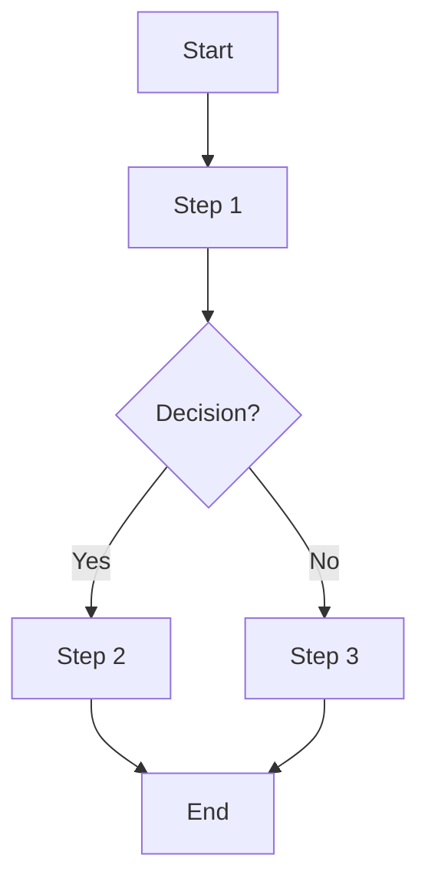

# [Workflow Name]

## 📝 Overview

<!-- Brief description of the workflow (2-3 sentences) -->

## 🎯 Purpose

<!-- Why does this workflow exist? What problem does it solve? -->

## 👥 Roles and Responsibilities

### Role 1: [Name]

**Responsibilities:**

- Responsibility 1
- Responsibility 2
- Responsibility 3

**Required Skills:**

- Skill 1
- Skill 2

### Role 2: [Name]

**Responsibilities:**

- Responsibility 1
- Responsibility 2

**Required Skills:**

- Skill 1
- Skill 2

## 🔄 Workflow Steps

### Step 1: [Step Name]

**Owner:** [Role]  
**Duration:** [Estimated time]  
**Dependencies:** [Prerequisites]

**Description:**

[Detailed description of what happens in this step]

**Inputs:**

- Input 1: [Description]
- Input 2: [Description]

**Outputs:**

- Output 1: [Description]
- Output 2: [Description]

**Actions:**

1. Action 1
2. Action 2
3. Action 3

**Validation:**

- [ ] Validation criterion 1
- [ ] Validation criterion 2

### Step 2: [Step Name]

**Owner:** [Role]  
**Duration:** [Estimated time]  
**Dependencies:** [Prerequisites]

**Description:**

[Detailed description]

**Inputs:**

- Input 1

**Outputs:**

- Output 1

**Actions:**

1. Action 1
2. Action 2

**Validation:**

- [ ] Validation criterion 1

### Step 3: [Step Name]

**Owner:** [Role]  
**Duration:** [Estimated time]  
**Dependencies:** [Prerequisites]

**Description:**

[Detailed description]

**Inputs:**

- Input 1

**Outputs:**

- Output 1

**Actions:**

1. Action 1
2. Action 2

**Validation:**

- [ ] Validation criterion 1

## 📊 Flow Diagram

## 🛠️ Tools and Systems

### Tool 1: [Name]

**Purpose:** [What it's used for]  
**Access:** [How to get access]  
**Documentation:** [Link]

### Tool 2: [Name]

**Purpose:** [What it's used for]  
**Access:** [How to get access]  
**Documentation:** [Link]

## 📋 Checklists

### Pre-Workflow Checklist

- [ ] Item 1
- [ ] Item 2
- [ ] Item 3

### Post-Workflow Checklist

- [ ] Item 1
- [ ] Item 2
- [ ] Item 3

## 🚨 Exception Handling

### Exception 1: [Scenario]

**Probability:** High | Medium | Low  
**Impact:** High | Medium | Low

**Trigger:** [What causes this exception?]

**Response:**

1. Step 1
2. Step 2
3. Step 3

**Escalation:** [When and to whom?]

### Exception 2: [Scenario]

**Probability:** High | Medium | Low  
**Impact:** High | Medium | Low

**Trigger:** [What causes this exception?]

**Response:**

1. Step 1
2. Step 2

**Escalation:** [When and to whom?]

## 📈 Success Criteria

- [ ] Criterion 1
- [ ] Criterion 2
- [ ] Criterion 3

## 📊 Metrics

### Process Metrics

- **Cycle Time:** [Target]
- **Throughput:** [Target]
- **Error Rate:** [Target]

### Quality Metrics

- **Defect Rate:** [Target]
- **Rework Rate:** [Target]
- **Customer Satisfaction:** [Target]

## 🔍 Quality Gates

### Gate 1: [Name]

**Location:** After [Step]  
**Criteria:**

- [ ] Criterion 1
- [ ] Criterion 2

**Action if Failed:** [What happens?]

### Gate 2: [Name]

**Location:** After [Step]  
**Criteria:**

- [ ] Criterion 1
- [ ] Criterion 2

**Action if Failed:** [What happens?]

## 📚 Templates and Resources

- Template 1: [Link]
- Template 2: [Link]
- Resource 1: [Link]

## 🔄 Continuous Improvement

### Review Frequency

[How often is this workflow reviewed?]

### Improvement Process

1. Collect feedback
2. Analyze metrics
3. Propose changes
4. Test changes
5. Update workflow

### Recent Improvements

#### [Date]: [Change]

**Reason:** [Why was this changed?]  
**Impact:** [What was the result?]

## 💡 Best Practices

1. Best practice 1
2. Best practice 2
3. Best practice 3

## ⚠️ Common Pitfalls

### Pitfall 1: [Description]

**How to Avoid:** [Prevention strategy]  
**How to Recover:** [Recovery strategy]

### Pitfall 2: [Description]

**How to Avoid:** [Prevention strategy]  
**How to Recover:** [Recovery strategy]

## 📖 Training and Onboarding

### Required Training

- Training 1: [Link/Duration]
- Training 2: [Link/Duration]

### Onboarding Checklist

- [ ] Read workflow documentation
- [ ] Complete training modules
- [ ] Shadow experienced team member
- [ ] Perform workflow with supervision
- [ ] Perform workflow independently

## 🔗 Related Workflows

- Related Workflow 1: [Link]
- Related Workflow 2: [Link]

## 📝 Notes

<!-- Additional context -->

## 📅 Review History

### [Date]

**Reviewer:** [Name]  
**Changes:** [What was changed?]  
**Reason:** [Why?]

## 🔄 Change Log

### v1.0.0 (YYYY-MM-DD)

- Initial workflow specification
