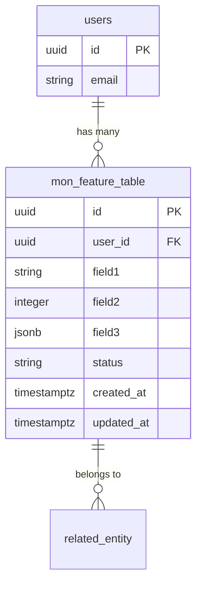

# 🏗️ SpecKit Workflow: Plan

> **Transformer une spec approuvée en plan technique d'implémentation détaillé.**

Ce workflow crée le pont entre la spécification fonctionnelle (issue de `/speckit.specify`) et l'implémentation concrète.

---

## 🎯 Objectif

Traduire une spec fonctionnelle en architecture technique exploitable :
1. ✅ **Architecture** : Modules, services, patterns
2. ✅ **Data Models** : Schémas Supabase, relations, indexes
3. ✅ **API Endpoints** : Routes REST, DTOs, validations
4. ✅ **Intégrations** : Dépendances modules, APIs externes
5. ✅ **Testing Strategy** : Approche tests unitaires/intégration/E2E

---

## 📋 Prérequis

**Avant d'utiliser `/speckit.plan`** :
- ✅ Spec créée via `/speckit.specify`
- ✅ Spec clarifiée via `/speckit.clarify`
- ✅ Spec approuvée (status: `approved`)
- ✅ Contexte technique connu (stack, patterns, architecture)

---

## 🚀 Processus

### Étape 1 : Analyser la spec approuvée

**Questions à se poser** :
- Quels modules backend sont impactés ?
- Quelles nouvelles tables/relations Supabase ?
- Quels endpoints API sont nécessaires ?
- Quelles dépendances avec modules existants ?
- Quelles contraintes de performance ?

**Checklist de lecture** :
- [ ] User stories comprises
- [ ] Exigences fonctionnelles listées
- [ ] Exigences non-fonctionnelles identifiées
- [ ] Data requirements analysés
- [ ] Intégrations externes identifiées

---

### Étape 2 : Créer le plan technique

**Commande** :
```bash
# Créer plan depuis template
cp .spec/templates/plan-template.md .spec/plans/mon-feature-plan.md
```

**Template de plan** :

```markdown
---
title: "Plan Technique: [Nom Feature]"
status: draft
version: 0.1.0
authors: [Votre nom]
created: YYYY-MM-DD
updated: YYYY-MM-DD
tags: [planning, architecture]
relates-to:
  - ../features/mon-feature.md
  - ../architecture/decisions/XXX.md
---

# Plan Technique : [Nom Feature]

## 📋 Contexte

### Spec Référencée
- **Spec** : [Lien vers spec](./../features/mon-feature.md)
- **Status Spec** : approved
- **Version Spec** : X.X.X

### Objectif Technique
[Traduire l'objectif métier en objectif technique]

---

## 🏗️ Architecture

### Modules Backend Impactés

#### Nouveaux Modules
```
backend/src/modules/
├── mon-feature/
│   ├── mon-feature.module.ts
│   ├── mon-feature.controller.ts
│   ├── mon-feature.service.ts
│   ├── dto/
│   │   ├── create-mon-feature.dto.ts
│   │   ├── update-mon-feature.dto.ts
│   │   └── mon-feature-response.dto.ts
│   ├── entities/
│   │   └── mon-feature.entity.ts
│   └── tests/
│       ├── mon-feature.controller.spec.ts
│       └── mon-feature.service.spec.ts
```

**MonFeatureModule** :
- **Responsabilité** : [Description courte]
- **Dependencies** : `[ConfigModule, CacheModule, ...]`
- **Exports** : `[MonFeatureService]`

**MonFeatureService** :
- **Pattern** : Hérite de `SupabaseBaseService`
- **Méthodes principales** :
  - `create(dto: CreateMonFeatureDto): Promise<MonFeature>`
  - `findAll(filters?: FilterDto): Promise<MonFeature[]>`
  - `findOne(id: string): Promise<MonFeature>`
  - `update(id: string, dto: UpdateMonFeatureDto): Promise<MonFeature>`
  - `remove(id: string): Promise<void>`

**MonFeatureController** :
- **Prefix** : `/api/mon-feature`
- **Guards** : `JwtAuthGuard` (si auth requise)
- **Endpoints** : Voir section API

#### Modules Existants Modifiés
- **[ModuleX]** : [Nature des modifications]
- **[ModuleY]** : [Nature des modifications]

### Data Layer

**Nouveau Data Service** :
```typescript
// backend/src/database/services/mon-feature-data.service.ts
@Injectable()
export class MonFeatureDataService extends SupabaseBaseService {
  constructor(
    @Inject('SUPABASE_CLIENT') supabaseClient: SupabaseClient,
  ) {
    super(supabaseClient, 'mon_feature_table');
  }

  // Méthodes spécifiques au domaine
  async findByUserId(userId: string): Promise<MonFeature[]> {
    return this.query()
      .eq('user_id', userId)
      .order('created_at', { ascending: false });
  }
}
```

### Patterns Utilisés

**Patterns NestJS** :
- ✅ Module Pattern (encapsulation fonctionnelle)
- ✅ Service Pattern (business logic)
- ✅ Repository Pattern (`SupabaseBaseService`)
- ✅ DTO Pattern (validation Zod)
- ✅ Guard Pattern (authentication/authorization)

**Patterns Data** :
- ✅ Active Record (via SupabaseBaseService)
- ✅ Query Builder (Supabase queries)
- ✅ Soft Delete (si applicable)

---

## 🗄️ Data Models

### Schéma Supabase

#### Table: `mon_feature_table`

**SQL Migration** :
```sql
-- Migration: YYYYMMDD_create_mon_feature_table.sql

CREATE TABLE IF NOT EXISTS public.mon_feature_table (
  id UUID PRIMARY KEY DEFAULT gen_random_uuid(),
  user_id UUID NOT NULL REFERENCES public.users(id) ON DELETE CASCADE,
  field1 VARCHAR(255) NOT NULL,
  field2 INTEGER DEFAULT 0,
  field3 JSONB,
  status VARCHAR(50) DEFAULT 'active',
  created_at TIMESTAMPTZ DEFAULT NOW(),
  updated_at TIMESTAMPTZ DEFAULT NOW(),
  deleted_at TIMESTAMPTZ
);

-- Indexes
CREATE INDEX idx_mon_feature_user_id ON public.mon_feature_table(user_id);
CREATE INDEX idx_mon_feature_status ON public.mon_feature_table(status) WHERE deleted_at IS NULL;
CREATE INDEX idx_mon_feature_created_at ON public.mon_feature_table(created_at DESC);

-- RLS Policies
ALTER TABLE public.mon_feature_table ENABLE ROW LEVEL SECURITY;

CREATE POLICY "Users can view their own records"
  ON public.mon_feature_table
  FOR SELECT
  USING (auth.uid() = user_id);

CREATE POLICY "Users can insert their own records"
  ON public.mon_feature_table
  FOR INSERT
  WITH CHECK (auth.uid() = user_id);

CREATE POLICY "Users can update their own records"
  ON public.mon_feature_table
  FOR UPDATE
  USING (auth.uid() = user_id);

-- Trigger updated_at
CREATE TRIGGER set_updated_at
  BEFORE UPDATE ON public.mon_feature_table
  FOR EACH ROW
  EXECUTE FUNCTION public.set_updated_at();

-- Comments
COMMENT ON TABLE public.mon_feature_table IS 'Description de la table';
COMMENT ON COLUMN public.mon_feature_table.field1 IS 'Description field1';
```

**Contraintes** :
- `id` : UUID v4, auto-généré
- `user_id` : Foreign key vers `users`, NOT NULL
- `field1` : Max 255 chars, NOT NULL
- `field2` : Integer positif
- `status` : Enum `['active', 'inactive', 'archived']`

**Indexes** :
- Primary: `id` (UUID)
- Foreign: `user_id` (B-tree)
- Composite: `(user_id, status)` pour queries fréquentes
- Temporal: `created_at DESC` pour tri chronologique

### TypeScript Interfaces

```typescript
// backend/src/modules/mon-feature/entities/mon-feature.entity.ts
export interface MonFeature {
  id: string;
  userId: string;
  field1: string;
  field2: number;
  field3: Record<string, any> | null;
  status: 'active' | 'inactive' | 'archived';
  createdAt: Date;
  updatedAt: Date;
  deletedAt: Date | null;
}
```

### Relations

```
User (1) ----< (N) MonFeature
MonFeature (N) >---- (1) RelatedEntity
```

**Diagramme ERD** :


---

## 🔌 API Endpoints

### REST API

**Base URL** : `/api/mon-feature`

#### POST `/api/mon-feature`
**Description** : Créer un nouvel item

**Auth** : Required (JWT)

**Request Body** :
```typescript
{
  field1: string;    // Required, max 255 chars
  field2?: number;   // Optional, default 0
  field3?: object;   // Optional
}
```

**Validation (Zod)** :
```typescript
// dto/create-mon-feature.dto.ts
import { z } from 'zod';

export const CreateMonFeatureSchema = z.object({
  field1: z.string().min(1).max(255),
  field2: z.number().int().positive().optional(),
  field3: z.record(z.any()).optional(),
});

export type CreateMonFeatureDto = z.infer<typeof CreateMonFeatureSchema>;
```

**Response** (201 Created) :
```typescript
{
  id: string;
  userId: string;
  field1: string;
  field2: number;
  field3: object | null;
  status: string;
  createdAt: string; // ISO 8601
  updatedAt: string;
}
```

**Errors** :
- `400` : Validation error
- `401` : Unauthorized
- `409` : Conflict (duplicate)

---

#### GET `/api/mon-feature`
**Description** : Lister tous les items de l'utilisateur

**Auth** : Required (JWT)

**Query Params** :
```typescript
{
  status?: 'active' | 'inactive' | 'archived';
  page?: number;     // Default: 1
  limit?: number;    // Default: 20, max: 100
  sortBy?: string;   // Default: 'createdAt'
  sortOrder?: 'asc' | 'desc'; // Default: 'desc'
}
```

**Response** (200 OK) :
```typescript
{
  data: MonFeature[];
  meta: {
    total: number;
    page: number;
    limit: number;
    totalPages: number;
  };
}
```

---

#### GET `/api/mon-feature/:id`
**Description** : Récupérer un item par ID

**Auth** : Required (JWT)

**Path Params** :
- `id` : UUID de l'item

**Response** (200 OK) :
```typescript
{
  id: string;
  userId: string;
  field1: string;
  // ... autres champs
}
```

**Errors** :
- `404` : Item not found
- `403` : Forbidden (pas le propriétaire)

---

#### PATCH `/api/mon-feature/:id`
**Description** : Mettre à jour un item

**Auth** : Required (JWT)

**Request Body** (partial update) :
```typescript
{
  field1?: string;
  field2?: number;
  status?: 'active' | 'inactive' | 'archived';
}
```

**Response** (200 OK) : MonFeature mis à jour

---

#### DELETE `/api/mon-feature/:id`
**Description** : Supprimer un item (soft delete)

**Auth** : Required (JWT)

**Response** (204 No Content)

**Errors** :
- `404` : Item not found
- `403` : Forbidden

---

### OpenAPI Spec

```yaml
# .spec/apis/mon-feature-api.yaml
openapi: 3.0.0
info:
  title: Mon Feature API
  version: 1.0.0
  description: API pour gestion Mon Feature

paths:
  /api/mon-feature:
    post:
      summary: Créer un item
      tags: [MonFeature]
      security:
        - bearerAuth: []
      requestBody:
        required: true
        content:
          application/json:
            schema:
              $ref: '#/components/schemas/CreateMonFeatureDto'
      responses:
        '201':
          description: Item créé
          content:
            application/json:
              schema:
                $ref: '#/components/schemas/MonFeature'
        '400':
          $ref: '#/components/responses/BadRequest'
        '401':
          $ref: '#/components/responses/Unauthorized'

components:
  schemas:
    CreateMonFeatureDto:
      type: object
      required: [field1]
      properties:
        field1:
          type: string
          maxLength: 255
        field2:
          type: integer
          minimum: 0
    
    MonFeature:
      type: object
      properties:
        id:
          type: string
          format: uuid
        userId:
          type: string
          format: uuid
        field1:
          type: string
        field2:
          type: integer
        createdAt:
          type: string
          format: date-time
        updatedAt:
          type: string
          format: date-time

  securitySchemes:
    bearerAuth:
      type: http
      scheme: bearer
      bearerFormat: JWT
```

---

## 🎨 Frontend (Remix)

### Routes

```
frontend/app/routes/
├── mon-feature.tsx                    # Layout /mon-feature
├── mon-feature._index.tsx             # Liste GET /api/mon-feature
├── mon-feature.new.tsx                # Création POST /api/mon-feature
├── mon-feature.$id.tsx                # Détail GET /api/mon-feature/:id
└── mon-feature.$id.edit.tsx           # Édition PATCH /api/mon-feature/:id
```

#### `mon-feature._index.tsx`
```typescript
import { json, type LoaderFunctionArgs } from '@remix-run/node';
import { useLoaderData } from '@remix-run/react';

export async function loader({ request }: LoaderFunctionArgs) {
  const url = new URL(request.url);
  const page = url.searchParams.get('page') || '1';
  
  const response = await fetch(
    `${process.env.API_URL}/api/mon-feature?page=${page}`,
    {
      headers: {
        'Authorization': `Bearer ${getToken(request)}`,
      },
    }
  );
  
  const data = await response.json();
  return json(data);
}

export default function MonFeatureIndex() {
  const { data, meta } = useLoaderData<typeof loader>();
  
  return (
    <div>
      <h1>Mon Feature</h1>
      <ul>
        {data.map(item => (
          <li key={item.id}>{item.field1}</li>
        ))}
      </ul>
      <Pagination meta={meta} />
    </div>
  );
}
```

### Composants

**Nouveaux composants** :
```
frontend/app/components/mon-feature/
├── MonFeatureCard.tsx
├── MonFeatureForm.tsx
├── MonFeatureList.tsx
└── MonFeatureFilters.tsx
```

**Composants réutilisés** :
- `<Button>` (UI kit)
- `<Input>` (UI kit)
- `<Toast>` (notifications)
- `<Loader>` (loading states)

---

## 🔗 Intégrations

### Modules Internes

**Dependencies** :
- **AuthModule** : Authentication guards, JWT validation
- **CacheModule** : Redis caching pour performance
- **ConfigModule** : Variables d'environnement
- **DatabaseModule** : Supabase client

**Injection Pattern** :
```typescript
@Module({
  imports: [
    ConfigModule,
    AuthModule,
    CacheModule,
    DatabaseModule,
  ],
  controllers: [MonFeatureController],
  providers: [MonFeatureService, MonFeatureDataService],
  exports: [MonFeatureService],
})
export class MonFeatureModule {}
```

### APIs Externes

**Si applicable** :
- **API Name** : [Description]
  - Endpoint : `https://api.example.com/v1/resource`
  - Auth : API Key via header `X-API-Key`
  - Rate limit : 1000 req/jour
  - Retry strategy : Exponential backoff

---

## 🧪 Testing Strategy

### Tests Unitaires

**Cibles** (80% coverage minimum) :

**MonFeatureService** :
```typescript
// mon-feature.service.spec.ts
describe('MonFeatureService', () => {
  let service: MonFeatureService;
  let dataService: MonFeatureDataService;

  beforeEach(async () => {
    const module = await Test.createTestingModule({
      providers: [
        MonFeatureService,
        {
          provide: MonFeatureDataService,
          useValue: mockDataService,
        },
      ],
    }).compile();

    service = module.get(MonFeatureService);
    dataService = module.get(MonFeatureDataService);
  });

  describe('create', () => {
    it('should create a new item', async () => {
      const dto = { field1: 'test', field2: 42 };
      const result = await service.create(userId, dto);
      
      expect(result).toHaveProperty('id');
      expect(result.field1).toBe('test');
      expect(dataService.insert).toHaveBeenCalledWith({
        userId,
        ...dto,
      });
    });

    it('should throw on duplicate field1', async () => {
      dataService.insert.mockRejectedValue(
        new ConflictException('Duplicate')
      );
      
      await expect(
        service.create(userId, { field1: 'existing' })
      ).rejects.toThrow(ConflictException);
    });
  });

  describe('findAll', () => {
    it('should return paginated results', async () => {
      const result = await service.findAll(userId, { page: 1, limit: 10 });
      
      expect(result.data).toHaveLength(10);
      expect(result.meta.total).toBeGreaterThan(0);
    });
  });
});
```

**MonFeatureController** :
```typescript
// mon-feature.controller.spec.ts
describe('MonFeatureController', () => {
  let controller: MonFeatureController;
  let service: MonFeatureService;

  beforeEach(async () => {
    const module = await Test.createTestingModule({
      controllers: [MonFeatureController],
      providers: [
        {
          provide: MonFeatureService,
          useValue: mockService,
        },
      ],
    }).compile();

    controller = module.get(MonFeatureController);
    service = module.get(MonFeatureService);
  });

  describe('POST /api/mon-feature', () => {
    it('should create item with valid DTO', async () => {
      const dto = { field1: 'test' };
      const req = { user: { id: 'user-123' } };
      
      const result = await controller.create(req, dto);
      
      expect(result).toHaveProperty('id');
      expect(service.create).toHaveBeenCalledWith('user-123', dto);
    });

    it('should return 400 on invalid DTO', async () => {
      const dto = { field1: '' }; // Empty string
      
      await expect(
        controller.create(req, dto)
      ).rejects.toThrow(BadRequestException);
    });
  });
});
```

### Tests d'Intégration

**Test DB + Service** :
```typescript
// mon-feature.integration.spec.ts
describe('MonFeature Integration', () => {
  let app: INestApplication;
  let supabase: SupabaseClient;

  beforeAll(async () => {
    const module = await Test.createTestingModule({
      imports: [AppModule],
    }).compile();

    app = module.createNestApplication();
    await app.init();
    
    supabase = module.get('SUPABASE_CLIENT');
  });

  afterAll(async () => {
    await app.close();
  });

  it('should create item and retrieve from DB', async () => {
    const dto = { field1: 'integration-test', field2: 99 };
    
    const response = await request(app.getHttpServer())
      .post('/api/mon-feature')
      .set('Authorization', `Bearer ${testToken}`)
      .send(dto)
      .expect(201);

    const itemId = response.body.id;

    // Vérifier en DB directement
    const { data } = await supabase
      .from('mon_feature_table')
      .select('*')
      .eq('id', itemId)
      .single();

    expect(data.field1).toBe('integration-test');
    expect(data.field2).toBe(99);
  });
});
```

### Tests E2E

**User Flow complet** :
```typescript
// mon-feature.e2e.spec.ts
describe('MonFeature E2E', () => {
  let app: INestApplication;
  let authToken: string;

  beforeAll(async () => {
    // Setup app
    // Authenticate user
  });

  it('should complete full CRUD cycle', async () => {
    // 1. Create
    const createRes = await request(app.getHttpServer())
      .post('/api/mon-feature')
      .set('Authorization', `Bearer ${authToken}`)
      .send({ field1: 'e2e-test' })
      .expect(201);

    const itemId = createRes.body.id;

    // 2. Read
    await request(app.getHttpServer())
      .get(`/api/mon-feature/${itemId}`)
      .set('Authorization', `Bearer ${authToken}`)
      .expect(200)
      .expect(res => {
        expect(res.body.field1).toBe('e2e-test');
      });

    // 3. Update
    await request(app.getHttpServer())
      .patch(`/api/mon-feature/${itemId}`)
      .set('Authorization', `Bearer ${authToken}`)
      .send({ field1: 'e2e-test-updated' })
      .expect(200);

    // 4. Delete
    await request(app.getHttpServer())
      .delete(`/api/mon-feature/${itemId}`)
      .set('Authorization', `Bearer ${authToken}`)
      .expect(204);

    // 5. Verify deletion (soft delete)
    await request(app.getHttpServer())
      .get(`/api/mon-feature/${itemId}`)
      .set('Authorization', `Bearer ${authToken}`)
      .expect(404);
  });
});
```

---

## ⚡ Performance

### Objectifs

- **Response Time** : < 100ms P95 (lectures), < 200ms P95 (écritures)
- **Throughput** : 1000 req/s par endpoint
- **Database Queries** : < 3 queries par request

### Stratégie de Cache

**Redis Cache** (optionnel pour lectures fréquentes) :
```typescript
// mon-feature.service.ts
async findAll(userId: string, filters?: FilterDto) {
  const cacheKey = `mon-feature:user:${userId}:${JSON.stringify(filters)}`;
  
  // Try cache first
  const cached = await this.cacheService.get(cacheKey);
  if (cached) return JSON.parse(cached);
  
  // Query DB
  const result = await this.dataService.findByUserId(userId, filters);
  
  // Cache for 5 minutes
  await this.cacheService.set(cacheKey, JSON.stringify(result), 300);
  
  return result;
}
```

**Cache Invalidation** :
- On CREATE : Invalider liste utilisateur
- On UPDATE : Invalider item + liste
- On DELETE : Invalider item + liste

### Database Optimization

**Indexes** :
```sql
-- Index composite pour queries fréquentes
CREATE INDEX idx_mon_feature_user_status 
  ON public.mon_feature_table(user_id, status) 
  WHERE deleted_at IS NULL;

-- Index partiel pour status actifs uniquement
CREATE INDEX idx_mon_feature_active 
  ON public.mon_feature_table(user_id, created_at DESC) 
  WHERE status = 'active' AND deleted_at IS NULL;
```

**Query Optimization** :
- Utiliser `select('id, field1, field2')` (pas `select('*')`)
- Limiter résultats (`limit(20)`)
- Pagination via `range()` plutôt qu'offset

---

## 🔒 Sécurité

### Authentication

**Guards NestJS** :
```typescript
@Controller('mon-feature')
@UseGuards(JwtAuthGuard)
export class MonFeatureController {
  // Tous les endpoints nécessitent JWT
}
```

### Authorization

**RLS Supabase** :
```sql
-- Politique : users ne voient que leurs données
CREATE POLICY "Users can view their own records"
  ON public.mon_feature_table
  FOR SELECT
  USING (auth.uid() = user_id);
```

**Service-level checks** :
```typescript
async findOne(userId: string, itemId: string) {
  const item = await this.dataService.findById(itemId);
  
  if (!item) throw new NotFoundException();
  if (item.userId !== userId) throw new ForbiddenException();
  
  return item;
}
```

### Validation

**Zod Schemas** :
- Tous les DTOs validés avec Zod
- Sanitization des inputs (trim, escape HTML si nécessaire)
- Validation stricte des types

**Rate Limiting** (optionnel) :
```typescript
@Controller('mon-feature')
@UseGuards(ThrottlerGuard)
@Throttle(100, 60) // 100 req/min
export class MonFeatureController {}
```

---

## 📊 Monitoring

### Métriques

**Backend** :
- Temps de réponse par endpoint (Prometheus)
- Taux d'erreur 4xx/5xx
- Throughput (req/s)

**Database** :
- Query time (log slow queries > 100ms)
- Connection pool usage
- Cache hit ratio

### Logs

**Structure logs** :
```typescript
this.logger.log({
  action: 'mon_feature.create',
  userId,
  itemId: result.id,
  duration: Date.now() - startTime,
});
```

---

## 🚀 Déploiement

### Migrations

**Ordre d'exécution** :
1. Créer table Supabase (`YYYYMMDD_create_mon_feature_table.sql`)
2. Créer indexes
3. Créer RLS policies
4. Déployer backend (NestJS)
5. Déployer frontend (Remix)

### Rollback Plan

**Si problème** :
1. Rollback code (git revert)
2. Rollback migration (`DROP TABLE IF EXISTS ...`)
3. Purger cache Redis

---

## 📝 Checklist Complétude

**Architecture** :
- [ ] Modules backend définis
- [ ] Services + Controllers spécifiés
- [ ] Patterns architecture documentés
- [ ] Data services définis

**Data** :
- [ ] Schémas Supabase définis (SQL migrations)
- [ ] Relations documentées (ERD)
- [ ] Indexes optimisés
- [ ] RLS policies définies

**API** :
- [ ] Endpoints REST définis
- [ ] DTOs avec validation Zod
- [ ] Responses documentées
- [ ] Error handling défini

**Frontend** :
- [ ] Routes Remix définies
- [ ] Composants listés
- [ ] Data fetching (loaders/actions) spécifié

**Testing** :
- [ ] Tests unitaires spécifiés (services + controllers)
- [ ] Tests intégration définis
- [ ] Tests E2E user flow définis
- [ ] Coverage objectives (80% services, 60% controllers)

**Performance** :
- [ ] Objectifs de performance définis
- [ ] Stratégie de cache définie
- [ ] Optimisations DB identifiées

**Sécurité** :
- [ ] Authentication définie
- [ ] Authorization (RLS + service-level)
- [ ] Validation inputs (Zod)
- [ ] Rate limiting (si nécessaire)

---

## 🔗 Prochaines Étapes

Après avoir complété `/speckit.plan` :

1. **`/speckit.tasks`** : Décomposer le plan en tâches implémentables
2. **`/speckit.analyze`** : Vérifier cohérence plan/spec
3. **`/speckit.checklist`** : Générer checklists qualité
4. **`/speckit.implement`** : Générer code et tests

---

## 📚 Ressources

- [Constitution du Projet](../constitution.md)
- [ADR-001: Supabase Direct](../architecture/decisions/001-supabase-direct.md)
- [ADR-002: Monorepo Structure](../architecture/decisions/002-monorepo-structure.md)
- [SupabaseBaseService Pattern](../guides/supabase-base-service.md)
- [NestJS Testing Best Practices](https://docs.nestjs.com/fundamentals/testing)

---

**Note** : Ce plan technique doit être validé par l'équipe avant de passer à `/speckit.tasks`.
