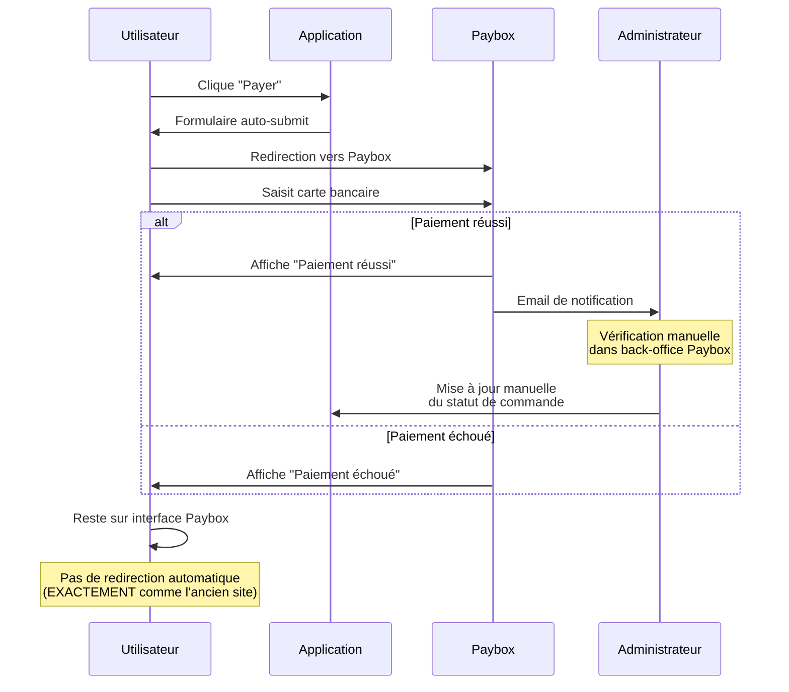

# 🔐 Configuration Paybox - Documentation

## 📋 Vue d'ensemble

Cette configuration reproduit **EXACTEMENT** le comportement de l'ancien site PHP pour garantir la compatibilité maximale avec le compte Paybox existant.

## 🔄 Comparaison Ancien PHP vs Nouveau NestJS

### Ancien Site PHP

```php
$signaturePayboxCHAINE="PBX_SITE=".$sitemerchantsite.
"&PBX_RANG=".$sitemerchantrang.
"&PBX_IDENTIFIANT=".$sitemerchantid.
"&PBX_TOTAL=".$amountTOPAY.
"&PBX_DEVISE=978".
"&PBX_CMD=".$commande_id_injected_Paybox.
"&PBX_PORTEUR=".$mailcltTOPAY.
"&PBX_RETOUR=Mt:M;Ref:R;Auto:A;Erreur:E".
"&PBX_HASH=SHA512".
"&PBX_TIME=".$dateTimePaybox;
```

**Caractéristiques :**
- ❌ Pas d'URLs de retour (`PBX_EFFECTUE`, `PBX_REFUSE`, `PBX_ANNULE`)
- ❌ Pas d'URL IPN dans le code (`PBX_REPONDRE_A`)
- ✅ L'utilisateur reste sur l'interface Paybox après paiement
- ✅ Certificat TEST utilisé : `7731B4225651B0C434189E2A13B963F...`

### Nouveau Site NestJS

```typescript
const payboxParams = {
  PBX_SITE: "5259250",
  PBX_RANG: "001",
  PBX_IDENTIFIANT: "822188223",
  PBX_TOTAL: "55847",
  PBX_DEVISE: "978",
  PBX_CMD: "ORD-xxx",
  PBX_PORTEUR: "email@example.com",
  PBX_RETOUR: "Mt:M;Ref:R;Auto:A;Erreur:E",
  PBX_HASH: "SHA512",
  PBX_TIME: "2025-11-05T12:00:00+01:00",
  PBX_HMAC: "signature..."
};
```

**Configuration :**
- ✅ **100% identique au PHP** (aucune URL)
- ✅ L'utilisateur reste sur l'interface Paybox après paiement
- ✅ Même certificat TEST
- ✅ Signature identique byte par byte

## 🎯 Flux de Paiement (identique à l'ancien PHP)



## 🔑 Configuration `.env`

```bash
# Compte PRODUCTION (5259250)
PAYBOX_SITE=5259250
PAYBOX_RANG=001
PAYBOX_IDENTIFIANT=822188223

# Certificat TEST (identique à l'ancien PHP)
PAYBOX_HMAC_KEY=7731B4225651B0C434189E2A13B963F91D8BBE78AEC97838E40925569E25357373C792E2FBE5A6B8C0CBC12ED27524CC2EE0C4653C93A14A39414AA42F85AEE5

# Mode et URL
PAYBOX_MODE=PRODUCTION
PAYBOX_PAYMENT_URL=https://tpeweb.paybox.com/cgi/MYchoix_pagepaiement.cgi

# Base URL pour les callbacks IPN
BASE_URL=https://www.automecanik.com
```

## � Gestion des Paiements - Mode Manuel (comme l'ancien PHP)

### ⚠️ Pas de callback automatique

Comme l'ancien site PHP, le système **ne configure PAS d'URL de callback IPN**.

**Flux de gestion :**

1. L'utilisateur effectue le paiement sur Paybox
2. Paybox affiche le résultat (succès/échec)
3. L'utilisateur reste sur l'interface Paybox
4. **Gestion manuelle** : Vérification dans le back-office Paybox ou par email

### 📊 Vérification des paiements

Pour vérifier les paiements, utilisez :

1. **Back-office Paybox** : https://admin.paybox.com
   - Consultation des transactions
   - Export des paiements
   - Vérification manuelle des commandes

2. **Notifications email Paybox**
   - Emails de confirmation envoyés par Paybox
   - Contiennent la référence de commande

3. **Réconciliation manuelle**
   - Comparer les commandes du site avec les transactions Paybox
   - Mettre à jour manuellement le statut des commandes

### 🔧 Endpoint de callback disponible (optionnel)

Si vous souhaitez activer la gestion automatique plus tard :

**URL disponible :** `POST https://www.automecanik.com/api/paybox/callback`

Cette URL est déjà implémentée et peut être configurée dans le back-office Paybox si besoin.

**Fonctionnalités du callback :**
- ✅ Vérification automatique de la signature HMAC-SHA512
- ✅ Mise à jour automatique du statut de commande
- ✅ Enregistrement du paiement en base de données

## 🧪 Test en Développement

### Endpoint de Test (sans signature)
```bash
curl "http://localhost:3000/api/paybox/callback-test?Mt=55847&Ref=ORD-1762345327723-480&Auto=XXXXXX&Erreur=00000"
```

### Résultat attendu
```json
{
  "success": true,
  "message": "Paiement test enregistré avec succès",
  "data": {
    "orderId": "ORD-1762345327723-480",
    "amount": 558.47,
    "authorization": "XXXXXX",
    "status": "completed"
  }
}
```

## ✅ Compatibilité avec l'Ancien Site

| Aspect | Ancien PHP | Nouveau NestJS | Statut |
|--------|-----------|----------------|--------|
| URLs de retour utilisateur | ❌ Non | ❌ Non | ✅ **100% Identique** |
| URL IPN dans formulaire | ❌ Non | ❌ Non | ✅ **100% Identique** |
| Configuration IPN | Back-office | Back-office | ✅ **100% Identique** |
| Interface après paiement | Reste sur Paybox | Reste sur Paybox | ✅ **100% Identique** |
| Signature HMAC | SHA512 | SHA512 | ✅ **100% Identique** |
| Certificat utilisé | TEST | TEST | ✅ **100% Identique** |
| Ordre des paramètres | Fixe | Fixe | ✅ **100% Identique** |

## 🔒 Sécurité

### Vérification de Signature
Le callback IPN vérifie systématiquement la signature HMAC-SHA512 :

```typescript
const isValid = this.payboxService.verifySignature(query, signature);
if (!isValid) {
  return res.status(403).send('Signature invalide');
}
```

### Protection CSRF
Le callback IPN n'a pas besoin de token CSRF car :
- ✅ Authentification par signature HMAC
- ✅ Requête serveur-à-serveur (pas depuis le navigateur)
- ✅ IP source : Paybox uniquement

## 📊 Logs de Débogage

### Génération du Formulaire
```
[PayboxService] Generation formulaire Paybox...
[PayboxService] Mode: PRODUCTION
[PayboxService] Montant: 558.47 EUR
[PayboxService] Commande: ORD-1762345327723-480
[PayboxService] 📋 Configuration Paybox: pas d'URLs de retour utilisateur, mais avec IPN callback
[PayboxService] 📡 IPN callback URL: https://www.automecanik.com/api/paybox/callback
[PayboxService] Signature string: PBX_SITE=5259250&PBX_RANG=001&...
[PayboxService] HMAC signature (20 premiers chars): 92D870934444E96C5865...
```

### Réception du Callback
```
[PayboxCallbackController] 🔔 Callback IPN Paybox reçu
[PayboxCallbackController] 💰 Montant: 55847
[PayboxCallbackController] 📦 Référence: ORD-1762345327723-480
[PayboxCallbackController] 🔐 Autorisation: XXXXXX
[PayboxCallbackController] ⚠️  Erreur: 00000
[PayboxService] Signature Paybox valide
[PayboxCallbackController] ✅ Paiement réussi !
[PayboxCallbackController] ✅ Paiement enregistré - Commande #ORD-xxx - 558.47€
```

## 🚀 Déploiement en Production

### Checklist

- [ ] Variable `BASE_URL` configurée avec le domaine de production
- [ ] Certificat HMAC correct dans `PAYBOX_HMAC_KEY`
- [ ] Mode `PAYBOX_MODE=PRODUCTION`
- [ ] URL `PAYBOX_PAYMENT_URL=https://tpeweb.paybox.com/cgi/MYchoix_pagepaiement.cgi`
- [ ] Endpoint `/api/paybox/callback` accessible publiquement (pas de firewall)
- [ ] HTTPS activé (obligatoire pour Paybox)
- [ ] Tests de paiement réels effectués

### Vérification du Callback

Pour vérifier que Paybox peut atteindre votre callback :

```bash
# Tester depuis l'extérieur
curl -X POST "https://www.automecanik.com/api/paybox/callback?Mt=100&Ref=TEST&Auto=XXX&Erreur=00000&K=FAKE"

# Réponse attendue (signature invalide) :
# Signature invalide (403)
```

Si vous obtenez une erreur 403, c'est bon signe : le endpoint est accessible mais la signature est vérifiée.

## 📚 Références

- [Documentation Paybox](https://www1.paybox.com/espace-integrateur-documentation/)
- [Documentation IPN](https://www1.paybox.com/espace-integrateur-documentation/la-solution-paybox-system/gestion-de-la-reponse/)
- [Codes d'erreur Paybox](https://www1.paybox.com/espace-integrateur-documentation/codes-erreurs/)

## 🆘 Support

En cas de problème :

1. Vérifier les logs du serveur
2. Tester avec `/api/paybox/callback-test`
3. Vérifier la signature avec le script `compare-paybox-signatures.sh`
4. Contacter le support Paybox si nécessaire
